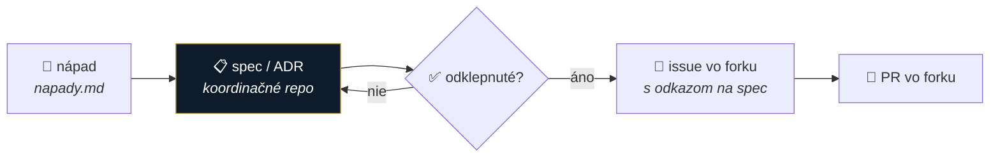

# AGENTS.md — ako pracovať v tomto repozitári

> **Single source of truth pre ľudí aj AI agentov.** `CLAUDE.md` je symlink na tento súbor — needituj ho zvlášť.
> Ak si AI agent a práve si načítal toto repo: **prečítaj celý tento súbor pred prvou zmenou.**

---

## 🎯 O projekte v 30 sekundách

Traja slovenskí advokáti (**Marián Čuprík**, **Martin Friedrich**, **Igor Ribár** — SAK, pracovná skupina pre elektronizáciu advokácie) a od 2026-08-06 aj český kolega **Vojta Říha** staviajú **LAWOSS** — open-source AI nástroj pre **českých a slovenských** advokátov, zadarmo.

| | |
|---|---|
| **Toto repo** | prípravné a plánovacie — **neobsahuje kód** produktu. Brainstorming, rešerše, rozhodnutia, plánovanie. |
| **Monetizácia** | výhradne **školenia a workshopy**. Nepredávame softvér ani službu (SaaS) — to by z advokáta spravilo poskytovateľa. Viď [ADR 0002](decisions/0002-preco-forkujeme-mikeoss.md). |
| **Voľba základu** | ✅ **rozhodnuté 2026-08-06: [LegalWork](https://github.com/eigenweltlabs/legalwork)** (MIT) → [ADR 0003](decisions/0003-legal-work-ako-zaklad.md), nahrádza ADR 0002. Organizačný fork je [Omni-Legal-Products/lawoss](https://github.com/Omni-Legal-Products/lawoss), default vetva `dev`, upstream zostáva `eigenweltlabs/legalwork`; **MF potvrdené 2026-08-09**. Hlavný dôvod: open-code harness ([opencode](https://github.com/sst/opencode)) v pozadí + MIT. Otvorený zostáva spôsob dlhodobej synchronizácie s upstreamom. |
| **Licencia** | **MIT** — vyplýva z voľby základu. Súbor `LICENSE` v tomto repe ešte **chýba** (úloha MČ). |
| **Názov** | **LAWOSS** — *Czechia · Slovakia* (od 2026-07-29; predtým pracovne „MikeOSS Slovakia"). Značka: `LAW` biele + `OSS` zlaté. |
| **Záber** | 🇨🇿 **ČR + 🇸🇰 SR** — dvojjurisdikčný. Pri rešeršiach a specoch mysli na obe. |
| **MikeOSS** | ❌ **zamietnutý ako základ** (2026-08-06, [ADR 0003](decisions/0003-legal-work-ako-zaklad.md)) — AGPL-3.0 a chýbajúci harness. Naďalej ho featurujeme len ako **inšpiráciu**. |
| **Organizácia** | **Omni Legal Products**, GitHub [Omni-Legal-Products](https://github.com/Omni-Legal-Products). Produkt je **LAWOSS**; samostatné repozitáre slúžia pre MCP, skills, pluginy a ďalšie moduly. |

**Začni čítaním:** [`decisions/`](decisions/) (čo je rozhodnuté a prečo) → [`specs/`](specs/) (čo staviame) → [`planning/roadmap.md`](planning/roadmap.md) (kde sme).

---

## 🚦 Zlaté pravidlá — toto nikdy

| ❌ Nikdy | Prečo |
|---|---|
| **Needituj AUTO sekcie v `README.md`** (medzi `<!-- AUTO:X -->`) | generuje ich GitHub Action, tvoje zmeny sa prepíšu |
| **Needituj `specs/prehlad.html`** | generuje sa z `specs/navrhy.md`; zmeny píš tam |
| **Nerob `git push --force` ani prepis histórie** | pracujú tu traja, zmažeš cudziu prácu — **`main` to aj technicky blokuje** |
| **Neprepisuj cudzie autorstvo** návrhov a rozhodnutí | evidencia v [`specs/navrhy.md`](specs/navrhy.md) musí sedieť |
| **Nemeň cudzí ADR** — namiesto toho pridaj nový, ktorý ten starý nahrádza | rozhodnutia sú záznam v čase |
| **Nepíš fakty „z hlavy"** — over ich (GitHub API, web, MCP) a označ, čo je overené a čo dohad | staviame na tom právne rozhodnutia |
| **Nedávaj do gitu veľké médiá** (audio, video) | `.gitignore` ich blokuje; použi GitHub Release |
| **Nedávaj sem klientske dáta ani tajomstvá** | repo je **verejné** |

---

## 🔀 Git a spolupráca — ako sa neprebíjať

> **Toto je najdôležitejšia sekcia.** Repo je verejné, `main` je chránený proti force-pushu, a **beží nad ním bot**, ktorý sám commituje.

### ⚠️ Pozor: auto-README bot commituje do `main`

Po každom pushi sa spustí Action, ktorá prepíše AUTO sekcie v `README.md` a **spraví vlastný commit**. Dôsledok: **remote sa ti pohne pod rukami** a tvoj ďalší push bude odmietnutý (`rejected — fetch first`).

**Preto vždy:**

```bash
git pull --no-rebase          # PRED každým pushom, aj keď si si istý
# ... práca ...
git add <konkrétne súbory>    # nie `git add -A` naslepo
git commit -m "..."
git pull --no-rebase          # ešte raz, bot mohol medzitým pushnúť
git push
```

Ak push aj tak zlyhá → `git pull --no-rebase` a push znova. **Nikdy to nerieš force-pushom.**

### 🔒 Ochrana vetvy `main`

Na `main` je zapnutá ochrana *(platí aj pre adminov)*:

| | |
|---|---|
| ❌ **force-push** | zablokovaný |
| ❌ **zmazanie vetvy** | zablokované |
| ✅ **bežný push** | funguje normálne — **žiadny povinný PR review**, aby vás to nezdržovalo |

Ak ti git odmietne push, **nikdy to nerieš `--force`** (aj tak neprejde) — urob `git pull --no-rebase` a push znova.

### Kedy priamo do `main` a kedy branch + PR

| Typ zmeny | Postup |
|---|---|
| Drobnosť — preklep, doplnenie riadku do backlogu, oprava odkazu | priamo do `main` (s pull pred/po) |
| **Nový spec, nový ADR, zmena štruktúry, väčší prepis** | **branch + Pull Request** — nech to ostatní dvaja vidia skôr, než to je v `main` |
| Čokoľvek, čo mení už **schválené** rozhodnutie | **vždy PR** + rozprava v Telegrame |

```bash
git checkout -b spec/nazov-veci
# ... práca, commity ...
git push -u origin spec/nazov-veci
gh pr create --fill
```

### Kto merguje — záväzné pravidlo ([ADR 0011](decisions/0011-proces-zmien-a-mergovania.md))

> [!IMPORTANT]
> **Platí pre ľudí aj AI agentov.** Rozhodnuté na calle 18. 8. 2026.

**Každý si merguje svoje PR a nesie zaň zodpovednosť.** Žiadna vstupná brána — kontrola je **následná**. Keď niekto zlúči nezmysel, upozorní sa naňho a **revertne sa to bežným PR**, bez drámy.

Čo z toho **nevyplýva**:

- **Merge nie je odklep.** Kto zlúči vlastný spec alebo ADR, tým ho nespravil rozhodnutím tímu — rozhodnutím sa stáva až vyjadrením ostatných na calle alebo v PR. **Ticho nie je súhlas.**
- **Väčšiu zmenu ohlás v Telegrame** *(topic General CHAT)* — nie na schválenie, ale aby dvaja neprepisovali ten istý súbor.
- **Vo forku [`lawoss`](https://github.com/Omni-Legal-Products/lawoss) brána zostáva** — tam je povinný review technicky vynútený. Koordinačné repo sú dokumenty, fork je kód, ktorý sa distribuuje advokátom.

**Kód skillov, pluginov a modulov do tohto repa nepatrí** — patrí do samostatných repozitárov organizácie (ADR 0005, ADR 0008). Tu žijú len skripty automatizácií tohto repa (`.github/`).

---|---|
| rešerš, podklad, zápis, návod (`research/`, `meetings/`, `docs/` mimo doktríny) | **autor sám** po zelenom CI |
| **spec, ADR, `AGENTS.md`, automatizácie, štruktúra repa** | **iba niekto iný než autor** — treba odklep aspoň 1 ďalšieho člena (review alebo 👍 v PR) |
| evidencia vlastného stanoviska (svoj stĺpec, svoje potvrdenie) | autor sám — smie meniť len svoje |

**Prečo:** spec a ADR sú rozhodnutia tímu — rozhodnutie vzniká až odklepom, nie mergom. Rešerše sú vstupy, tie nech tečú voľne. **Ticho nie je súhlas** — ak sa nikto neozve do 3 pracovných dní, eskaluj na product ownera.

**Kód skillov, pluginov a modulov do tohto repa nepatrí** — patrí do samostatných repozitárov organizácie (ADR 0005, ADR 0008). Tu žijú len skripty automatizácií tohto repa (`.github/`).

### Aby ste si nešliapali po nohách

- **Ohlás sa v Telegrame** (topic *General CHAT*), keď ideš robiť väčšiu zmenu — „idem prepisovať specs/0002".
- **Malé, časté commity** > jeden veľký. Ľahšie sa mergujú.
- **Jeden súbor = jeden autor v jednom čase.** Markdown sa merguje zle, keď dvaja prepisujú tú istú sekciu.
- **Commit správa po slovensky**, formát `typ: čo` — `docs:`, `research:`, `specs:`, `feat:`, `fix:`, `chore:`.

### Riešenie konfliktu

Konflikt v markdowne rieš **ručne a obe strany zachovaj** (nie „moja verzia vyhráva"). Ak si nie si istý, čí text je aktuálnejší — **spýtaj sa v Telegrame**, neháp.

---

## 📁 Kam čo patrí

```
decisions/    ADR — rozhodnutia: čo, prečo, aké alternatívy sme zvážili
specs/        špecifikácie funkcií (+ navrhy.md = evidencia, kto čo navrhol)
research/     rešerše — deep-research/, inspiracie/, idey/, sk-datove-zdroje/…
planning/     roadmap, timeline, backlog, napady.md (zberný kôš), workshopy
              (checkboxy → progress v README)
meetings/     zápisky zo stretnutí, RRRR-MM-DD.md, na konci VŽDY akčné body
docs/         vízia, princípy, glosár, návody
assets/       obrázky, diagramy, brand
```

**Pravidlá pre obsah:**

1. **Rozhodnutie** → ADR do `decisions/` podľa [`template.md`](decisions/template.md). Vždy uveď **zvažované alternatívy a prečo NIE**.
2. **Surový nápad** → [`planning/napady.md`](planning/napady.md) (zberný kôš) alebo Telegram topic *Feature IDEAS*. Odtiaľ sa po prerokovaní zaradí do verzie. **Nič sa nezahadzuje** — aj zamietnuté tam zostávajú aj s dôvodom.
3. **Návrh funkcie** → spec do `specs/` **+ riadok do [`specs/navrhy.md`](specs/navrhy.md)**.
   Hlavička specu musí obsahovať `- **Navrhol:** <Meno> (<skratka>) · <dátum>`.
   Skratky: **MČ** = Marián Čuprík · **MF** = Martin Friedrich · **IR** = Igor Ribár · **VŘ** = Vojta Říha.
   *Autorstvo nevymýšľaj — ak nevieš, kto návrh podal, spýtaj sa.*
4. **Úloha** → checkbox `- [ ]` v `planning/`. README z nich sám počíta progress.
5. **Rešerš** → `research/<oblasť>/`. Uveď **dátum a spôsob overenia**.

---

## 🔁 Od nápadu k implementácii — dve repá, jeden smer

> **Obe repá sú od 2026-08-14 v organizácii [Omni-Legal-Products](https://github.com/Omni-Legal-Products).** Vďaka tomu sa dajú issues medzi nimi **natívne presúvať** (*Issue → Transfer issue*), čo predtým nešlo.

| Repo | Čo tam žije | Čo tam **nepatrí** |
|---|---|---|
| **`lawOSS-like-SK-CZ`** *(toto)* | nápady, ADR, špecifikácie, rešerše, zápisy — **zdroj pravdy pre rozhodnutia** | issues typu „appka padá pri OCR", implementačné úlohy |
| **[`lawoss`](https://github.com/Omni-Legal-Products/lawoss)** *(fork)* | kód, implementačné issues a PR, buildy, releases | rozhodovanie o tom, *či* sa funkcia postaví |

### Pravidlo toku — záväzné pre ľudí aj AI agentov

> [!IMPORTANT]
> Toto nie je odporúčanie, ale **proces, ktorý tím schválil**. Agent, ktorý dostane nápad či feature na spracovanie, ho **vedie touto cestou** — nezakladá spec bez záznamu v koši, nezakladá issue vo forku bez odklepnutého specu, nezačína implementáciu bez issue.

1. **Nápad** → [`planning/napady.md`](planning/napady.md) + riadok do [`specs/navrhy.md`](specs/navrhy.md). Žije tu.
2. **Rozhodnutie** *(call, ADR alebo odklep v PR)* → tu. **Nikdy vo forku.**
3. **Až po odklepnutí** → issue vo **forku**, ktoré **odkazuje späť** na spec alebo ADR.
4. Spec sa **nekopíruje** do forku. Iba odkaz — duplikát znamená drift.



### Prečo to nie je zautomatizované

Zvažovalo sa vytváranie issues cez GitHub Action. **Zamietnuté:** vyžadovalo by to PAT uložený ako secret, teda ďalšie trvalé prihlasovacie údaje, pri objeme pár schválených položiek týždenne. **Most robí človek alebo jeho agent** — po calle prejde odklepnuté položky a založí k nim issues vo forku. Ak by objem narástol, prehodnotiť.

### Keď issue vznikne na zlom mieste

Nezakladaj duplikát — použi **Transfer issue** *(`Issue → ⋯ → Transfer issue`)*. Funguje oboma smermi v rámci organizácie a zachová komentáre aj históriu.

---

## ✍️ Ako písať

- **Po slovensky.** Technické termíny môžu ostať anglicky (*fork, commit, prompt, MCP*).
- **Oddeľuj overené od dohadov.** Píš „overené cez GitHub API 2026-07-29" vs „pravdepodobne, neoverené". Nikdy nevydávaj dohad za fakt.
- **Uvádzaj dátum** pri všetkom, čo starne (stav projektu, počty hviezd, aktivita repa).
- **Rich markdown je štandard** — tabuľky, mermaid diagramy, `> [!NOTE]` / `> [!WARNING]` bloky.
- **Dôležité dokumenty majú aj HTML dvojníka** (`.md` + `.html`), ktorý sa nasadí cez GitHub Pages. HTML musí byť **self-contained** (žiadne CDN), responzívne a s light/dark režimom. Farby značky: navy `#0d1b2a`, zlatá `#c9a24a`.

---

## 🤖 Automatizácie — nebojuj s nimi

| Čo | Kde | Správanie |
|---|---|---|
| **Auto-README** | [`.github/workflows/update-readme.yml`](.github/workflows/update-readme.yml) | po pushi prepíše AUTO sekcie (progress, strom, aktivita) a **sám commitne** |
| **Prehľad návrhov** | [`.github/scripts/update_prehlad.py`](.github/scripts/update_prehlad.py) | po pushi pregeneruje [`specs/prehlad.html`](specs/prehlad.html) z `specs/navrhy.md`. **Needituj ho ručne** — zdroj pravdy je evidencia. Beží v tom istom workflowe ako auto-README. |
| **Telegram: koordinácia** | [`.github/workflows/telegram-notify.yml`](.github/workflows/telegram-notify.yml) | `Omni-Legal-Products/lawOSS-like-SK-CZ` → topic *GitHub · Ops* (`2`). Push, issue, PR, release a diskusia. |
| **Telegram: produkt** | [`docs/telegram-notifikacie.md`](docs/telegram-notifikacie.md) | `Omni-Legal-Products/lawoss` → topic *GitHub · App* (`293`). PR, issue, release a zlyhanie CI; bežné push správy sú vypnuté. **Aktívne od 2026-08-14** — token je organizačný secret. |
| **Týždenný prehľad** | [`.github/workflows/tyzdenny-prehlad.yml`](.github/workflows/tyzdenny-prehlad.yml) | pondelok ráno do topicu *GitHub · Ops*: koľko PR čaká a ako dlho, koľko je bez recenzie, čo sa za týždeň zlúčilo, nápady podľa stavu. **Súhrn, nie prúd udalostí.** Dá sa spustiť aj ručne cez *Run workflow*. |
| **GitHub Pages** | z `main`, root, `.nojekyll` | HTML dokumenty sú živé na `omni-legal-products.github.io/lawOSS-like-SK-CZ/...` |

**Lokálne si vieš oboje pregenerovať:** `python3 .github/scripts/update_readme.py && python3 .github/scripts/update_prehlad.py`

---

## ✅ Pred ukončením práce

- [ ] `git pull --no-rebase` a až potom push
- [ ] Nové rozhodnutie má ADR · nový návrh má spec **a riadok v `navrhy.md`**
- [ ] Fakty majú uvedený dátum a spôsob overenia
- [ ] Neoverené veci sú **označené ako neoverené**
- [ ] Žiadne klientske dáta ani tajomstvá (repo je verejné)
- [ ] Veľké médiá nie sú v gite (Release / `.gitignore`)
- [ ] Ak si menil HTML → over, že sa nasadil (Pages build) a neobsahuje poškodené znaky

---

## 🔗 Odkazy

- **Repo:** https://github.com/Omni-Legal-Products/lawOSS-like-SK-CZ
- **Základ projektu:** [LegalWork](https://github.com/eigenweltlabs/legalwork) (MIT) nad [opencode](https://github.com/sst/opencode) — [ADR 0003](decisions/0003-legal-work-ako-zaklad.md). Zamietnutí kandidáti: [mikeOSS](https://github.com/Open-Legal-Products/mike), Stella (CZ).
- **Podať návrh funkcie:** [formulár](https://github.com/Omni-Legal-Products/lawOSS-like-SK-CZ/issues/new?template=feature-navrh.yml)
- **Komunikácia:** Telegram *LawOSS (SLOVAKIA | CZECHIA) + AI Frontier Labs* (`-1003828145652`) · topics: General CHAT (`1`) · GitHub · Ops (`2`) · GitHub · App (`293`) · DESIGN (`5`) · Research (`6`) · AI Frontier Labs (`7`) · Feature IDEAS (`97`)
