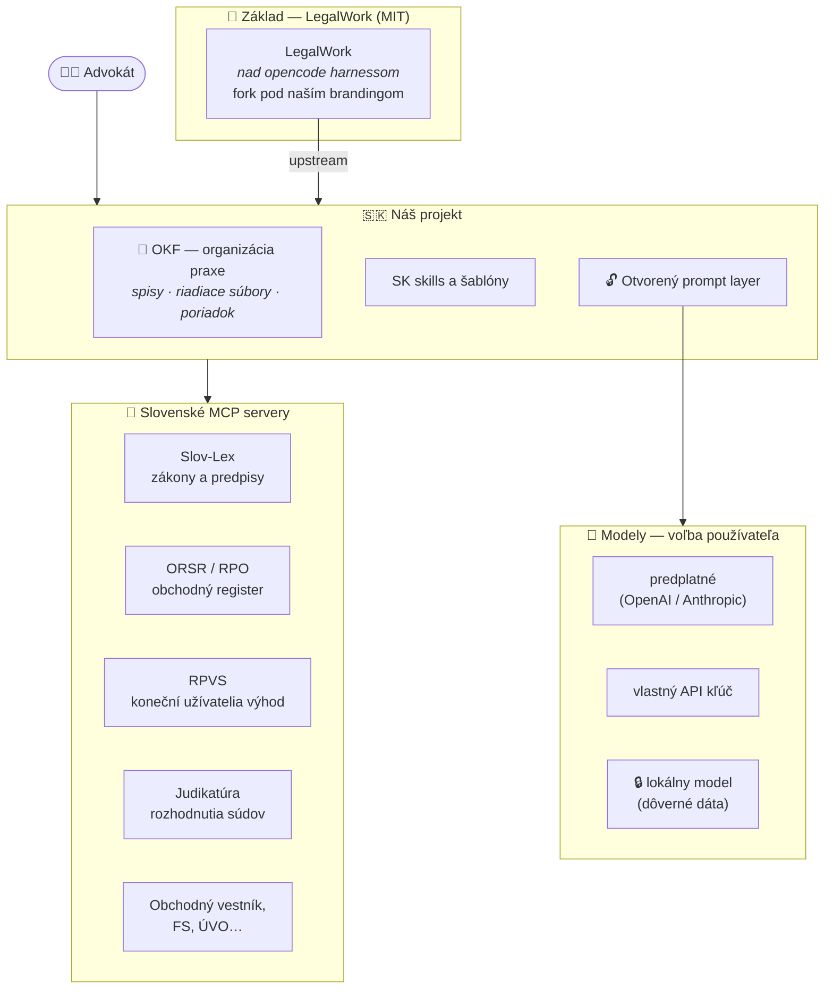
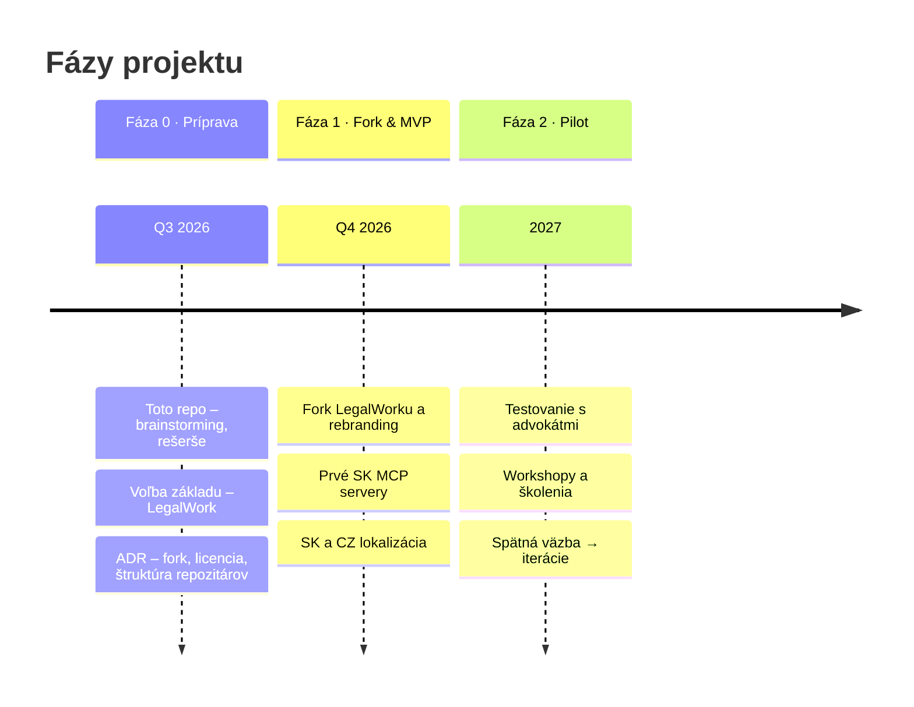
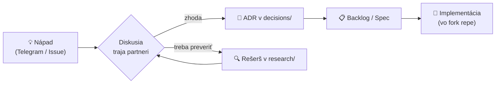

<div align="center">


# LAWOSS

### Czechia · Slovakia

**AI nástroje pre moderného advokáta**
*Poriadok v spise. Overené právo. AI pod kontrolou.*

`AI · KOMUNITA · KNOW-HOW`

[](planning/roadmap.md)
[](#-postavené-na-myšlienke-mikeoss)
[](decisions/0003-legal-work-ako-zaklad.md)
[](decisions/0003-legal-work-ako-zaklad.md)
[](docs/vision.md)


</div>

> [!NOTE]
> Toto repo **zatiaľ neobsahuje kód produktu**. Slúži na brainstorming, rešerše, plánovanie a spoločnú evidenciu podkladov (vrátane `AGENTS.md` / `CLAUDE.md`) pred založením samotného vývojového repozitára.

---

## ✨ Postavené na myšlienke MikeOSS

<table>
<tr>
<td width="120" align="center">

### 🍴
**MikeOSS**

</td>
<td>

**[MikeOSS](https://github.com/Open-Legal-Products/mike)** ukázal, že právny AI asistent nemusí byť uzavretý enterprise produkt za tisíce eur — môže byť **open-source a slobodný**. Tú myšlienku berieme a prinášame ju do **česko-slovenského** právneho prostredia.

LAWOSS je pokračovaním tejto línie: otvorený kód, žiadne black-box prompty, dáta u advokáta. To, čo MikeOSS začal pre svet, my dokončujeme pre CZ + SK jurisdikciu — so Slov-Lexom, judikatúrou, ORSR a slovenskou aj českou realitou advokátskej praxe.

</td>
</tr>
</table>

## 🎯 Vízia

Priniesť českým a slovenským advokátom **užitočný open-source nástroj úplne zadarmo** — postavený na zrelom open-source základe, obohatený o lokálne skills a MCP servery (Slov-Lex, ORSR, RPVS, judikatúra…), prispôsobený nášmu právu.

Nechceme „ďalší AI editor dokumentov". Ťažisko je **[organizácia advokátskej praxe (OKF)](specs/0002-okf-operacny-system-praxe.md)** — appka zakladá spisy, generuje riadiace súbory a stráži poriadok; AI je násobič, nie základ.

### Päť pilierov

| | |
|---|---|
| 📂 **Inteligentné spisy a úlohy** | OKF štruktúra, validácia, lehoty pod kontrolou |
| 🎙️ **Transkripcia a zápisy z porád** | on-device, prepis rovno do spisu |
| ⚖️ **Overené právne zdroje SK/CZ** | Slov-Lex, judikatúra, registre — proti halucináciám |
| 🔓 **Otvorený prompt layer** | žiadny black box, verzované prompty, štýlový profil advokáta |
| 🔒 **Lokálne dáta, maximálna bezpečnosť** | *Bezpečné. Súkromné. Vaše.* |

| | |
|---|---|
| 👥 **Tím** | Marián Čuprík · Martin Friedrich · Igor Ribár (advokáti SAK, pracovná skupina pre elektronizáciu advokácie) · Vojta Říha 🇨🇿 |
| 💰 **Model** | Nástroj zadarmo, open-source. Monetizácia výhradne cez workshopy a školenia — [ADR 0002](decisions/0002-preco-forkujeme-mikeoss.md) |
| 🧩 **Základ** | ✅ **[LegalWork](https://github.com/eigenweltlabs/legalwork)** (MIT) nad [opencode](https://github.com/sst/opencode) — [ADR 0003](decisions/0003-legal-work-ako-zaklad.md) |
| 🔄 **Stratégia** | **Fork pod vlastným brandingom** vo vlastnom repozitári; čo dáva zmysel posielame do upstreamu — [ADR 0004](decisions/0004-ako-rozsirit-legalwork.md) |
| 💬 **Komunikácia** | Telegram skupina + GitHub Issues/Discussions |

## 📦 Čo staviame ako prvé

> [!IMPORTANT]
> **Scope V1 (MVP) sa odklepáva v stredu 12. 8. 2026** → [agenda a odôvodnenie](meetings/2026-08-12-agenda-mvp.md)

Základ [LegalWork](decisions/0003-legal-work-ako-zaklad.md) už dáva chat, agenta, Office add-iny, transkripciu aj UI na MCP servery. **MVP je preto to, čo z neho spraví nástroj pre slovenského a českého advokáta:**

| Kandidát na V1 | Prečo |
|---|---|
| 🇸🇰🇨🇿 **SK/CZ lokalizácia** | bez nej to advokát nepoužije; nové súbory locale = nulový merge konflikt |
| 📁 **[OKF — spisy a štruktúra](specs/0002-okf-operacny-system-praxe.md)** | jadro odlíšenia, veľká časť už existuje |
| 🔌 **[MCP: judikatúra + Slov-Lex](specs/0004-mcp-sk-konektory.md)** | najviditeľnejšia hodnota, servery bežia, read-only |
| ⏰ **[Lehoty a timeline](specs/0005-lehoty-timeline.md)** | zmeškaná lehota = najčastejší dôvod zodpovednosti advokáta |
| 📄 **OCR ingest → markdown** | quick win, hotová Quick Action |

🗃️ **Všetkých 26 nápadov aj s tým, kam mieria:** [zberný kôš](planning/napady.md) · [grafický prehľad funkcií](https://originalmagneto.github.io/lawOSS-like-SK-CZ/specs/prehlad.html)

## 🖥️ Ako to má vyzerať

> [!NOTE]
> **Vizuálne koncepty, nie snímky hotového produktu.** Slúžia na zjednotenie predstavy o rozhraní a na komunikáciu projektu. Dáta v nich sú vymyslené.

<div align="center">


<sub><i>Prehľad · Spisy · Rešerš · Transkripcia · Dokumenty · Prompty · AI Asistent</i></sub>

<br><br>


<sub><i>Detail hlavných funkcií — prehľad spisu, právny výskum s citáciami, transkripcia, editor promptov a AI asistent</i></sub>

<br><br>


<sub><i>Prax pod kontrolou, kdekoľvek — mobil aj desktop</i></sub>

</div>

**Čo v konceptoch hľadať:**

| V rozhraní | Čo za tým je |
|---|---|
| **Spisy** s číslami vecí a agendou | [OKF — operačný systém praxe](specs/0002-okf-operacny-system-praxe.md) |
| **Rešerš** s relevanciou nad rozhodnutiami NS, ÚS a KS | [SK MCP konektory](specs/0004-mcp-sk-konektory.md) |
| **Transkripcia** naviazaná na konkrétny spis, s úlohami a lehotami | [spec 0001](specs/0001-transkripcia.md) + [lehoty a timeline](specs/0005-lehoty-timeline.md) |
| **Prompty** ako vlastné AI postupy | [otvorený prompt layer](specs/0003-prompt-layer.md) |
| **Konektory** na e-súdy, registre a služby tretích strán | [spec 0004](specs/0004-mcp-sk-konektory.md) |
| **Lokálne spracovanie dát** | dáta zostávajú u advokáta — mlčanlivosť a GDPR |

> [!NOTE]
> Vo vizuáloch sa objavujú aj funkcie, ktoré sú zatiaľ **v štádiu prieskumu** a nemajú špecifikáciu — evidujeme ich v [navrhy.md](specs/navrhy.md).

## 🧩 Základ — rozhodnuté

**[LegalWork](https://github.com/eigenweltlabs/legalwork)** (MIT) — [ADR 0003](decisions/0003-legal-work-ako-zaklad.md), rozhodnuté na [calle 6. 8. 2026](meetings/2026-08-06-sync-call-volba-zakladu.md).

Hlavný dôvod je **open-code harness v pozadí**: LegalWork nie je samostatný agent, ale desktopová nadstavba nad **[opencode](https://github.com/sst/opencode)** (MIT), ktorý natívne podporuje MCP servery, agentov a subagentov, skills a pluginy. K tomu MIT licencia, lokálny beh a hotová on-device transkripcia.

| Kandidát | Výsledok |
|---|---|
| **[LegalWork](research/inspiracie/legalwork.md)** 🇩🇪 | ✅ **zvolený** — MIT, opencode harness, desktop app, lokálny beh, MCP rozšírenia, **prihlásenie vlastným predplatným** (OpenAI · Anthropic · xAI a ďalšie) |
| **[mikeOSS](https://github.com/Open-Legal-Products/mike)** 🇺🇸 | ❌ zamietnutý — **AGPL-3.0** (nezlučiteľné s požiadavkou na permisívnu licenciu) a chýbajúci harness. Zostáva ako **inšpirácia**. |
| **Stella** 🇨🇿 | ❌ nedostala sa do užšieho výberu — zostáva možným zdrojom komponentov pre anonymizáciu |

**Ako ho rozšírime:** forkujeme pod vlastným brandingom do vlastného repozitára a čo dáva zmysel posielame do upstreamu — [ADR 0004](decisions/0004-ako-rozsirit-legalwork.md). Koordinácia (toto repo) a kód zostávajú oddelene — [ADR 0005](decisions/0005-struktura-repozitarov.md).

> [!TIP]
> **Prihlásenie vlastným predplatným funguje.** Overené 2026-08-06 na **OpenAI (ChatGPT)**, **Anthropic (Claude)** aj **xAI (Grok)** — advokát vie využiť predplatné, ktoré už má, bez riešenia API kľúčov. To je pri cene rešeršnej práce podstatný rozdiel.
>
> Pri Anthropicu appka zobrazuje upozornenie, že ich Consumer Terms obmedzujú tento OAuth na Claude Code a claude.ai. Berieme to ako **informovanú voľbu používateľa**; kto chce mať istotu, použije vlastný API kľúč. Detail v [analýze LegalWork](research/inspiracie/legalwork.md) a [spec 0003](specs/0003-prompt-layer.md).

## 🏗️ Architektúra (návrh)



## 🎨 Značka

**Wordmark:** `LAW` biele + `OSS` zlaté · **Logo:** hexagonálny štít s váhami spravodlivosti a antickým stĺpom, štítky s českou a slovenskou vlajkou.
**Paleta:** navy `#0D1B2A` · zlatá `#C9A24A` · biela — **Typografia:** Inter (UI) + Playfair Display (nadpisy).

> Celý rozpis značky a rozhrania: **[docs/brand-concept.md](docs/brand-concept.md)**

## 🔬 Rešerše

Prvý **deep-research** balík (NotebookLM, 245 zdrojov, 6 kôl) o open-source AI pre slovenskú advokáciu — MCP servery, anonymizácia (MasKIT/Stella), integrácia vlastného a lokálneho API (BYOK), a compliance (SAK 2025, EU AI Act).

- 📊 **Grafický report (rich markdown):** [research/deep-research/](research/deep-research/)
- 🌐 **Živý HTML report:** [originalmagneto.github.io/lawOSS-like-SK-CZ/research/deep-research/report.html](https://originalmagneto.github.io/lawOSS-like-SK-CZ/research/deep-research/report.html)
- 🎧 **Audio podcast (SK):** [Releases](https://github.com/originalmagneto/lawOSS-like-SK-CZ/releases/tag/research-2026-07-10)

## 🗺️ Roadmapa



Detailný harmonogram: [planning/timeline.md](planning/timeline.md) · Backlog: [planning/backlog.md](planning/backlog.md)

## 📊 Progress

<!-- AUTO:PROGRESS -->
| Súbor | Progress | Hotovo |
|---|---|---|
| [`2026-08-12-mcp-repository-rollout-plan.md`](planning/2026-08-12-mcp-repository-rollout-plan.md) | `░░░░░░░░░░░░░░░░░░░░` | 0/46 (0 %) |
| [`backlog.md`](planning/backlog.md) | `██░░░░░░░░░░░░░░░░░░` | 5/52 (10 %) |
| [`mcp-repository-inventory.md`](planning/mcp-repository-inventory.md) | `░░░░░░░░░░░░░░░░░░░░` | 0/6 (0 %) |
| [`roadmap.md`](planning/roadmap.md) | `███░░░░░░░░░░░░░░░░░` | 6/35 (17 %) |
| [`workshopy.md`](planning/workshopy.md) | `░░░░░░░░░░░░░░░░░░░░` | 0/3 (0 %) |
<!-- /AUTO:PROGRESS -->

## 🗂️ Štruktúra repozitára

<!-- AUTO:TREE -->
```text
lawOSS-like-SK-CZ/
├── assets/
│   └── brand/
│       ├── keyvisual-dashboard.png
│       ├── keyvisual-features.png
│       ├── keyvisual-hero.png
│       ├── keyvisual-mobile.png
│       ├── logo.png
│       ├── mockup.png
│       ├── moodboard.png
│       └── README.md
├── decisions/
│   ├── 0002-preco-forkujeme-mikeoss.html
│   ├── 0002-preco-forkujeme-mikeoss.md
│   ├── 0003-legal-work-ako-zaklad.html
│   ├── 0003-legal-work-ako-zaklad.md
│   ├── 0004-ako-rozsirit-legalwork.html
│   ├── 0004-ako-rozsirit-legalwork.md
│   ├── 0005-struktura-repozitarov.html
│   ├── 0005-struktura-repozitarov.md
│   ├── 0006-anonymizacia-ako-lokalny-privacy-gate.md
│   ├── 0008-sprava-mcp-repozitarov.md
│   └── template.md
├── docs/
│   ├── templates/
│   │   └── mcp-repository-AGENTS.md
│   ├── brand-concept.md
│   ├── glossary.md
│   ├── mcp-repository-workflow.md
│   ├── principles.md
│   ├── telegram-notifikacie.md
│   └── vision.md
├── meetings/
│   ├── 2026-08-04-brainstorming-zaklad-a-prenositelnost.md
│   ├── 2026-08-06-sync-call-volba-zakladu.md
│   ├── 2026-08-12-agenda-mvp.md
│   └── 2026-08-12-produktova-vizia-okf-pamat.md
├── planning/
│   ├── 2026-08-12-mcp-repository-rollout-plan.md
│   ├── 2026-08-12-rozhodovacie-otazky-timu.md
│   ├── backlog.md
│   ├── mcp-repository-inventory.md
│   ├── napady.md
│   ├── roadmap.md
│   ├── timeline.md
│   └── workshopy.md
├── research/
│   ├── deep-research/
│   │   ├── 2026-07-10-open-source-legaltech-EU-mcp-anonymizacia.md
│   │   ├── 2026-07-10-zdroje.md
│   │   ├── README.md
│   │   └── report.html
│   ├── idey/
│   │   ├── 2026-07-29-build-open-vs-buy-closed.md
│   │   ├── 2026-07-29-orchestrator-transkripcia-byo-subscriptions.md
│   │   ├── 2026-08-07-feature-ideas-telegram.md
│   │   └── README.md
│   ├── inspiracie/
│   │   ├── legalwork.md
│   │   ├── porovnanie.html
│   │   └── README.md
│   ├── mcp-servery/
│   ├── mikeoss/
│   ├── pravny-ramec/
│   └── sk-datove-zdroje/
├── specs/
│   ├── 0001-transkripcia.md
│   ├── 0002-okf-operacny-system-praxe.md
│   ├── 0003-prompt-layer.md
│   ├── 0004-mcp-sk-konektory.md
│   ├── 0005-lehoty-timeline.md
│   ├── 0007-podpisovanie-a-zarucena-konverzia.md
│   ├── 0008-anonymizacia-a-privacy-gate.md
│   ├── navrhy.md
│   ├── prehlad.html
│   ├── README.md
│   └── template.md
├── AGENTS.md
├── CLAUDE.md
├── CONTRIBUTING.md
└── README.md
```
<!-- /AUTO:TREE -->

<details>
<summary><b>Na čo slúžia jednotlivé priečinky</b></summary>

| Priečinok | Účel |
|---|---|
| `docs/` | Vízia, princípy, glosár |
| `decisions/` | ADR — zaznamenané rozhodnutia (čo, prečo, aké alternatívy) |
| `research/` | Rešerše: upstream MikeOSS, inšpirácie, SK dátové zdroje, MCP servery, právny rámec |
| `planning/` | Roadmapa, timeline, backlog, plán workshopov |
| `specs/` | Konkrétne návrhy funkcií (dozreté nápady z backlogu) |
| `meetings/` | Zápisky zo stretnutí (`RRRR-MM-DD.md`) |
| `assets/` | Diagramy, obrázky, PDF podklady |
| `AGENTS.md` | Kontext pre agentické systémy — **single source of truth** |
| `CLAUDE.md` | Mirror `AGENTS.md` — needitovať priamo |

</details>

## 🔄 Ako pracujeme s rozhodnutiami



## 📈 Aktivita

<!-- AUTO:ACTIVITY -->
**123 commitov** · **80 súborov**

| Commit | Dátum | Autor | Správa |
|---|---|---|---|
| `754bde5` | 2026-08-12 | github-actions[bot] | docs: auto-update README [skip ci] |
| `395bb7c` | 2026-08-12 | Majo Cuprik | Merge pull request #26 from originalmagneto/codex/collaboration-decision-questions |
| `b321bcf` | 2026-08-12 | github-actions[bot] | docs: auto-update README [skip ci] |
| `72288bf` | 2026-08-12 | Majo Cuprik | Merge pull request #25 from originalmagneto/codex/call-2026-08-12-decisions |
| `08f50fd` | 2026-08-12 | Majo Cuprik | planning: otvoriť rozhodovacie otázky tímu |
| `70a629d` | 2026-08-12 | Majo Cuprik | docs: zapísať priority z callu 12. augusta |
| `39d7b3b` | 2026-08-12 | github-actions[bot] | docs: auto-update README [skip ci] |
| `82d8aeb` | 2026-08-12 | Majo Cuprik | Merge pull request #24 from originalmagneto/codex/mcp-rollout-execution |
<!-- /AUTO:ACTIVITY -->

---

<div align="center">
<sub>Sekcie označené 🤖 sa aktualizujú automaticky GitHub Action pri každom pushi — needitujte ich ručne.<br/>
<b>Posledná automatická aktualizácia:</b> <!-- AUTO:UPDATED -->2026-08-12 18:01 UTC<!-- /AUTO:UPDATED --></sub>
</div>
