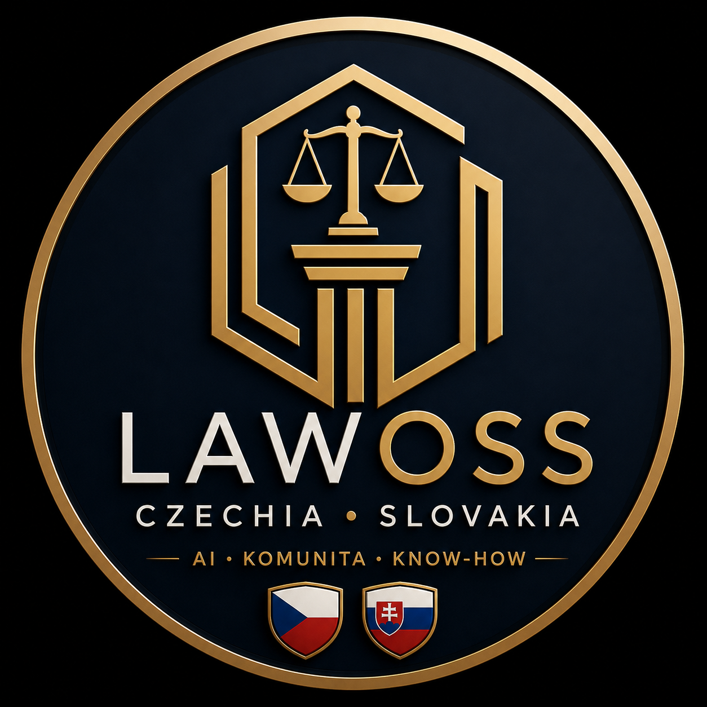
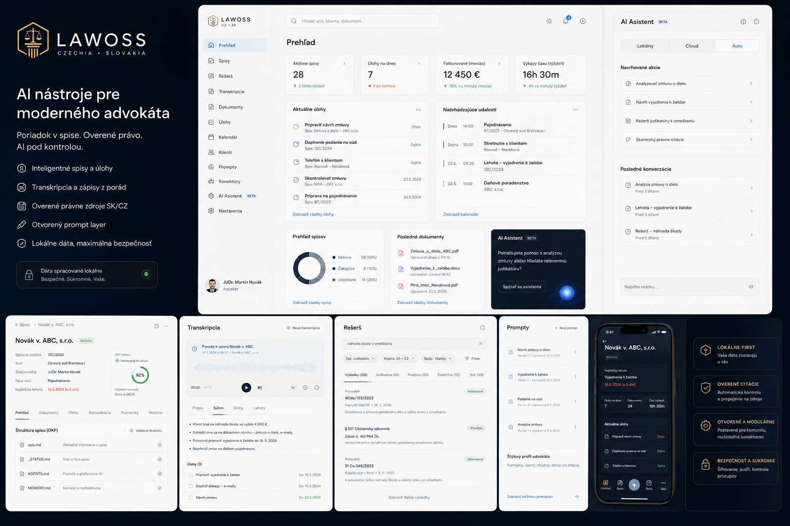
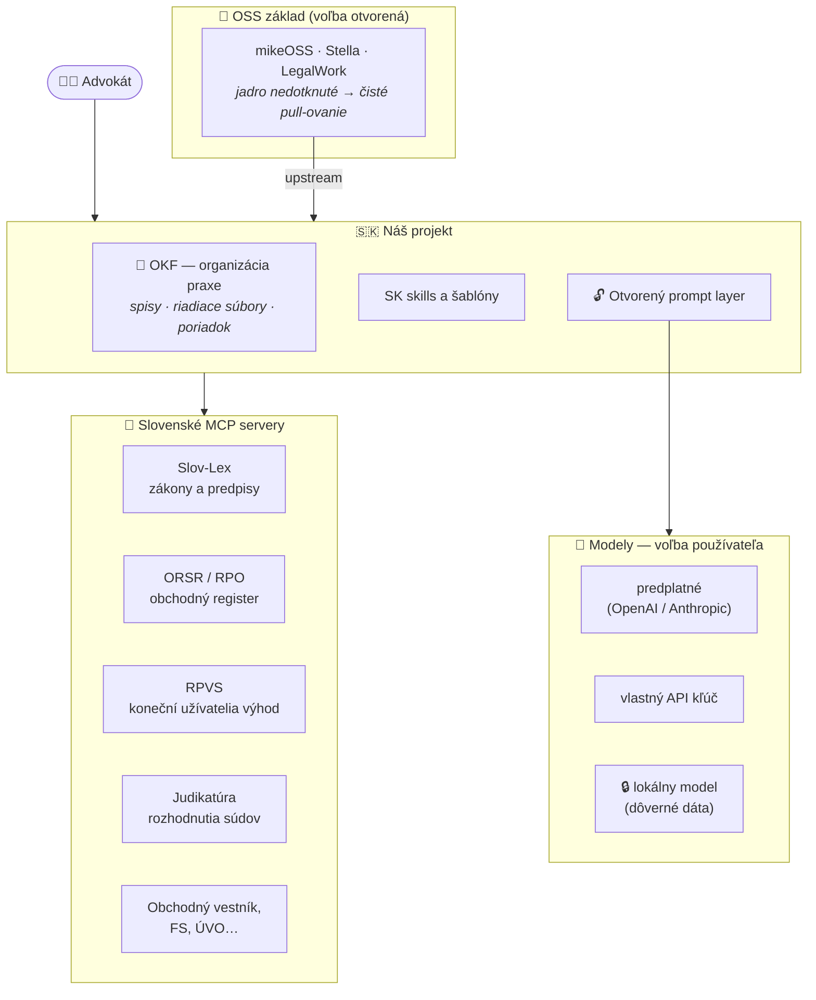
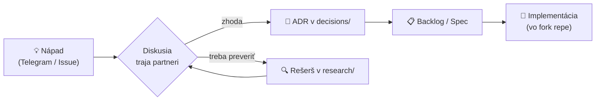

<div align="center">



# LAWOSS

### Czechia · Slovakia

**AI nástroje pre moderného advokáta**
*Poriadok v spise. Overené právo. AI pod kontrolou.*

`AI · KOMUNITA · KNOW-HOW`

[](planning/roadmap.md)
[](#-postavené-na-myšlienke-mikeoss)
[](research/inspiracie/)
[](planning/backlog.md)
[](docs/vision.md)

</div>

> [!NOTE]
> Toto repo **zatiaľ neobsahuje kód produktu**. Slúži na brainstorming, rešerše, plánovanie a spoločnú evidenciu podkladov (vrátane `AGENTS.md` / `CLAUDE.md`) pred založením samotného vývojového repozitára.

---

## ✨ Postavené na myšlienke MikeOSS

<table>
<tr>
<td width="120" align="center">

### 🍴
**MikeOSS**

</td>
<td>

**[MikeOSS](https://github.com/Open-Legal-Products/mike)** ukázal, že právny AI asistent nemusí byť uzavretý enterprise produkt za tisíce eur — môže byť **open-source a slobodný**. Tú myšlienku berieme a prinášame ju do **česko-slovenského** právneho prostredia.

LAWOSS je pokračovaním tejto línie: otvorený kód, žiadne black-box prompty, dáta u advokáta. To, čo MikeOSS začal pre svet, my dokončujeme pre CZ + SK jurisdikciu — so Slov-Lexom, judikatúrou, ORSR a slovenskou aj českou realitou advokátskej praxe.

</td>
</tr>
</table>

## 🎯 Vízia

Priniesť českým a slovenským advokátom **užitočný open-source nástroj úplne zadarmo** — postavený na zrelom open-source základe, obohatený o lokálne skills a MCP servery (Slov-Lex, ORSR, RPVS, judikatúra…), prispôsobený nášmu právu.

Nechceme „ďalší AI editor dokumentov". Ťažisko je **[organizácia advokátskej praxe (OKF)](specs/0002-okf-operacny-system-praxe.md)** — appka zakladá spisy, generuje riadiace súbory a stráži poriadok; AI je násobič, nie základ.

### Päť pilierov

| | |
|---|---|
| 📂 **Inteligentné spisy a úlohy** | OKF štruktúra, validácia, lehoty pod kontrolou |
| 🎙️ **Transkripcia a zápisy z porád** | on-device, prepis rovno do spisu |
| ⚖️ **Overené právne zdroje SK/CZ** | Slov-Lex, judikatúra, registre — proti halucináciám |
| 🔓 **Otvorený prompt layer** | žiadny black box, verzované prompty, štýlový profil advokáta |
| 🔒 **Lokálne dáta, maximálna bezpečnosť** | *Bezpečné. Súkromné. Vaše.* |

| | |
|---|---|
| 👥 **Tím** | Marián Čuprík · Martin Friedrich · Igor Ribár (advokáti SAK, pracovná skupina pre elektronizáciu advokácie) |
| 💰 **Model** | Nástroj zadarmo, open-source. Monetizácia výhradne cez workshopy a školenia — [ADR 0002](decisions/0002-preco-forkujeme-mikeoss.md) |
| 🧩 **Základ** | ⚠️ **voľba otvorená** — [mikeOSS · Stella · LegalWork](research/inspiracie/) |
| 🔄 **Stratégia** | Lokálne úpravy ako **skills / pluginy / MCP** mimo jadra → priebežné pull-ovanie upstreamu bez konfliktov |
| 💬 **Komunikácia** | Telegram skupina + GitHub Issues/Discussions |

## 🖥️ Ako to má vyzerať

<div align="center">

<sub><i>Koncept rozhrania — nie finálny dizajn. Prehľad · Spisy · Rešerš · Transkripcia · Prompty · Konektory · AI Asistent</i></sub>
</div>

> [!TIP]
> Všimni si v mockupe **prepínač `Lokálny · Cloud · Auto`** pri AI asistentovi — to je [hybrid routing](specs/0003-prompt-layer.md#-hybrid-routing--rozdelenie-podľa-vrstvy), a **OKF status „Validovaná štruktúra 92 %"** so zoznamom riadiacich súborov (`spis.md`, `_STATUS.md`, `AGENTS.md`, `MEMORY.md`) — to je [spec 0002](specs/0002-okf-operacny-system-praxe.md).

## 🧩 Voľba základu — otvorená

Rozhodnutie **[ADR 0002](decisions/0002-preco-forkujeme-mikeoss.md)** (forkujeme zrelý OSS projekt, nestaviame od nuly) platí. Otvorené ostáva **ktorý** projekt.

| Kandidát | Hlavná výhoda | Poznámka |
|---|---|---|
| **[LegalWork](research/inspiracie/legalwork.md)** 🇩🇪 | 🔑 **Prihlásenie cez OpenAI / Anthropic účet** — používateľ vie priamo využiť **svoje existujúce predplatné**, nemusí riešiť API kľúče. Navyše MIT, desktop app, beží lokálne, hotová on-device transkripcia, MCP rozšírenia. | najaktívnejší vývoj *(62 vs 6 commitov/mes.)* |
| **[mikeOSS](https://github.com/Open-Legal-Products/mike)** 🇺🇸 | 📣 **Marketingové spojenie a známosť mena** (3 924 ⭐) — ťaháme na tom pozornosť pri promovaní projektu | AGPL-3.0; menšia vývojová aktivita |
| **Stella** 🇨🇿 | 🛡️ **Hotová anonymizácia** pre CZ/SK text, permisívna licencia | zdroj komponentov aj pri inej voľbe |

> [!IMPORTANT]
> **Prečo je to zámerne otvorené:** LegalWork má silnejší technický argument (subscription auth + lokálny beh), mikeOSS silnejší marketingový (meno, komunita). Rozhodneme na stretku — a nie je vylúčené **kombinovať**: základ od jedného, komponenty od druhého.
>
> ⚠️ K subscription: prihlásenie predplatným **je implementované**, ale poskytovateľ ho môže obmedziť svojimi podmienkami — detail a odporúčanie v [spec 0003](specs/0003-prompt-layer.md#-tos-subscriptions--čiastočne-zodpovedané-2026-07-29).

## 🏗️ Architektúra (návrh)



## 🎨 Značka

**Wordmark:** `LAW` biele + `OSS` zlaté · **Logo:** hexagonálny štít s váhami spravodlivosti a antickým stĺpom, štítky s českou a slovenskou vlajkou.
**Paleta:** navy `#0D1B2A` · zlatá `#C9A24A` · biela — **Typografia:** Inter (UI) + Playfair Display (nadpisy).

> Celý rozpis značky a rozhrania: **[docs/brand-concept.md](docs/brand-concept.md)**

## 🔬 Rešerše

Prvý **deep-research** balík (NotebookLM, 245 zdrojov, 6 kôl) o open-source AI pre slovenskú advokáciu — MCP servery, anonymizácia (MasKIT/Stella), integrácia vlastného a lokálneho API (BYOK), a compliance (SAK 2025, EU AI Act).

- 📊 **Grafický report (rich markdown):** [research/deep-research/](research/deep-research/)
- 🌐 **Živý HTML report:** [originalmagneto.github.io/lawOSS-like-SK-CZ/research/deep-research/report.html](https://originalmagneto.github.io/lawOSS-like-SK-CZ/research/deep-research/report.html)
- 🎧 **Audio podcast (SK):** [Releases](https://github.com/originalmagneto/lawOSS-like-SK-CZ/releases/tag/research-2026-07-10)

## 🗺️ Roadmapa


Detailný harmonogram: [planning/timeline.md](planning/timeline.md) · Backlog: [planning/backlog.md](planning/backlog.md)

## 📊 Progress

<!-- AUTO:PROGRESS -->
| Súbor | Progress | Hotovo |
|---|---|---|
| [`backlog.md`](planning/backlog.md) | `█░░░░░░░░░░░░░░░░░░░` | 1/19 (5 %) |
| [`roadmap.md`](planning/roadmap.md) | `██░░░░░░░░░░░░░░░░░░` | 2/17 (12 %) |
| [`workshopy.md`](planning/workshopy.md) | `░░░░░░░░░░░░░░░░░░░░` | 0/3 (0 %) |
<!-- /AUTO:PROGRESS -->

## 🗂️ Štruktúra repozitára

<!-- AUTO:TREE -->
```text
lawOSS-like-SK-CZ/
├── assets/
│   └── brand/
│       ├── logo.png
│       ├── mockup.png
│       ├── moodboard.png
│       └── README.md
├── decisions/
│   ├── 0002-preco-forkujeme-mikeoss.html
│   ├── 0002-preco-forkujeme-mikeoss.md
│   └── template.md
├── docs/
│   ├── brand-concept.md
│   ├── glossary.md
│   ├── principles.md
│   ├── telegram-notifikacie.md
│   └── vision.md
├── meetings/
├── planning/
│   ├── backlog.md
│   ├── roadmap.md
│   ├── timeline.md
│   └── workshopy.md
├── research/
│   ├── deep-research/
│   │   ├── audio/
│   │   │   └── 2026-07-10-mikeoss-research-podcast-sk.m4a
│   │   ├── 2026-07-10-open-source-legaltech-EU-mcp-anonymizacia.md
│   │   ├── 2026-07-10-zdroje.md
│   │   ├── README.md
│   │   └── report.html
│   ├── idey/
│   │   ├── 2026-07-29-build-open-vs-buy-closed.md
│   │   ├── 2026-07-29-orchestrator-transkripcia-byo-subscriptions.md
│   │   └── README.md
│   ├── inspiracie/
│   │   ├── legalwork.md
│   │   ├── porovnanie.html
│   │   └── README.md
│   ├── mcp-servery/
│   ├── mikeoss/
│   ├── pravny-ramec/
│   └── sk-datove-zdroje/
├── specs/
│   ├── 0001-transkripcia.md
│   ├── 0002-okf-operacny-system-praxe.md
│   ├── 0003-prompt-layer.md
│   ├── 0004-mcp-sk-konektory.md
│   ├── 0005-lehoty-timeline.md
│   ├── navrhy.md
│   ├── prehlad.html
│   ├── README.md
│   └── template.md
├── AGENTS.md
├── CLAUDE.md
├── CONTRIBUTING.md
└── README.md
```
<!-- /AUTO:TREE -->

<details>
<summary><b>Na čo slúžia jednotlivé priečinky</b></summary>

| Priečinok | Účel |
|---|---|
| `docs/` | Vízia, princípy, glosár |
| `decisions/` | ADR — zaznamenané rozhodnutia (čo, prečo, aké alternatívy) |
| `research/` | Rešerše: upstream MikeOSS, inšpirácie, SK dátové zdroje, MCP servery, právny rámec |
| `planning/` | Roadmapa, timeline, backlog, plán workshopov |
| `specs/` | Konkrétne návrhy funkcií (dozreté nápady z backlogu) |
| `meetings/` | Zápisky zo stretnutí (`RRRR-MM-DD.md`) |
| `assets/` | Diagramy, obrázky, PDF podklady |
| `AGENTS.md` | Kontext pre agentické systémy — **single source of truth** |
| `CLAUDE.md` | Mirror `AGENTS.md` — needitovať priamo |

</details>

## 🔄 Ako pracujeme s rozhodnutiami



## 📈 Aktivita

<!-- AUTO:ACTIVITY -->
**73 commitov** · **53 súborov**

| Commit | Dátum | Autor | Správa |
|---|---|---|---|
| `08c6b72` | 2026-07-30 | Majo Cuprik | Merge branch 'main' of https://github.com/originalmagneto/lawOSS-like-SK-CZ |
| `5a86429` | 2026-07-30 | Marián Čuprík | specs: 0005 Lehoty & timeline (MF, Issue #1) + zúžený alfa scope |
| `5404609` | 2026-07-30 | github-actions[bot] | docs: auto-update README [skip ci] |
| `e46789d` | 2026-07-30 | Majo Cuprik | Merge branch 'main' of https://github.com/originalmagneto/lawOSS-like-SK-CZ |
| `0bb2d72` | 2026-07-30 | Marián Čuprík | specs: zaevidovaný návrh MF — Attorney workflow MVP (Issue #1) |
| `8fde62e` | 2026-07-30 | github-actions[bot] | docs: auto-update README [skip ci] |
| `dc82a58` | 2026-07-30 | Majo Cuprik | Merge branch 'main' of https://github.com/originalmagneto/lawOSS-like-SK-CZ |
| `f91cf7b` | 2026-07-30 | Marián Čuprík | assets: logo, mockup a moodboard LAWOSS |
<!-- /AUTO:ACTIVITY -->

---

<div align="center">
<sub>Sekcie označené 🤖 sa aktualizujú automaticky GitHub Action pri každom pushi — needitujte ich ručne.<br/>
<b>Posledná automatická aktualizácia:</b> <!-- AUTO:UPDATED -->2026-07-30 16:08 UTC<!-- /AUTO:UPDATED --></sub>
</div>
