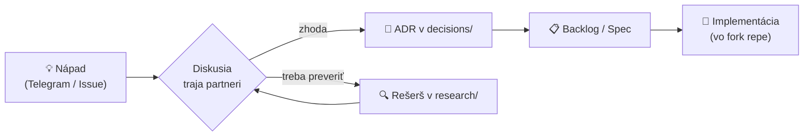

<div align="center">

# ⚖️ MikeOSS Slovakia

**Open-source právny asistent pre slovenských advokátov**
*Operačný systém advokátskej praxe — organizácia spisov, AI rešerš a slovenské registre v jednom*

[](planning/roadmap.md)
[](research/inspiracie/)
[](planning/backlog.md)
[](docs/vision.md)

</div>

> [!NOTE]
> Toto repo **zatiaľ neobsahuje kód produktu**. Slúži na brainstorming, rešerše, plánovanie a spoločnú evidenciu podkladov (vrátane `AGENTS.md` / `CLAUDE.md`) pred založením samotného vývojového repozitára.

---

## 🎯 Vízia

Priniesť slovenským advokátom **užitočný open-source nástroj úplne zadarmo** — postavený na zrelom open-source základe, obohatený o slovenské skills a MCP servery (Slov-Lex, ORSR, RPVS, judikatúra…), prispôsobený slovenskému právu, s možnosťou neskoršieho rozšírenia o ďalšie krajiny.

Nechceme „ďalší AI editor dokumentov". Ťažisko je **[organizácia advokátskej praxe (OKF)](specs/0002-okf-operacny-system-praxe.md)** — appka zakladá spisy, generuje riadiace súbory a stráži poriadok; AI je násobič, nie základ.

| | |
|---|---|
| 👥 **Tím** | Marián Čuprík · Martin Friedrich · Igor Ribár (advokáti SAK, pracovná skupina pre elektronizáciu advokácie) |
| 💰 **Model** | Nástroj zadarmo, open-source. Monetizácia výhradne cez workshopy a školenia — [ADR 0002](decisions/0002-preco-forkujeme-mikeoss.md) |
| 🧩 **Základ** | ⚠️ **voľba otvorená** — [mikeOSS · Stella · LegalWork](research/inspiracie/) |
| 🔄 **Stratégia** | Slovenské úpravy ako **skills / pluginy / MCP** mimo jadra → priebežné pull-ovanie upstreamu bez konfliktov |
| 💬 **Komunikácia** | Telegram skupina + GitHub Issues/Discussions |

## 🧩 Voľba základu — otvorená

Rozhodnutie **[ADR 0002](decisions/0002-preco-forkujeme-mikeoss.md)** (forkujeme zrelý OSS projekt, nestaviame od nuly) platí. Otvorené ostáva **ktorý** projekt.

| Kandidát | Hlavná výhoda | Poznámka |
|---|---|---|
| **[LegalWork](research/inspiracie/legalwork.md)** 🇩🇪 | 🔑 **Prihlásenie cez OpenAI / Anthropic účet** — používateľ vie priamo využiť **svoje existujúce predplatné**, nemusí riešiť API kľúče. Navyše MIT, desktop app, beží lokálne, hotová on-device transkripcia, MCP rozšírenia. | najaktívnejší vývoj *(62 vs 6 commitov/mes.)* |
| **[mikeOSS](https://github.com/Open-Legal-Products/mike)** 🇺🇸 | 📣 **Marketingové spojenie a známosť mena** (3 924 ⭐) — ťaháme na tom pozornosť pri promovaní projektu | AGPL-3.0; menšia vývojová aktivita |
| **Stella** 🇨🇿 | 🛡️ **Hotová anonymizácia** pre CZ/SK text, permisívna licencia | zdroj komponentov aj pri inej voľbe |

> [!IMPORTANT]
> **Prečo je to zámerne otvorené:** LegalWork má silnejší technický argument (subscription auth + lokálny beh), mikeOSS silnejší marketingový (meno, komunita). Rozhodneme na stretku — a nie je vylúčené **kombinovať**: základ od jedného, komponenty od druhého.
>
> ⚠️ K subscription: prihlásenie predplatným **je implementované**, ale poskytovateľ ho môže obmedziť svojimi podmienkami — detail a odporúčanie v [spec 0003](specs/0003-prompt-layer.md#-tos-subscriptions--čiastočne-zodpovedané-2026-07-29).

## 🏗️ Architektúra (návrh)


## 🎨 Vizuálny koncept

Ranný náčrt značky a produktu — logo (monogram „M" s váhami spravodlivosti), tmavo-zlatá paleta, typografia **Inter + Playfair Display** a koncept dashboardu (Spisy · Klienti · Dokumenty · Fakturácia · AI Asistent). Päť pilierov: **dôvera a bezpečnosť · efektivita · prehľadnosť · spolupráca · modernosť**.

> Celý moodboard a rozpis: **[docs/brand-concept.md](docs/brand-concept.md)** · *(ide o koncept, nie schválený finálny dizajn)*

## 🔬 Rešerše

Prvý **deep-research** balík (NotebookLM, 245 zdrojov, 6 kôl) o open-source AI pre slovenskú advokáciu — MCP servery, anonymizácia (MasKIT/Stella), integrácia vlastného a lokálneho API (BYOK), a compliance (SAK 2025, EU AI Act).

- 📊 **Grafický report (rich markdown):** [research/deep-research/](research/deep-research/)
- 🌐 **Živý HTML report:** [originalmagneto.github.io/lawOSS-like-SK-CZ/research/deep-research/report.html](https://originalmagneto.github.io/lawOSS-like-SK-CZ/research/deep-research/report.html)
- 🎧 **Audio podcast (SK):** [Releases](https://github.com/originalmagneto/lawOSS-like-SK-CZ/releases/tag/research-2026-07-10)

## 🗺️ Roadmapa


Detailný harmonogram: [planning/timeline.md](planning/timeline.md) · Backlog: [planning/backlog.md](planning/backlog.md)

## 📊 Progress

<!-- AUTO:PROGRESS -->
| Súbor | Progress | Hotovo |
|---|---|---|
| [`backlog.md`](planning/backlog.md) | `░░░░░░░░░░░░░░░░░░░░` | 0/16 (0 %) |
| [`roadmap.md`](planning/roadmap.md) | `██░░░░░░░░░░░░░░░░░░` | 2/17 (12 %) |
| [`workshopy.md`](planning/workshopy.md) | `░░░░░░░░░░░░░░░░░░░░` | 0/3 (0 %) |
<!-- /AUTO:PROGRESS -->

## 🗂️ Štruktúra repozitára

<!-- AUTO:TREE -->
```text
lawOSS-like-SK-CZ/
├── assets/
│   └── brand/
│       └── README.md
├── decisions/
│   ├── 0002-preco-forkujeme-mikeoss.html
│   ├── 0002-preco-forkujeme-mikeoss.md
│   └── template.md
├── docs/
│   ├── brand-concept.md
│   ├── glossary.md
│   ├── principles.md
│   ├── telegram-notifikacie.md
│   └── vision.md
├── meetings/
├── planning/
│   ├── backlog.md
│   ├── roadmap.md
│   ├── timeline.md
│   └── workshopy.md
├── research/
│   ├── deep-research/
│   │   ├── 2026-07-10-open-source-legaltech-EU-mcp-anonymizacia.md
│   │   ├── 2026-07-10-zdroje.md
│   │   ├── README.md
│   │   └── report.html
│   ├── idey/
│   │   ├── 2026-07-29-build-open-vs-buy-closed.md
│   │   ├── 2026-07-29-orchestrator-transkripcia-byo-subscriptions.md
│   │   └── README.md
│   ├── inspiracie/
│   │   ├── legalwork.md
│   │   ├── porovnanie.html
│   │   └── README.md
│   ├── mcp-servery/
│   ├── mikeoss/
│   ├── pravny-ramec/
│   └── sk-datove-zdroje/
├── specs/
│   ├── 0001-transkripcia.md
│   ├── 0002-okf-operacny-system-praxe.md
│   ├── 0003-prompt-layer.md
│   ├── 0004-mcp-sk-konektory.md
│   ├── navrhy.md
│   ├── prehlad.html
│   ├── README.md
│   └── template.md
├── AGENTS.md
├── CLAUDE.md
├── CONTRIBUTING.md
└── README.md
```
<!-- /AUTO:TREE -->

<details>
<summary><b>Na čo slúžia jednotlivé priečinky</b></summary>

| Priečinok | Účel |
|---|---|
| `docs/` | Vízia, princípy, glosár |
| `decisions/` | ADR — zaznamenané rozhodnutia (čo, prečo, aké alternatívy) |
| `research/` | Rešerše: upstream MikeOSS, inšpirácie, SK dátové zdroje, MCP servery, právny rámec |
| `planning/` | Roadmapa, timeline, backlog, plán workshopov |
| `specs/` | Konkrétne návrhy funkcií (dozreté nápady z backlogu) |
| `meetings/` | Zápisky zo stretnutí (`RRRR-MM-DD.md`) |
| `assets/` | Diagramy, obrázky, PDF podklady |
| `AGENTS.md` | Kontext pre agentické systémy — **single source of truth** |
| `CLAUDE.md` | Mirror `AGENTS.md` — needitovať priamo |

</details>

## 🔄 Ako pracujeme s rozhodnutiami



## 📈 Aktivita

<!-- AUTO:ACTIVITY -->
**56 commitov** · **49 súborov**

| Commit | Dátum | Autor | Správa |
|---|---|---|---|
| `cd6d2f5` | 2026-07-30 | Marián Čuprík | chore: regenerácia README po merge |
| `3d1ff06` | 2026-07-30 | Majo Cuprik | Merge branch 'main' of https://github.com/originalmagneto/lawOSS-like-SK-CZ |
| `2b61c4d` | 2026-07-30 | Marián Čuprík | fix: aktualizované URL po premenovaní repa na lawOSS-like-SK-CZ |
| `672545b` | 2026-07-29 | github-actions[bot] | docs: auto-update README [skip ci] |
| `b9a4b53` | 2026-07-29 | Marián Čuprík | Merge branch 'main' of https://github.com/originalmagneto/mikeOSS-SLOVAKIA |
| `7775505` | 2026-07-29 | Marián Čuprík | docs: README a vízia prepísané — základ ako otvorená voľba s pomenovaným trade-offom |
| `841859f` | 2026-07-29 | github-actions[bot] | docs: auto-update README [skip ci] |
| `4508928` | 2026-07-29 | Marián Čuprík | docs: zdokumentovaná ochrana vetvy main (zákaz force-push a mazania) |
<!-- /AUTO:ACTIVITY -->

---

<div align="center">
<sub>Sekcie označené 🤖 sa aktualizujú automaticky GitHub Action pri každom pushi — needitujte ich ručne.<br/>
<b>Posledná automatická aktualizácia:</b> <!-- AUTO:UPDATED -->2026-07-30 11:24 UTC<!-- /AUTO:UPDATED --></sub>
</div>
