<div align="center">


# LAWOSS

### Czechia · Slovakia

**AI nástroje pre moderného advokáta**
*Poriadok v spise. Overené právo. AI pod kontrolou.*

`AI · KOMUNITA · KNOW-HOW`

[](planning/roadmap.md)
[](#-postavené-na-myšlienke-mikeoss)
[](decisions/0003-legal-work-ako-zaklad.md)
[](decisions/0003-legal-work-ako-zaklad.md)
[](docs/vision.md)

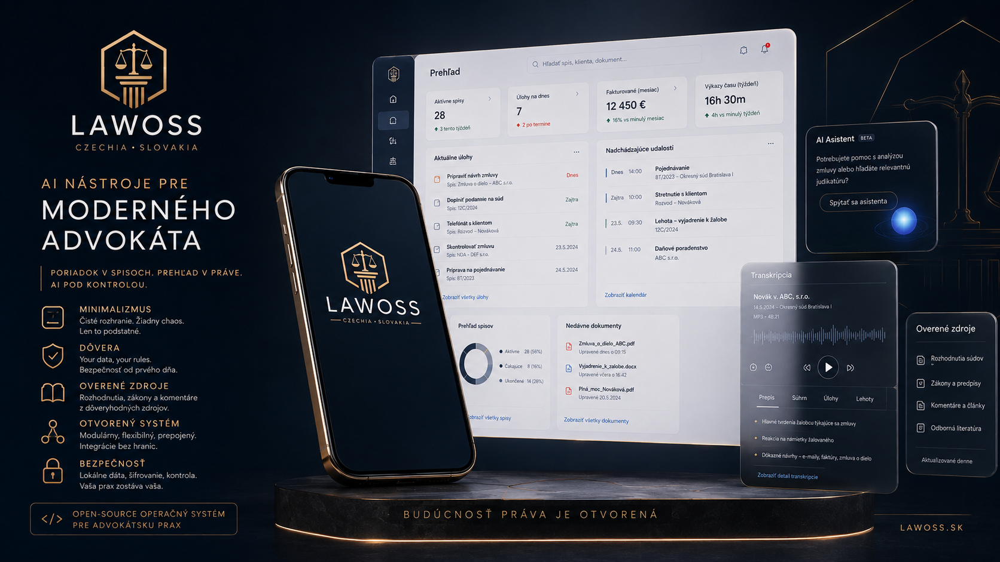

</div>

> [!NOTE]
> Toto repo **zatiaľ neobsahuje kód produktu**. Slúži na brainstorming, rešerše, plánovanie a spoločnú evidenciu podkladov (vrátane `AGENTS.md` / `CLAUDE.md`) pred založením samotného vývojového repozitára.

---

## ✨ Postavené na myšlienke MikeOSS

<table>
<tr>
<td width="120" align="center">

### 🍴
**MikeOSS**

</td>
<td>

**[MikeOSS](https://github.com/Open-Legal-Products/mike)** nás inšpiroval ukážkou, že právny AI asistent môže byť **open-source a slobodný**. Túto myšlienku rozvíjame pre **česko-slovenské** právne prostredie.

LAWOSS je pokračovaním tejto línie: otvorený kód, žiadne black-box prompty, dáta u advokáta. To, čo MikeOSS začal pre svet, my dokončujeme pre CZ + SK jurisdikciu — so Slov-Lexom, judikatúrou, ORSR a slovenskou aj českou realitou advokátskej praxe.

</td>
</tr>
</table>

## 🎯 Vízia

Priniesť českým a slovenským advokátom **užitočný open-source nástroj úplne zadarmo** — postavený na zrelom open-source základe, obohatený o lokálne skills a MCP servery (Slov-Lex, ORSR, RPVS, judikatúra…), prispôsobený nášmu právu.

Nechceme „ďalší AI editor dokumentov". Ťažisko je **[organizácia advokátskej praxe (OKF)](specs/0002-okf-operacny-system-praxe.md)**: appka zakladá spisy, generuje riadiace súbory a stráži poriadok. OKF a dáta sú stabilný základ praxe. Agenti sú operačným modelom, ktorý na tomto základe pripravuje, organizuje a kontroluje prácu pod dohľadom právnika.

### Právnik riadi svoju AI

**LAWOSS dáva právnikom úplnú kontrolu nad ich AI.**

**Your law. Your models. Your knowledge. Your agents.**

Kancelária si vyberá modely podľa kvality, ceny, rýchlosti a súkromia. Môže používať vlastné skilly, MCP servery a dátové zdroje, upravovať otvorené pracovné postupy a kontrolovať, ako agent pracoval. Agenti pripravujú a organizujú prácu, no právnik určuje cieľ, riadi riziko a schvaľuje výsledok ako ich supervízor. Podrobnosti rozvíja navrhnutá [základná produktová doktrína](decisions/0009-zakladna-produktova-doktrina.md).

### Päť pilierov

| | |
|---|---|
| 📂 **Inteligentné spisy a úlohy** | OKF štruktúra, validácia, lehoty pod kontrolou |
| 🎙️ **Transkripcia a zápisy z porád** | on-device, prepis rovno do spisu |
| ⚖️ **Overené právne zdroje SK/CZ** | Slov-Lex, judikatúra, registre — proti halucináciám |
| 🔓 **Otvorený prompt layer** | žiadny black box, verzované prompty, štýlový profil advokáta |
| 🔒 **Lokálne dáta, maximálna bezpečnosť** | *Bezpečné. Súkromné. Vaše.* |

| | |
|---|---|
| 👥 **Tím** | Marián Čuprík · Martin Friedrich · Igor Ribár (advokáti SAK, pracovná skupina pre elektronizáciu advokácie) · Vojta Říha 🇨🇿 |
| 💰 **Model** | Nástroj zadarmo, open-source. Monetizácia výhradne cez workshopy a školenia — [ADR 0002](decisions/0002-preco-forkujeme-mikeoss.md) |
| 🧩 **Základ** | ✅ **[LegalWork](https://github.com/eigenweltlabs/legalwork)** (MIT) nad [opencode](https://github.com/sst/opencode) — [ADR 0003](decisions/0003-legal-work-ako-zaklad.md) |
| 🔄 **Stratégia** | **Fork pod vlastným brandingom** vo vlastnom repozitári; čo dáva zmysel posielame do upstreamu — [ADR 0004](decisions/0004-ako-rozsirit-legalwork.md) |
| 💬 **Komunikácia** | Telegram skupina + GitHub Issues/Discussions |

## 📦 Čo staviame ako prvé

> [!IMPORTANT]
> **Scope V1 (MVP) sa odklepáva v stredu 12. 8. 2026** → [agenda a odôvodnenie](meetings/2026-08-12-agenda-mvp.md)

Základ [LegalWork](decisions/0003-legal-work-ako-zaklad.md) už dáva chat, agenta, Office add-iny, transkripciu aj UI na MCP servery. **MVP je preto to, čo z neho spraví nástroj pre slovenského a českého advokáta:**

| Kandidát na V1 | Prečo |
|---|---|
| 🇸🇰🇨🇿 **SK/CZ lokalizácia** | bez nej to advokát nepoužije; nové súbory locale = nulový merge konflikt |
| 📁 **[OKF — spisy a štruktúra](specs/0002-okf-operacny-system-praxe.md)** | jadro odlíšenia, veľká časť už existuje |
| 🔌 **[MCP: judikatúra + Slov-Lex](specs/0004-mcp-sk-konektory.md)** | najviditeľnejšia hodnota, servery bežia, read-only |
| ⏰ **[Lehoty a timeline](specs/0005-lehoty-timeline.md)** | zmeškaná lehota = najčastejší dôvod zodpovednosti advokáta |
| 📄 **OCR ingest → markdown** | quick win, hotová Quick Action |

🗃️ **Všetky nápady aj s tým, kam mieria:** [zberný kôš](planning/napady.md) · [grafický prehľad funkcií](https://omni-legal-products.github.io/lawOSS-like-SK-CZ/specs/prehlad.html)

## 🖥️ Ako to má vyzerať

> [!NOTE]
> **Vizuálne koncepty, nie snímky hotového produktu.** Slúžia na zjednotenie predstavy o rozhraní a na komunikáciu projektu. **Dáta v nich sú vymyslené** — vrátane mien, spisových značiek a súm.

Sada z **21. 8. 2026** — desať obrazoviek, ktoré prvýkrát držia jeden dizajnový jazyk: navy plocha, zlatý akcent, jedna ľavá navigácia a rovnaký spôsob, akým sa ukazuje zdroj a rozhodnutie. Pri každej je uvedené, čo za ňou stojí — a či na to už máme špecifikáciu.

<div align="center">

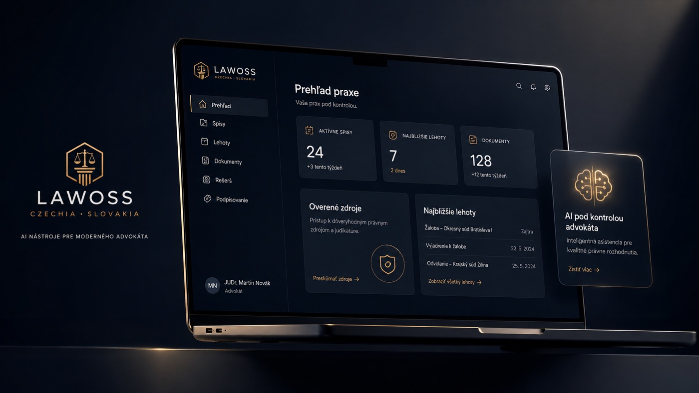

<sub><b>1 · Prehľad praxe</b> — aktívne spisy, najbližšie lehoty a dokumenty na jednej obrazovke. Vpravo stála pripomienka doktríny: <i>AI pod kontrolou advokáta</i>. → <a href="specs/0002-okf-operacny-system-praxe.md">OKF</a> · <a href="specs/0005-lehoty-timeline.md">lehoty</a></sub>

<br><br>

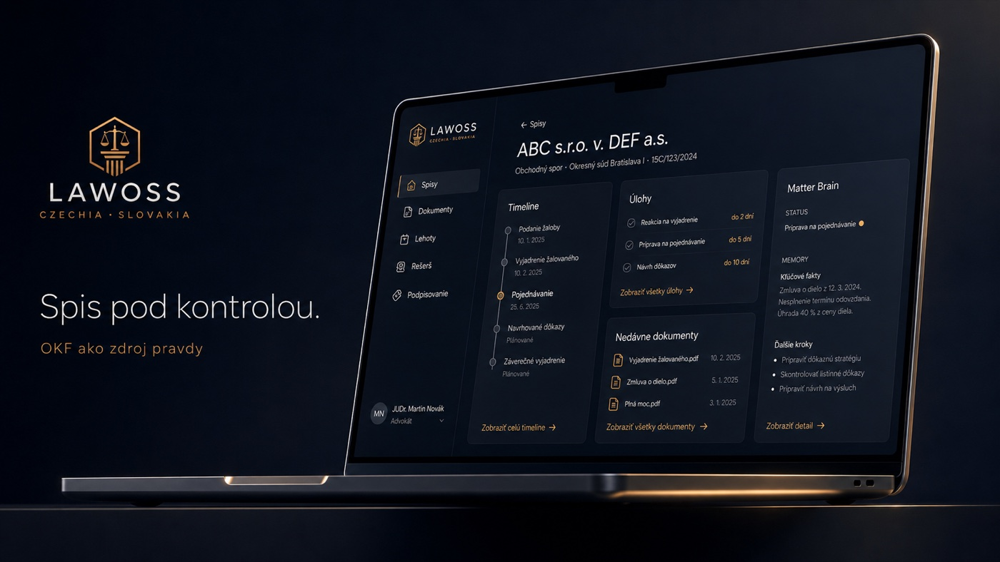

<sub><b>2 · Spis pod kontrolou</b> — timeline veci, úlohy s termínmi, nedávne dokumenty a vpravo <b>Matter Brain</b> so stavom, kľúčovými faktami a ďalšími krokmi. Podtitul <i>„OKF ako zdroj pravdy"</i> hovorí presne to, o čo ide. → <a href="specs/0002-okf-operacny-system-praxe.md">OKF</a></sub>

<br><br>

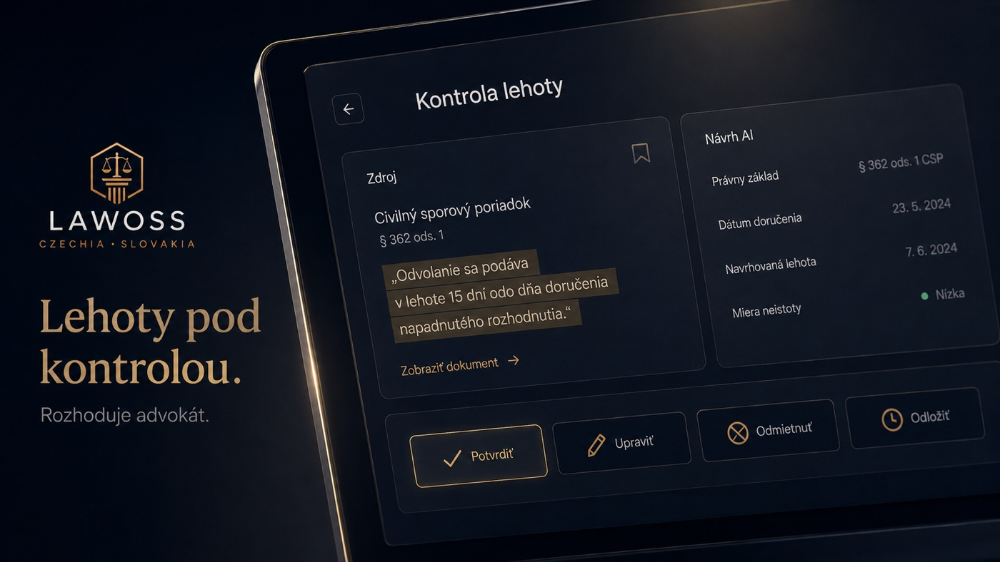

<sub><b>3 · Lehoty pod kontrolou. Rozhoduje advokát.</b> — vľavo doslovná citácia § 362 ods. 1 CSP, vpravo návrh AI s <b>mierou neistoty</b>, dole štyri tlačidlá: potvrdiť, upraviť, odmietnuť, odložiť. Nič sa nezapíše bez advokáta. → <a href="specs/0005-lehoty-timeline.md">spec 0005</a> · <a href="decisions/0009-zakladna-produktova-doktrina.md">doktrína</a></sub>

<br><br>

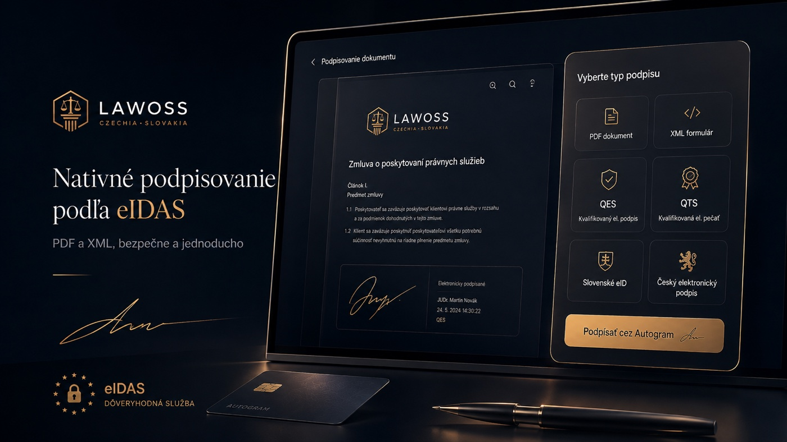

<sub><b>4 · Natívne podpisovanie podľa eIDAS</b> — PDF aj XML, QES a QTS, slovenské eID aj český elektronický podpis, podpis cez <a href="https://github.com/slovensko-digital/autogram">Autogram</a> ako externý proces. → <a href="specs/0007-podpisovanie-a-zarucena-konverzia.md">spec 0007</a></sub>

<br><br>

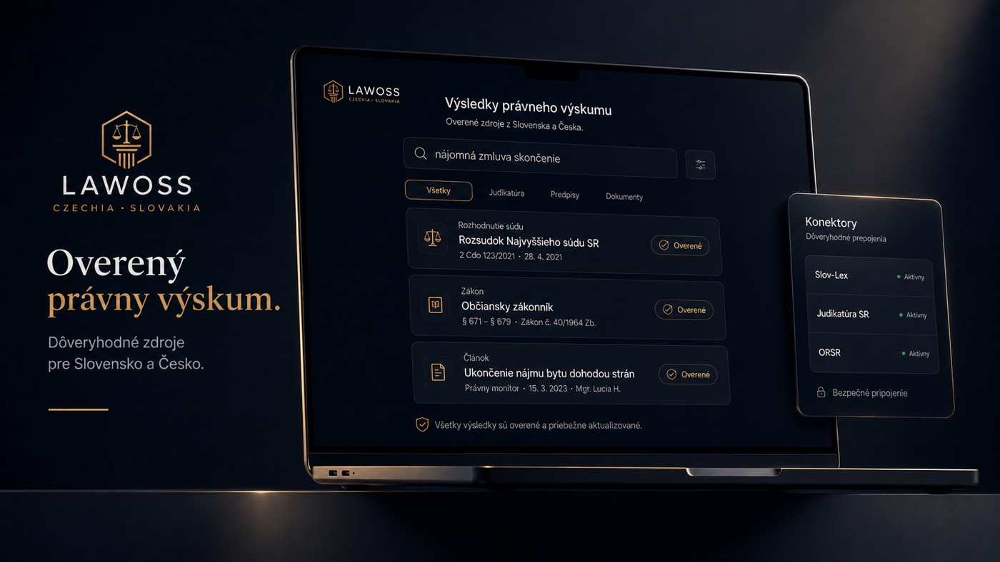

<sub><b>5 · Overený právny výskum</b> — judikatúra, predpisy a články s odznakom <i>Overené</i> a s panelom aktívnych konektorov (Slov-Lex, Judikatúra SR, ORSR). Odznak nie je ozdoba: je to odpoveď na halucinácie. → <a href="specs/0004-mcp-sk-konektory.md">spec 0004</a></sub>

<br><br>

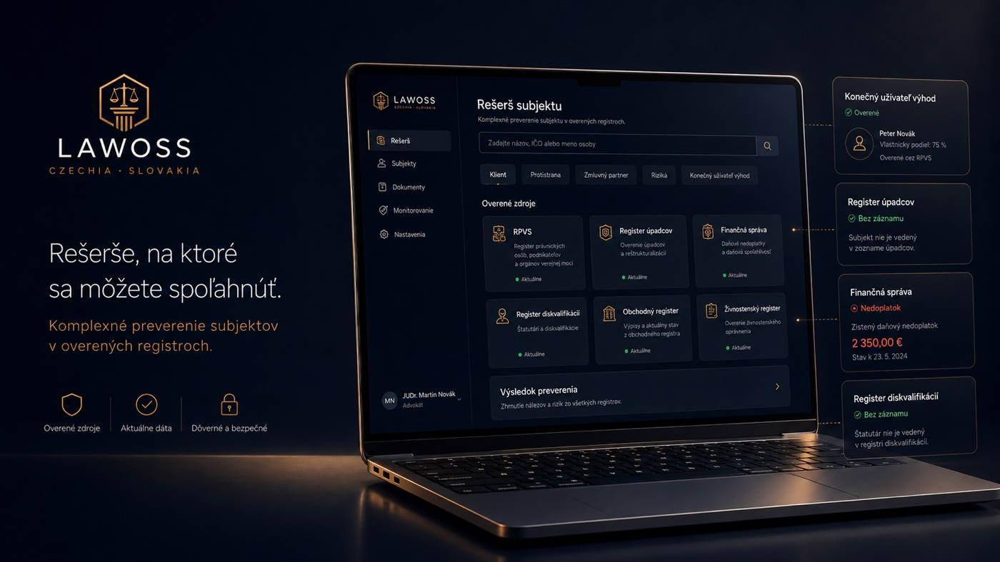

<sub><b>6 · Rešerše, na ktoré sa dá spoľahnúť</b> — jedno preverenie naprieč RPVS, registrom úpadcov, Finančnou správou, registrom diskvalifikácií, ORSR a živnostenským registrom; vpravo zhrnutie nálezov vrátane <b>daňového nedoplatku</b> a konečného užívateľa výhod. → <a href="specs/0002-okf-operacny-system-praxe.md">onboarding subjektov</a> · <a href="specs/0004-mcp-sk-konektory.md">spec 0004</a></sub>

<br><br>

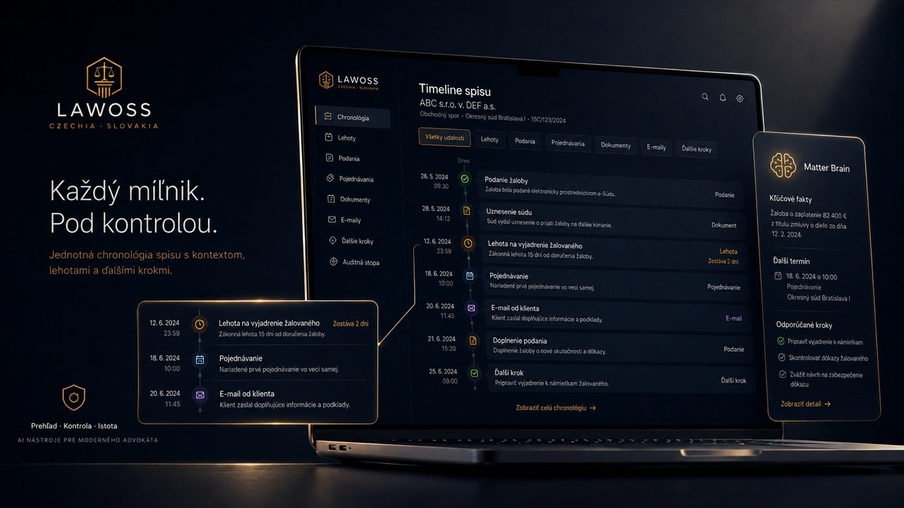

<sub><b>7 · Každý míľnik. Pod kontrolou.</b> — jednotná chronológia veci, kde vedľa seba stoja podania, uznesenia, lehoty, pojednávania aj e-maily, a v ľavom menu <b>auditná stopa</b>. Vpravo znova Matter Brain. → <a href="specs/0005-lehoty-timeline.md">spec 0005</a></sub>

<br><br>

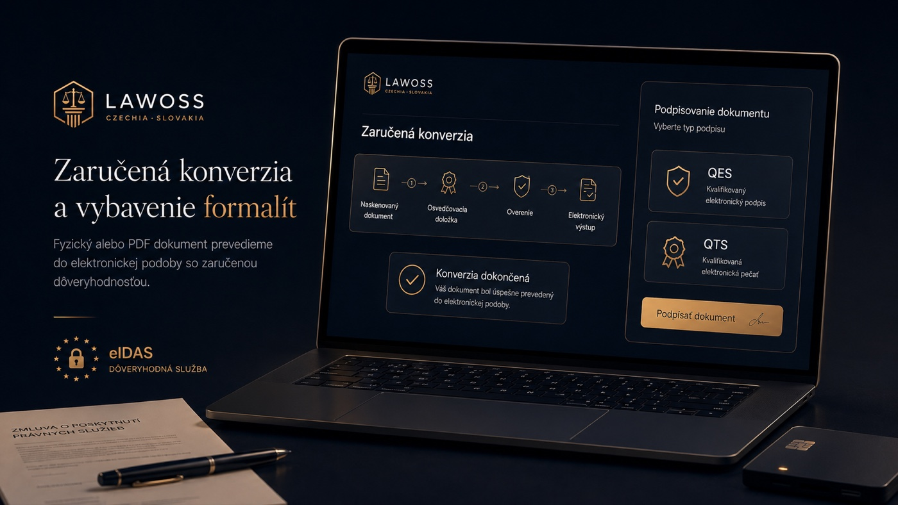

<sub><b>8 · Zaručená konverzia a vybavenie formalít</b> — štyri kroky od naskenovaného dokumentu cez osvedčovaciu doložku a overenie po elektronický výstup. → <a href="specs/0010-zarucena-konverzia.md">spec 0010</a> · <a href="specs/0007-podpisovanie-a-zarucena-konverzia.md">spec 0007</a></sub>

<br><br>

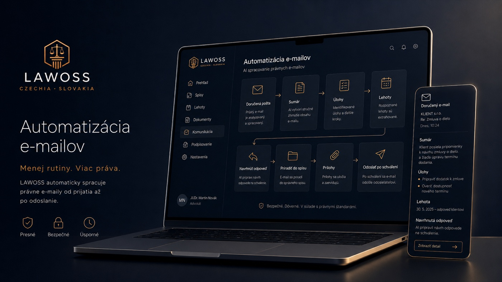

<sub><b>9 · Automatizácia e-mailov</b> — od doručenia cez sumár, úlohy a rozpoznané lehoty až po návrh odpovede, ktorý <b>odíde až po schválení</b>. Rieši to, čo VŘ označil za jediný explicitne pomenovaný nevyriešený problém z praxe. → <a href="planning/napady.md">nápad #22</a> — <b>zatiaľ bez špecifikácie</b></sub>

<br><br>

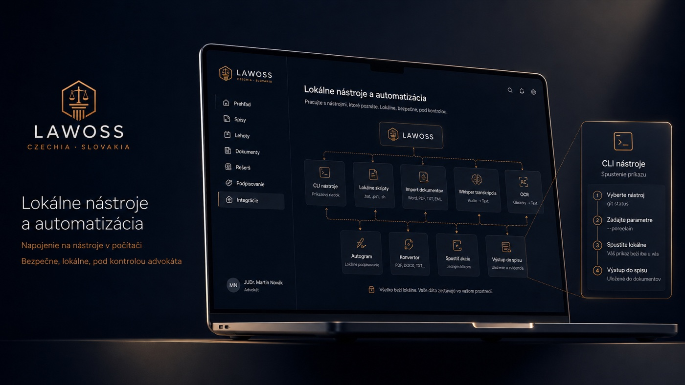

<sub><b>10 · Lokálne nástroje a automatizácia</b> — CLI, lokálne skripty, import dokumentov, Whisper transkripcia, OCR a Autogram, všetko s pätkou <i>„Všetko beží lokálne. Vaše dáta zostávajú vo vašom prostredí."</i> → <a href="specs/0001-transkripcia.md">spec 0001</a> · <a href="planning/napady.md">nápad #45</a></sub>

</div>

> [!IMPORTANT]
> **Nový pojem, ktorý sa v mockupoch objavil sám: „Matter Brain"** *(obrazovky 2 a 7)*.
> Pomenúva presne to, čo v OKF dnes nesú `_STATUS.md` a `MEMORY.md` — stav veci, kľúčové fakty, ďalšie kroky. Sedí na [rešerš pamäťových vzorov](research/inspiracie/2026-08-21-granular-brain-a-pamatove-vzory.md) z 21. 8., ale **názov zatiaľ nie je odklepnutý** a je anglický, kým zvyšok rozhrania je po slovensky. Na prerokovanie.

**Čo v konceptoch hľadať a čo za tým je:**

| V rozhraní | Čo za tým je | Stav |
|---|---|---|
| **Prehľad** a **Spisy** so spisovými značkami | [OKF — operačný systém praxe](specs/0002-okf-operacny-system-praxe.md) | 📝 spec |
| **Kontrola lehoty** so štyrmi tlačidlami | [spec 0005](specs/0005-lehoty-timeline.md) — povinné potvrdenie advokátom | 📝 spec |
| **Matter Brain** — stav, fakty, ďalšie kroky | pamäť spisu v [OKF](specs/0002-okf-operacny-system-praxe.md); názov otvorený | 💭 prieskum |
| **Rešerš** s odznakom *Overené* | [SK MCP konektory](specs/0004-mcp-sk-konektory.md) | 📝 spec |
| **Rešerš subjektu** naprieč registrami | onboarding subjektov v [OKF](specs/0002-okf-operacny-system-praxe.md) | 📝 spec |
| **Podpisovanie** QES/QTS cez Autogram | [spec 0007](specs/0007-podpisovanie-a-zarucena-konverzia.md) | 📝 spec |
| **Zaručená konverzia** | [spec 0010](specs/0010-zarucena-konverzia.md) | 📝 spec |
| **Komunikácia** — spracovanie e-mailov | [nápad #22](planning/napady.md) (VŘ) | 💭 prieskum |
| **Integrácie** — CLI, skripty, OCR | lokálnosť dát (Q16) · [nápad #45](planning/napady.md) | 💭 prieskum |

> [!NOTE]
> Vo vizuáloch sa objavujú aj funkcie, ktoré sú zatiaľ **v štádiu prieskumu** a nemajú špecifikáciu — evidujeme ich v [navrhy.md](specs/navrhy.md).

<details>
<summary><b>Staršie vizuálne koncepty</b> (7. 8. 2026) — pre históriu</summary>

<div align="center">

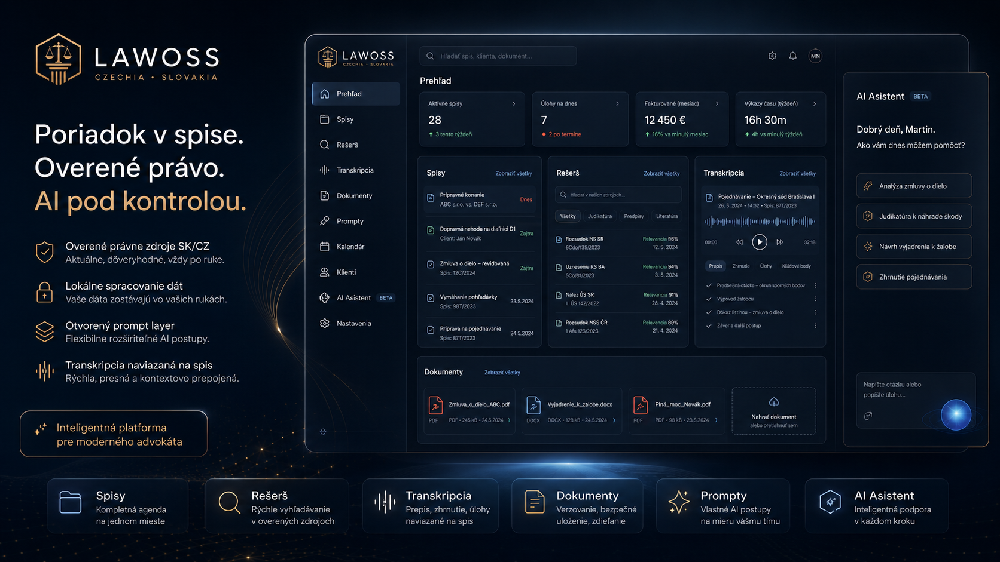

<sub><i>Prehľad · Spisy · Rešerš · Transkripcia · Dokumenty · Prompty · AI Asistent</i></sub>

<br><br>

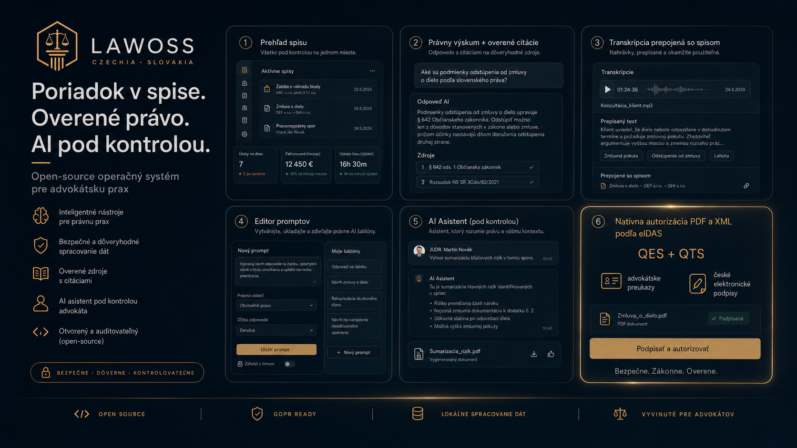

<sub><i>Detail hlavných funkcií — prehľad spisu, právny výskum s citáciami, transkripcia, editor promptov a AI asistent</i></sub>

<br><br>

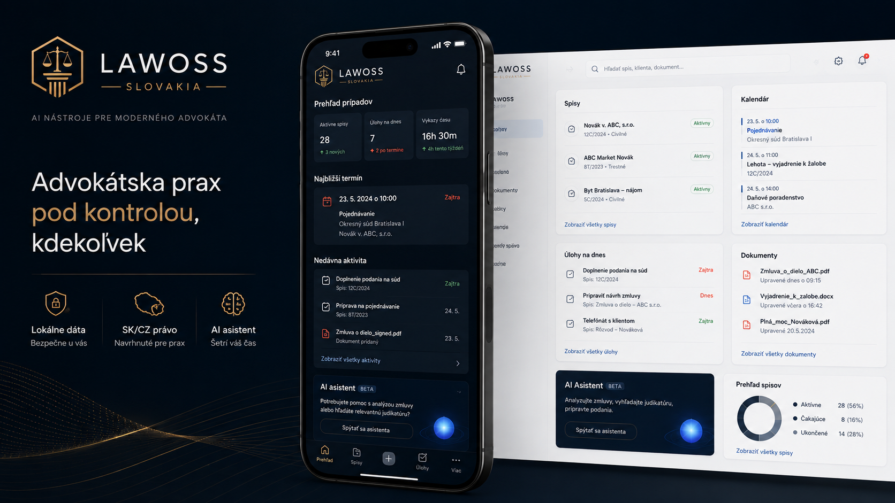

<sub><i>Prax pod kontrolou, kdekoľvek — mobil aj desktop</i></sub>

</div>

</details>

## 🧩 Základ — rozhodnuté

**[LegalWork](https://github.com/eigenweltlabs/legalwork)** (MIT) — [ADR 0003](decisions/0003-legal-work-ako-zaklad.md), rozhodnuté na [calle 6. 8. 2026](meetings/2026-08-06-sync-call-volba-zakladu.md).

Hlavný dôvod je **open-code harness v pozadí**: LegalWork nie je samostatný agent, ale desktopová nadstavba nad **[opencode](https://github.com/sst/opencode)** (MIT), ktorý natívne podporuje MCP servery, agentov a subagentov, skills a pluginy. K tomu MIT licencia, lokálny beh a hotová on-device transkripcia.

| Kandidát | Výsledok |
|---|---|
| **[LegalWork](research/inspiracie/legalwork.md)** 🇩🇪 | ✅ **zvolený** — MIT, opencode harness, desktop app, lokálny beh, MCP rozšírenia, **prihlásenie vlastným predplatným** (OpenAI · Anthropic · xAI a ďalšie) |
| **[mikeOSS](https://github.com/Open-Legal-Products/mike)** 🇺🇸 | ❌ zamietnutý — **AGPL-3.0** (nezlučiteľné s požiadavkou na permisívnu licenciu) a chýbajúci harness. Zostáva ako **inšpirácia**. |
| **Stella** 🇨🇿 | ❌ nedostala sa do užšieho výberu — zostáva možným zdrojom komponentov pre anonymizáciu |

**Ako ho rozšírime:** forkujeme pod vlastným brandingom do vlastného repozitára a čo dáva zmysel posielame do upstreamu — [ADR 0004](decisions/0004-ako-rozsirit-legalwork.md). Koordinácia (toto repo) a kód zostávajú oddelene — [ADR 0005](decisions/0005-struktura-repozitarov.md).

> [!TIP]
> **Prihlásenie vlastným predplatným funguje.** Overené 2026-08-06 na **OpenAI (ChatGPT)**, **Anthropic (Claude)** aj **xAI (Grok)** — advokát vie využiť predplatné, ktoré už má, bez riešenia API kľúčov. To je pri cene rešeršnej práce podstatný rozdiel.
>
> Pri Anthropicu appka zobrazuje upozornenie, že ich Consumer Terms obmedzujú tento OAuth na Claude Code a claude.ai. Berieme to ako **informovanú voľbu používateľa**; kto chce mať istotu, použije vlastný API kľúč. Detail v [analýze LegalWork](research/inspiracie/legalwork.md) a [spec 0003](specs/0003-prompt-layer.md).

## 🏗️ Architektúra (návrh)

<div align="center">

<a href="https://omni-legal-products.github.io/lawOSS-like-SK-CZ/assets/diagrams/architektura.html">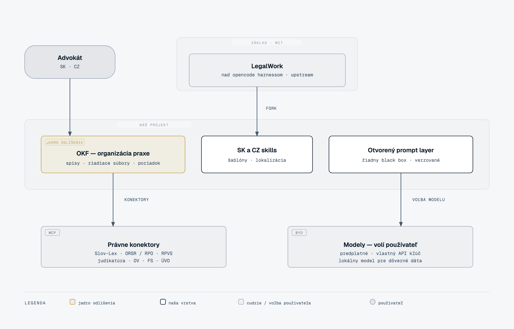</a>

<sub><b>Zlatý rám</b> = jadro odlíšenia · <b>plný rám</b> = naša vrstva · <b>sivý rám</b> = cudzie alebo voľba používateľa<br/>
<a href="https://omni-legal-products.github.io/lawOSS-like-SK-CZ/assets/diagrams/architektura.html">otvoriť interaktívnu verziu</a> · <a href="assets/diagrams/architektura.html">zdroj</a></sub>

</div>

<details>
<summary><sub>pôvodný mermaid zdroj</sub></summary>


```mermaid
flowchart TB
    ADVOKAT(["👩‍⚖️ Advokát"]) --> SK

    subgraph SK["🇸🇰 Náš projekt"]
        OKF["📁 OKF — organizácia praxe<br/><i>spisy · riadiace súbory · poriadok</i>"]
        SKILLS["SK skills a šablóny"]
        PROMPT["🔓 Otvorený prompt layer"]
    end

    subgraph base["🧩 Základ — LegalWork (MIT)"]
        B["LegalWork<br/><i>nad opencode harnessom</i><br/>fork pod naším brandingom"]
    end

    subgraph mcp["🔌 Slovenské MCP servery"]
        SLOVLEX["Slov-Lex<br/>zákony a predpisy"]
        ORSR["ORSR / RPO<br/>obchodný register"]
        RPVS["RPVS<br/>koneční užívatelia výhod"]
        JUD["Judikatúra<br/>rozhodnutia súdov"]
        OV["Obchodný vestník,<br/>FS, ÚVO…"]
    end

    subgraph model["🤖 Modely — voľba používateľa"]
        SUB["predplatné<br/>(OpenAI / Anthropic)"]
        API["vlastný API kľúč"]
        LOC["🔒 lokálny model<br/>(dôverné dáta)"]
    end

    B -- "upstream" --> SK
    SK --> mcp
    PROMPT --> model
```

</details>

### OKF zblízka — čo systém drží

Diagram vyššie ukazuje vrstvy projektu. Tento ukazuje **jadro odlíšenia** — ako appka štruktúru presadzuje a udržiava.

<div align="center">

<a href="https://omni-legal-products.github.io/lawOSS-like-SK-CZ/assets/diagrams/okf-system.html">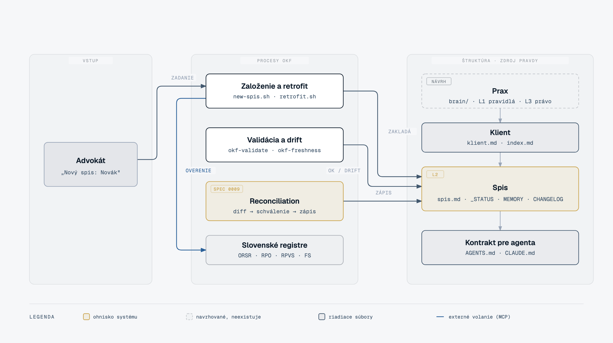</a>

<sub><b>Zlatý rám</b> = ohnisko systému · <b>plný rám</b> = beží dnes v skille <code>novy-spis</code> · <b>prerušovaný rám</b> = navrhované, zatiaľ neexistuje<br/>
<a href="https://omni-legal-products.github.io/lawOSS-like-SK-CZ/assets/diagrams/okf-system.html">otvoriť interaktívnu verziu</a> · <a href="assets/diagrams/okf-system.html">zdroj</a></sub>

</div>

> [!WARNING]
> **Podklad na rozpravu, nie schválená architektúra.** Úroveň *Prax* (L1 pravidlá a L3 právna vrstva) je zámerne prerušovaná — dnes **neexistuje** a povýšený poznatok nemá kam padnúť. Detail v [spec 0002](specs/0002-okf-operacny-system-praxe.md).

### Rozhodovacia brána — kde končí AI a začína advokát

Obrazovka 3 vyššie ukazuje, ako to vyzerá. Tento diagram ukazuje, ako to funguje.

<div align="center">

<a href="https://omni-legal-products.github.io/lawOSS-like-SK-CZ/assets/diagrams/lehota-rozhodovacia-brana.html">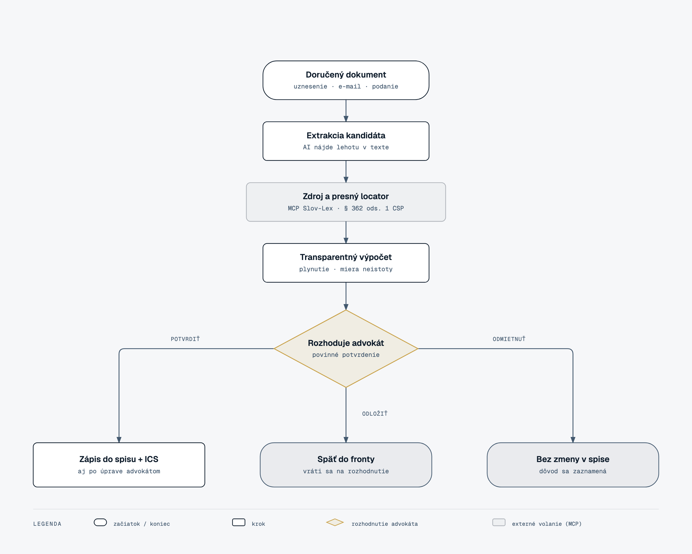</a>

<sub>Žiadna cesta nevedie do spisu mimo kosoštvorca.<br/>
<a href="https://omni-legal-products.github.io/lawOSS-like-SK-CZ/assets/diagrams/lehota-rozhodovacia-brana.html">otvoriť interaktívnu verziu</a> · <a href="assets/diagrams/lehota-rozhodovacia-brana.html">zdroj</a></sub>

</div>

> [!NOTE]
> **Lehoty sú výnimka, nie pravidlo.** Podľa **Q11/Q21** ([call 18. 8.](meetings/2026-08-18-zapis-sync-call.md)) je miera autonómie **nastavenie používateľa** — od schvaľovania každého kroku po YOLO; appka hard stopy sama neurčuje. Pri lehotách to neplatí: [spec 0005](specs/0005-lehoty-timeline.md) má vlastnú sekciu *„Povinné ľudské potvrdenie"*, lebo zmeškaná lehota je najčastejší dôvod zodpovednosti advokáta za škodu.

## 🎨 Značka

**Wordmark:** `LAW` biele + `OSS` zlaté · **Logo:** hexagonálny štít s váhami spravodlivosti a antickým stĺpom, štítky s českou a slovenskou vlajkou.
**Paleta:** navy `#0D1B2A` · zlatá `#C9A24A` · biela — **Typografia:** Inter (UI) + Playfair Display (nadpisy).

> Celý rozpis značky a rozhrania: **[docs/brand-concept.md](docs/brand-concept.md)**

## 🔬 Rešerše

Prvý **deep-research** balík (NotebookLM, 245 zdrojov, 6 kôl) o open-source AI pre slovenskú advokáciu — MCP servery, anonymizácia (MasKIT/Stella), integrácia vlastného a lokálneho API (BYOK), a compliance (SAK 2025, EU AI Act).

- 📊 **Grafický report (rich markdown):** [research/deep-research/](research/deep-research/)
- 🌐 **Živý HTML report:** [omni-legal-products.github.io/lawOSS-like-SK-CZ/research/deep-research/report.html](https://omni-legal-products.github.io/lawOSS-like-SK-CZ/research/deep-research/report.html)
- 🎧 **Audio podcast (SK):** [Releases](https://github.com/Omni-Legal-Products/lawOSS-like-SK-CZ/releases/tag/research-2026-07-10)

## 🗺️ Roadmapa

<div align="center">

<a href="https://omni-legal-products.github.io/lawOSS-like-SK-CZ/assets/diagrams/roadmapa.html">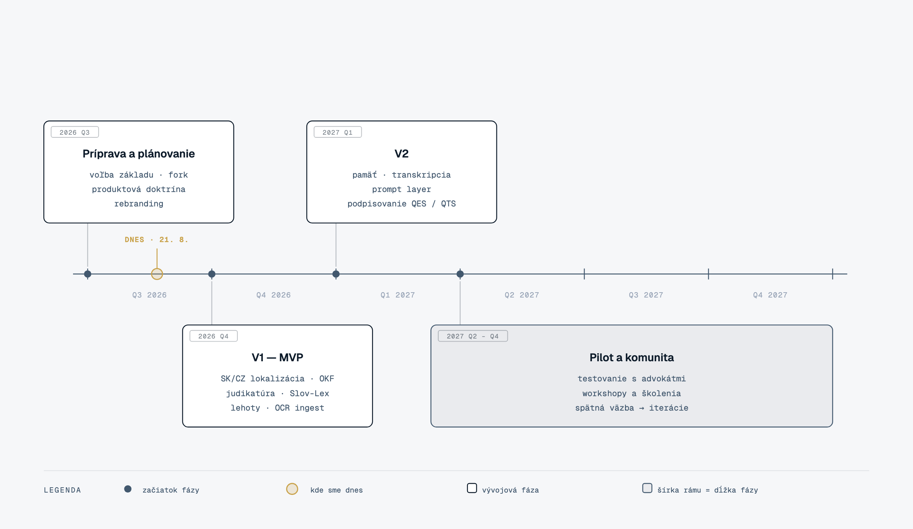</a>

<sub>Lineárna škála: jeden štvrťrok = rovnaký úsek. Preto je vidieť, že pilot je najdlhšia fáza.<br/>
<a href="https://omni-legal-products.github.io/lawOSS-like-SK-CZ/assets/diagrams/roadmapa.html">otvoriť interaktívnu verziu</a> · <a href="assets/diagrams/roadmapa.html">zdroj</a></sub>

</div>

<details>
<summary><sub>pôvodný mermaid zdroj</sub></summary>

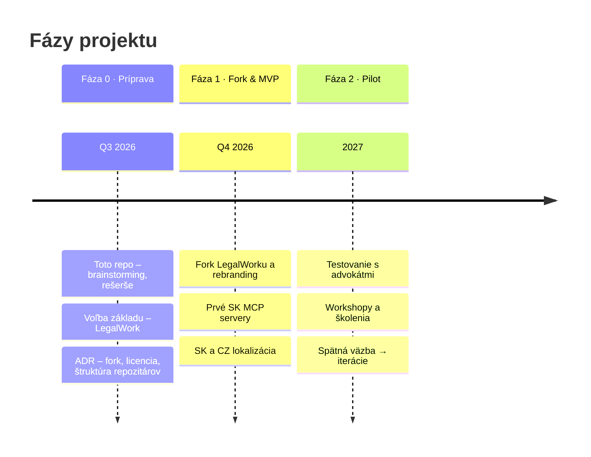
```mermaid
timeline
    title Fázy projektu
    section Fáza 0 · Príprava
        Q3 2026 : Toto repo – brainstorming, rešerše : Voľba základu – LegalWork : ADR – fork, licencia, štruktúra repozitárov
    section Fáza 1 · Fork & MVP
        Q4 2026 : Fork LegalWorku a rebranding : Prvé SK MCP servery : SK a CZ lokalizácia
    section Fáza 2 · Pilot
        2027 : Testovanie s advokátmi : Workshopy a školenia : Spätná väzba → iterácie
```

</details>

Detailný harmonogram: [planning/timeline.md](planning/timeline.md) · Backlog: [planning/backlog.md](planning/backlog.md)

## 📊 Progress

<!-- AUTO:PROGRESS -->
| Súbor | Progress | Hotovo |
|---|---|---|
| [`2026-08-12-mcp-repository-rollout-plan.md`](planning/2026-08-12-mcp-repository-rollout-plan.md) | `░░░░░░░░░░░░░░░░░░░░` | 0/46 (0 %) |
| [`2026-08-15-odpovedi-VR-Q01-Q25.md`](planning/2026-08-15-odpovedi-VR-Q01-Q25.md) | `░░░░░░░░░░░░░░░░░░░░` | 0/4 (0 %) |
| [`2026-08-21-paper-cuts-a-rychle-vylepsenia.md`](planning/2026-08-21-paper-cuts-a-rychle-vylepsenia.md) | `░░░░░░░░░░░░░░░░░░░░` | 0/4 (0 %) |
| [`backlog.md`](planning/backlog.md) | `███░░░░░░░░░░░░░░░░░` | 10/71 (14 %) |
| [`cz-datove-zdroje.md`](planning/cz-datove-zdroje.md) | `░░░░░░░░░░░░░░░░░░░░` | 0/10 (0 %) |
| [`mcp-repository-inventory.md`](planning/mcp-repository-inventory.md) | `░░░░░░░░░░░░░░░░░░░░` | 0/6 (0 %) |
| [`roadmap.md`](planning/roadmap.md) | `███████░░░░░░░░░░░░░` | 17/46 (37 %) |
| [`workshopy.md`](planning/workshopy.md) | `░░░░░░░░░░░░░░░░░░░░` | 0/3 (0 %) |
<!-- /AUTO:PROGRESS -->

## 🗂️ Štruktúra repozitára

<!-- AUTO:TREE -->
```text
lawOSS-like-SK-CZ/
├── assets/
│   ├── brand/
│   │   ├── mockupy/
│   │   │   ├── 01-prehlad-praxe.jpg
│   │   │   ├── 02-spis-matter-brain.jpg
│   │   │   ├── 03-kontrola-lehoty.jpg
│   │   │   ├── 04-podpisovanie-eidas.jpg
│   │   │   ├── 05-pravny-vyskum.jpg
│   │   │   ├── 06-reserse-subjektov.jpg
│   │   │   ├── 07-timeline-spisu.jpg
│   │   │   ├── 08-zarucena-konverzia.jpg
│   │   │   ├── 09-automatizacia-emailov.jpg
│   │   │   └── 10-lokalne-nastroje.jpg
│   │   ├── keyvisual-dashboard.png
│   │   ├── keyvisual-features.png
│   │   ├── keyvisual-hero.png
│   │   ├── keyvisual-mobile.png
│   │   ├── logo sub 1M.png
│   │   ├── logo.png
│   │   ├── mockup.png
│   │   ├── moodboard.png
│   │   └── README.md
│   └── diagrams/
│       ├── architektura.html
│       ├── architektura.png
│       ├── lehota-rozhodovacia-brana.html
│       ├── lehota-rozhodovacia-brana.png
│       ├── okf-system.html
│       ├── okf-system.png
│       ├── roadmapa.html
│       ├── roadmapa.png
│       ├── tok-rozhodnutia.html
│       └── tok-rozhodnutia.png
├── decisions/
│   ├── 0002-preco-forkujeme-mikeoss.html
│   ├── 0002-preco-forkujeme-mikeoss.md
│   ├── 0003-legal-work-ako-zaklad.html
│   ├── 0003-legal-work-ako-zaklad.md
│   ├── 0004-ako-rozsirit-legalwork.html
│   ├── 0004-ako-rozsirit-legalwork.md
│   ├── 0005-struktura-repozitarov.html
│   ├── 0005-struktura-repozitarov.md
│   ├── 0006-anonymizacia-ako-lokalny-privacy-gate.md
│   ├── 0007-agent-first-architektura.html
│   ├── 0007-agent-first-architektura.md
│   ├── 0008-sprava-mcp-repozitarov.md
│   ├── 0009-zakladna-produktova-doktrina.html
│   ├── 0009-zakladna-produktova-doktrina.md
│   ├── 0010-ochrana-know-how-a-znacky.md
│   └── template.md
├── docs/
│   ├── superpowers/
│   │   ├── plans/
│   │   │   └── 2026-08-12-lawoss-zakladna-produktova-doktrina.md
│   │   └── specs/
│   │       └── 2026-08-12-lawoss-zakladna-produktova-doktrina-design.md
│   ├── templates/
│   │   └── mcp-repository-AGENTS.md
│   ├── agent-plugins.md
│   ├── brand-concept.md
│   ├── glossary.md
│   ├── mcp-repository-workflow.md
│   ├── metodika-kvality-skillov.md
│   ├── navod-mcp-pripojenie-legalwork.md
│   ├── principles.md
│   ├── strategia.html
│   ├── strategia.md
│   ├── telegram-notifikacie.md
│   ├── validate-skills.md
│   └── vision.md
├── meetings/
│   ├── 2026-08-04-brainstorming-zaklad-a-prenositelnost.md
│   ├── 2026-08-06-sync-call-volba-zakladu.md
│   ├── 2026-08-12-agenda-mvp.md
│   ├── 2026-08-12-produktova-vizia-okf-pamat.md
│   ├── 2026-08-18-agenda-sync-call.md
│   ├── 2026-08-18-podklad-konsolidacia-Q01-Q25.md
│   └── 2026-08-18-zapis-sync-call.md
├── planning/
│   ├── 2026-08-12-mcp-repository-rollout-plan.md
│   ├── 2026-08-12-rozhodovacie-otazky-timu.md
│   ├── 2026-08-14-stav-odpovedi-timu.md
│   ├── 2026-08-15-odpovedi-VR-Q01-Q25.md
│   ├── 2026-08-17-stanoviska-timu-Q01-Q25.md
│   ├── 2026-08-21-paper-cuts-a-rychle-vylepsenia.md
│   ├── backlog.md
│   ├── cz-datove-zdroje.md
│   ├── mcp-repository-inventory.md
│   ├── napady.md
│   ├── plan-fork-a-workflow.html
│   ├── plan-fork-a-workflow.md
│   ├── roadmap.md
│   ├── timeline.md
│   └── workshopy.md
├── plugins/
│   ├── lawoss-legal/
│   │   └── skills/
│   │       ├── judikatura-citation-builder/
│   │       │   └── SKILL.md
│   │       ├── lawoss-source-coverage/
│   │       │   └── SKILL.md
│   │       └── lawoss-spec-review/
│   │           └── SKILL.md
│   └── lawoss-legal-lab/
│       └── skills/
│           └── lawoss-workflow-capture/
│               └── SKILL.md
├── research/
│   ├── anonymizacia/
│   │   └── 2026-08-14-sk-anonymizacne-detektory.md
│   ├── deep-research/
│   │   ├── 2026-07-10-open-source-legaltech-EU-mcp-anonymizacia.md
│   │   ├── 2026-07-10-zdroje.md
│   │   ├── README.md
│   │   └── report.html
│   ├── idey/
│   │   ├── 2026-07-29-build-open-vs-buy-closed.md
│   │   ├── 2026-07-29-orchestrator-transkripcia-byo-subscriptions.md
│   │   ├── 2026-08-07-feature-ideas-telegram.md
│   │   ├── 2026-08-14-orchestracia-human-gates-vzory.md
│   │   ├── 2026-08-14-spisovy-destilat-l2-pamat.md
│   │   └── README.md
│   ├── inspiracie/
│   │   ├── 2026-08-13-editory-docx-superdoc-vs-eigenpal.md
│   │   ├── 2026-08-21-granular-brain-a-pamatove-vzory.md
│   │   ├── legalwork.md
│   │   ├── porovnanie.html
│   │   ├── README.md
│   │   └── reconcile-jeff-su.md
│   ├── mcp-servery/
│   ├── mikeoss/
│   ├── pravny-ramec/
│   │   ├── zdroje-zarucena-konverzia/
│   │   │   ├── 2026-08-12-analyza-zarucenej-konverzie.md
│   │   │   ├── 2026-08-12-grok-report-integracia-ZK.pdf
│   │   │   ├── 2026-08-12-zarucena-konverzia-SR-report.md
│   │   │   └── README.md
│   │   ├── 2026-08-12-zarucena-konverzia-sk.md
│   │   ├── 2026-08-14-lehoty-sk-pravidla-vypoctu.md
│   │   └── 2026-08-15-lhoty-cz-pravidla-vypoctu.md
│   └── sk-datove-zdroje/
├── scripts/
│   └── validate-skills.mjs
├── specs/
│   ├── 0001-transkripcia.md
│   ├── 0002-okf-operacny-system-praxe.md
│   ├── 0003-prompt-layer.md
│   ├── 0004-mcp-sk-konektory.md
│   ├── 0005-lehoty-timeline.md
│   ├── 0006-orchestrator-subagenti.md
│   ├── 0007-podpisovanie-a-zarucena-konverzia.md
│   ├── 0008-anonymizacia-a-privacy-gate.md
│   ├── 0009-reconcile-ucenie-z-uprav.md
│   ├── 0010-zarucena-konverzia.md
│   ├── navrhy.md
│   ├── prehlad.html
│   ├── README.md
│   └── template.md
├── tests-fixtures/
│   └── skills/
│       ├── zly-skill/
│       │   └── SKILL.md
│       └── zmluvny-audit/
│           ├── tests/
│           │   └── triggers.md
│           └── SKILL.md
├── AGENTS.md
├── CLAUDE.md
├── CONTRIBUTING.md
└── README.md
```
<!-- /AUTO:TREE -->

<details>
<summary><b>Na čo slúžia jednotlivé priečinky</b></summary>

| Priečinok | Účel |
|---|---|
| `docs/` | Vízia, princípy, glosár |
| `decisions/` | ADR — zaznamenané rozhodnutia (čo, prečo, aké alternatívy) |
| `research/` | Rešerše: upstream MikeOSS, inšpirácie, SK dátové zdroje, MCP servery, právny rámec |
| `planning/` | Roadmapa, timeline, backlog, plán workshopov |
| `specs/` | Konkrétne návrhy funkcií (dozreté nápady z backlogu) |
| `meetings/` | Zápisky zo stretnutí (`RRRR-MM-DD.md`) |
| `assets/` | Diagramy, obrázky, PDF podklady |
| `AGENTS.md` | Kontext pre agentické systémy — **single source of truth** |
| `CLAUDE.md` | Mirror `AGENTS.md` — needitovať priamo |

</details>

## 🔄 Ako pracujeme s rozhodnutiami

<div align="center">

<a href="https://omni-legal-products.github.io/lawOSS-like-SK-CZ/assets/diagrams/tok-rozhodnutia.html">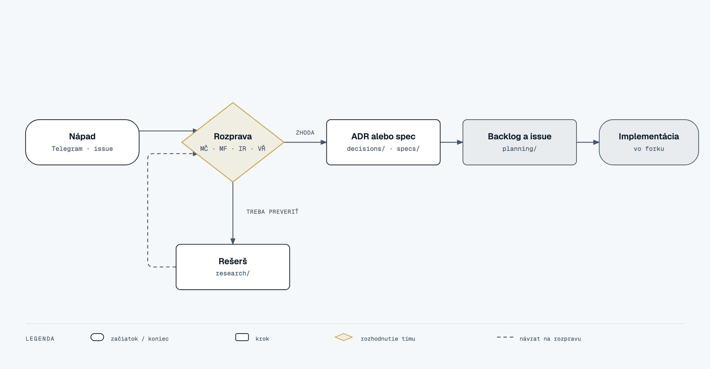</a>

<sub>Ak nie je zhoda, vec sa vracia na rešerš a späť do rozpravy — tá slučka je jadro postupu.<br/>
<a href="https://omni-legal-products.github.io/lawOSS-like-SK-CZ/assets/diagrams/tok-rozhodnutia.html">otvoriť interaktívnu verziu</a> · <a href="assets/diagrams/tok-rozhodnutia.html">zdroj</a></sub>

</div>

<details>
<summary><sub>pôvodný mermaid zdroj</sub></summary>

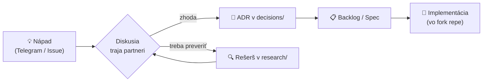
```mermaid
flowchart LR
    A["💡 Nápad<br/>(Telegram / Issue)"] --> B{"Diskusia<br/>traja partneri"}
    B -->|zhoda| C["📄 ADR v decisions/"]
    B -->|treba preveriť| D["🔍 Rešerš v research/"]
    D --> B
    C --> E["📋 Backlog / Spec"]
    E --> F["🚀 Implementácia<br/>(vo fork repe)"]
```

</details>

## 📈 Aktivita

<!-- AUTO:ACTIVITY -->
**328 commitov** · **156 súborov**

| Commit | Dátum | Autor | Správa |
|---|---|---|---|
| `d90ede5` | 2026-08-21 | Majo Cuprik | docs: prekresliť tri mermaid diagramy v README + dve vecné opravy (#61) |
| `48d2f0a` | 2026-08-21 | Majo Cuprik | docs: prekresliť tri mermaid diagramy v README do brandových |
| `f49b1e1` | 2026-08-21 | github-actions[bot] | docs: auto-update README a prehľad návrhov [skip ci] |
| `7d89e65` | 2026-08-21 | Majo Cuprik | docs: nová sada mockupov v README + dva diagramy (#60) |
| `eaaaee8` | 2026-08-21 | Majo Cuprik | docs: nová sada mockupov v README + dva diagramy (OKF, rozhodovacia brána) |
| `f5e6c3d` | 2026-08-21 | github-actions[bot] | docs: auto-update README a prehľad návrhov [skip ci] |
| `4b144fd` | 2026-08-21 | Majo Cuprik | Merge pull request #59 from Omni-Legal-Products/docs/okf-diagram-ilustracia |
| `25c41bd` | 2026-08-21 | Majo Cuprik | specs: 0002 — doplniť ilustráciu architektúry OKF (návrh, nie finál) |
<!-- /AUTO:ACTIVITY -->

---

<div align="center">
<sub>Sekcie označené 🤖 sa aktualizujú automaticky GitHub Action pri každom pushi — needitujte ich ručne.<br/>
<b>Posledná automatická aktualizácia:</b> <!-- AUTO:UPDATED -->2026-08-21 17:21 UTC<!-- /AUTO:UPDATED --></sub>
</div>
