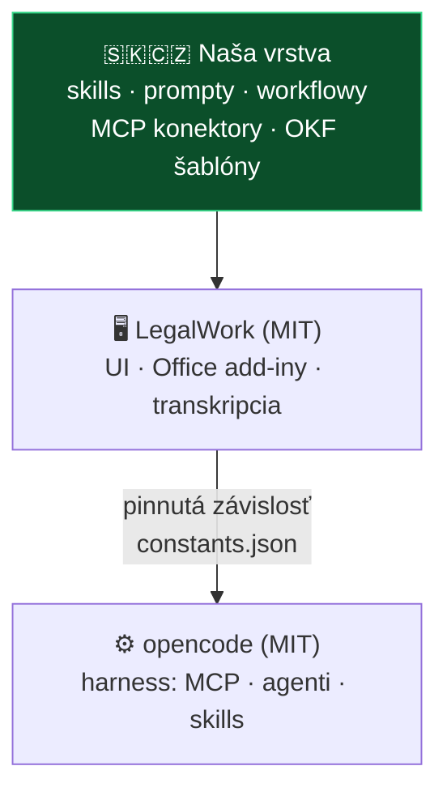

# ADR 0003: LegalWork ako základ projektu

- **Dátum:** 2026-08-06
- **Stav:** prijaté *(čaká na potvrdenie: Martin Friedrich)*
- **Rozhodli:** MČ · IR · VŘ — na [sync calle 6. 8. 2026](../meetings/2026-08-06-sync-call-volba-zakladu.md)
- **Nahrádza:** [ADR 0002 — Prečo forkujeme mikeOSS](0002-preco-forkujeme-mikeoss.md)
- **Súvisí s:** [brainstorming 4. 8.](../meetings/2026-08-04-brainstorming-zaklad-a-prenositelnost.md) · [analýza LegalWork](../research/inspiracie/legalwork.md)

> [!NOTE]
> Rozhodnutie padlo na prvom calle s Vojtom Říhom (CZ). Zaznamenávame ho aj s **dôvodmi, prečo NIE alternatívy**, aby sme sa k tomu nevracali.

## Kontext

[ADR 0002](0002-preco-forkujeme-mikeoss.md) stanovil, že forkneme [mikeOSS](https://github.com/Open-Legal-Products/mike). Odvtedy sa zmenili tri veci:

1. **MČ prakticky otestoval LegalWork** na reálnom priečinku — Codex aj Groq fungovali, celkový dojem *„veľmi som bol impressed"*.
2. **Vyšlo najavo, že mikeOSS je AGPL-3.0**, čo je v rozpore s požiadavkou na čo najviac permisívnu licenciu. LegalWork je **MIT** (overené).
3. **Pribudol Vojta Říha (CZ)** so skúsenosťou z prototypu Determo a s MCP Salvia.

Obmedzenia, ktoré tvarujú riešenie, zostávajú z ADR 0002 v platnosti: robíme to popri praxi, **nepredávame softvér ani službu**, monetizácia je cez vzdelávanie, výstup je open source.

Pribudol piaty princíp: **nezávislosť a prenositeľnosť** — výstup musí byť prenositeľný medzi harnessmi a agentmi.

## Rozhodnutie

**Berieme [LegalWork](https://github.com/eigenweltlabs/legalwork) (MIT) ako základ projektu.**

Hlavný dôvod je **open-code harness v pozadí**: LegalWork nie je samostatný agent, ale desktopová nadstavba nad [opencode](https://github.com/sst/opencode) (MIT, 193k ⭐), ktorý natívne a konfiguračne podporuje MCP servery, agentov a subagentov, skills, pluginy, custom commands a rules.

Súvisiace rozhodnutia z toho istého callu:

- **UI je predvolené**, CLI ako voliteľný prepínač
- **Markdown je primárny dátový formát** — žiadny vendor lock-in, interoperabilita s Obsidianom
- **Modulárna plug-and-play architektúra**
- **Regionálny záber SK + CZ, s otvorením na PL**

## Zvažované alternatívy

| Alternatíva | Prečo nie |
|---|---|
| **mikeOSS** *(pôvodné ADR 0002)* | **AGPL-3.0** → odvodené dielo musí byť tiež AGPL, čo je v rozpore s požiadavkou na permisívnu licenciu. VŘ ho navyše hodnotí ako *„spíš hype"* bez prepojenia na reálne veci; MČ: *„nemá ten agresívny harness"*. Marketingová hodnota nevyvažuje technické nevýhody. |
| **Determo** *(prototyp VŘ)* | Work in progress na starších modeloch, nie je funkčný. Prepája Evolution cez Azure. **Berieme koncepty a bezpečnostné vzory, nie kód.** |
| **Stella** | Nedostala sa do užšieho výberu. |
| **oh-my-pi / Pi** | Technicky silné (MIT), ale sú to **coding agenty** s veľkým privilege surface — MF na to skôr správne upozornil. Nikto nad nimi nepostavil právnu desktopovú aplikáciu, ktorú by sme mohli prevziať. |
| **Vlastná aplikácia od nuly** | Nie sme programátori; neutiahneme to. |

## Dôsledky

**Pozitívne:**

- Licencia MIT → maximálna sloboda pre nás aj komunitu; rieši otvorený bod „vybrať licenciu" v [backlogu](../planning/backlog.md)
- Dedíme hotové veci: Office add-iny s tracked changes, on-device transkripciu (whisper.cpp, parakeet), tabular review, model-agnostickú architektúru
- MCP konektory (judikatúra, Slov-Lex, ORSR, RPO, RPVS) sa napájajú **konfiguráciou, bez zásahu do jadra**
- Slovenčina ani čeština v LegalWorku zatiaľ nie sú → **lokalizácia je čistý, viditeľný príspevok do upstreamu**

**Negatívne a na doriešenie:**

> [!WARNING]
> **Otvorený architektonický bod: ako presne „forkneme".**
> Argument pre LegalWork bol, že *„cez upstream to môžeš udržiavať"* — ale klasický fork túto výhodu ruší práve na vrstve, ktorú chceme meniť. Sám LegalWork si tento problém rieši tak, že opencode drží ako **pinnutú externú závislosť**, nie ako fork.
> Zvážiť: **(a)** fork s disciplinovaným overlayom, kde naše zmeny žijú oddelene od upstream súborov · **(b)** downstream nadstavba nad nezmeneným LegalWorkom · **(c)** extension pack cez Settings → Extensions.
> Rozhodnúť pred založením fork repozitára.

- Viažeme sa na roadmapu Eigenwelt Labs (Berlín). Mitigácia: naša vrstva (skills, prompty, MCP, OKF šablóny) musí zostať prenositeľná.
- **Free modely od Eigenweltu sú logované** — ich vlastné README hovorí, že sa nesmú používať na privilegované, klientske ani spisové dáta. Pre advokáta: **iba vlastný model alebo vlastný kľúč.**
- Telemetria v oficiálnych buildoch (anonymná, EU PostHog, vypnuteľná) — treba to advokátom povedať.
- **Anthropic subscription cez OAuth je na hrane Consumer Terms** — nestavať odporúčaný postup pre kolegov na ňom, default je API kľúč. Viď [analýzu LegalWork](../research/inspiracie/legalwork.md).
- Otvorené: ktorá verzia (tag/commit) sa forkne.
