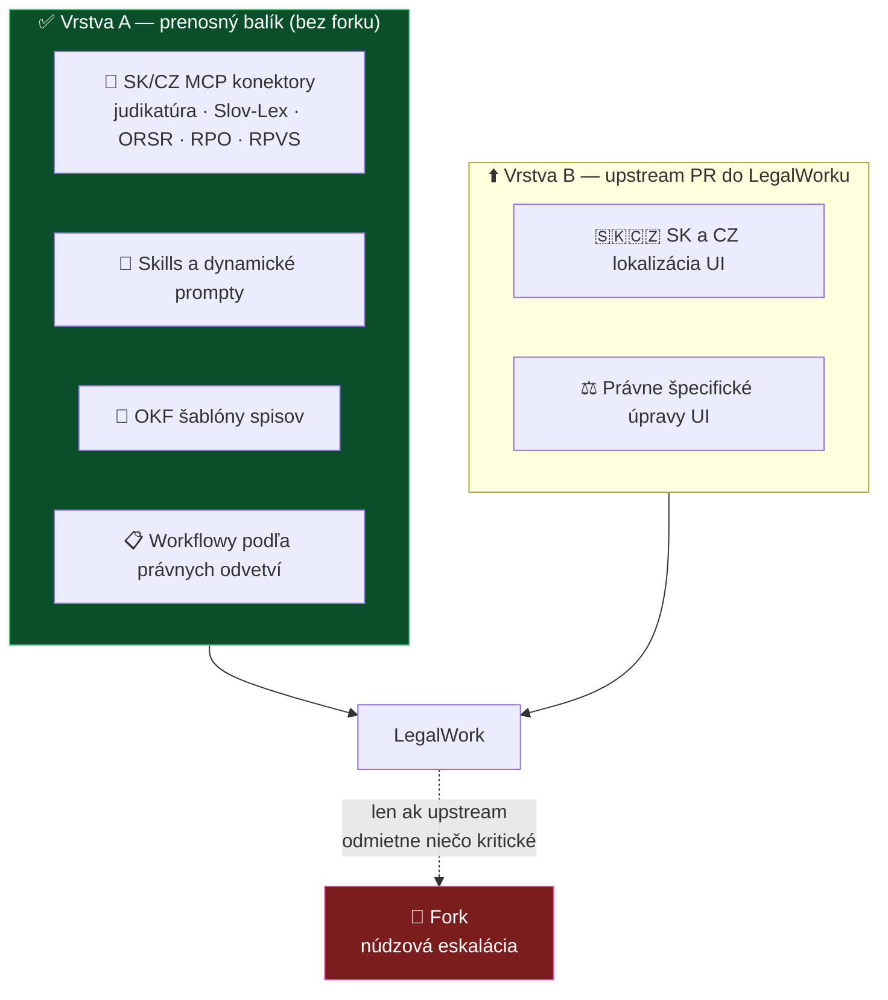

# ADR 0004: Ako rozšíriť LegalWork — fork, nadstavba, alebo balík

- **Dátum:** 2026-08-06
- **Stav:** 📝 **návrh** — na prerokovanie na najbližšom stredajšom sync calle
- **Navrhol:** MČ *(podklad pripravený s AI; fakty overené priamo v zdrojáku LegalWorku 2026-08-06)*
- **Súvisí s:** [ADR 0003](0003-legal-work-ako-zaklad.md) · [ADR 0005](0005-struktura-repozitarov.md) · [analýza LegalWork](../research/inspiracie/legalwork.md)

> [!IMPORTANT]
> **Toto rozhodnutie blokuje založenie fork repozitára** ([roadmapa, Fáza 1](../planning/roadmap.md)). Kým nepadne, nemá zmysel nič zakladať.

## Kontext

[ADR 0003](0003-legal-work-ako-zaklad.md) určil LegalWork ako základ. Nechal ale otvorené **ako presne** ho rozšírime, a ten rozpor je vecný:

- Argument pre LegalWork bol, že *„cez upstream to môžeš udržiavať, oni to updateujú"*.
- **Klasický fork túto výhodu ruší** — a to práve na vrstve, ktorú chceme meniť.
- Sám LegalWork sa tomu vyhýba: opencode drží ako **pinnutú závislosť** (`constants.json` → `v1.17.18`), nie ako fork.

Zároveň platí [princíp 1](../AGENTS.md) (nie sme programátori → minimálny maintenance) a princíp 5 (nezávislosť a prenositeľnosť).

## Čo sa v LegalWorku dá rozšíriť zvonku — overené

Toto je jadro rozhodnutia. Overené čítaním zdrojáku 2026-08-06:

| Vrstva | Vieme pridať bez zásahu do ich repa? | Dôkaz |
|---|---|---|
| **MCP servery** | ✅ **áno, používateľ cez UI** | `add-mcp-modal.tsx`, `mcp-connector-setup-modal.tsx`, `mcp-view.tsx` |
| **Agent Skills** | ✅ áno — súborové, na úrovni opencode | README: *„Extend it with skills, plugins, and MCP connectors"* |
| **Prompty, workflowy, OKF šablóny** | ✅ áno — obyčajné súbory | — |
| **opencode pluginy** | ✅ áno — cez opencode SDK | opencode docs |
| **LegalWork „extensions"** | ❌ **nie — sú hard-coded v ich strome** | `apps/server/src/extensions/index.ts`: statické pole `LEGALWORK_EXPERIMENTAL_EXTENSION_ACTIONS` + dispatch cez `if (extensionId === …)`. Žiadna registrácia zvonku. |
| **UI, lokalizácia, branding** | ❌ nie | zdrojáky `apps/app/` |

> [!NOTE]
> **Dôsledok:** to, čo LegalWork volá „extensions" (napr. `google-workspace.ts`, `openai-image-generation.ts`), je *ich* interná vec. Pridať takú extension znamená PR do ich repa alebo fork.
> Ale **väčšina našej plánovanej hodnoty do tejto kategórie nepatrí** — MCP konektory, skills, prompty a OKF šablóny vieme dodať zvonku.

## Rozhodnutie (návrh)

**Rozdeliť našu prácu na dve vrstvy a forkovať až vtedy, keď to inak nepôjde.**

**Vrstva A — prenosný balík.** Všetko, čo sa dá dodať zvonku. Žiadny fork, žiadny maintenance jadra, a **funguje to aj mimo LegalWorku** (opencode, Claude Code) — čím je splnený princíp 5. Toto je väčšina hodnoty projektu.

**Vrstva B — upstream PR.** Čo musí byť vnútri LegalWorku, pošleme im ako pull request. **Lokalizácia je pre nich žiadaná** — majú 12 jazykov a slovenčina ani čeština medzi nimi nie sú. Je to čistý, viditeľný vstup do komunity a zároveň nám nevzniká žiadny dlh.

**Fork — až ako núdzová eskalácia**, s vopred definovaným spúšťačom: *upstream odmietne alebo mesiace neriešia niečo, bez čoho produkt nedáva zmysel.* Vtedy sa ADR reviduje.

## Zvažované alternatívy

| Alternatíva | Prečo nie |
|---|---|
| **(a) Fork s disciplinovaným overlayom** | Každý upstream release = merge, a konflikty sa koncentrujú presne tam, kde editujeme. Vyžaduje niekoho, kto vie riešiť konflikty v TypeScripte — **to v tíme nemáme** (princíp 1). Zabíja aj prenositeľnosť (princíp 5). |
| **(b) Downstream nadstavba nad ich balíkmi** | LegalWork je desktopová aplikácia (Tauri), nie knižnica. Na npm je len `opencode-router` (MIT); `legalwork-orchestrator` tam **nemá publikovanú verziu** *(overené 2026-08-06)*. Stavať na tom vlastné UI = veľa práce za málo. |
| **(c) Čistý extension pack bez upstream PR** | Nepokryje lokalizáciu ani UI — a bez SK/CZ rozhrania je produkt pre cieľovú skupinu polovičný. |
| **Fork hneď, „nech máme kontrolu"** | Kontrola, ktorú nevieme uniesť. Fork sa dá spraviť kedykoľvek neskôr; nedá sa lacno vrátiť späť. |

## Dôsledky

**Pozitívne:**

- **Nulový maintenance jadra.** Upgrade LegalWorku = stiahnuť novú verziu.
- **Vrstva A je prenositeľná** — keď o rok bude lepší harness, presťahujeme sa.
- **Distribúcia komunite je triviálna** — balík súborov, nie aplikácia na zostavenie.
- Upstream PR s lokalizáciou nám dá **viditeľnosť v projekte s reálnym financovaním**.

**Negatívne a na doriešenie:**

- **Nemáme kontrolu nad UI ani brandingom.** Používateľ bude vidieť LegalWork, nie LAWOSS. To treba vedome prijať — alebo to znamená fork, so všetkým, čo k nemu patrí.
- Sme závislí od toho, či a ako rýchlo Eigenwelt merguje. **Otvorené: osloviť ich vopred**, či o SK/CZ lokalizáciu stoja.
- Treba overiť, či sa dá vypnúť ich telemetria a free modely centrálne pre celý tím, nielen per-inštalácia.

> [!TIP]
> **Praktický prvý krok, ktorý nič nepredurčuje:** zabaliť existujúce SK MCP konektory a OKF skilly ako vrstvu A a otestovať ich v LegalWorku *(úloha „prvý SK MCP server integrovaný" z [roadmapy](../planning/roadmap.md))*. Ak to zafunguje, väčšina otázky o forku je zodpovedaná praxou.

## Poznámka na okraj

LegalWork už obsahuje plugin `legalwork-legalmemory-knowledge` *(viď `legalwork-extensions-plugin-path.ts`)* — teda **integráciu na ich sesterský produkt [LegalMemory](https://github.com/eigenweltlabs/LegalMemory)**. Pri úvahách o pamäti prípadu s tým treba rátať: časť práce môže byť hotová, ale LegalMemory je **AGPL-3.0 + CLA**, na rozdiel od MIT LegalWorku. Viď [brainstorming 4. 8.](../meetings/2026-08-04-brainstorming-zaklad-a-prenositelnost.md)
