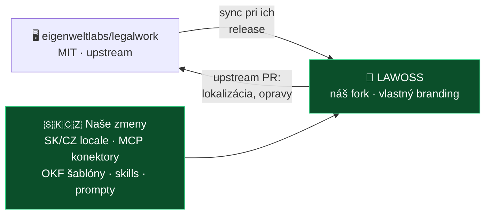

# ADR 0004: Forkujeme LegalWork pod vlastným brandingom

- **Dátum:** 2026-08-06
- **Stav:** prijaté — **rozhodol MČ** *(na potvrdenie: MF · IR · VŘ na stredajšom sync calle)*
- **Súvisí s:** [ADR 0003](0003-legal-work-ako-zaklad.md) · [ADR 0005](0005-struktura-repozitarov.md) · [analýza LegalWork](../research/inspiracie/legalwork.md)

## Kontext

[ADR 0003](0003-legal-work-ako-zaklad.md) určil LegalWork ako základ, ale nechal otvorené **ako presne** ho rozšírime. Zvažovali sa tri cesty: fork, downstream nadstavba, alebo prenosný balík bez forku.

**MČ rozhodol pre fork** s odôvodnením, že chceme **vlastný produkt s vlastným brandingom vo vlastnom repozitári**, nie doplnok do cudzej aplikácie. Expozícia a vlastná značka sú jedným zo štyroch princípov projektu.

## Rozhodnutie

**Forkneme [LegalWork](https://github.com/eigenweltlabs/legalwork) (MIT) do vlastného repozitára, prispôsobíme ho pod značkou LAWOSS a čo dáva zmysel budeme posielať späť do upstreamu.**

## Čo forkom získavame — overené v ich repe

Fork je lacnejší, než sa na prvý pohľad zdalo. Overené 2026-08-06:

| Čo | Zistenie |
|---|---|
| **Celý build pipeline** | `.github/workflows/` obsahuje `release-macos-aarch64.yml` (36 kB), `alpha-macos-aarch64.yml`, `alpha-windows-x64.yml`, `ci-tests.yml`, `ci-i18n.yml`. **Forkom ich zdedíme celé** — stačí doplniť vlastné podpisové tajomstvá. |
| **Branding je sústredený** | `tauri.conf.json` + `productName` — **iba 2 miesta**. Zmena názvu a ikony je malý, izolovaný zásah. |
| **Lokalizácia = nové súbory** | `apps/app/src/i18n/locales/` má `en · de · es · ru · vi · zh · th · ca`. Pridanie `sk.ts` a `cs.ts` sú **nové súbory → nulový merge konflikt**. Navyše `ci-i18n.yml` kompletnosť prekladov kontroluje za nás. |
| **Aktívny upstream** | posledný release `v0.1.13` z 2026-08-04 s 18 assetmi — vyvíja sa rýchlo, sync treba robiť pravidelne |

## Ako udržať fork lacný — záväzné pravidlá

> [!IMPORTANT]
> **Pravidlo č. 1: radšej pridávaj súbory, než upravuj cudzie.**
> Nové súbory sa nikdy nemergujú konfliktne. Každý riadok, ktorý zmeníme v ich existujúcom súbore, je budúci konflikt. Toto jedno pravidlo rozhoduje o tom, či bude fork udržateľný.

1. **Forkovať cez GitHub**, nie kopírovaním. Len tak funguje *Sync fork* a `upstream` remote.
2. **Evidencia zásahov** — súbor `PATCHES.md` v forku, kde je vymenovaný **každý** náš zásah do upstream súboru a prečo. Keď merge spadne, vieme presne, čo obnoviť.
3. **Synchronizovať pri ich releasoch**, nie priebežne. Pinnúť sa na tag, prejsť changelog, mergnúť vedome.
4. **Čo sa dá, posielať upstream.** Nie z altruizmu — **každá vec, ktorú prijmú, zmenšuje náš diff.** Lokalizácia je ideálny kandidát: SK ani CZ nemajú a `ci-i18n.yml` naznačuje, že o preklady stoja.
5. **Naša doména do vlastných priečinkov** — SK/CZ MCP konfigy, OKF šablóny, skills a prompty držať v samostatných adresároch, ktoré upstream nepozná. Tie sa nikdy nezrazia.

## Náklady, s ktorými treba rátať

| Položka | Poznámka |
|---|---|
| **Apple Developer Program** | notarizácia macOS buildov; bez nej Gatekeeper appku zablokuje. Ročný poplatok — *sumu overiť pred rozpočtom* |
| **Podpisovanie na Windows** | bez certifikátu bude SmartScreen varovať; dá sa dočasne akceptovať |
| **CI tajomstvá** | podpisové kľúče a heslá do GitHub Secrets nášho forku |
| **Merge práca** | pri každom upstream release; veľkosť závisí od dodržiavania pravidla č. 1 |
| **Zodpovednosť** | vlastná branded binárka nás v očiach používateľa posúva bližšie k dodávateľovi — viď [ADR 0002](0002-preco-forkujeme-mikeoss.md), kde je monetizácia postavená na vzdelávaní, nie na softvéri. **Ošetriť disclaimerom v README a v podmienkach.** |

## Zvažované alternatívy

| Alternatíva | Prečo nie |
|---|---|
| **Prenosný balík bez forku** *(skills, prompty, MCP konektory inštalované do LegalWorku)* | Technicky najlacnejšie a plne prenositeľné, ale používateľ by videl LegalWork, nie LAWOSS. **Nedáva vlastný produkt ani vlastnú značku**, čo je pre projekt určujúce. Rovnaký argument sme zamietli už v [ADR 0002](0002-preco-forkujeme-mikeoss.md): *„netechnický advokát nerozbehne «naklonuj MCP config» — fork dáva použiteľnú appku s UI."* Časti tohto prístupu si však ponechávame — naša doména žije vo vlastných priečinkoch (pravidlo č. 5). |
| **Downstream nadstavba nad ich balíkmi** | LegalWork je desktopová aplikácia (Tauri), nie knižnica. `legalwork-orchestrator` **nemá na npm publikovanú verziu** *(overené 2026-08-06)*, takže reálne to nejde. |
| **LegalWork „extensions"** | Ich extension registry je **hard-coded** — `apps/server/src/extensions/index.ts` obsahuje statické pole a dispatch cez `if (extensionId === …)`. Zvonku sa registrovať nedá; aj tak by to znamenalo zásah do ich repa. |

## Dôsledky

**Pozitívne:**

- Vlastný produkt, vlastná značka, vlastný repozitár — plná kontrola nad tým, čo advokát vidí.
- Zdedený build pipeline pre macOS aj Windows.
- SK/CZ lokalizácia ako nové súbory → bez konfliktov, a zároveň silný kandidát na upstream.
- Môžeme meniť UI presne pre advokátsku prácu, čo balík neumožňoval.

**Negatívne a na doriešenie:**

- **Merge dlh.** Upstream sa hýbe rýchlo (release 4. 8.). Dodržiavanie pravidla č. 1 nie je odporúčanie, ale podmienka udržateľnosti.
- **Potrebujeme niekoho, kto vie riešiť merge konflikty v TypeScripte.** V tíme to dnes nemáme — otvorená otázka, či to zvládne AI asistencia, alebo treba prizvať človeka.
- **Notarizácia a podpisovanie** sú náklad aj administratíva. Rozhodnúť, kto účet zriadi.
- **Prenositeľnosť klesá.** Naša doména (skills, prompty, MCP, OKF) zostáva prenosná, ale samotný produkt už bude viazaný na LegalWork.
- Otvorené: **ktorý tag** forkneme *(kandidát: `v0.1.13`)*.

> [!NOTE]
> LegalWork obsahuje plugin `legalwork-legalmemory-knowledge` — integráciu na ich sesterský [LegalMemory](https://github.com/eigenweltlabs/LegalMemory), ktorý je **AGPL-3.0 + CLA**, na rozdiel od MIT LegalWorku. V našom forku ho **nepoužívať ani neupravovať**, kým sa licenčný dopad nevyhodnotí. Pamäť prípadu plánujeme stavať nad [OKF](../specs/0002-okf-operacny-system-praxe.md) vlastnými silami.
