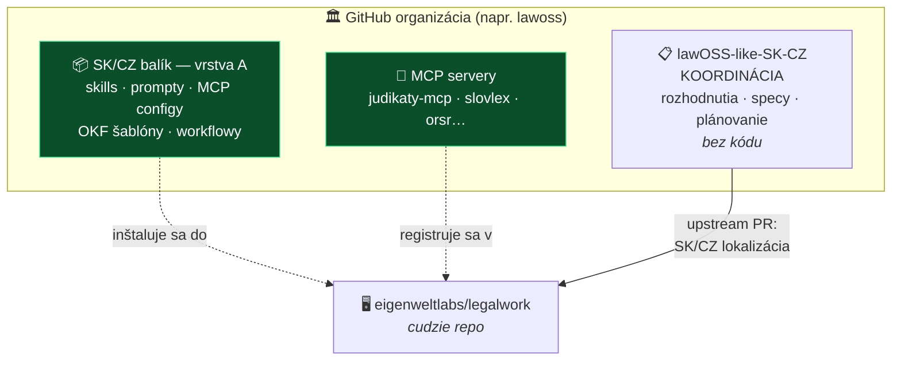

# ADR 0005: Štruktúra repozitárov — koordinácia oddelene od kódu

- **Dátum:** 2026-08-06
- **Stav:** 📝 **návrh** — na prerokovanie na najbližšom stredajšom sync calle
- **Navrhol:** MČ *(podklad pripravený s AI)*
- **Súvisí s:** [ADR 0004](0004-ako-rozsirit-legalwork.md) · [ADR 0003](0003-legal-work-ako-zaklad.md)

## Kontext

Toto repo je **výhradne koordinačné** — nápady, rozhodnutia, rešerše, projektové riadenie. Neobsahuje kód produktu a nemá ho obsahovať.

Vznikla otázka, kde bude žiť samotná práca na aplikácii. Zvažovalo sa riešenie **v tomto repe cez druhú vetvu**: `main` na koordináciu, samostatná vetva na appku a features.

Cieľ za tým návrhom je správny — **jedno miesto, jeden odkaz, nízka réžia.** Nižšie je návrh, ako ho dosiahnuť bez nevýhod vetvy.

## Rozhodnutie (návrh)

**Koordináciu a kód držať v oddelených repozitároch. Nie vo vetvách jedného repa.**

| Repo | Obsah | Licencia |
|---|---|---|
| **`lawOSS-like-SK-CZ`** *(toto)* | koordinácia — zostáva presne ako je | MIT *(doplniť)* |
| **balík vrstvy A** *(nové)* | skills, prompty, MCP configy, OKF šablóny, workflowy | MIT |
| **MCP servery** *(už existujú samostatne)* | `judikaty-mcp` a ďalšie | MIT *(doplniť)* |

Podľa [ADR 0004](0004-ako-rozsirit-legalwork.md) **fork LegalWorku zatiaľ nevzniká.** Ak neskôr vznikne ako núdzová eskalácia, bude to **samostatné repo založené ako GitHub fork** — inak nefunguje upstream sync.

## Prečo nie vetva v tomto repe

| Dôvod | Vysvetlenie |
|---|---|
| **Fork potrebuje vlastné repo** | Upstream sync z `eigenweltlabs/legalwork` vyžaduje `upstream` remote. Histórie tohto repa a LegalWorku sú nesúvisiace — spájali by sa cez `--allow-unrelated-histories`, čo je jednorazový hack, ktorý sa pri každom ďalšom pulle rozsype. **Zabilo by to presne tú vlastnosť, kvôli ktorej sme LegalWork zvolili.** |
| **Vetvy sa majú zlievať** | Vetva s úplne iným stromom, ktorá sa nikdy nemergne do `main`, nie je vetva — je to druhé repo schované v prvom. PR medzi nimi nedáva zmysel a `git merge main` by miešal dokumentáciu do kódu. |
| **Licencia** | Kód odvodený od LegalWorku musí niesť jeho MIT `LICENSE` a atribúciu. Koordinačné repo je iné dielo. V jednom repe by bolo nejednoznačné, čo je pod čím — zbytočné riziko pre advokátov publikujúcich open source. |
| **Issues, PR a releases** | Jeden tracker pre „diskusia o roadmape" aj „appka padá pri OCR". Appka bude potrebovať verzované buildy, koordinačné repo nie. |
| **Skúsenosť prispievateľa** | Kolega, ktorý chce appku vyskúšať, by si klonoval zápisy zo stretnutí. Kto chce komentovať rozhodnutie, pristane v kóde. |

> [!NOTE]
> **Jeden argument, ktorý NEPLATÍ.** Automatizácie by problém nespôsobili — `update-readme.yml` aj `telegram-notify.yml` majú `branches: [main]`, takže na inej vetve sa nespustia *(overené 2026-08-06)*.

## Ako splniť pôvodný cieľ „jedno miesto"

**GitHub organizácia.** Dá jednu landing stránku, jeden názov, spoločné členstvo a práva naprieč repami — teda presne to, čo vetva sľubovala, ale bez jej nevýhod.

- Názov v súlade s [ADR o názve](../AGENTS.md): **LAWOSS**. *(Dostupnosť `lawoss` na GitHube neoverená — treba skontrolovať.)*
- Presun existujúceho repa do organizácie je **bezpečný** — GitHub drží presmerovanie zo starých URL. Pozor len na GitHub Pages: URL sa zmení.
- Vhodná príležitosť presunúť pod organizáciu aj **`judikaty-mcp`**, ktorý je dnes **private a bez licencie** — a tým blokuje komunitnú časť projektu.

## Zvažované alternatívy

| Alternatíva | Prečo nie |
|---|---|
| **Vetva v tomto repe** | Viď tabuľku vyššie. Cieľ je legitímny, mechanizmus nie. |
| **Monorepo — kód aj koordinácia v `main`** | Zmiešalo by rozhodovanie s implementáciou; navyše rovnaký problém s forkom a licenciou. |
| **Všetko v jednom repe bez organizácie** | Funguje len dovtedy, kým je repo jedno. MCP servery už dnes samostatné sú. |

## Dôsledky

- Toto repo sa **nemení** — zostáva koordinačné, tak ako doteraz.
- Vzniká jedno nové repo (balík vrstvy A), zatiaľ **bez forku**.
- Treba rozhodnúť, či zakladáme organizáciu hneď, alebo až keď bude kód.
- Do každého README patrí odkaz na to druhé repo, nech je väzba zrejmá.

> [!WARNING]
> **Nič z toho ešte nie je vytvorené.** Založenie organizácie, forku aj nového repa čaká na odsúhlasenie tímom.
