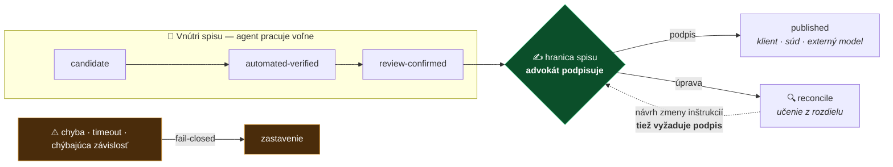

# ADR 0007: Agent-first architektúra — softvér pre agenta, rozhranie pre advokáta

- **Dátum:** 2026-08-12
- **Stav:** **návrh** — smerovanie prijaté callom 12. 8. *(záver R1)*; samotné pravidlá čakajú na potvrdenie tímom
- **Vzťah k [ADR 0009](0009-zakladna-produktova-doktrina.md):** toto ADR je **technickým vykonávacím predpisom k druhému pilieru doktríny** *(„Aplikácia sa stavia pre agentov, človek ju riadi")*. Doktrína hovorí **čo a prečo**, toto ADR **ako**. Prechádza záväzným produktovým testom — viď kapitolu na konci.
- **Navrhol:** MČ · 2026-08-12
- **Povinný recenzent:** **MF** — toto ADR zovšeobecňuje stavový automat, ktorý navrhol v [ADR 0006](0006-anonymizacia-ako-lokalny-privacy-gate.md) a [spec 0008](../specs/0008-anonymizacia-a-privacy-gate.md). Bez jeho stanoviska sa neprijíma.
- **Stanovisko MF (2026-08-12):** smerovanie je *„zlučiteľné s princípmi SAK **iba podmienečne**"*. Vyžiadal tri doplnenia — **povinnú ľudskú verifikáciu pred použitím výstupu v právnej službe**, **oddelenie roly recenzenta architektúry od zodpovedného advokáta vo veci** a **technické vylúčenie podpisovania a konania navonok agentom**. Zapracované nižšie *(pravidlo 3, kapitola „Role a zodpovednosť", pravidlo 5)*; **čaká na jeho opätovné posúdenie.**
- **Stavia na:** [ADR 0006](0006-anonymizacia-ako-lokalny-privacy-gate.md) *(prevzatý kontrakt — pozri poznámku nižšie)* · [ADR 0002](0002-preco-forkujeme-mikeoss.md) *(červená čiara — nie sme dodávateľ softvéru)*
- **Podložené callom 12. 8.:** záver **R1** — *„LAWOSS sa navrhuje ako AI-first prostredie. Primárnym vykonávateľom práce je agent, právnik zostáva supervízorom a rozhodovacou vrstvou."* → [zápis](../meetings/2026-08-12-produktova-vizia-okf-pamat.md)
- **Súvisiace:** [spec 0002 OKF](../specs/0002-okf-operacny-system-praxe.md) · [spec 0007 podpisovanie](../specs/0007-podpisovanie-a-zarucena-konverzia.md) · [spec 0009 reconcile](../specs/0009-reconcile-ucenie-z-uprav.md) *(zatiaľ len v [PR #16](https://github.com/originalmagneto/lawOSS-like-SK-CZ/pull/16))* · [stratégia](../docs/strategia.md) *(zatiaľ len v [PR #14](https://github.com/originalmagneto/lawOSS-like-SK-CZ/pull/14))*

> [!IMPORTANT]
> **Odloženie anonymizácie (záver R7) toto ADR nepodkopáva.** Call rozhodol, že **anonymizačný modul sa v aktuálnej fáze neimplementuje**. To sa týka *funkcie*, nie *kontraktu*: pravidlo 3 preberá z [ADR 0006](0006-anonymizacia-ako-lokalny-privacy-gate.md) **stavový automat a pravidlo o spoločnej autorizácii**, ktoré platia bez ohľadu na to, či niekedy vznikne anonymizer. Ak by sa ADR 0006 niekedy zrušilo, kontrakt sa presunie sem — nezaniká.

> [!NOTE]
> **Pozor na číslovanie.** V repe existuje aj **spec 0007** (podpisovanie a zaručená konverzia) — iný dokument v inom priečinku. V odkazoch vždy píš *ADR 0007* alebo *spec 0007* v plnom znení, nikdy len „0007".

---

## Kontext

Doterajšie rozhodnutia opisujú, **čo** staviame ([ADR 0003](0003-legal-work-ako-zaklad.md), [ADR 0004](0004-ako-rozsirit-legalwork.md)) a **prečo** ([ADR 0002](0002-preco-forkujeme-mikeoss.md)). Nikde nie je napísané, **pre koho je softvér primárne navrhnutý** — a ukazuje sa, že to nie je detail.

Viaceré doterajšie dokumenty krúžia okolo tej istej myšlienky bez toho, aby ju pomenovali:

- [Spec 0002](../specs/0002-okf-operacny-system-praxe.md) hovorí: *„Aplikácia je lepidlo a register (zdroj pravdy), nie monolitický AI engine."* OKF už dnes generuje `AGENTS.md`, `CLAUDE.md`, `MEMORY.md` a `_STATUS.md` — teda **strojovo čitateľný stav spisu s protokolom zápisu**. To je agent-first architektúra, len tak nepomenovaná.
- Verdikt oponentúry v [stratégii](../docs/strategia.md) znie *„vrstva > binárka; kto vlastní formát spisu, vlastní trh"*.
- [ADR 0006](0006-anonymizacia-ako-lokalny-privacy-gate.md) definuje stavový automat `candidate → automated-verified → review-confirmed → published` a pravidlo, že **originál sa nikdy neprepíše** a publikovanie **vyžaduje výslovné potvrdenie advokátom**. MF ho napísal pre anonymizáciu, ale je to všeobecný kontrakt medzi agentom a advokátom.

Toto ADR ten princíp pomenúva a robí z neho záväzné kritérium návrhu.

## Rozhodnutie

**LAWOSS sa navrhuje tak, že primárny používateľ softvéru je agent, nie človek. Ľudské rozhranie je riadiaci panel: zadať mandát, vidieť stav, podpísať výstup.**

### Rámec: agent je koncipient

Pre tento vzťah existuje zabehnutá právnická analógia a používame ju namiesto technického žargónu:

> **Agent je koncipient.** Pracuje samostatne, pripravuje podklady a drafty, má prístup do spisu. Ale **nepodpisuje**. Za jeho prácu zodpovedá advokát, ktorý ju pred podpisom prečíta — a tým, že ju opravuje, ho učí.

Táto analógia nie je ozdoba. Má dva praktické dôsledky: tím štyroch advokátov rozumie bez vysvetľovania, ako sa taký vzťah riadi; a pred komorou sa obhajuje ľahšie než čokoľvek s prívlastkom „AI", lebo **režim zodpovednosti sa nemení** — mení sa len to, kto píše drafty.

### Päť záväzných pravidiel

#### 1. Strojovo čitateľný stav je prvotný, ľudské zobrazenie odvodené

Nie naopak. `_STATUS.md`, `spis.md`, `MEMORY.md` a `AGENTS.md` sú zdroj pravdy; rozhranie je pohľad na ne. OKF to dnes robí, ale nikde to nie je napísané ako pravidlo — takže sa to dá kedykoľvek nechtiac porušiť.

#### 2. Každá funkcia musí byť vykonateľná agentom bez GUI

Ak sa niečo dá spraviť len klikaním, je to **chyba návrhu**, nie vlastnosť. Toto je zároveň testovacie kritérium celého ADR: dá sa naň ukázať prstom a odpoveď je áno/nie.

#### 3. Kontrakt agent ↔ advokát

Zovšeobecnenie automatu z [ADR 0006](0006-anonymizacia-ako-lokalny-privacy-gate.md) z anonymizácie na všetko, čo agent vyprodukuje:

| Zóna | Kto koná | Pravidlo |
|---|---|---|
| **Vnútri spisu** | agent voľne | stavy `candidate` → `automated-verified` → `review-confirmed` sú lokálne; **originál sa nikdy neprepíše** |
| **Hranica spisu** | **advokát podpisuje** | prechod do `published` vyžaduje automatické overenie **a** výslovné potvrdenie advokátom |
| **Zlyhanie** | nikto | chyba, timeout alebo chýbajúca závislosť = **fail-closed**, nikdy tichý prechod |

**Čo znamená „von"** — nielen klientovi, protistrane alebo na súd, ale **aj externému modelu**. To ADR 0006 už hovorí; tu to prestáva byť pravidlo o anonymizácii a stáva sa pravidlom o agentoch všeobecne.

> [!CAUTION]
> **Povinná ľudská verifikácia pred použitím výstupu v právnej službe** *(doplnené na žiadosť MF, 2026-08-12)*
> Slovo **„voľne"** v prvom riadku tabuľky sa týka **výlučne toho, že agent smie pracovať a produkovať** — nie toho, že by sa jeho výstup dal použiť.
> **Žiadny výstup agenta sa nesmie použiť pri poskytovaní právnej služby, kým ho advokát neoveril.** Platí to aj vtedy, keď výstup **neopúšťa spis** — teda aj pre rešerš, o ktorú sa advokát oprie v porade, pre zhrnutie, z ktorého vychádza pri rozhodovaní, aj pre návrh úkonu.
> Overenie znamená, že advokát obsah **prečítal a prevzal zaň zodpovednosť** — nie že ho videl prebehnúť. Neoverený výstup je pracovný materiál, nie podklad právnej služby.

#### 4. Hranica spisu je súčasne kontrolný **aj učiaci** bod

Podpis advokáta v praxi nie je klik — je to **úprava**. Advokát draft prečíta a prepíše. Ten rozdiel medzi tým, čo pripravil agent, a tým, čo advokát reálne podpísal, je najkvalitnejší tréningový signál, aký máme, a vzniká sám pri bežnej práci. Spracúva ho [spec 0009 reconcile](../specs/0009-reconcile-ucenie-z-uprav.md).

Z toho plynú tri veci:

- **Ľudská brána nie je réžia, je to investícia.** Najsilnejšia námietka proti human gate je „spomaľuje to". Ak každé schválenie kŕmi reconcile, počet zásahov v čase **klesá** — brána sa sama zaplatí.
- **Rozhranie dostáva konkrétnu úlohu.** Hlavná obrazovka nie je chat ani dashboard, ale **rozdiel medzi návrhom agenta a mojou verziou, s podpisom**. *(Smerovanie, nie záväzná požiadavka na UI — to sa rieši samostatne.)*
- **Zápis do inštrukcií je tiež prechod hranice.** Učenie, ktoré reconcile navrhne zapísať do `AGENTS.md`, `MEMORY.md` alebo prompt layeru, **vyžaduje podpis rovnako ako odchod dokumentu von.** Nie je to slušnosť, je to nosný bezpečnostný prvok — dôvod je v rizikách nižšie. **Kto podpisuje, závisí od úrovne**: na úrovni veci zodpovedný advokát, na úrovni kancelárie a vyššie recenzent architektúry — a jeho schválenie **nikdy nenahrádza overenie vo veci** *(viď kapitolu Role a zodpovednosť)*.

#### 5. Podpisovanie a konanie navonok sú agentovi **technicky** znemožnené

*(doplnené na žiadosť MF, 2026-08-12)*

Nestačí, že to agent nemá dovolené. **Nesmie na to mať schopnosť.**

| Zakázané | Ako sa to vynucuje |
|---|---|
| **Podpisovanie** — QES, QTS, akákoľvek autorizácia | agent **nemá prístup k rozhraniu Autogramu**, k mandátnemu certifikátu ani k čítačke; podpis spúšťa človek vo vlastnej aplikácii Autogramu |
| **Odoslanie čohokoľvek navonok** — e-mail, dátová schránka, podanie na súd, komunikácia s protistranou či klientom | agent **nemá odosielací nástroj** — nie je mu sprístupnený, nie je mu zakázaný |
| **Konanie v mene advokáta** voči tretím stranám | to isté: chýbajúca schopnosť, nie inštrukcia |

> [!IMPORTANT]
> **Rozdiel je zásadný.** Zákaz v prompte sa dá obísť — otráveným dokumentom, zle formulovanou úlohou, chybou modelu. **Chýbajúci nástroj obísť nedá.** Preto sa tieto schopnosti agentovi **nesprístupňujú**, namiesto toho, aby sa mu zakazovali.
>
> Praktický dôsledok pre návrh: **každý nástroj, ktorý koná navonok, patrí do ľudského rozhrania, nie do sady nástrojov agenta.** Ak by niekedy vznikla požiadavka dať agentovi odosielací alebo podpisový nástroj, je to zmena tohto ADR, nie konfiguračná voľba.

Sedí to s tým, ako už dnes funguje podpisovanie *(nižšie)*: Autogram je cudzia aplikácia, ktorú agent nemá ako ovládať, a PIN ani certifikát cez LAWOSS neprechádzajú. Toto pravidlo z faktického stavu robí **záväzné pravidlo návrhu**.

### Role a zodpovednosť — dve rôzne veci, ktoré sa nesmú zliať

*(doplnené na žiadosť MF, 2026-08-12)*

Pôvodné znenie ADR hovorilo, že zmenu inštrukcií „schvaľuje advokát", a **tým dve odlišné roly nesprávne zlialo do jednej**:

| Rola | Čo schvaľuje | Za čo **nezodpovedá** |
|---|---|---|
| **Recenzent architektúry** | pravidlá, inštrukčné vrstvy, prompty kancelárie, zmeny v `AGENTS.md` na úrovni kancelárie a komunity | **za žiadnu konkrétnu vec.** Jeho súhlas nie je odborným posúdením ničoho, čo sa v spise deje |
| **Zodpovedný advokát vo veci** | všetko, čo sa v jeho spise použije pri poskytovaní právnej služby | — nesie zodpovednosť podľa predpisov o výkone advokácie |

Z toho plynú tri záväzné dôsledky:

1. **Schválenie na úrovni architektúry nikdy nenahrádza overenie vo veci.** Ak recenzent architektúry schváli inštrukciu do promptu kancelárie, **nezbavuje to zodpovedného advokáta povinnosti overiť každý výstup vo svojom spise** podľa pravidla 3.
2. **Recenzent architektúry nesmie zasahovať do cudzieho spisu.** Zmena inštrukcií na úrovni kancelárie je zmena *pravidiel*, nie zmena *obsahu veci*. Nikto nesmie cez inštrukčnú vrstvu meniť, ako sa vedie konkrétna vec, ktorú nevedie.
3. **Zodpovedný advokát smie inštrukciu kancelárie vo svojej veci prebiť.** Ak je pre danú vec nevhodná, platí jeho rozhodnutie — a rozpor ide na prerokovanie tímu, nie na tichý prepis spoločného promptu. *(To už vyžaduje [spec 0009](../specs/0009-reconcile-ucenie-z-uprav.md), Adaptácia 4.)*

> [!NOTE]
> V malom tíme sú obe roly často tá istá osoba. **To nie je dôvod ich nerozlišovať** — je to dôvod, prečo si treba pri každom schválení uvedomiť, v ktorej z nich človek práve koná.

### Podpisovanie ako externý add-on — a čo z toho pre kontrakt vyplýva

**Podpisovanie nie je súčasť LAWOSS a nemá ňou byť.** Podľa [spec 0007](../specs/0007-podpisovanie-a-zarucena-konverzia.md) je to **samostatný krok na konci prípravy dokumentu** — napríklad pred podaním na súd — realizovaný cez [Autogram](https://github.com/slovensko-digital/autogram) (Slovensko.Digital, eIDAS):

1. advokát má **Autogram nainštalovaný samostatne** — LAWOSS ho nedistribuuje ani nebundluje *(je EUPL-1.2; licenčná hranica musí zostať čistá)*,
2. Autogram beží ako **lokálny proces s HTTP API** (`localhost:37200`) alebo CLI,
3. LAWOSS ho **zavolá** a podpísaný súbor si prevezme späť do spisu podľa OKF.

Je to teda **add-on, nie integrovaný systém overenia advokáta.** LAWOSS nepracuje s PIN-om ani s certifikátmi — tie ostávajú medzi Autogramom a čítačkou.

**Prečo to sem patrí:** práve preto, že je to mimo nás, je hranica z pravidla 3 v tomto prípade **vynútená zvonku, nie našou disciplínou**. Podpis fyzicky prebehne v cudzej aplikácii, potvrdením v jej vlastnom rozhraní, s kartou v čítačke. Nemôžeme ho oslabiť ani omylom, ani zlým promptom, ani zmenou nášho UI. Agent pripraví dokument, skontroluje ho, založí do spisu a pripraví podpisovú dávku — a **musí sa zastaviť**, lebo ďalej jednoducho nemá ako pokračovať.

To je pre toto ADR užitočný referenčný bod: ukazuje, ako vyzerá hranica, ktorá drží aj bez toho, aby ju niekto strážil.

**Zaručená konverzia je samostatná funkcionalita**, nie variant podpisovania. Spec 0007 ju dnes pokrýva spolu s podpisovaním *(zdieľajú engine)*; po doplnení rešerše MČ sa zváži jej vyčlenenie do vlastného specu.

Zaradenie sa týmto ADR **nemení** — QES/QTS ostáva kandidát na V2, zaručená konverzia ďalšia verzia *(rozhodnutie MČ 2026-08-07)*.

## Dôsledky

1. **Každá budúca spec odpovie na otázku: čo z toho číta agent a čo človek.** Jedna veta, povinná, ako dnes „stav" a „navrhol". Lacné, a hneď odhalí funkcie navrhnuté pre klikanie.
2. **Reconcile prestáva byť voliteľná funkcia.** [Spec 0009](../specs/0009-reconcile-ucenie-z-uprav.md) ostáva **V2** — ale architektúra V1 jej musí nechať miesto: drafty sa neprepisujú, verzie ostávajú, hranica je explicitná. Zhodou okolností to pravidlo 3 už vyžaduje.
3. **Metrika projektu:** koľko toho musel advokát prepísať a či to v čase klesá. Sleduje sa z verzií súborov v spise — bez telemetrie a bez analytiky.
4. **Aktualizovať `AGENTS.md`** koordinačného repa o povinnú otázku z bodu 1 — po prijatí tohto ADR.
5. **Sada nástrojov agenta sa stáva predmetom review.** Keďže pravidlo 5 sa vynucuje tým, čo agentovi *nesprístupníme*, musí byť pri každej zmene zjavné, aké nástroje agent má. Pridanie nástroja, ktorý koná navonok, je zmena tohto ADR.

## Čo toto ADR NEznamená

| Nie je to | Prečo to treba povedať nahlas |
|---|---|
| **Nie je to pitch pre advokátov** | Je to architektonický princíp. Advokátovi predávame poriadok v spise a ušetrený čas, nie „agent-first architektúru". Persona používateľa v [oponentúre](../docs/strategia.md) pred touto optikou výslovne varovala. |
| **Nemení to scope V1** | SK/CZ lokalizácia ostáva v V1 — je to **vstupenka, nie funkcia**: bez slovenského rozhrania advokát appku neotvorí a k agentom sa nikdy nedostane. Princíp hovorí *ako* stavať, nie *čo* je v V1. |
| **Nie je to krok k autonómii** | Kontrakt v pravidle 3 je **strop, nie schodík**. Žiadne budúce ADR ho nesmie posunúť tak, že podpisuje agent. Kto to navrhne, musí najprv zrušiť toto ADR. |
| **Nie je to o rozšírení na ďalšie trhy** | Poľsko ani iné jurisdikcie sem nepatria. Nanajvýš riadok do [zberného koša](../planning/napady.md). |

## Riziká

**1. Zovšeobecňujeme cudziu prácu.** Stavový automat navrhol MF a bol zlúčený 2026-08-11. Robiť z neho základ celej architektúry je poklona — ale iba ak sa ho spýtame. Preto je **MF povinný recenzent** v hlavičke, nie poznámka pod čiarou.

**2. „Agent pracuje voľne vnútri spisu" naráža na mlčanlivosť.** Ak je agent cloudový model, „voľne vnútri spisu" znamená, že klientske dáta odchádzajú von. Toto ADR na to **nemá vlastné riešenie** a ani si ho nenárokuje — brzdou je hybrid routing *(návrh #5, [spec 0003](../specs/0003-prompt-layer.md))* a anonymizačný gate z [ADR 0006](0006-anonymizacia-ako-lokalny-privacy-gate.md). Slovo „voľne" sa vzťahuje na **rozsah práce v rámci spisu, nie na voľbu modelu.**

**3. Prompt injection dostáva novú, trvalú cestu.** Bezpečnostná persona v oponentúre *(3/10)* varovala pred injection cez OCR dokumenty. Agent-first spolu s reconcile ten povrch **rozširuje**: otrávený dokument ovplyvní draft → advokát draft upraví → reconcile z tej úpravy vyrobí inštrukciu → otrava sa **natrvalo usadí v `AGENTS.md`**. Preto je v pravidle 4 zápis do inštrukcií definovaný ako prechod hranice vyžadujúci podpis. Spec 0009 túto poistku má; toto ADR z nej robí **záväznú, nie voliteľnú**.

**4. Princíp sa môže rozpustiť do frázy.** Tím nemá programátora, ktorý by strážil dodržiavanie. Proti tomu stojí testovacie kritérium z pravidla 2. **Ak sa po dvoch specoch ukáže, že sa naň nikto nepýta, toto ADR sa zruší** — nebude sa predstierať, že platí.

## Záväzný produktový test podľa ADR 0009

[ADR 0009](0009-zakladna-produktova-doktrina.md) zaviedlo šesť otázok, na ktoré musí odpovedať každý významný návrh, ADR, feature a partnerstvo. Tu sú odpovede za toto ADR:

| # | Otázka | Odpoveď |
|---|---|---|
| 1 | Zvyšuje kontrolu používateľa nad modelmi, dátami, nástrojmi a know-how? | **Áno.** Pravidlo 1 robí zo stavu spisu čitateľný markdown u advokáta, nie databázu v aplikácii. Pravidlo 4 dáva advokátovi kontrolu nad tým, čo sa systém naučí. |
| 2 | Zachováva možnosť systém pochopiť, upraviť, vymeniť alebo opustiť? | **Áno, a posilňuje ju.** Pravidlo 1 (strojovo čitateľný stav je prvotný) a pravidlo 2 (všetko vykonateľné bez GUI) sú presne tie vlastnosti, vďaka ktorým sa dá vrstva odpojiť od LegalWorku — sedí to na exit plán zo [stratégie](../docs/strategia.md). |
| 3 | Posilňuje schopnosť právnika bezpečne riadiť agentov? | **Áno.** Kontrakt v pravidle 3, povinná ľudská verifikácia pred použitím a technické vylúčenie konania navonok (pravidlo 5) sú konkrétnym obsahom slova „supervízor". |
| 4 | Zachováva audit, provenance a primerané human approval? | **Áno.** Originál sa nikdy neprepíše, stavy sú evidované, prechod hranice vyžaduje podpis, zlyhanie je fail-closed. Kapitola *Role a zodpovednosť* rieši, **kto** schvaľuje na ktorej úrovni. |
| 5 | Nevytvára nový povinný black box ani vendor lock-in? | **Nie.** Pravidlo 1 vylučuje stav uzavretý v aplikácii; podpisovanie zostáva v cudzom procese (Autogram), ktorý nevlastníme. |
| 6 | Umožňuje kanceláriám využiť vlastné výhody bez nútenej uniformity? | **Áno.** Rebrík učenia v [spec 0009](../specs/0009-reconcile-ucenie-z-uprav.md) drží preferencie na úrovni veci, spisu a kancelárie; povýšenie na komunitnú úroveň je dobrovoľné a cez PR. |

**Výnimku z doktríny toto ADR nepotrebuje.**

## Vzťah k ostatným rozhodnutiam

| Dokument | Vzťah |
|---|---|
| **[ADR 0009](0009-zakladna-produktova-doktrina.md)** — doktrína | **nadradené.** Hovorí *čo a prečo*. Toto ADR je jeho technický vykonávací predpis pre druhý pilier. Ak sa doktrína zmení, toto ADR sa jej prispôsobuje, nie naopak. |
| **[ADR 0006](0006-anonymizacia-ako-lokalny-privacy-gate.md)** — anonymizačný gate | **zdroj kontraktu.** Preberáme stavový automat, nie funkciu. Odloženie funkcie (R7) na kontrakt nemá vplyv. |
| **[Spec 0002](../specs/0002-okf-operacny-system-praxe.md)** — OKF | **nositeľ.** Pravidlo 1 opisuje to, čo OKF už dnes robí; tu z toho vzniká záväzné pravidlo. |
| **[Spec 0009](../specs/0009-reconcile-ucenie-z-uprav.md)** — reconcile | **druhá polovica kontraktu** (pravidlo 4). Potvrdené aj záverom **R4** z callu. |
| **[Spec 0007](../specs/0007-podpisovanie-a-zarucena-konverzia.md)** a **[spec 0010](../specs/0010-zarucena-konverzia.md)** | **prípady pravidla 5.** Podpisovanie a konverzia sú mimo agenta — technicky, nie inštrukciou. |

## Zvažované alternatívy

- **Nechať to nepomenované** — stav pred týmto ADR. Princíp fakticky platí (OKF), ale nedá sa naň odvolať pri rozhodovaní o funkciách a nikto ho nemusí dodržať. Zamietnuté: neviditeľné pravidlo nie je pravidlo.
- **Agent-first ako piaty filter výberu do V1** — zapracovať priamo do kritérií a prehodnotiť scope. Zamietnuté **pre teraz**: myšlienka je pár dní stará a scope V1 sa klepe 2026-08-12. Možné neskôr, po overení na dvoch–troch specoch.
- **Klient-agnostický agentský runtime** — OKF + skills + MCP ako samostatný produkt, kde LegalWork je len jeden z klientov. Neprijaté ako súčasť tohto ADR, ale **nezatvorené**: je to smer, kam pravidlá 1 a 2 prirodzene vedú, a zhoduje sa s exit plánom z upstreamu v [stratégii](../docs/strategia.md). Na samostatné ADR, keď na to bude dôvod.

## Otvorené otázky

- [x] ~~**Stanovisko MF** k zovšeobecneniu jeho automatu~~ → **doručené 2026-08-12:** zlučiteľné s princípmi SAK **podmienečne**, s tromi požiadavkami. Zapracované *(pravidlo 3, pravidlo 5, kapitola Role a zodpovednosť)*.
- [ ] **Opätovné posúdenie MF** po zapracovaní *(blokuje prijatie)*
- [ ] **Ako sa pravidlo 5 overí v praxi** — kto a ako skontroluje, že agent naozaj nemá sprístupnený odosielací či podpisový nástroj? Bez odpovede je to pravidlo na papieri.
- [ ] Kde presne v OKF žije stav `candidate` — nový podpriečinok v spise, alebo konvencia v názve súboru?
- [ ] Ako sa metrika z dôsledku 3 počíta bez toho, aby sa z nej stala telemetria
- [ ] Platí pravidlo 2 aj pre funkcie prevzaté z upstreamu, alebo len pre naše? *(návrh: len pre naše — upstream neriadime)*

---

Pripravil MČ s AI asistenciou, 2026-08-12. Fakty o OKF, ADR 0006 a spec 0007 overené v repe k 2026-08-12. Analógia s koncipientom a rozdelenie zón sú **návrh na prerokovanie**, nie rozhodnutie. Inšpirácia pre reconcile: skill `reconcile`, Jeff Su / Cowork Academy (https://coworkacademy.ai/) — platený kurz bez licencie, koncept adaptujeme vlastnými slovami, text nepreberáme.
