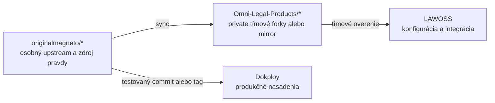

# ADR 0008: Správa MCP repozitárov medzi osobným účtom a Omni Legal Products

- **Dátum:** 2026-08-12
- **Stav:** prijaté MČ, na potvrdenie tímom
- **Rozhodol:** Marián Čuprík (MČ)
- **Súvisí s:** [ADR 0005](0005-struktura-repozitarov.md) · [spec 0004](../specs/0004-mcp-sk-konektory.md) · [LAWOSS](https://github.com/Omni-Legal-Products/lawoss)

## Kontext

MČ prevádzkuje na Dokploy viacero remote MCP serverov pre slovenské, české a európske právne zdroje. Väčšina má zdrojový kód v súkromných repozitároch účtu `originalmagneto`. LAWOSS tím potrebuje tieto servery lokálne skúšať, porovnávať a postupne integrovať do aplikácie bez toho, aby osobný účet prestal byť vlastníkom pôvodných projektov.

Kontrola 2026-08-12 potvrdila pravdepodobné GitHub zdroje pre hlavné nasadenia Slov-Lex, judikatúra, ORSR, RPO, RPVS, RÚZ, CRZ, Finančná správa, Obchodný vestník, register úpadcov, ÚVO, register diskvalifikácií, právne kalkulačky, EUR-Lex a CZ Agents. `HITL-Forms-MCP` a `SOI-MCP` sú vedome mimo rozsahu tohto rozhodnutia.

## Rozhodnutie

Osobné repozitáre pod `originalmagneto` zostávajú zdrojom pravdy a vlastníctva MCP serverov MČ. Organizácia Omni Legal Products dostane súkromné tímové forky. Verejný `cz-agents-mcp`, z ktorého GitHub neumožňuje vytvoriť súkromný fork, dostane súkromný mirror s explicitnou väzbou na osobný upstream.

### Rozsah repozitárov

| Osobný upstream | Organizačný názov | Typ |
|---|---|---|
| `originalmagneto/kalkulacky-sk-MCP` | `mcp-kalkulacky-sk` | private fork |
| `originalmagneto/judikaty-mcp` | `mcp-judikaty-sk` | private fork |
| `originalmagneto/slov-lex-mcp-deploy` | `mcp-slovlex` | private fork |
| `originalmagneto/orsr-mcp` | `mcp-orsr` | private fork |
| `originalmagneto/RPO-MCP` | `mcp-rpo` | private fork |
| `originalmagneto/RPVS-MCP` | `mcp-rpvs` | private fork |
| `originalmagneto/RUZ-MCP` | `mcp-ruz` | private fork |
| `originalmagneto/crz-mcp` | `mcp-crz` | private fork |
| `originalmagneto/FS-MCP` | `mcp-financna-sprava` | private fork |
| `originalmagneto/OV-MCP` | `mcp-obchodny-vestnik` | private fork |
| `originalmagneto/RU-MCP` | `mcp-register-upadcov` | private fork |
| `originalmagneto/UVO-MCP` | `mcp-uvo` | private fork |
| `originalmagneto/DISQ-MCP` | `mcp-diskvalifikacie` | private fork |
| `originalmagneto/MCP-EURLEX-CELEX` | `mcp-eurlex` | private fork |
| `originalmagneto/cz-agents-mcp` | `mcp-cz-agents` | private mirror |

`HITL-Forms-MCP` a `SOI-MCP` sa nespracúvajú.

### Povinné GitHub topics

Každá organizačná kópia dostane minimálne:

- `mcp-server`
- `majo-mcp`
- `lawoss`
- `legaltech`

Podľa jurisdikcie sa pridá `slovakia`, `czechia` alebo `eu-law`. Topic `majo-mcp` označuje pôvodný MCP server MČ aj vtedy, keď tímová kópia žije v Omni Legal Products.

### Pravidlá synchronizácie

1. Funkčná zmena vzniká v osobnom upstream repozitári.
2. Pred pushom a nasadením musí prejsť testami daného repozitára.
3. Dokploy sa nasadzuje iba z identifikovateľného commitu alebo tagu osobného upstreamu.
4. Organizačný fork sa synchronizuje až po overení osobného upstreamu.
5. LAWOSS integruje označený tag alebo commit, nie neidentifikovanú vetvu.
6. Zmena vytvorená tímom v organizačnom forku sa najprv ponúkne späť do osobného upstreamu. Organizačný fork nesmie dlhodobo vytvoriť druhú nezávislú verziu servera.

### Agentické pravidlá

Pred forkovaním dostane každý osobný upstream:

- `AGENTS.md` ako single source of truth,
- obsahovo identický `CLAUDE.md`,
- presné príkazy pre lokálny setup, testy, build a bezpečný deploy,
- zákaz commitovania secrets, klientskych dát, produkčných tokenov a Dokploy konfigurácie s citlivými hodnotami,
- zákaz produkčného deployu, restartu alebo zmeny environmentu bez výslovného pokynu používateľa,
- požiadavku zachovať spätnú kompatibilitu názvov MCP tools a ich vstupných a výstupných schém,
- povinnosť oddeliť technickú validitu od právnej a doménovej správnosti,
- povinnosť synchronizovať `AGENTS.md` a `CLAUDE.md` v tom istom PR.

Repozitárové pravidlá musia zachovať existujúce technické špecifiká jednotlivých serverov. Jednotná šablóna nesmie prepisovať konkrétne build, test alebo deployment príkazy bez ich overenia.

## Predbežná oprava Slov-Lex repozitára

Pred forkovaním sa musí opraviť popis `originalmagneto/slov-lex-mcp-deploy`, ktorý dnes nesprávne uvádza ORSR. Popis musí jasne uvádzať, že ide o MCP server pre Slov-Lex a slovenské právne predpisy. Zároveň sa overí, že obsah repozitára skutočne zodpovedá Dokploy nasadeniu Slov-Lex MCP.

## Zvažované alternatívy

| Alternatíva | Prečo nie |
|---|---|
| Presunúť osobné repozitáre do organizácie | MČ chce zachovať osobné vlastníctvo a osobný účet ako zdroj pravdy. |
| Vyvíjať osobný upstream a organizačný fork nezávisle | Vznikli by dve verzie rovnakého MCP, nejasný Dokploy zdroj a dvojitá údržba. |
| Skopírovať všetky MCP do jedného monorepa | Servery majú samostatný release, deployment, závislosti a bezpečnostný profil. Monorepo by komplikovalo nasadenie a oprávnenia. |
| Vložiť MCP implementácie priamo do LAWOSS | Zvýšilo by to diff voči LegalWork upstreamu a znížilo prenositeľnosť MCP serverov. |
| Verejný fork `cz-agents-mcp` v organizácii | Požiadavkou je súkromná tímová kópia. GitHub nepovoľuje súkromný fork verejného repozitára, preto sa použije mirror. |

## Dôsledky

### Pozitívne

- MČ si zachová osobné vlastníctvo pôvodných MCP projektov.
- Tím dostane spoločný, súkromný priestor na testovanie a integráciu.
- LAWOSS zostane oddelený od implementácie samostatných MCP serverov.
- Dokploy deployment bude možné spätne priradiť ku konkrétnemu zdroju.
- Každý AI agent dostane po otvorení repozitára rovnaké bezpečnostné a pracovné pravidlá.

### Riziká a mitigácia

- **Dvojitá história:** pravidlo upstream-first a pravidelný sync organizačných forkov.
- **Nejasný deployment commit:** nasadzovať iba identifikovateľný commit alebo tag.
- **Rozdielne repo štruktúry:** spoločné jadro agentických pravidiel doplnené overenými lokálnymi príkazmi.
- **Citlivé údaje v histórii:** pred prípadným zverejnením samostatný secret a licenčný audit. V tejto fáze zostávajú organizačné kópie private.
- **Mirror bez GitHub fork väzby:** `mcp-cz-agents` musí v README a remote konfigurácii explicitne uvádzať osobný upstream.

## Implementačná brána

Pred vytvorením organizačnej kópie každého MCP musí byť overené:

1. správny osobný upstream,
2. zhoda s Dokploy zdrojom,
3. absencia viditeľných secrets v aktuálnom strome,
4. existencia a zhoda `AGENTS.md` a `CLAUDE.md`,
5. funkčný lokálny test alebo aspoň zdokumentovaný blokátor,
6. správny názov, popis, licencia a GitHub topics.

Ak niektorá brána neprejde, daný MCP sa do organizácie ešte neforkuje.
