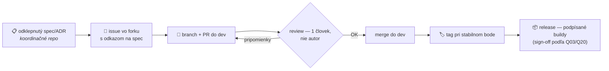

# ADR 0011: Proces zmien a mergovania — kto, čo, kedy a ako

- **Dátum:** 2026-08-17
- **Stav:** **návrh** — na odklep na calle 21. 8. 2026
- **Navrhol:** Marián Čuprík (MČ) · 2026-08-17
- **Súvisí s:** [ADR 0005 — štruktúra repozitárov](0005-struktura-repozitarov.md) · [ADR 0007 — agent-first architektúra](0007-agent-first-architektura.md) · odpovede tímu na Q02, Q05 ([prehľad](../planning/2026-08-17-stanoviska-timu-Q01-Q25.md))

## Kontext

Doterajšie pravidlá hovoria, *že* väčšie zmeny idú cez branch + PR, ale **nehovoria, kto smie PR zlúčiť**. `main` nemá povinný review (vedomé rozhodnutie, aby to nezdržovalo) — a 17. 8. sa ukázalo, že to je diera: šesť PR vrátane **nového specu** a **veľkého prepisu existujúceho specu** bolo zlúčených autorom bez odklepu tímom. Obsahovo zmeny išli v smere odpovedí tímu, ale proces to nechráni: nabudúce nemusia.

Zároveň všetci štyria v Q05 odpovedali, že review minimá majú byť **záväzné aj tam, kde ich GitHub Free technicky nevynúti** — tento ADR ich konkrétne pomenúva. A z Q02 vyplýva model upstream syncu, ktorý treba zapísať.

## Rozhodnutie (návrh)

### 1 · Koordinačné repo `lawOSS-like-SK-CZ` — kto merguje čo

| Typ zmeny | Kto smie zlúčiť | Podmienka |
|---|---|---|
| **Rešerš, podklad, zápis z callu** (`research/`, `meetings/`) | autor sám | po zelenom CI; self-merge OK |
| **Návody a dokumentácia** (`docs/` bez doktríny) | autor sám | po zelenom CI |
| **Drobnosť** (preklep, riadok v backlogu, oprava odkazu) | ktokoľvek priamo do `main` | existujúce pravidlo, bez zmeny |
| **Nový spec alebo zmena specu** (`specs/`) | **iba niekto iný než autor** | odklep aspoň 1 ďalšieho člena v PR (review alebo 👍 komentár); regulované témy → príslušný sign-off |
| **Nový ADR alebo zmena ADR** (`decisions/`) | **iba niekto iný než autor** | odklep aspoň 1 ďalšieho člena; zmena prijatého rozhodnutia → rozprava v Telegrame vopred |
| **`AGENTS.md`, automatizácie, CI, štruktúra repa** | **iba niekto iný než autor** | odklep aspoň 1 ďalšieho člena |
| **Evidencia vlastného stanoviska** (zápis vlastného potvrdenia/odpovede do stavových polí) | autor sám | musí meniť len vlastné stanovisko, nie cudzie |

> [!NOTE]
> **Princíp: rozhodovací obsah nemerguje autor.** Nejde o nedôveru — ide o to, že spec a ADR sú **rozhodnutia tímu**, a rozhodnutie vzniká až odklepom. Merge bez odklepu z neho robí hotovú vec. Naopak rešerše a podklady sú **vstupy** do rozhodovania — tie nech tečú voľne a rýchlo.

### 2 · Fork `lawoss` — ako sa integrujú funkcie

1. **Nič sa nestavia bez odklepnutého specu** — platí doterajšie pravidlo toku. Výnimka: drobné opravy chýb a upstream-kandidáti (typu nápady #28–#31), tie stačí evidovať ako issue.
2. **Každá zmena kódu ide cez PR do `dev`** s odkazom na issue. **Merguje niekto iný než autor** po aspoň jednom ľudskom review. AI review je vítaný doplnok, nenahrádza človeka.
3. **Regulované oblasti** (QES, konverzia, AML, privacy/pamäť) navyše vyžadujú sign-off doménového vlastníka podľa Q20.
4. **Stabilné body sa tagujú**; release podlieha Q03 (product + technická + doménová kontrola). Verejné buildy len podpísané (Q06).

### 3 · Upstream sync (Q02)

- **Maintainer:** *(doplniť na calle — MČ alebo IR)* + AI agent; **reviewer:** ten druhý. VŘ robí review CZ vrstvy.
- Každý náš zásah do prevzatého kódu sa eviduje v **`PATCHES.md`** vo forku — tak, aby sync vedel zopakovať ktokoľvek.
- Sync beží ako **samostatný PR** s regresným testom; IR dodá automat, ktorý pri konflikte sám otvorí PR s prehľadom.
- Čo sa upstreamuje späť do LegalWorku: všeobecné opravy a lokalizácie áno, LAWOSS-specific nadstavba nie — **case-by-case**, rozhoduje maintainer syncu s PO.

### 4 · Kde žije aký kód

| Čo | Kam patrí |
|---|---|
| Kód produktu | fork `lawoss` |
| MCP servery | samostatné repá organizácie (ADR 0008) |
| Skilly, pluginy, agentské nástroje | **samostatné repá organizácie** (napr. `lawoss-skills`), nie koordinačné repo |
| Pomocné skripty koordinačného repa (`.github/`) | koordinačné repo — sú to nástroje *tohto* repa |

> [!WARNING]
> 17. 8. pribudli do koordinačného repa adresáre `.agents/` a `plugins/` (Codex skilly a pluginy z PR #4, #8, #9). Podľa tohto ADR patria do samostatného repa — **navrhuje sa presun do `lawoss-skills`** po odklepe. Obsah sa nezahadzuje, len sťahuje na správne miesto.

### 5 · Kadencia

- **Týždenný sync call** (streda 17:00) je miesto, kde sa odklepávajú nazbierané specy/ADR a rieši sa, čo sa v PR zaseklo.
- Čo potrebuje odklep skôr, pýta si ho **v Telegrame** (topic *General CHAT*) — odklep v PR komentári stačí, netreba čakať na call.
- **Ticho nie je súhlas** (rovnaké pravidlo ako pri Q otázkach). Ak sa nikto nevyjadrí do 3 pracovných dní, autor to eskaluje na PO; PO môže rozhodnúť sám a zapíše to.

## Zvažované alternatívy — a prečo nie

| Alternatíva | Prečo nie |
|---|---|
| **Zapnúť povinný PR review na GitHube** (branch protection s required review) | GitHub Free na privátnych repách obmedzuje; na verejných by blokoval aj rešerše a drobnosti — spomalí presne to, čo má tiecť voľne. Pravidlo držíme ako záväznú normu tímu (Q05: všetci súhlasili so záväznosťou bez technického vynútenia). Ak sa poruší opakovane, prehodnotiť. |
| **Všetko merguje iba PO** | MČ výslovne nechce byť bottleneck; odporuje Q05 odpovedi MČ (všetci štyria majú mať právomoc review/merge). |
| **Nechať status quo** (merguje hocikto hocičo) | práve zlyhalo — spec sa stal „rozhodnutím" bez rozhodnutia. |

## Dôsledky

- Autor specu/ADR musí požiadať o odklep — najneskôr na calle, rýchlejšie cez Telegram.
- Merge specu 0006 a prepisu specu 0005 zo 17. 8. sa **spätne legitimizuje odklepom na calle 21. 8.** (obsahovo idú v smere odpovedí tímu; ak call rozhodne inak, revertnú sa bežným PR).
- `.agents/` a `plugins/` sa po odklepe presunú do samostatného repa.
