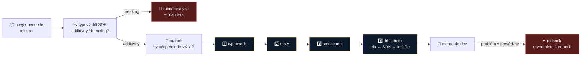

# ADR 0012: Bump `opencodeVersion` presúvame z 🔴 zóny do riadeného procesu s verifikačnou bránou

- **Dátum:** 2026-08-21
- **Stav:** návrh *(na odklep na stredajšom sync calle — MČ · MF · IR · VŘ)*
- **Navrhol:** Marián Čuprík (MČ)
- **Súvisí s:** [ADR 0004](0004-ako-rozsirit-legalwork.md) *(nemení sa — dopĺňa sa)* · **ADR 0011** *(proces zmien a mergovania, [PR #54](https://github.com/Omni-Legal-Products/lawOSS-like-SK-CZ/pull/54) — ešte neodklepnuté)* · [nápad #48](../planning/napady.md) · issue [lawoss#11](https://github.com/Omni-Legal-Products/lawoss/issues/11) · [analýza LegalWork](../research/inspiracie/legalwork.md)

> [!IMPORTANT]
> **Toto ADR nemerguje jeho autor.** Je to rozhodovací obsah, ktorý mení už schválené pravidlo — podľa navrhovaného [ADR 0011](https://github.com/Omni-Legal-Products/lawOSS-like-SK-CZ/pull/54) potrebuje odklep aspoň jedného ďalšieho člena tímu.

> [!NOTE]
> **Toto ADR nenahrádza [ADR 0004](0004-ako-rozsirit-legalwork.md).** Mení jediný riadok v modeli troch zón (`opencodeVersion` v `constants.json`) a zvyšok pravidiel — vrátane pravidla č. 1 *„radšej pridávaj súbory, než upravuj cudzie"* — ponecháva nedotknutý.

---

## Kontext

Plán forku ([`AGENTS.md` vo forku](https://github.com/Omni-Legal-Products/lawoss/blob/dev/AGENTS.md), sekcia *Three change zones*) zaraďuje `opencodeVersion` v `constants.json` do **🔴 červenej zóny** — spolu s `legalwork-legalmemory-knowledge`, `apps/server/src/extensions/` a prepisom histórie. Pravidlo červenej zóny znie: *„Do not change without a new approved ADR in the coordination repository."*

Zaradenie dávalo zmysel v čase, keď sme netušili, **ako tesne** je LegalWork na opencode naviazaný. To sme si medzitým overili.

### Čo sme zistili — overené v kóde 2026-08-21

| Zistenie | Ako overené |
|---|---|
| LegalWork **neforkuje** opencode — je jeho čistý konzument | čítanie kódu upstreamu `eigenweltlabs/legalwork` @ `v0.1.13` |
| Binárka je pinnutá v `constants.json:2` (`opencodeVersion: v1.17.18`) | tamtiež |
| Používa **oficiálne** `@opencode-ai/sdk` `^1.17.18` (lock `1.17.18`) v 5 `package.json` | tamtiež |
| Rozšírenia idú **výhradne cez pluginy mimo jadra** (`apps/server/src/opencode-plugins/legalwork-*.ts`) a **nepoužívajú** `@opencode-ai/plugin` API | tamtiež |
| Diff SDK `1.17.18` → `1.18.20`: **jeden súbor** `dist/v2/gen/types.gen.d.ts`, **7 riadkov, čisto additívne** (rozšírenie `interleaved`, nové voliteľné `subagent_depth`) — žiadne breaking changes | `npm pack @opencode-ai/sdk@1.17.18` a `@1.18.20`, rozbalenie a `diff` |
| Release notes 1.18.x sú prevažne bugfixy; *Desktop v2* sa nás netýka; fix *„ignore unknown top-level config fields"* nám priamo pomáha | changelog opencode |
| Aktuálny opencode release: `v1.18.20` | GitHub releases `sst/opencode`, 2026-08-21 |

**Dôsledok:** bump opencode nie je architektonické rozhodnutie. Je to **rutinná údržba závislosti** — bump pinu, bump SDK, `pnpm install`, prebehnutie testov.

### Prečo je súčasný stav problém

1. **Ceremónia neúmerná riziku.** Nový ADR na sedemriadkový additívny typový diff je proces, ktorý nikto nebude dodržiavať — a nedodržiavané pravidlo je horšie než žiadne.
2. **Blokuje to bezpečnostné a chybové opravy.** Ak vyjde opencode s opravou, ktorá sa nás týka, čakáme na call.
3. **Rastie merge dlh.** Čím dlhšie na pine sedíme, tým väčší bude skok, keď ho konečne urobíme — a tým vyššia šanca, že práve ten skok *bude* breaking.
4. **Blokuje [nápad #48](../planning/napady.md)** *(opencode sync pipeline + verifikačná brána)* a s ním issue [lawoss#11](https://github.com/Omni-Legal-Products/lawoss/issues/11).

**Zároveň platí:** červená zóna nebola zbytočná. Opencode je **behový základ celej appky**. Zlý bump neznamená zle vykreslené tlačidlo — znamená, že advokátovi nenabehne nástroj. Riziko treba **ošetriť**, nie ignorovať.

---

## Rozhodnutie

**`opencodeVersion` v `constants.json` (a s ním verzia `@opencode-ai/sdk`) sa presúva z 🔴 červenej do riadenej zóny: meniť sa smie, ale výhradne cez branch + PR, ktorý prejde verifikačnou bránou. Červená zóna zostáva v platnosti pre všetky ostatné položky.**

### Verifikačná brána — všetky štyri kroky, v tomto poradí

| # | Krok | Čo musí platiť |
|---|---|---|
| 1 | **Typecheck** | prejde bez chýb |
| 2 | **Testy** | existujúca sada vo forku prejde |
| 3 | **Smoke test** | appka **nabehne s novou binárkou** · vznikne session · **načítajú sa pluginy** · **pripojí sa MCP** |
| 4 | **Drift check** | pin v `constants.json`, verzie SDK vo všetkých `package.json` a `pnpm-lock.yaml` **sedia navzájom** |

**Bez kroku 3 to nie je verifikačná brána.** Typecheck ani unit testy nezachytia, že sa binárka nespustí alebo že sa MCP nepripojí — a práve to je scenár, ktorý advokáta zastaví.

### Ďalšie záväzné podmienky

- **Rollback plán je súčasťou každého takého PR.** Vrátenie pinu musí byť jeden revertovateľný commit. PR, ktorý bump mieša s inou zmenou, sa nesmie zlúčiť.
- **Nikdy naživo.** Žiadny bump priamo do `dev`, žiadny bump „pri príležitosti" iného PR.
- **Breaking diff → späť do červeného režimu.** Ak typový diff nie je čisto additívny, alebo ak sa zmení plugin API (`@opencode-ai/plugin`), bump sa **nerobí bez rozpravy tímu**. Toto ADR povoľuje rutinu, nie skok cez majora.
- **Major verzia opencode** *(1.x → 2.x)* zostáva v 🔴 zóne a vyžaduje nové ADR.
- **Záznam.** PR uvádza starú a novú verziu, výsledok typového diffu a výstupy všetkých štyroch krokov brány. `PATCHES.md` sa nedopĺňa — `constants.json` je upstream súbor, ale pin je konfigurácia, nie downstream patch; drift check je jeho evidencia.

### Čo v 🔴 zóne zostáva nezmenené

`legalwork-legalmemory-knowledge` *(AGPL-3.0 + CLA, licenčný dopad nevyhodnotený — viď [ADR 0004](0004-ako-rozsirit-legalwork.md))* · `apps/server/src/extensions/` *(ich hard-coded extension registry — spec 0011 v [PR #55](https://github.com/Omni-Legal-Products/lawOSS-like-SK-CZ/pull/55) ho nepoužíva vôbec)* · prepis histórie · **major verzia opencode**.

---

## Zvažované alternatívy

| Alternatíva | Prečo nie |
|---|---|
| **Nechať červenú zónu absolútnu** *(status quo)* | Formálne najbezpečnejšie, reálne najhoršie. Rutinnú údržbu zamkne za ceremóniu, ktorú nikto nebude dodržiavať — pin zamrzne, merge dlh narastie a bezpečnostné opravy nedôjdu. Riziko sa nezníži, len sa odloží a znásobí. |
| **Jedno ADR na každý bump** *(doslovné plnenie súčasného pravidla)* | Odblokovalo by [lawoss#11](https://github.com/Omni-Legal-Products/lawoss/issues/11) hneď, ale za dva mesiace sme na tom istom mieste. Opencode vydáva releasy v týždňovom rytme; ADR na sedemriadkový additívny diff je administratíva bez informačnej hodnoty. **ADR má zachytávať rozhodnutia, nie údržbu.** |
| **Presunúť bump do 🟢 zelenej zóny** *(bežná zmena bez brány)* | Opencode je behový základ celej appky. Bez smoke testu sa dá zlomiť spustenie nástroja spôsobom, ktorý typecheck ani unit testy nezachytia. Sloboda bez brány prenáša riziko priamo na advokáta v praxi. |
| **Automatický bot** *(Dependabot / Renovate, auto-merge pri zelenom CI)* | Sedelo by na princíp *„hranica vynútená v nástroji, nie v prompte"* ([#36](../planning/napady.md)) a je to **správny cieľ**, keď brána bude v CI kompletná — vrátane smoke testu. Dnes ju kompletnú nemáme, takže auto-merge by len presunul rozhodovanie na nástroj, ktorý ho ešte nevie spraviť zodpovedne. **Odložené, nie zamietnuté** — je to cieľový stav [nápadu #48](../planning/napady.md), proces A. |
| **Odpojiť sa od pinu úplne** *(sledovať opencode `latest`)* | Znamená rozísť sa s upstreamom LegalWork v tom, čo appka reálne spúšťa, a testovať proti niečomu inému než oni. Maximálny merge dlh za minimálny prínos. |

---

## Dôsledky

**Pozitívne:**

- Issue [lawoss#11](https://github.com/Omni-Legal-Products/lawoss/issues/11) *(bump `v1.17.18` → `v1.18.20`)* sa po odklepnutí tohto ADR odblokuje a stane sa **prvou aplikáciou brány** — máme na nej overiť, či proces sedí.
- [Nápad #48](../planning/napady.md), proces A *(opencode watch)*, dostáva cieľ, do ktorého má ústiť: typový diff nie je samoúčelný report, ale **vstup do brány**, ktorý rozhoduje medzi *zelenou* a *ručnou analýzou*.
- Bezpečnostné a chybové opravy opencode sa dajú prevziať v dňoch, nie v týždňoch.
- Pin zostáva blízko upstreamu → menší merge dlh pri každom sync s LegalWorkom.

**Negatívne a na doriešenie:**

- **Smoke test dnes neexistuje ako automat.** Kým nebude v CI, musí ho pri každom bumpe odbehnúť človek a výsledok napísať do PR. **Otvorená úloha:** zautomatizovať ho — dovtedy je brána len čiastočne strojová.
- **Drift check tiež ešte nie je v CI.** Do jeho nasadenia ho kontroluje recenzent PR.
- **Kto smoke test odbehne.** Pri každom bumpe potrebujeme človeka, ktorý appku reálne spustí. Nadväzuje na otvorenú otázku z [ADR 0004](0004-ako-rozsirit-legalwork.md) *(kto v tíme rieši TypeScript a build)*.
- **Hranica „additívny vs. breaking" je posudok.** Typový diff je strojový, ale rozhodnutie, či zmena správania *v runtime* je breaking, strojové nie je. Pri pochybnosti platí prísnejší výklad — rozprava.

**Následné kroky po odklepnutí** *(nerobiť pred schválením)*:

1. **PR vo forku:** upraviť riadok 🔴 zóny v [`AGENTS.md`](https://github.com/Omni-Legal-Products/lawoss/blob/dev/AGENTS.md) — vyňať `opencodeVersion` a doplniť odkaz na toto ADR + popis brány.
2. **Odblokovať a spraviť [lawoss#11](https://github.com/Omni-Legal-Products/lawoss/issues/11)** cez `sync/opencode-v1.18.20`.
3. **Zaškrtnúť** položku v [`planning/roadmap.md`](../planning/roadmap.md).
4. **Rozpísať [nápad #48](../planning/napady.md)** do specu — brána a drift check patria do CI.
