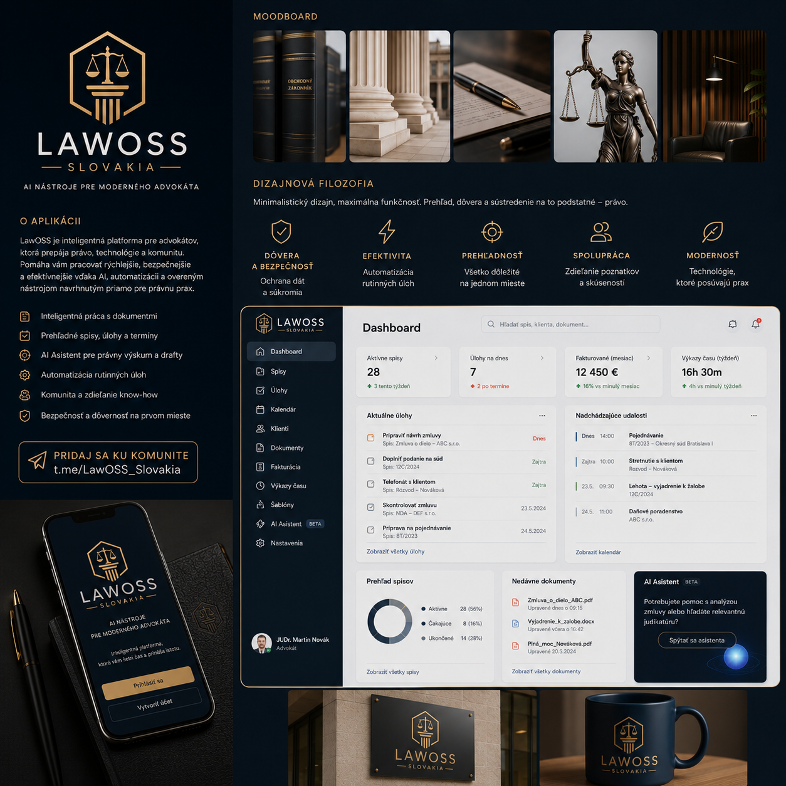

# Vizuálny koncept — LAWOSS

> [!NOTE]
> Vizuálny koncept a smerovanie značky. Logo je **aktuálne** (2026-07-29); rozhranie je **koncept, nie finálny dizajn**. Záväzné rozhodnutia o brandingu patria do [ADR](../decisions/).

## Značka

- **Názov:** **LAWOSS** — *Czechia · Slovakia*
- **Claim v logu:** `AI · KOMUNITA · KNOW-HOW`
- **Tagline:** *AI nástroje pre moderného advokáta*
- **Podtitul:** *Poriadok v spise. Overené právo. AI pod kontrolou.*
- **Logo:** okrúhly odznak so zlatým lemom na tmavo-námorníckom podklade. V strede **hexagonálny štít** obopínajúci **váhy spravodlivosti** a **antický stĺp** (symbol práva a stability). Pod wordmarkom **štítky s českou a slovenskou vlajkou** — dvojjurisdikčný záber.
- **Wordmark:** `LAW` biely + `OSS` zlatý — zdôrazňuje open-source podstatu.
- **Positioning:** open-source nástroj a komunita advokátov v ČR a SR; *dáta zostávajú u advokáta*.

> [!TIP]
> Rozdelenie `LAW` (biele) / `OSS` (zlaté) je nosný prvok značky — používaj ho konzistentne aj v textových logách a prezentáciách.

## Rozhranie — koncept

<!-- Nahrajte mockup do assets/brand/mockup.png -->

**Moduly v koncepte:** Prehľad · Spisy · Rešerš · Transkripcia · Dokumenty · Úlohy · Kalendár · Klienti · **Prompty** · **Konektory** · AI Asistent *(BETA)* · Nastavenia

Dva prvky, ktoré priamo napĺňajú specy:
- **`Lokálny · Cloud · Auto`** prepínač pri AI asistentovi → [hybrid routing](../specs/0003-prompt-layer.md#-hybrid-routing--rozdelenie-podľa-vrstvy)
- **OKF status „Validovaná štruktúra 92 %"** so zoznamom riadiacich súborov (`spis.md`, `_STATUS.md`, `AGENTS.md`, `MEMORY.md`) → [spec 0002](../specs/0002-okf-operacny-system-praxe.md)

## Moodboard

> [!NOTE]
> Moodboard je **starší variant** — nesie wordmark „LAWOSS SLOVAKIA" (bez *Czechia*) a odkaz `t.me/LawOSS_Slovakia`. Aktuálny je logo odznak s **CZECHIA · SLOVAKIA**. Moodboard drží paletu a atmosféru, nie presné znenie značky.

## Farebná paleta

| Farba | Použitie | Hex (orientačne) |
|---|---|---|
| Tmavá námornícka (navy) | Primárne pozadie, header | `#0D1B2A` |
| Zlatá | Akcent, logo, CTA | `#C9A24A` |
| Antracit / sivá | Sekundárne plochy | `#3A4553` |
| Svetlosivá | Karty, oddeľovače | `#D9DCE1` |
| Biela | Obsahové plochy, text | `#FFFFFF` |

## Typografia

- **Inter** — UI, telo textu (moderný, čitateľný sans-serif)
- **Playfair Display** — nadpisy, akcenty (dôveryhodnosť, „spojenie moderny a tradície")

## Dizajnová filozofia

Právna práca si zaslúži nástroje, ktoré šetria čas, znižujú chaos a prinášajú istotu. Päť pilierov:

| Pilier | Význam |
|---|---|
| 🛡️ **Dôvera a bezpečnosť** | Ochrana dát na najvyššej úrovni |
| ⚡ **Efektivita** | Automatizácia rutinných úloh |
| 🎯 **Prehľadnosť** | Všetko dôležité na jednom mieste |
| 👥 **Spolupráca** | Tímová práca a zdieľanie |
| 🌿 **Modernosť** | Technológie, ktoré posúvajú prax |

**Vizuálny jazyk:** minimalistický · profesionálny · zrozumiteľný · nadčasový

## Náčrt produktu (dashboard)

Koncept hlavného rozhrania — ľavý navigačný panel + prehľadový dashboard:

```mermaid
flowchart LR
    subgraph nav["Navigácia"]
        D["Dashboard"]
        S["Spisy"]
        U["Úlohy"]
        K["Kalendár"]
        KL["Klienti"]
        DOK["Dokumenty"]
        F["Fakturácia"]
        V["Výkazy času"]
        SAB["Šablóny"]
        AI["AI Asistent ᴮᴱᵀᴬ"]
    end
    subgraph dash["Dashboard – prehľad"]
        M1["Aktívne spisy"]
        M2["Úlohy na dnes"]
        M3["Fakturované / mesiac"]
        M4["Výkazy času / týždeň"]
        T["Aktuálne úlohy"]
        E["Nadchádzajúce udalosti"]
        R["Nedávne dokumenty"]
    end
    nav --> dash
```

**Kľúčové moduly:** Spisy · Úlohy · Kalendár · Klienti · Dokumenty · Fakturácia · Výkazy času · Šablóny · **AI Asistent** (analýza zmlúv, vyhľadanie relevantnej judikatúry).

> [!TIP]
> Moduly ako *Spisy*, *Klienti*, *AI Asistent* a *Šablóny* sú prirodzené miesta na napojenie slovenských MCP serverov (Slov-Lex, ORSR, RPVS, judikatúra) — pozri [backlog](../planning/backlog.md).
