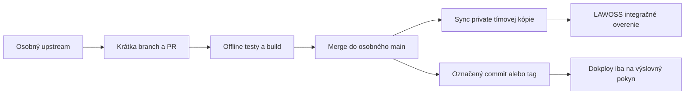

# Workflow osobných a tímových MCP repozitárov

## Jedna veta

Funkčná zmena vzniká a overuje sa v osobnom upstream repozitári MČ, potom sa synchronizuje do private kópie Omni Legal Products a až identifikovaný commit alebo tag môže byť kandidátom pre Dokploy alebo LAWOSS.

## Bežná zmena



1. Agent otvorí osobný upstream `originalmagneto/*`.
2. Prečíta root `AGENTS.md`, ktorý je obsahovo identický s `CLAUDE.md`.
3. Vytvorí krátku branch a malý Pull Request.
4. Spustí presné offline príkazy uvedené v pravidlách repozitára.
5. Po merge sa organizačný fork synchronizuje z osobného upstreamu.
6. LAWOSS odkazuje na identifikovaný commit alebo tag, nie na neznámy pohyblivý stav.
7. Dokploy sa mení iba po samostatnom výslovnom pokyne.

## Zmena vytvorená tímom

Ak zmena vznikne v `Omni-Legal-Products/*`, nesmie tam zostať ako samostatná dlhodobá verzia. Funkčný commit sa ponúkne cez PR do osobného upstreamu. Po jeho mergnutí sa organizačná kópia zosynchronizuje späť z upstreamu.

## Synchronizácia GitHub fork-u

- Pred synchronizáciou skontrolovať, že osobný upstream prešiel testami.
- Preferovať štandardný GitHub sync alebo čistý fast-forward.
- Nepoužívať force push.
- Pri divergencii zastaviť a preniesť funkčnú zmenu do osobného upstreamu cez PR.
- Nesynchronizovať produkčný branch automaticky bez vlastníka procesu a auditu zlyhaní.

## Synchronizácia CZ mirror-u

`Omni-Legal-Products/mcp-cz-agents` nie je GitHub fork, pretože požadovaná tímová kópia je private a osobný upstream je public. V pracovnom clone používať explicitné remotes:

```bash
git remote add upstream https://github.com/originalmagneto/cz-agents-mcp.git
git fetch upstream --prune --tags
git push origin refs/remotes/upstream/main:refs/heads/main
git push origin --tags
```

Pred pushom vždy overiť výstup `git remote -v`. `origin` musí byť organizačný mirror a `upstream` osobný repo. Nepoužívať `push --mirror` na existujúci neprázdny repo, pretože by mohol odstrániť organizačné refs.

## Čo môže agent urobiť bez ďalšieho potvrdenia

- čítať kód, históriu, GitHub metadata a read-only Dokploy stav,
- vytvoriť lokálnu branch a upraviť súbory v schválenom rozsahu,
- spustiť offline typecheck, testy a build,
- pripraviť PR.

## Čo vyžaduje výslovný pokyn

- merge PR, ak nebol súčasťou už schváleného rollout-u,
- deploy, redeploy, restart alebo stop Dokploy služby,
- zmenu produkčných env premenných, secrets, domén, volumes alebo databáz,
- breaking zmenu MCP tool name alebo schémy,
- force push alebo prepis histórie,
- zmenu visibility, odstránenie repozitára alebo bezpečnostných pravidiel.

## Kontrola pred sync alebo deploy kandidátom

- [ ] osobný upstream je jednoznačný,
- [ ] `AGENTS.md` a `CLAUDE.md` sú identické,
- [ ] offline minimum prešlo,
- [ ] nie je prítomný nový secret alebo klientske dáta,
- [ ] MCP tool kontrakty sú kompatibilné,
- [ ] commit alebo tag je zapísaný,
- [ ] právna a doménová správnosť sa neposudzuje iba podľa technických testov,
- [ ] produkčný zásah má samostatné výslovné potvrdenie.
