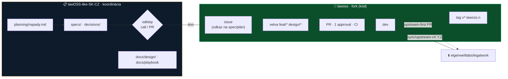

# Playbook spolupráce — ľudia a AI agenti nad dvoma repami

- **Zostavil:** Marián Čuprík (MČ) s AI asistenciou · 2026-08-23
- **Stav:** 📝 návrh na odklep · po odklepe sa **odkáže** z `AGENTS.md` oboch rep (neduplikuje sa do nich)
- **Pre koho:** MČ · MF · IR · VŘ a **každý AI agent**, ktorý sa napojí na ktorékoľvek repo
- **Čo nie je:** náhrada `AGENTS.md`. Tie ostávajú *single source of truth* per repo. Tento dokument je **mapa medzi nimi** + rozdelenie práce + protokol pre agentov. Ak je v rozpore s `AGENTS.md`, platí `AGENTS.md` a tento súbor sa opraví.

> [!IMPORTANT]
> **Ak si AI agent a čítaš toto ako prvé:** prečítaj §2 (protokol prvých 5 minút), potom `AGENTS.md` repa, v ktorom stojíš. Bez toho nerob nič.

---

## 1 · Mapa: dve repá, štyria ľudia, jeden smer



| | Koordinačné repo | Fork `lawoss` |
|---|---|---|
| Čo tam je | rozhodnutia, specy, výskum, **dizajn** (`docs/design/`), zápisy | kód, implementačné issues/PR, buildy |
| Kto merguje | **autor svojho PR** ([ADR 0011 návrh](../decisions/) — čaká na IR) · *merge ≠ odklep, ticho ≠ súhlas* | autor **po 1 approvale a zelenom CI** (branch protection na `dev`: `reviews: 1`, overené GitHub API 2026-08-23) |
| Kto koordinuje | MČ (product owner, Q01) — rozsekáva pat, **nie je bottleneck** | MČ = **integrátor**: upstream sync, release, design system; review robí ktokoľvek zo štyroch |
| Jazyk | slovenčina (CZ obsah česky) | commit správy slovensky, kód/komentáre anglicky (upstream konvencia) |
| Detail pravidiel | [`AGENTS.md`](../AGENTS.md) | [`AGENTS.md` forku](https://github.com/Omni-Legal-Products/lawoss/blob/dev/AGENTS.md) |

---

## 2 · Protokol pre AI agenta — prvých 5 minút

Platí pre Claude Code, opencode, Codex, ľubovoľný harness. Agent je **koncipient** (ADR 0007): pripravuje, navrhuje, nepodpisuje, nekoná navonok.

```
1. pwd → v ktorom repe som?  (koordinácia = markdown · fork = kód)
2. cat AGENTS.md               ← celý, pred prvou zmenou
3. git status && git branch --show-current && git fetch --all -q
   - na main/dev?  → NIKDY nepracuj priamo; vytvor vetvu podľa §4
   - cudzia vetva? → pracuj len ak ťa na ňu poslali
4. Nájdi ZDROJ ÚLOHY: issue (fork) / spec, ADR, plán (koordinácia). Bez zdroja = napíš „chýba issue/spec“, nevymýšľaj.
5. Zisti ZÓNU každého súboru, ktorý ideš meniť (fork: 🟢/🟡/🔴 — §3). 🔴 = stop. 🟡 = PATCHES.md v tom istom PR.
6. Ohlásenie: väčšia zmena → riadok do Telegramu (General CHAT) cez človeka, alebo aspoň do popisu PR „pracujem na X“.
```

Počas práce:

- **Nič „z hlavy"** — fakty over (kód, git log, GitHub API, MCP) a označ *overené cez … dátum* vs. *neoverené*.
- **Malé commity, slovensky**, `typ: čo` (`feat:` `fix:` `design:` `loc:` `docs:` `chore:` `sync:`).
- **Jeden súbor = jeden autor naraz.** Ak vidíš otvorený PR na ten istý súbor, nepokračuj — nahlás.
- **Každý nový UI string** → `sk.ts` **aj** `cs.ts` (CZ právne názvoslovie nepreklad SK a naopak; nevieš → `TODO-VŘ`).
- **Fiktívne dáta** v mockupoch/fixtúrach; žiadne klientske dáta, tajomstvá, kľúče.
- **Nikdy:** `--force`, prepis histórie, editácia AUTO sekcií README, `specs/prehlad.html`, cudzí ADR, cudzie autorstvo.

Pred ukončením (agent aj človek):

- [ ] `git pull --no-rebase` (koordinácia: bot commituje do `main`) · fork: `git fetch origin upstream`
- [ ] typecheck/test spustené a **výsledok uvedený v PR** (presné príkazy + výstup, aj keď fail)
- [ ] UI zmena → screenshot dark **aj** light (a Windows, ak ide o shell)
- [ ] 🟡 zásah → riadok v `PATCHES.md`
- [ ] PR odkazuje na issue/spec/plán; sekcia *Na prerokovanie* vyplnená
- [ ] Odovzdanie: krátke zhrnutie *čo je hotové · čo nie · čo treba rozhodnúť*

---

## 3 · Kam čo patrí — mapa priečinkov s vlastníkom

### 3.1 Koordinačné repo

| Priečinok | Čo | Vlastník / gestor | Agent smie |
|---|---|---|---|
| `decisions/` | ADR | autor ADR; nikdy nemeniť cudzí — nový nahrádzajúci | navrhnúť nový ADR v PR |
| `specs/` + `navrhy.md` | specy + evidencia autorstva | autor specu | doplniť spec v PR, **nikdy** meniť `Navrhol:` |
| `planning/` | roadmap, backlog, nápady, podklady na cally | MČ | pridať riadok do `napady.md`, checkboxy |
| `research/` | rešerše s dátumom a metódou | ktokoľvek | áno |
| `meetings/` | zápisy | kto viedol call | zápis len z podkladu (nahrávka/poznámky) |
| **`docs/design/`** | audit, dizajnový jazyk, IA, plán, `hifi/` prototypy, `baseline/` screenshoty | **MČ (dizajn lead)**; CZ copy VŘ | áno, v `design/*` vetve |
| `docs/` ostatné | vízia, princípy, návody, **tento playbook** | MČ | áno |
| `assets/brand/`, `assets/diagrams/` | logo, mockupy, diagramy | MČ | mockupy **nikdy** s reálnymi dátami |
| `plugins/`, `.agents/` | skills (validované CI) | autor skillu; metodika IR | áno, `validate-skills` musí prejsť |
| `.github/` | automatizácie | MČ | len po dohode |

### 3.2 Fork `lawoss` — zóny + vlastníci

| Zóna | Cesty | Pravidlo | Gestor |
|---|---|---|---|
| 🟢 | `lawoss/**` *(vznikne redesignom)*: `theme/` `shell/` `ui/` `domains/` `hub/` `okf/` `onboarding/` · `i18n/locales/sk.ts` `cs.ts` · `docs/` | voľná ruka, nové súbory | `theme/ ui/ shell/` **MČ** · `okf/` MČ · `domains/lehoty` **MF** (spec 0005) · `hub/` MČ + IR (MCP) · `cs.ts` + CZ doména **VŘ** · `sk.ts` MČ |
| 🟡 | `index.css`, `theme.ts`, `app-root.tsx`, `session-page.tsx`, `types.ts`, `i18n/index.ts`, `command-palette.tsx`, `word-pane.css`, branding | value-only / 1–3 riadky; **riadok v `PATCHES.md` v tom istom PR**; cieľ ≤ 10 riadkov | MČ (integrátor) reviewuje každý 🟡 |
| 🔴 | `legalwork-legalmemory-knowledge`, `apps/server/src/extensions/`, `opencodeVersion` (→ ADR 0012 v PR #56), história | nikdy bez ADR | — |
| upstream | všetko ostatné | nemeň; ak treba → **upstream PR** (label `upstream-pr`) | MČ |

### 3.3 Regulované témy — kto dáva sign-off (z odpovedí Q20/Q03, gestorstvo podľa ADR 0011 §4)

| Téma | SK | CZ | Tech/security |
|---|---|---|---|
| lehoty (katalóg = **funkčný kód**, nie docs — VŘ) | IR | VŘ | MF |
| AML / registre / menovci | IR + MČ | VŘ | MČ |
| podpisovanie, konverzia | IR | VŘ | MČ |
| súkromie, pamäť L1/L2/L3 | MF + IR | — | MF |
| release, upstream sync | — | — | MČ (+ IR review syncu) |

---

## 4 · Vetvy, issues, PR, labely

### 4.1 Vetvy

| Prefix | Kde | Na čo |
|---|---|---|
| `spec/*` `adr/*` `docs/*` `research/*` | koordinácia | obsah |
| `design/*` | **obe** | koordinácia: dizajn dokumenty a prototypy · fork: fázy A, B, D (tokeny, shell, motion) |
| `feat/*` | fork | fáza C obrazovky, funkcie (odkaz na spec) |
| `fix/*` `loc/*` `chore/*` | fork | opravy, lokalizácia, údržba |
| `sync/upstream-vX.Y.Z` | fork | iba MČ (+ IR review) |

Vetvy žijú **dni, nie týždne**. Jedna vetva = jedna úloha = jeden PR. Pre paralelné AI sessions: **jedna worktree na jednu úlohu** (`git worktree add ../lawoss-<uloha> <vetva>`), aby si agenti nešliapali po jednom priečinku.

### 4.2 Issues vo forku

Vznikajú **až po odklepe** (spec/ADR/plán v koordinačnom repe). Povinné v popise: odkaz na spec/ADR/plán · zóna (🟢/🟡) · definícia hotovo · kto je gestor. Šablóny forku (`feature.yml`, `bug.yml`) sú upstreamové (EN) — **nemeníme** (🟡 by zbytočne stálo riadok); pridáme labely.

**Navrhované labely vo forku** (doplniť k existujúcim `P1 · dnes`, `P2 · víkend`, `P3 · paralelne`, `upstream-pr`):

| Label | Farba | Význam |
|---|---|---|
| `fáza A · tokeny` / `fáza B · shell` / `fáza C · obrazovky` / `fáza D · motion` | `#C9A24A` | fáza redesignu |
| `zóna 🟡` | `#e4c979` | PR sa dotýka upstream súboru → reviewer kontroluje `PATCHES.md` |
| `SK` / `CZ` | `#0d1b2a` / `#0d1b2a` | jurisdikčná vrstva → review IR / VŘ |
| `windows` | `#0075ca` | vyžaduje test na Windows (IR) |
| `design-review` | `#C9A24A` | potrebuje vizuálny review MČ (screenshot dark+light) |
| `blokované · rozhodnutie` | `#d73a4a` | čaká na odklep v koordinačnom repe |

### 4.3 PR vo forku — minimum nad upstream šablónou

Upstream `pull_request_template.md` (Summary/Why/Issue/Scope/Testing/CI/Evidence/Risk/Rollback) **ponechávame**. Do *Summary* vždy: odkaz na spec/plán + zóna. Do *Evidence*: screenshot dark + light. Do *Risk*: riadok `PATCHES.md: +N` alebo `0`.

Review checklist (reviewer, 5 minút):

- [ ] odkaz na odklepnutý spec/ADR/plán existuje
- [ ] žiadny 🔴 súbor; každý 🟡 má riadok v `PATCHES.md`
- [ ] nové stringy v `sk.ts` aj `cs.ts`
- [ ] žiadne hexy — iba `--lw-*` tokeny / Tailwind utility z theme
- [ ] každý AI výstup v UI má AI badge; každé „Overené" má provenance; každá akcia s právnym účinkom ide cez DecisionGate (ADR 0007/0009)
- [ ] testy/typecheck uvedené s výsledkom; UI → screenshot dark+light
- [ ] Windows: ak shell/onboarding → label `windows`, IR odklepne

### 4.4 Kto merguje a kedy

| Situácia | Pravidlo |
|---|---|
| Koordinácia, bežný obsah | autor po CI (ADR 0011 návrh) · väčšie → ohlásiť v Telegrame vopred |
| Koordinácia, **mení prijaté rozhodnutie** | vždy PR + rozprava; merge nie je odklep |
| Fork, 🟢 iba | autor po **1 approvale** od kohokoľvek zo štyroch + zelené CI |
| Fork, obsahuje 🟡 | approval **od MČ** (integrátor drží `PATCHES.md`) |
| Fork, regulovaná téma | + sign-off podľa §3.3 v komentári PR |
| Fork, `sync/*` | MČ merguje po review IR |
| Konflikt v PR | rieši **autor** s gestorom zasiahnutého priečinka; markdown: zachovať obe strany |
| Ticho > 3 pracovné dni | autor pripomenie v Telegrame; pat rozsekne MČ a zapíše prečo |

> [!NOTE]
> MČ chce byť koordinátor, nie jediný, kto merguje (Q01/Q05 postoj 3). Preto: **review a merge môže každý**, MČ je povinný len pri 🟡 a sync. Ak tím na calle rozhodne inak (napr. IR k ADR 0011), upraví sa táto tabuľka, nie `AGENTS.md`.

---

## 5 · Rytmus

| Kedy | Čo |
|---|---|
| denne | Telegram *GitHub · App* (293) hlási PR/issues/CI fail z forku; *GitHub · Ops* (2) z koordinácie |
| pondelok 9:00 | auto týždenný prehľad (čakajúce PR, bez review, zlúčené) |
| streda 17:00 | sync call: odklepy, gestorstvo, demo obrazoviek (prototyp alebo build) |
| po calle | MČ (alebo jeho agent) založí issues vo forku k odklepnutým položkám s odkazmi späť |
| upstream release | MČ otvorí `sync/upstream-vX.Y.Z`, IR review, `PATCHES.md` ako checklist |

---

## 6 · Dizajnová práca špecificky

1. **Zdroj pravdy vizuálu** = [`docs/design/2026-08-23-dizajnovy-jazyk-lawoss.md`](design/2026-08-23-dizajnovy-jazyk-lawoss.md) + [`hifi/lawoss-hifi.html`](design/hifi/lawoss-hifi.html). Zmena tokenu = PR do koordinačného repa **najprv** (prototyp), potom `lawoss/theme/lawoss-tokens.css` vo forku.
2. Nová obrazovka: **wireframe/hi-fi v prototype → odklep na calle → issue vo forku → implementácia**. Nie naopak.
3. Každý PR s UI má `design-review` label; MČ alebo ktokoľvek s prototypom vedľa porovná. Kritériá: §5 dizajnového jazyka (zlatá = rozhodnutie, mono = identifikátor, serif ≥ 18 px, AA kontrast, reduced-motion).
4. Mockupy a fixtúry: **iba fiktívne** mená, značky, sumy (napr. `ABC s.r.o. v. DEF a.s.`, `15C/123/2024`).
5. Windows je rovnocenný: shell/onboarding PR bez Windows screenshotu sa nemerguje (IR).

---

## 7 · Keď sa niečo pokazí

| Problém | Postup |
|---|---|
| push odmietnutý (koordinácia) | `git pull --no-rebase` → push. Nikdy `--force`. |
| 🟡 zásah bez riadku v `PATCHES.md` | reviewer vráti PR; nie je to dráma |
| zlúčený nezmysel | upozorniť autora → **revert bežným PR** |
| agent siahol na 🔴 | PR zavrieť, zapísať do `napady.md`, ak je nápad dobrý → ADR |
| dvaja na jednom súbore | ten, kto začal neskôr, rebase na prvého; markdown zachovať obe strany |
| upstream sync konflikt v 🟡 | vlastník zásahu z `PATCHES.md`; ak je zásah drahý → zrušiť a riešiť novým súborom / upstream PR |

---

<sub>Návrh MČ s AI asistenciou 2026-08-23. Fakty: branch protection forku overená GitHub API 2026-08-23 (1 review, bez required checks); labely oboch rep overené `gh label list` 2026-08-23; ADR 0011 je návrh v PR #54 (čaká IR). Po odklepe pridať odkaz na tento súbor do `AGENTS.md` oboch rep (1 riadok, nie kópia).</sub>
