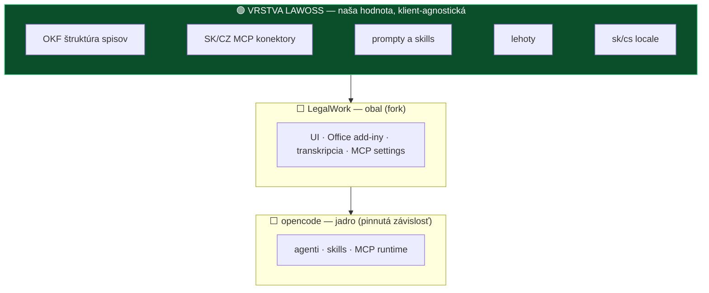

# 🧭 Strategické zamyslenie — zvládneme to, udrží sa to a ako to predáme

**Úprimná odpoveď na tri kľúčové otázky + rola IR + základ pre marketing a komunikáciu**

> [!IMPORTANT]
> Tento dokument má dve tváre a vedome ich drží oddelene: **kapitoly 1–5 sú úprimné interné hodnotenie** (vrátane adverzariálnej oponentúry, ktorá projekt tvrdo napadla) a **kapitoly 6–7 sú základ pre externú komunikáciu**. Dokument, ktorý by bol zároveň pressure-test aj pitch v tých istých odsekoch, by nebol ani jedno.

## TL;DR — tri otázky, tri odpovede

| Otázka | Odpoveď jednou vetou |
|---|---|
| **Zvládneme to?** | **Áno — ale iba ako obsahový projekt, nie softvérovú firmu.** V1 je z ~90 % obsah (šablóny, prompty, konektory, locale), a ten s AI asistenciou popri praxi zvládneme. Čo nezvládneme, je rola dodávateľa softvéru — preto ju nesmieme na seba prevziať. |
| **Je to udržateľné?** | **Podmienečne.** Fork ako pracovný nástroj áno; **verejná distribúcia podpísaných binárok a modul lehôt sú dve miesta, kde sa hobby projekt preklápa do zodpovednosti dodávateľa** — obe treba pustiť von až po splnení podmienok (kap. 3). Povinný je písomný exit plán z upstreamu. |
| **Sú nápady realizovateľné?** | **Prevažná väčšina áno, a lacnejšie, než sme mysleli** — 21 z 26 nápadov padne do zelenej zóny (konfigurácia a nové súbory, žiadny zásah do jadra). Naša hodnota je **klient-agnostická vrstva**, ktorá prežije aj smrť LegalWorku. |

---

## 1️⃣ Čo v skutočnosti staviame — vrstva, nie binárka

Kľúčové uvedomenie celého zamyslenia: **naša hodnota nie je fork. Je to vrstva nad ním.**

Dôsledky tohto pohľadu:

1. **Vrstva LAWOSS funguje aj bez forku** — OKF šablóny, MCP konfigy, prompty a skills sa dajú nainštalovať do vanilla LegalWorku (cez jeho Settings UI), do čistého opencode aj do Claude Code. Fork je **obal a distribúcia**, nie podstata.
2. **Vrstva prežije smrť ktorejkoľvek nižšej vrstvy.** Ak LegalWork zomrie alebo pivotne (7-týždňový projekt, 2 ľudia — reálny scenár), doména sa za víkend presunie inam. Ak by sme hodnotu zapiekli do jadra, zomrie s ním.
3. **Toto je zároveň odpoveď na najtvrdší útok oponentúry** *(„forkujete z ega, nie z potreby")*: fork si ponechávame ako obal pre netechnického advokáta a vlastnú značku, ale **úspech projektu nesmie stáť na binárke** — stojí na vrstve a na vzdelávaní.

---

## 2️⃣ Oponentúra — rada 6 person a verdikt (2026-08-10)

Projekt prešiel adverzariálnou oponentúrou (`/roast`, režim TECH): šesť nezávislých person s mandátom netlmiť údery. Toto sú ich hlasy — vedome necenzurované, lebo hodnota je v trení:

| Persona | Skóre | Stanovisko jednou vetou |
|---|---|---|
| 🔮 **Vizionár (10×)** | **9/10** | Nie appka — šanca stať sa *de facto* štandardom digitálnej praxe pre ~19 000 advokátov v dvoch krajinách, ktoré Harvey ani Legora neobslúžia. Modul lehôt sám zaplatí adopciu; kto vlastní formát spisu, vlastní trh. |
| 🧠 **First-principles** | 4/10 | Celá V1 je obsah, nie kód — fork je najdrahší spôsob doručenia hodnoty, ktorá je z 80 % v obsahu. Najmenšia vec s 80 % hodnoty: LAWOSS balík + inštalátor + workshopy. |
| 🔍 **Prior-art** | 4/10 | Upstream je novorodenec (vznik 23. 6. 2026, 90 ⭐, **2 prispievatelia** — overené API). Fork-drift je zdokumentovaný zabijak; skutočná inovácia je klient-agnostická SK/CZ vrstva. Povinný písomný exit plán. |
| 🔧 **Budúci údržbár** | 3/10 | Upstream je open-core **konkurent**, nie partner. „<10 riadkov patchov" je sebaklam — skutočná väzba je na i18n štruktúru a build layout. **Lehoty nie sú feature, sú malpractice povrch** — bez doménových testov nebezpečné. |
| 🛡️ **Bezpečnosť/útočník** | 3/10 | Podpisovací kľúč = single point of failure bez plánu; prompt injection cez OCR dokumenty; free logované modely = diskvalifikačné pri mlčanlivosti. **Podpísaná binárka pre komoru z nás robí presne toho dodávateľa, ktorému sme sa chceli vyhnúť.** |
| 👤 **Používateľ (advokát)** | 4/10 | „GitHub, API kľúč, token, MCP — už ste ma stratili." Dôvera v autorov je reálna devíza; **predávajte školenie s inštaláciou v cene, nie softvér s návodom.** Lehoty v experimentálnej appke si nechá strážiť diárom. |

### ⚖️ VERDIKT: PRESKUPIŤ

**Istota: vysoká**

**Rozhodnutie v jednej vete:** Do projektu ísť — ale preskupiť ho z „forkneme appku a rozdáme binárky" na **„staviame klient-agnostickú vrstvu LAWOSS + vzdelávanie; fork je len obal, ktorého verejná distribúcia je míľnik s podmienkami, nie deň D".**

**Prečo:** Rada sa v skutočnosti nezhoduje v skóre, ale zhoduje sa v diagnóze — päť person nezávisle ukázalo na to isté: hodnota je vo vrstve a vo vzdelávaní (čo vieme uniesť), riziko je v roli dodávateľa binárky a v module lehôt (čo uniesť nevieme). Vizionárov upside (štandard, kanál komory, formát spisu) **preskupenie plne zachováva** — nič z toho nestojí na tom, že advokát stiahne našu binárku z GitHubu; stojí to na tom, že odíde zo školenia s fungujúcim nástrojom. Jediné, čo vizionár tvrdí a čo zamietame, je „posvätenie SAK" — to je presne optika, ktorú [ADR 0002](../decisions/0002-preco-forkujeme-mikeoss.md) zakazuje.

**Najväčšie riziko:** Podpísaná binárka + modul lehôt bez doménových testov = zodpovednosť dodávateľa softvéru s menom člena predsedníctva SAK v credits — kombinácia, ktorá pri prvom incidente zasiahne nielen projekt, ale advokátsku reputáciu všetkých štyroch.

**Najväčší upside:** Neobslúžený trh (sólo a malé kancelárie SK/CZ, orientačne ~6 000 + ~13 000 advokátov — *počty overiť*), distribučný kanál cez vzdelávanie, ktorý sa nedá kúpiť, a OKF ako otvorený formát spisu — kto ho definuje prvý, toho už nemožno obísť. Produkt je zároveň vlastný dôkaz: „štyria advokáti si to postavili sami" JE ten workshop.

**Realizačný pohľad:** Obsahová vrstva + fork v zelenej zóne = zvládnuteľné s AI asistenciou popri praxi (rádovo hodiny/týždeň). Verejná binárka = Apple Developer účet (*štandardne 99 USD/rok — overiť*), správa podpisového kľúča, incident proces — to si vyžaduje security ownera, ktorého dnes nemáme. Lehoty = doménové testy SK aj CZ procesných lehôt + human-verify UX; bez toho radšej nešipovať.

**Najlacnejší test (48 h):** Vezmi **nultý krok** (návod na MCP judikatúra + Slov-Lex do vanilla LegalWorku) a posaď k nemu **jedného reálneho netechnického advokáta** mimo tímu. Meraj: rozbehá to podľa návodu sám? Ušetrí mu prvá rešerš hodinu? Povedal by za to na školení 150–250 €? Výsledok rozhodne viac než celá roadmapa — testuje naraz obsah, onboarding bariéru aj ochotu platiť.

**Ak PRESKUPIŤ (pivot, ktorý opraví fatálnu chybu a zachová upside):**

1. **Fork založiť hneď** (deň D podľa [plánu](../planning/plan-fork-a-workflow.md)) — ale ako **pracovný nástroj tímu a stage pre vrstvu**, v zelenej zóne.
2. **Verejnú distribúciu binárok** vyhlásiť za **míľnik M2 s bránou**: security owner + správa kľúča + incident kontakt + disclaimer set. Dovtedy je oficiálny onboarding „školenie s inštaláciou v cene" a LAWOSS pack do vanilla LegalWorku.
3. **Modul lehôt** šipovať až s doménovými testami (SK aj CZ, sviatky, hmotnoprávne vs. procesné) a s UX, ktoré vyžaduje potvrdenie advokátom — do rozhodnutia je to „timeline spisu" (zobrazenie), nie „stráženie lehôt" (spoliehanie).
4. **Písomný exit plán z upstreamu** do `AGENTS.md` forku — triggery: ≥3 mesiace bez releasu · odchod maintainera · pivot na closed-core · konflikt vyžadujúci >1 týždeň práce. Pri triggeri: vrstva sa odpája a žije nad čistým opencode/iným klientom.

**Skóre rady:** Bezpečnosť 3/10 · Vizionár 9/10 · Prior-art 4/10 · First-principles 4/10 · Údržbár 3/10 · Používateľ 4/10

---

## 3️⃣ Zvládneme to? — kapacita a role

### Úprimné fakty

- Štyria ľudia s plnou advokátskou praxou, **nikto neprogramuje**, všetko s AI asistenciou. Reálna kapacita rádovo **5–10 h/týždeň na osobu**, nerovnomerne.
- **MČ je single point of failure** — v aktuálnom rozdelení vlastní 7+ z 11 oblastí (fork, PATCHES, lokalizácia, OKF, MCP, OCR, sync…). Ak MČ vypadne na mesiac, projekt stojí.
- Tím **nemá security ownera ani nikoho, kto prečíta TypeScript diff** — to nie je hanba, ale determinuje to, čo si smieme naložiť.

### Čo z toho vyplýva

| Zásada | Konkrétne |
|---|---|
| **V1 = obsah, nie kód** | presne ako hovorí [agenda 12. 8.](../meetings/2026-08-12-agenda-mvp.md): „MVP nie je appka" — je to vrstva, ktorá z LegalWorku spraví nástroj pre SK/CZ advokáta |
| **Znížiť koncentráciu na MČ** | návrhy presunov: dokumentácia a PM proces → IR (už vlastní z callu 6. 8.) · celá CZ os + UI/CLI → VŘ · lehoty vrátane doménových testov → MF · **upstream sync zostáva MČ, ale s dokumentovaným runbookom, aby ho vedel prevziať ktokoľvek** |
| **Descope triggery** *(návrh)* | ak do konca septembra nie je hotová lokalizácia + OKF v zelenej zóne → V1 sa zužuje na „nultý krok + workshop" · ak lehoty neprejdú doménovými testami → vypadávajú z V1 bez diskusie · ak fork sync 2× po sebe presiahne víkend práce → aktivuje sa exit plán |
| **Nekupovať si nové povinnosti** | žiadny public issue tracker s prísľubom odpovede, žiadne SLA, žiadna „podpora" — komunita áno, helpdesk nie |

---

## 4️⃣ Je to udržateľné? — fork, upstream, náklady

### Upstream — overené fakty (GitHub API, 2026-08-12)

| Fakt | Hodnota | Dôsledok |
|---|---|---|
| Vznik repa | **2026-06-23** — projekt má **7 týždňov** | staviame na novorodencovi; rýchla aktivita ≠ stabilita |
| Prispievatelia | **2** (68 + 31 commitov) | bus factor 2; dovolenka = mŕtvy upstream |
| Popularita | 90 ⭐ · 17 forkov | skoro žiadna komunita, ktorá by projekt prevzala |
| Biznis model | open-core — firemné funkcie monetizujú | **upstream je náš potenciálny konkurent** — free fork pre tú istú cieľovku mu kanibalizuje trh; upstream-first PRs áno, ale nečakajme, že SK/CZ doménu prijmú z lásky |
| Release tempo | v0.1.13 zo 4. 8., vysoká kadencia | sync 1–2× mesačne; breaking changes v 0.1.x sú normálne, nie výnimka |

### Ekonomika údržby

- **Zelená zóna drží náklady nízko** — kým sú naše zmeny nové súbory, sync je mechanika. Skutočná väzba je však aj na **i18n štruktúru a build layout** (údržbár má pravdu) — locale refactor upstreamu nás zasiahne napriek PATCHES.md. Preto: locale posielať upstream čo najskôr (keď ho prijmú, udržiavajú ho oni).
- **Priebežné náklady:** Apple Developer (*štandardne 99 USD/rok — overiť pri zriadení*) · API tokeny na vývoj a demá · čas na sync · čas na komunitu. Nič z toho nefinancuje softvér — školenia financujú **prednášanie o vývoji, nie vývoj**. To je v poriadku presne dovtedy, kým vývoj zostáva obsahový.
- **Exit plán je podmienka, nie možnosť** *(bod 4 verdiktu)* — písomné triggery v `AGENTS.md` forku. Vrstva LAWOSS je poistená tým, že je klient-agnostická.

### Dve brány, ktoré chránia monetizačný model

Celý biznis model stojí na téze *„nie sme dodávateľ softvéru"* ([ADR 0002](../decisions/0002-preco-forkujeme-mikeoss.md)). Oponentúra ukázala, že dve veci túto tézu potichu rušia — preto dostávajú brány:

| Brána | Podmienky otvorenia |
|---|---|
| **M2: verejná distribúcia podpísaných binárok** | určený security owner · podpisový kľúč v spravovanom úložisku s plánom rotácie a revokácie · incident kontakt a proces („koho volať, keď build tečie") · disclaimer set v appke aj README · rozhodnutie tímu zapísané ako ADR |
| **Modul lehôt ako „stráženie" (nie len zobrazenie)** | doménové testy SK aj CZ (procesné vs. hmotnoprávne, sviatky, doručovanie) · UX s povinným potvrdením advokátom · výslovný disclaimer, že zodpovednosť za lehotu nesie advokát · review MF ako navrhovateľa |

---

## 5️⃣ Sú naše nápady realizovateľné? — mapa 26 nápadov na architektúru

Mapované na tri zóny z [plánu forku](../planning/plan-fork-a-workflow.md). Kľúčové zistenie: **21 z 26 nápadov padne do zelenej zóny** — sú to konfigurácie, skills, prompty a MCP servery, žiadny zásah do jadra. Označenie: ✅ = overené v kóde/analýze · 🤔 = odhad, treba spike.

### V1 (podľa [agendy 12. 8.](../meetings/2026-08-12-agenda-mvp.md))

| Nápad | Zóna | Realizovateľnosť |
|---|---|---|
| SK/CZ lokalizácia | 🟢 nové locale súbory | ✅ overené — `ci-i18n.yml` kontroluje kompletnosť za nás |
| OKF — spisy a štruktúra | 🟢 `lawoss/okf/` | ✅ existuje ako skill `novy-spis`; práca = zabalenie + GUI cesta cez skills UI |
| MCP judikatúra + Slov-Lex | 🟢 konfigurácia | ✅ servery existujú; LegalWork má MCP settings UI |
| Lehoty a timeline | 🟢 skill/MCP | 🤔 technicky áno; **produktovo za bránou** (kap. 4) — vo V1 ako „timeline spisu" |
| OCR ingest → markdown | 🟢 skill | ✅ MČ má hotovú Quick Action |

### V2

| Nápad | Zóna | Realizovateľnosť |
|---|---|---|
| #21 tiered memory s compaction | 🟢 vlastná vrstva nad OKF markdown | 🤔 najväčší build; ⚠️ **nepoužiť AGPL `legalwork-legalmemory`** (zakázaná zóna) — staviame vlastné nad OKF |
| #1 transkripcia do spisu | 🟢 skill (routing výstupu) | ✅ transkripciu robí LegalWork, my len ukladáme do OKF |
| #3 otvorený prompt layer | 🟢 `lawoss/prompts/` | ✅ opencode rules/commands sú konfiguračné |
| #5 hybrid routing (lokálny vs. cloud) | 🟡 | 🤔 voľba modelu existuje; *automatické* smerovanie podľa citlivosti môže vyžadovať zásah — spike |
| #17 one-click rešerš | 🟢 skill/command | ✅ |
| #19 QES/QTS cez Autogram | 🟢 technicky (integrácia externého nástroja) | 🤔 regulované — human gate; rozhodnuté V2 |
| #14 agenti podľa odvetvia | 🟢 opencode agents | ✅ konfiguračné |

### Neskôr / priebežné

| Nápad | Zóna | Poznámka |
|---|---|---|
| #26 zaručená konverzia | 🟢 technicky | rozhodnuté 7. 8.: až ďalšia verzia (regulované) |
| #22 zjednotenie komunikačných kanálov | 🟡/🔴 | jediný nápad, ktorý pravdepodobne **nejde bez zásahu do jadra** — potrebuje UI aj integrácie; odložiť správne |
| #23/#24 self-healing / self-evolving | 🟡 | nerozvinuté; spike až po V2 |
| #25 CMR / case audit | 🟢 nad OKF | zatiaľ heslo |
| #20 fakturácia | 🔴 pre fork | veľký UI build v jadre — buď samostatná appka nad OKF dátami, alebo nikdy; **do forku nepatrí** |
| #15 PL rozšírenie | 🟢 `pl/` adresáre | architektúra škáluje jazykom, nie kódom |
| #18 Workspace integrácia | 🟢 MCP | existujúce servery |
| #13 MCP Salvia | 🟢 konfigurácia | závisí od licencie tretej strany (VŘ overuje) |
| #11 UI/CLI prepínač | 🟢/🟡 | opencode má TUI; „prepínač" = dokumentácia + launcher, spike VŘ |
| #12 markdown interop · #16 modulové rozhranie · #9 orchestrátor · #10 digitálna sekretárka | 🟢 | princípy a rámce nad zelenou zónou; #16 spracúva IR |

> [!NOTE]
> **Jediné dva nápady, ktoré fork architektúra reálne limituje, sú #22 (komunikačné kanály) a #20 (fakturácia).** Všetko ostatné je otázka poradia a kapacity, nie realizovateľnosti. To je silný výsledok — a zároveň potvrdenie, že voľba „konfiguračne rozšíriteľného" základu bola správna.

---

## 6️⃣ Rola Igora Ribára — kanál, test, kompas *(návrh na potvrdenie IR)*

> [!WARNING]
> **Toto je najcitlivejšia kapitola dokumentu.** IR je člen predsedníctva SAK (pracovná skupina pre elektronizáciu advokácie). To je obrovské aktívum — a zároveň presne to miesto, kde si projekt môže najviac ublížiť. [ADR 0002](../decisions/0002-preco-forkujeme-mikeoss.md) podmienku stanovil už v júli: **transparentné priznanie vzťahu, nič v štýle „schválené komorou".** Oponentúra ju potvrdila z oboch strán — vizionár ukázal, aká silná páka to je, bezpečnostná persona, ako sa autorita mení na krytie, ktoré vypína due diligence advokátov.

### Tri legitímne roly IR *(návrh)*

| Rola | Čo konkrétne | Čo to NIE je |
|---|---|---|
| **1. Procesný vlastník** | už dohodnuté na calle 6. 8.: PM rámec, konvencie vetiev a PR, základná dokumentácia, návrh modulového rozhrania (do 19. 8.) | — |
| **2. Hlas komory dovnútra** | požiadavky a priority z pohľadu bežného advokáta a regulácie; **testovanie na reálnej (anonymizovanej) agende**; early-warning na témy, ktoré komora rieši (mlčanlivosť × AI, metodické usmernenia) | lobovanie „nech to SAK odporučí" |
| **3. Etický kompas a transparentnosť** | stráži, aby komunikácia nikdy neimplikovala endorsement komory; navrhne **formu verejného priznania vzťahu** (disclosure v README a na školeniach); kontroluje súlad s predpismi SAK | „posvätenie" projektu funkciou |

### Prečo je transparentnosť aktívum, nie obmedzenie

Advokáti sú profesionálne nedôverčiví — a disclosure „áno, jeden z nás je v predsedníctve SAK, a preto si dávame extra pozor, aby projekt nebol s komorou zamieňaný" je **dôveryhodnejší signál než akýkoľvek endorsement**. Vzdelávacie podujatia SAK sú legitímny kanál, kde LAWOSS môže vystupovať — ako téma prednášky lektora, nie ako produkt komory. Rovnaká logika platí pre ČAK cez VŘ.

### Jedna červená čiara

**IR nesmie byť tvárou distribúcie binárky.** Kým brána M2 (kap. 4) nie je otvorená, meno člena predsedníctva SAK sa nespája s výzvou „stiahnite si a nainštalujte" — spája sa so vzdelávaním, poriadkom v praxi a otvoreným formátom. Toto chráni IR, komoru aj projekt.

---

## 7️⃣ Ako to predáme — positioning, publikum, kanály

### Positioning (stavia na [brand koncepte](brand-concept.md))

> **LAWOSS — Poriadok v spise. Overené právo. AI pod kontrolou.**
> Open-source nástroj a komunita advokátov v ČR a SR. Dáta zostávajú u advokáta. Postavili sme si ho sami — a naučíme vás s ním pracovať.

Tri nosné pravdy (proof points, všetky už dnes obhájiteľné):

1. **Poriadok má hodnotu aj bez AI** — OKF štruktúra spisu je použiteľná aj keby ste AI vypli. Nie sme „ďalší AI editor".
2. **Overené zdroje namiesto halucinácií** — rešerš cez Slov-Lex a judikatúru read-only konektormi; AI cituje, advokát overuje.
3. **Dáta pod kontrolou advokáta** — lokálny beh, voľba modelu podľa citlivosti, otvorený formát (markdown), žiadny vendor lock-in.

### Príbeh, ktorý nikto nevie skopírovať

„Štyria advokáti si popri praxi postavili s AI vlastný nástroj — a dávajú ho kolegom zadarmo." Produkt je **dôkaz vlastného workshopu**: keď to dokázali advokáti, dokáže to (s ich školením) každá kancelária. Tento flywheel — nástroj robí kredibilitu školeniam, školenia financujú čas na nástroj — je celý biznis model. *(Poznámka z oponentúry: presne preto nesmie inštalačná bariéra zmiznúť „sama" — jej prekonanie NA školení je súčasť produktu. Školenie s inštaláciou a nastavením v cene, nie softvér s návodom.)*

### Publikum (v poradí priority)

| Segment | Veľkosť | Správa |
|---|---|---|
| **Sólo a malé kancelárie SK** | orientačne ~6 000 advokátov SAK *(overiť)* | „AI bez toho, aby váš spis odišiel z počítača" |
| **Sólo a malé kancelárie CZ** | orientačne ~13 000 advokátov ČAK *(overiť)* | to isté; vlastní VŘ, česká nomenklatúra od prvého dňa |
| **Účastníci školení** | — | primárny monetizačný vzťah; z workshopu odchádzajú s fungujúcim nástrojom |
| **OSS / legal-tech komunita** | — | OKF ako otvorený štandard; prispievatelia MCP serverov |

Konkurenčné pozadie *(z oponentúry, s odkazmi — over pred použitím navonok)*: Harvey/Legora neobsluhujú malé SK/CZ kancelárie (cena, jazyk); ASPI AI a CODEXIS AI sú kapitálovo silné a lokalizované, ale platené a uzavreté — proti nim hráme kartou *zadarmo, otvorené, dáta doma* a **nekonkurujeme im v obsahu** (komentáre a vzory vydavateľstiev mať nikdy nebudeme — a netreba).

### Čo nesľubujeme — verejný záväzok

Táto sekcia patrí v nejakej forme do README aj na každé školenie. Pre advokátov je to najsilnejší signál dôveryhodnosti:

- ❌ **Žiadne „schválené SAK/ČAK"** — projekt je nezávislá iniciatíva; vzťah k SAK transparentne priznávame
- ❌ **Žiadna záruka anonymizácie** — nástroje sú asistenčné, kontrola je vždy na advokátovi
- ❌ **Žiadna náhrada právneho úsudku** — zodpovednosť za výstup nesie advokát (Metodické usmernenie SAK 2025)
- ❌ **Žiadne SLA ani helpdesk** — open-source komunita, nie dodávateľský vzťah
- ⚠️ **Prihlásenie vlastným predplatným** (Claude/ChatGPT) je informovaná voľba používateľa — pri Anthropicu môže narážať na ich Consumer Terms; odporúčaný default je API kľúč
- ⚠️ **Free modely tretích strán sú logované** — pre prácu s klientskymi dátami zásadne vlastný model

### Kanály a najbližšie marketingové kroky *(follow-up, nie súčasť tohto dokumentu)*

Workshopy (s inštaláciou v cene) · GitHub Pages ako živá vizitka · odborné články (bulletin SAK/ČAK, epravo) · konferencie o elektronizácii justície · Telegram komunita. Artefakty na vyrobenie neskôr: one-pager pre advokátov, landing page, workshop sylabus, ukážkové video „spis za 5 minút". **Zámerne nič z toho nevzniká teraz** — všetko čaká na výsledok najlacnejšieho testu (kap. 2) a odklep V1.

---

## 8️⃣ Čo z toho vyplýva pre plán forku a call 12. 8.

[Plán forku](../planning/plan-fork-a-workflow.md) (PR #13) **zostáva v platnosti** — deň D, workflow, tri zóny, sync runbook. Toto zamyslenie k nemu pridáva:

1. **Fork = pracovný nástroj a stage, nie distribučný kanál.** Verejná distribúcia binárok je míľnik M2 s bránou (security owner, správa kľúča, incident proces, disclaimer set).
2. **Oficiálny onboarding do M2:** „školenie s inštaláciou v cene" + LAWOSS pack do vanilla LegalWorku. Nultý krok (MCP návod) sa tým stáva strategickým, nie len rýchlym výstupom.
3. **Lehoty vo V1 ako „timeline spisu"** (zobrazenie); „stráženie lehôt" až po doménových testoch a human-verify UX.
4. **Exit plán z upstreamu** s písomnými triggermi → do `AGENTS.md` forku v deň D.
5. **Rozdelenie práce preskupiť** tak, aby MČ prestal byť SPOF (kap. 3).
6. **Rola IR** podľa kap. 6 — na potvrdenie samotným IR.
7. **Najlacnejší test** (1 advokát mimo tímu + nultý krok) spustiť **pred** väčšou investíciou do V1.

**Do checklistu „na odklep 12. 8." pribúda:** brána M2 a jej podmienky · lehoty-gate · exit plán · rola IR · najlacnejší test (kto zoženie testovacieho advokáta).

---

Pripravil MČ s AI asistenciou, 2026-08-10. Oponentúra: rada 6 nezávislých person (`/roast`, režim TECH), 2026-08-10. Fakty o upstreame overené cez GitHub API k 2026-08-12 (vznik repa 2026-06-23, 90 ⭐, 17 forkov, 2 prispievatelia, release v0.1.13). Počty advokátov SAK/ČAK a poplatok Apple Developer sú orientačné a neoverené. Odkazy z rešerše prior-art persony (fork-drift, konkurencia) preberáme z oponentúry — pred externým použitím overiť. Kapitoly 6–7 sú návrh na potvrdenie tímom, rola IR na potvrdenie IR osobne.
