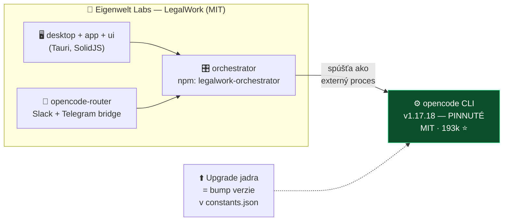
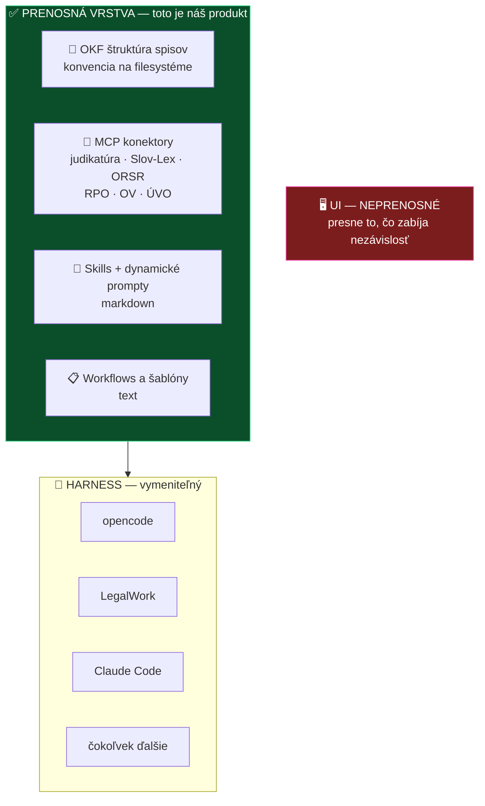

# 🧠 Brainstorming: voľba základu a prenositeľnosť

**Pracovná session MČ + AI · 2026-08-04**

*Podklad pre synchronizačný call — appka · CZ spolupráca · roadmapa · alpha/beta*

---

## 📌 TL;DR

> [!IMPORTANT]
> **Tri veci, ktoré menia doterajšie uvažovanie:**
> 1. **LegalWork nie je fork OpenCode.** Volá `opencode` ako **externý engine pinnutý na verziu**. To je presne ten vzor, ktorý rieši našu obavu z maintenance — upgrade jadra = zmena jedného reťazca, nie merge konflikty.
> 2. **LegalMemory je AGPL-3.0 + CLA**, nie MIT ako jeho sesterský LegalWork. Pri našej požiadavke „čo najviac permissive" je to mína.
> 3. **Prenositeľnosť ako tvrdá podmienka mení tvar produktu.** Nestaviame appku ani plugin — staviame **prenosnú vrstvu zo súborov a štandardných protokolov**, kde je harness vymeniteľný.

---

## 🎯 Východiská (MČ)

Päť princípov, z ktorých session vychádzala:

| # | Princíp | Dôsledok |
|---|---|---|
| 1 | **Nie sme programátori** | Základ musí byť stabilný a udržateľný; musí fungovať upstream/downstream sync |
| 2 | **Lokalizácia SK + CZ** | Tam je náš skutočný prínos |
| 3 | **MikeOSS = expozícia komunite** | Musí to byť jednoduché, s minimálnym effortom |
| 4 | **Hlavný benefit = workflows, dynamické prompty, nastavenie + naučiť advokátov** | Hodnota nie je v jadre |
| 5 | **Nezávislosť a prenositeľnosť** | Čisto local, licencia max permissive (**ideál MIT**), výstup prenositeľný medzi harnessmi. OKF je už dnes prenositeľný. |

> [!NOTE]
> Body **1 + 4** spolu dávajú tézu, ktorá rozhoduje väčšinu sporov sama:
> **Nestaviame agenta. Staviame právnu vrstvu nad cudzím jadrom — plus vzdelávanie.**
> Bod **5** potom určuje, že tá vrstva sa nesmie viazať na konkrétne jadro.

---

## 🔍 Čo sme preverili

Fakty overené cez GitHub API a čítanie repozitárov k **2026-08-04**.

| Projekt | Repo | Licencia | Hviezdy | Poznámka |
|---|---|---|---|---|
| **OpenCode** | [`sst/opencode`](https://github.com/sst/opencode) | MIT | **193 209** | Natívne MCP, agenti, skills, pluginy |
| **Pi** | [`badlogic/pi-mono`](https://github.com/badlogic/pi-mono) | MIT | 83 366 | Agent toolkit (Mario Zechner) |
| **oh-my-pi** | [`can1357/oh-my-pi`](https://github.com/can1357/oh-my-pi) | MIT | ~21 800 | **Fork Pi**, ~80k riadkov Rustu |
| **LegalWork** | [`eigenweltlabs/legalwork`](https://github.com/eigenweltlabs/legalwork) | **MIT** | 85 | Desktop app nad opencode |
| **LegalMemory** | [`eigenweltlabs/LegalMemory`](https://github.com/eigenweltlabs/LegalMemory) | **AGPL-3.0** | 11 | Vzniklo 1. 8. 2026 |
| **LegalOSS** | [`eigenweltlabs/legaloss`](https://github.com/eigenweltlabs/legaloss) | MIT | 17 | Komunitný index OSS legal softvéru |
| **mikeOSS** | [`Open-Legal-Products/mike`](https://github.com/Open-Legal-Products/mike) | **AGPL-3.0** | 4 065 | Náš pôvodný fork target |

> [!NOTE]
> **LegalWork, LegalMemory aj LegalOSS sú od tej istej firmy** — Eigenwelt Labs (Berlín).
> Doplnenie k [hĺbkovej analýze LegalWork](../research/inspiracie/legalwork.md) z 29. 7., ktorá toto ešte nezachytáva.

---

## 🏗️ Kľúčové zistenie: opencode ako pinnutý engine

Pôvodný predpoklad znel, že LegalWork je fork OpenCode. **Nie je.**

**Dôkazy priamo z repa:**

- `README.md`, sekcia *Develop*: vyžaduje **„the `opencode` CLI on PATH"**
- `constants.json` obsahuje doslova `{"opencodeVersion": "v1.17.18"}` — jadro je **pinnuté na verziu**
- `patches/` obsahuje **jediný patch — a je na `@solidjs/router`**, nie na opencode
- GitHub repo neeviduje ako fork
- *Acknowledgements:* „We thank the teams at Different AI and Opencode for previous work."

### Prečo je to pre nás zásadné

| Fork | Pinnutý engine |
|---|---|
| Každý upstream release = merge konflikt | Upgrade = zmena jedného reťazca |
| Treba rozumieť cudziemu kódu | Netreba doňho vôbec siahnuť |
| Divergencia rastie v čase | Divergencia je nulová |
| ❌ nezvládneme (bod 1) | ✅ zvládneme |

> [!TIP]
> **Toto je vzor, ktorý máme skopírovať.** Nie preto, že je elegantný, ale preto, že je jediný, ktorý zodpovedá bodu 1.

---

## 🔌 Náš judikatúrny MCP: žiadny zásah do jadra netreba

OpenCode podporuje **natívne a čisto konfiguračne** (bez zásahu do zdrojáku):

`MCP servery` · `agenti a subagenti` · `Agent Skills` · `pluginy cez SDK` · `custom commands` · `rules`

Takže „natívne implementovaný judikatúrny MCP" = **zaregistrovať ho v configu.** Práca na hodinu.

> [!WARNING]
> **Dva blokátory, ktoré treba vyriešiť skôr:**
> [`originalmagneto/judikaty-mcp`](https://github.com/originalmagneto/judikaty-mcp) je momentálne **private a bez licencie**.
> Kým sa to nezmení, komunita ho nemôže použiť ani legálne forknúť — a to blokuje **bod 3**.

---

## 🧳 Prenositeľnosť: čo cestuje a čo nie

Bod 5 (nezávislosť) je vlastne odpoveďou na otázku „appka alebo plugin?" — **ani jedno**.

| Vrstva | Prenositeľnosť | Prečo |
|---|---|---|
| OKF štruktúra spisov | **úplná** | čistá konvencia na filesystéme |
| MCP konektory | **úplná** | MCP je štandard naprieč harnessmi |
| Skills a prompty | **vysoká** | markdown; opencode aj Claude Code majú Agent Skills |
| Workflows a šablóny | **vysoká** | text |
| UI | **žiadna** | viazanie na cudziu roadmapu |

### Dôsledok

> **Nevyberáme základ. Vyberáme referenčný harness.**
> Ten, na ktorom to testujeme a demonštrujeme — ale nič vo vrstve od neho nesmie závisieť.
> Keď o rok bude lepší harness, presťahujeme sa za deň.

Kandidát na referenčný harness: **opencode** — MIT, 193k ⭐, natívne MCP aj skills, a LegalWork nám MIT kódom ukazuje, ako sa naň vešia UI, keby sme ho niekedy chceli.

---

## ⚖️ LegalMemory: skvelá technika, licenčná mína

Technicky pôsobivé a áno, **je to MCP server**: shadow index nad dokumentmi bez zmeny zdrojových súborov, permission compiler **pred** rankingom, sedemstupňová pipeline, konektory (SharePoint, OneDrive, Google Drive, Clio, lokálne priečinky), identity-bound MCP nástroje za OAuth 2.1, append-only access ledger, Docker appliance.

> [!CAUTION]
> **Tri dôvody na opatrnosť:**
> 1. **AGPL-3.0 + CLA + komerčná duálna licencia.** Zámerná konštrukcia: komunita prispieva pod AGPL, Eigenwelt predáva komerčne. Kto prispeje, posilňuje ich komerčný produkt.
> 2. **Repo vzniklo 1. 8. 2026** — v čase tejto session malo **tri dni**.
> 3. **OCR pipeline je stavaná na nemčinu.** SK/CZ chýba.

**Ak by sme ho použili:** držať ako **samostatný appliance za MCP rozhraním** (oddelený proces, žiadne linkovanie) a **nemodifikovať** — tým sa obchádza sieťová copyleft doložka AGPL §13 pre vlastné úpravy.

**Ak chceme zostať MIT:** ich kód **neštudovať a nereimplementovať** — pri AGPL je to reálne riziko odvodeného diela. Bezpečná cesta existuje: v `docs/src/content/docs/concepts/evidence.md` majú odôvodnenie retrieval rozhodnutí **s citáciami na publikovaný výskum** (Filtered-DiskANN a spol.). To je verejná literatúra. **Vezmime citácie a argumenty, kód nechajme tak.**

### A vlastne to už máme rozostavané

Ich kľúčová myšlienka — dokumenty priradiť k veci, poprepájať verzie a vzťahy, vyhľadávať v rámci povolení — je presne to, čo dáva [OKF](../specs/0002-okf-operacny-system-praxe.md). Nemusíme stavať shadow index nad cudzím DMS, lebo **naše spisy sú už usporiadané**. Zostáva tenký prenosný index nad OKF — a ten vieme spraviť pod MIT.

> [!NOTE]
> **Zhoda naprieč SK a CZ:** MČ nezávisle navrhol tiered memory s compactiou a Vojta napísal:
> *„pamět případu je základní kámen právní práce. Bez tohoto nemůže fungovat žádnej agent."*
> Ak má mať alfa jednu vlajkovú feature, **toto je ona.**

---

## 🚨 Dva konflikty, ktoré treba vyriešiť

### 1. mikeOSS je AGPL, ale chceme MIT

> [!WARNING]
> [ADR 0002](../decisions/0002-preco-forkujeme-mikeoss.md) je zapísaný ako **prijatý** a hovorí, že forkujeme [mikeOSS](https://github.com/Open-Legal-Products/mike) — ktorý je **AGPL-3.0**.
> Na tejto session MČ formuloval bod 5: *„čo najviac permissive, ideál MIT"*.
> **Tieto dve veci nejdú dokopy.** Fork AGPL projektu znamená, že náš výstup je AGPL.

Možnosti na call:
- **A** — držať sa mikeOSS a prijať AGPL (zmeniť bod 5)
- **B** — prenosná vrstva pod MIT, mikeOSS len ako jeden z podporovaných harnessov *(zosúladí body 1, 3 a 5)*
- **C** — revidovať ADR 0002

### 2. Názvová kolízia LAWOSS vs LegalOSS

Eigenwelt prevádzkuje [`legaloss`](https://github.com/eigenweltlabs/legaloss) / [legal-oss.com](https://legal-oss.com/) — komunitný index open-source právneho softvéru. Náš názov je **LAWOSS**. To je nebezpečne blízko.

Zároveň je to **príležitosť**: dostať LAWOSS do ich indexu je hotová distribučná cesta pre bod 3 (expozícia komunite).

---

## ❓ Otvorené otázky na štvrtok (6. 8., 14:00)

- [ ] **Tvar produktu** — prenosná vrstva, appka, alebo oboje? *(rozhoduje všetko ostatné)*
- [ ] **Licencia LAWOSS** — stále žiadna; blokuje komunitu. Zosúladiť s ADR 0002 a bodom 5.
- [ ] **`judikaty-mcp`** — zverejniť + pridať licenciu (dnes private, bez licencie)
- [ ] **LegalMemory** — áno/nie, a ak áno, len ako neupravený appliance za MCP
- [ ] **Referenčný harness** — opencode?
- [ ] **Vlajková feature alfy** — pamäť prípadu nad OKF?
- [ ] **Názov** — LAWOSS vs LegalOSS
- [ ] **Martinove otvorené veci** — [Issue #1](https://github.com/Omni-Legal-Products/lawOSS-like-SK-CZ/issues/1) (attorney workflow MVP) a [PR #2](https://github.com/Omni-Legal-Products/lawOSS-like-SK-CZ/pull/2) (orchestrátor a subagenti), obe nevybavené

---

## 🔐 Poznámka k dôvernosti

Do akceptačného filtra pre voľbu harnessu patrí explicitne:

- **žiadna defaultná telemetria** s obsahom
- **žiadny zdieľaný stav mimo stroja**
- **auditná stopa**

Konkrétne zistené: oficiálne buildy LegalWorku posielajú anonymné štatistiky na EU-hosted PostHog (vypnuteľné, dev buildy nič), a **ich free modely logujú dáta** — vlastné README hovorí, že sa nesmú používať na privilegované, klientske ani spisové dáta. Martinova skoršia oponentúra k `oh-my-pi` (telemetria zapnutá defaultne, bearer-link collab, obrovský privilege surface) bola vecne správna a rovnaké kritérium má platiť na všetkých kandidátov.

Presne toto pokrýva Martinov [PR #2](https://github.com/Omni-Legal-Products/lawOSS-like-SK-CZ/pull/2): read-only default, matter-scoped capabilities, human gates, žiadne autonómne eID ani odosielanie.

---

## 📚 Zdroje

**Repozitáre:** [sst/opencode](https://github.com/sst/opencode) · [badlogic/pi-mono](https://github.com/badlogic/pi-mono) · [can1357/oh-my-pi](https://github.com/can1357/oh-my-pi) · [eigenweltlabs/legalwork](https://github.com/eigenweltlabs/legalwork) · [eigenweltlabs/LegalMemory](https://github.com/eigenweltlabs/LegalMemory) · [eigenweltlabs/legaloss](https://github.com/eigenweltlabs/legaloss) · [Open-Legal-Products/mike](https://github.com/Open-Legal-Products/mike)

**Weby:** [LegalWork](https://eigenweltlabs.com/legalwork) · [LegalMemory](https://eigenweltlabs.com/legalmemory) · [LegalOSS](https://legal-oss.com/) · [opencode docs](https://opencode.ai/docs/)

**Interné:** [LegalWork hĺbková analýza](../research/inspiracie/legalwork.md) · [ADR 0002](../decisions/0002-preco-forkujeme-mikeoss.md) · [spec 0002 OKF](../specs/0002-okf-operacny-system-praxe.md) · [spec 0003 prompt layer](../specs/0003-prompt-layer.md) · [spec 0004 SK MCP konektory](../specs/0004-mcp-sk-konektory.md) · [roadmapa](../planning/roadmap.md)

---

Záznam pracovnej session MČ + AI, 2026-08-04. Fakty overené cez GitHub API a čítanie repozitárov v ten istý deň — hviezdy a stavy sa menia, pri ďalšom použití preveriť. Konverzačný kontext: topicy <i>Research</i> a <i>Feature IDEAS</i> v skupine LawOSS (SLOVAKIA | CZECHIA) + AI Frontier Labs.
