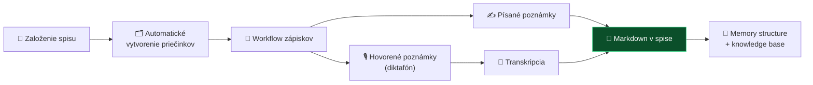

# 📞 Sync call — voľba základu a smerovanie

**2026-08-06, 17:04 · 32 minút**

## 👥 Účastníci

| | Kto | Rola na calle |
|---|---|---|
| **MČ** | Marián | zvolal, viedol, prezentoval testovanie LegalWork |
| **IR** | Igor Ribár | projektový manažment, procesy |
| **VŘ** | Vojta Říha | CZ strana, MCP Salvia, Determo |
| **MF** | Martin Friedrich | ⚠️ **nezúčastnil sa** — rozhodnutia čakajú na jeho potvrdenie |

> [!NOTE]
> Prvý call s Vojtom Říhom (CZ). Podklady: [brainstorming z 4. 8.](2026-08-04-brainstorming-zaklad-a-prenositelnost.md), [analýza LegalWork](../research/inspiracie/legalwork.md).

---

## ✅ Prijaté rozhodnutia

| # | Rozhodnutie | Kto potvrdil |
|---|---|---|
| **R1** | **LegalWork sa berie ako základ projektu.** Dôvod: open-code harness v pozadí, MIT licencia, praktická skúsenosť z testovania. | MČ, IR, VŘ |
| **R2** | **UI je predvolené rozhranie, CLI ako voliteľný prepínač.** | MČ, VŘ |
| **R3** | **Markdown je primárny dátový formát.** Žiadny vendor lock-in; systém musí byť interoperabilný s Obsidianom aj klasickými priečinkami. | MČ, VŘ |
| **R4** | **Modulárna plug-and-play architektúra** — moduly ako LEGO nad jednotným základom. | MČ |
| **R5** | **Regionálny záber SK + CZ, s otvorením na PL.** Poľsko má voľne prístupné právne dáta a jazyková blízkosť umožňuje evaluáciu. | VŘ (návrh), MČ (súhlas) |
| **R6** | **Mike sa nepreferuje.** Marketingová hodnota nevyvažuje chýbajúci harness; VŘ ho hodnotí ako hype bez prepojenia na reálne veci. | MČ, VŘ |
| **R7** | **Determo (VŘ) slúži ako referencia**, nie ako základ — WIP na starších modeloch. Použiteľné sú koncepty integrácie a bezpečnostné vzory. | VŘ, MČ |
| **R8** | **MCP Salvia sa pripraví ako voliteľný modul** a zváži sa odporúčanie komunite. | MČ, VŘ |
| **R9** | **Zavádza sa projektové riadenie:** master plán, backlog, vedľajšie vetvy, PR proces — nič priamo do `main`. | IR (návrh), MČ |
| **R10** | **Týždenný synchronizačný call v stredu, 15–30 min**, formát „kde sme, čo sme urobili". | všetci |
| **R11** | **Projekt zostáva open source a zadarmo.** Monetizácia mimo softvéru — nepredávame službu, za ktorú by sme niesli zodpovednosť. | MČ, IR |

> [!IMPORTANT]
> **R1 nahrádza [ADR 0002](../decisions/0002-preco-forkujeme-mikeoss.md)**, ktorý hovoril o forku mikeOSS. Formalizované v **[ADR 0003](../decisions/0003-legal-work-ako-zaklad.md)**.

---

## 📋 Akčné úlohy

### Marián (MČ)

- [ ] Zápis z callu + ingest do repozitára *(2026-08-08)* — **⬅ tento dokument**
- [ ] Overiť licenciu LegalWork, doplniť `LICENSE`, `NOTICE`, `CONTRIBUTING` *(2026-08-08)*
- [ ] Fork LegalWork a príprava dev setupu *(2026-08-09)*
- [ ] Naplánovať týždenný stredajší call *(2026-08-09)*
- [ ] Publikovať legálne použiteľné datasety na GitHub *(2026-08-10)*
- [ ] Report k integráciám — Anthropic/Claude vs. Groq/Codex *(2026-08-11)*
- [ ] Návrh modulu Elektronický spis *(2026-08-11)*
- [ ] Audit existujúcich OKF skillov *(2026-08-13)*
- [ ] Definícia balíčka „Community Skills" *(2026-08-15)*
- [ ] Návrh Markdown/Obsidian integrácie *(2026-08-15)*
- [ ] Rešeršný workflow „one-click" cez NotebookLM CLI *(2026-08-16)*
- [ ] Jurisdikčne neutrálny intake pre SK/CZ/PL *(2026-08-18)*

### Igor Ribár (IR)

- [ ] Definícia PM rámca, master plán a backlog *(2026-08-12)*
- [ ] Konvencie vetiev, PR checklist, pravidlá code review *(2026-08-12)*
- [ ] Základná dokumentácia projektu — README, inštalácia, architektúra *(2026-08-13)*
- [ ] Návrh modulového rozhrania (plug-and-play, bezpečnostné hranice) *(2026-08-19)*

### Vojta Říha (VŘ)

- [ ] Analýza repozitára Determo — čo je prenositeľné *(2026-08-12)*
- [ ] Česká a poľská stránka integrácie *(2026-08-12)*
- [ ] Návrh architektúry UI/CLI prepínača *(2026-08-13)*
- [ ] Príprava integrácie MCP Salvia — autentifikácia, limity *(2026-08-16)*
- [ ] Mapovanie poľských právnych zdrojov *(2026-08-20)*

### Všetci

- [ ] Praktické otestovanie LegalWork na vlastných dátach *(2026-08-13)*

---

## 💡 Hlavná produktová myšlienka: digitálna sekretárka

Ústredný koncept, s ktorým MČ otvoril call:

> „Takí starí advokáti si tak diktovali niečo a potom sekretárka to prepisovala a dávala to do spisu."

Cieľ je zmodernizovať presne tento vzor:

Nadväzuje na existujúce [spec 0001 (transkripcia)](../specs/0001-transkripcia.md) a [spec 0002 (OKF)](../specs/0002-okf-operacny-system-praxe.md) — nové je **spojenie do jedného workflowu** a rámovanie ako „digitálna sekretárka".

---

## 🔍 Témy a zistenia

### MCP Salvia — CZ judikatúra

VŘ ju hodnotí výrazne nad konkurenčným Codexisom:

> „Majú veľmi dobre zaindexovanú judikatúru... u komplikovaných právnych otázok výborné sa to osvedčilo... tam nie sú ani balastné slová."

| Parameter | Hodnota |
|---|---|
| **Cena** | 242 Kč ≈ **10 € za 3 000 dotazov** |
| **Indexácia** | spisové značky, kľúčové slová, články, embeddingy, pravdepodobne aj grafová DB |
| **Spotreba** | adversariálny agent prepáli **~200 dotazov** na jeden beh |

VŘ ju použil v reálnom čase priamo na pojednávaní, s výstupom do Obsidianu. Odporúča **špecializovaných agentov podľa právneho odvetvia** — všeobecný agent spotrebuje priveľa dotazov.

### Determo (VŘ)

Prototyp prepájajúci **Evolution** (aplikácia na správu spisu, beží na Azure, používajú ju aj súdy) s agentom. Repozitár zdieľaný. Stav: *„že by to bolo funkčný, to nie"* — robené na starších modeloch. Berieme koncepty, nie kód.

### Testovanie LegalWork (MČ)

> „Veľmi som bol impressed."

| Integrácia | Výsledok |
|---|---|
| Anthropic subscription | ❌ nepodarilo sa pripojiť, Claude hádzal chyby |
| Codex | ✅ funguje |
| Groq | ✅ funguje |
| Reálny priečinok | ✅ otestované |

### Dátové formáty

VŘ upozornil, že datasety na Hugging Face nie sú použiteľné v Markdowne — sú príliš zhustené, agent sa s nimi nepopasuje a fulltext/grep nefunguje. Argument pre vlastnú prípravu dát.

---

## ⚠️ Riziká a otvorené otázky

> [!WARNING]
> **1. „Forkneme LegalWork" je v napätí s dôvodom, prečo ho berieme.**
> Hlavný argument pre LegalWork bol, že *„cez upstream to môžeš udržiavať, oni to updateujú"*. Lenže fork tú výhodu ruší práve na vrstve, ktorú chceme upravovať (UI, workflowy).
> Sám LegalWork sa tomuto vyhýba — opencode drží ako **pinnutú externú závislosť** (`constants.json` → `opencodeVersion`), nie ako fork. Viď [brainstorming 4. 8.](2026-08-04-brainstorming-zaklad-a-prenositelnost.md)
> **Na doriešenie:** fork s disciplinovaným overlayom / downstream nadstavba / extension pack. Rozhodnuté v [ADR 0003](../decisions/0003-legal-work-ako-zaklad.md) ako otvorený bod.

> [!CAUTION]
> **2. Problém s Anthropic subscription pravdepodobne nie je chyba konfigurácie.**
> [Analýza LegalWork](../research/inspiracie/legalwork.md) z 29. 7. našla priamo v ich zdrojáku komentár a varovanie: Consumer Terms Anthropicu obmedzujú ten OAuth na Claude Code a claude.ai, takže **použitie treťou stranou môže byť zablokované bez oznámenia**.
> To sedí na to, čo MČ zažil. **Nehľadať chybu u seba** — použiť API kľúč.

**Ďalšie otvorené otázky:**

- [ ] **Potvrdenie od Martina (MF)** — nezúčastnil sa; jeho [Issue #1](https://github.com/Omni-Legal-Products/lawOSS-like-SK-CZ/issues/1) a [PR #2](https://github.com/Omni-Legal-Products/lawOSS-like-SK-CZ/pull/2) sú stále otvorené
- [ ] **Branding** — názov **LAWOSS** je rozhodnutý od 29. 7. ([AGENTS.md](../AGENTS.md)), ale na calle sa téma znova otvorila v súvislosti s upustením od Mikea ako marketingového ťahúňa. Treba doriešiť, čím sa marketingová expozícia nahradí.
- [ ] **Licenčné podmienky MCP Salvia** pre komunitné zdieľanie — VŘ: *„musím si nechať potvrdiť, či to vôbec môžeme odoslať"*
- [ ] **Ktorá verzia LegalWork** sa forkne (tag/commit)?
- [ ] Ako sa budú spravovať prístupové kľúče (Google, NotebookLM) v open-source projekte?
- [ ] Presný čas stredajšieho callu
- [ ] Ktoré poľské zdroje majú licencie vhodné pre open source?

---

## 📎 Poznámka k prepisu

Automatický prepis obsahuje chyby v názvoch, ktoré treba čítať takto:

| V prepise | Správne |
|---|---|
| „League of Orcs" | **LegalWork** |
| „All My PIE" / „PIE agent" | **oh-my-pi** / **Pi** |
| „kódex" (v kontexte modelu) | **Codex** |

---

Zdroj: nahrávka a automatický prepis callu z 2026-08-06, 17:04–17:36. Zápis spracoval MČ s AI asistenciou. Termíny akčných úloh podľa pôvodného súhrnu.
