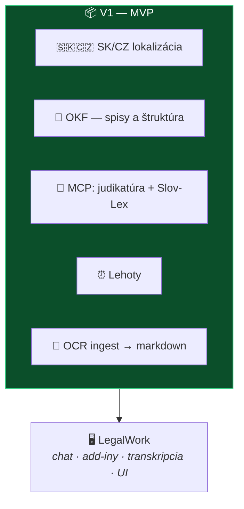

# 🎯 Agenda: rozhodnutie o MVP (verzia 1)

**Streda 12. 8. 2026 · sync call**

> [!IMPORTANT]
> **Cieľ stretnutia je jediný: odsúhlasiť konkrétny zoznam funkcií pre V1 a vydať ju čo najskôr.**
> Všetko ostatné (26 nápadov) je v [zbernom koši](../planning/napady.md) a nikam neutečie.

---

## 1️⃣ Východisko — čo už máme zadarmo

Toto je najdôležitejší bod, lebo mení, čo vôbec treba stavať. **[LegalWork](../decisions/0003-legal-work-ako-zaklad.md) nám hotové dáva:**

| Máme | Netreba stavať |
|---|---|
| Chat a lokálny agent, práca so súbormi | ✅ |
| Word, Excel a PowerPoint add-iny s tracked changes | ✅ |
| On-device transkripcia (whisper.cpp, parakeet) | ✅ |
| Tabular review s citáciami | ✅ |
| Voľba modelu — vlastné predplatné aj API kľúč | ✅ |
| UI na pridávanie MCP serverov a skillov | ✅ |

**Z toho vyplýva: MVP nie je „appka". MVP je to, čo z LegalWorku spraví nástroj pre slovenského a českého advokáta.**

---

## 2️⃣ Kritériá výberu do V1 — návrh

Aby sa dalo rozhodovať rýchlo, navrhujem štyri filtre. Funkcia ide do V1, ak spĺňa **všetky štyri**:

| # | Kritérium | Prečo |
|---|---|---|
| 1 | **Dá sa vydať rýchlo** | staviame na hotovom, nie od nuly |
| 2 | **Má hodnotu aj samostatne** | advokát ju ocení, aj keď zvyšok nie je |
| 3 | **Nízke riziko** | nič regulované, nič, čo koná v mene advokáta |
| 4 | **Väčšinu už máme** | MCP servery a OKF skilly existujú |

---

## 3️⃣ Návrh scope V1

| Funkcia | Odkiaľ | Prečo do V1 | Kto |
|---|---|---|---|
| **SK/CZ lokalizácia rozhrania** | [ADR 0004](../decisions/0004-ako-rozsirit-legalwork.md) | Bez nej to advokát nepoužije. Sú to **nové súbory locale** → nulový merge konflikt, a ich CI to aj testuje. Zároveň náš prvý upstream PR. | MČ + VŘ |
| **OKF — založenie spisu a štruktúra** | [spec 0002](../specs/0002-okf-operacny-system-praxe.md) | Jadro odlíšenia. MČ to má osobne rozbehnuté — ide o zabalenie, nie o vynález. | MČ |
| **MCP konektory: judikatúra + Slov-Lex** | [spec 0004](../specs/0004-mcp-sk-konektory.md) | Najviditeľnejšia hodnota. Servery existujú, read-only = nízke riziko. | MČ |
| **Lehoty a timeline spisu** | [spec 0005](../specs/0005-lehoty-timeline.md) | Kandidát #1 od MF. Zmeškaná lehota je najčastejší dôvod zodpovednosti advokáta — hodnota aj samostatne. | MF |
| **OCR ingest → markdown** | návrh #8 | Quick win, MČ má hotovú Quick Action. | MČ |

> [!TIP]
> **Jedna vec sa dá vydať budúci týždeň, bez forku a bez programovania.**
> MCP servery sa v LegalWorku pridávajú **cez UI** (*Settings → pridať MCP server*). Čiže judikatúrny a Slov-Lex konektor viete dať kolegom **hneď** ako návod so screenshotmi — a máme prvý reálny výstup, kým sa fork ešte len rozbieha. Odporúčam to spraviť ako nultý krok.

---

## 4️⃣ Čo do V1 vedome NEDÁVAME

Toto je rovnako dôležité — bez toho sa MVP rozleje.

| Funkcia | Prečo nie teraz |
|---|---|
| **Tiered memory s compaction** *(#21)* | Najsilnejší diferenciátor, ale najväčší build. **OKF v MVP pokryje základnú „pamäť prípadu"** — štruktúra a markdown v spise. Plná verzia vo V2. |
| **Podpisovanie QES + QTS** *(#19)* | Regulované, potrebuje human gate a overenie advokátskeho preukazu. → V2 |
| **Zaručená konverzia** *(#26)* | **Rozhodnuté 7. 8.: až ďalšia verzia.** Regulovaná činnosť. |
| **Zjednotenie komunikačných kanálov** *(#22)* | Najsilnejšie pomenovaná bolesť (VŘ), ale veľký scope a nejasné riešenie. |
| **Transkripcia do spisu** *(#1)* | LegalWork už transkribuje sám — naviazanie na spis je pridaná hodnota, nie podmienka. |
| Fakturácia, self-healing, PL, Workspace | → [zberný kôš](../planning/napady.md) |

---

## 5️⃣ Blokátory, ktoré musia padnúť skôr

> [!WARNING]
> **Bez týchto rozhodnutí sa V1 nedá začať.** Sú otvorené z minulého callu.

- [ ] **Potvrdenie [ADR 0003](../decisions/0003-legal-work-ako-zaklad.md) od MF** — nezúčastnil sa calle 6. 8.
- [ ] **Zakladáme GitHub organizáciu?** Ak áno, **pred forkom** — [ADR 0005](../decisions/0005-struktura-repozitarov.md)
- [ ] **Ktorý tag LegalWorku forkneme?** *(kandidát `v0.1.13`)*
- [ ] **Kto rieši merge konflikty pri upstream syncu?** V tíme dnes nikto
- [ ] **Kto zriadi Apple Developer účet** na notarizáciu macOS buildov
- [ ] **Doplniť `LICENSE`** do repa — stále chýba
- [ ] **Zverejniť `judikaty-mcp`** — je private a bez licencie, čím blokuje komunitnú časť

---

## 6️⃣ Čo odklepnúť

1. **Prijímame kritériá výberu** z bodu 2?
2. **Prijímame scope V1** z bodu 3 — alebo z neho niečo vypadne?
3. **Ide sa nultý krok** (MCP konektory ako návod, bez forku)?
4. **Termín V1** — dokedy chceme vydať?
5. **Rozdelenie práce** — kto berie ktorú položku?
6. Prejsť blokátory z bodu 5.

---

## 📎 Podklady

[Zberný kôš — všetkých 26 nápadov](../planning/napady.md) · [Evidencia návrhov](../specs/navrhy.md) · [Backlog](../planning/backlog.md) · [Roadmapa](../planning/roadmap.md) · [Zápis z callu 6. 8.](2026-08-06-sync-call-volba-zakladu.md) · [Spracovanie topicu Feature IDEAS](../research/idey/2026-08-07-feature-ideas-telegram.md)

---

Podklad pripravil MČ s AI asistenciou, 2026-08-07. Návrh scope je **návrh na prerokovanie**, nie rozhodnutie.
