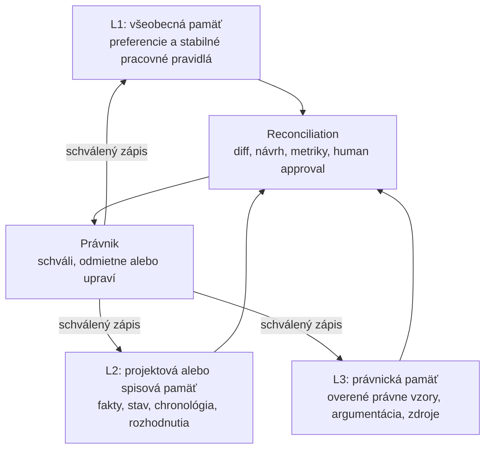

# Týždenný call: produktová vízia, OKF a pamäť

- **Dátum:** 2026-08-12, 17:00
- **Účastníci podľa podkladov:** Marián Čuprík (MČ), Martin Friedrich (MF), Vojta Říha (VŘ), ďalší účastník v automatickom prepise označený ako Speaker 1
- **Primárne podklady:** automatická sumarizácia a adaptívny PDF report z callu
- **Spresnenie rozhodnutí:** MČ po calle 2026-08-12

> [!NOTE]
> Automatické podklady nie sú doslovný prepis. Tam, kde boli nepresné alebo širšie než následné zadanie MČ, má prednosť explicitné spresnenie MČ uvedené v tomto zápise.

## Prijaté smerovanie

| # | Záver | Dôsledok |
|---|---|---|
| R1 | LAWOSS sa navrhuje ako **AI-first prostredie**. Primárnym vykonávateľom práce je agent, právnik zostáva supervízorom a rozhodovacou vrstvou. | GUI zostáva použiteľné pre človeka, ale musí prioritne poskytovať prehľad, brány, schvaľovanie a audit. |
| R2 | **OKF je hlavná produktová priorita presadzovaná MČ.** | Správa spisov, pamäť a základné skilly tvoria jadro prvej verzie. |
| R3 | Pamäť má tri vrstvy: všeobecnú, projektovú alebo spisovú a právnickú. | Každá vrstva musí mať vlastný scope, provenance, pravidlá zápisu a schvaľovania. |
| R4 | Reconciliation je súčasť OKF a pamäťového systému. | Porovnáva stav a používateľské úpravy, navrhuje zmeny pamäte, ale nezapisuje ich autonómne bez human approval. |
| R5 | Pri založení nového spisu sa kontrolujú subjekty a podľa režimu sa spustí hĺbkový research cez MCP. | Intake zahŕňa conflict a identity check, registre, AML a diskvalifikačné alebo sankčné kritériá. |
| R6 | Subjektové reporty a stav spisu sa majú pravidelne aktualizovať s auditnou stopou. | Periodické rescan a reconciliation procesy musia byť idempotentné, merateľné a vratné. |
| R7 | Anonymizácia je **nice to have** a v aktuálnej fáze sa neimplementuje. | Spec sa zachová ako budúci voliteľný modul, nie P0 hranica ani podmienka prvej verzie. |
| R8 | Preferujú sa lokálne indexované korpusy, jednoduché vyhľadávanie, graph alebo citačné väzby a otvorené rozhrania pred komplexným RAG ako východiskom. | RAG sa nezakazuje navždy, ale nie je predvolenou architektúrou prvej iterácie. |
| R9 | AML a subjektový research sú silný používateľský scenár naviazaný na OKF onboarding. | AML nie je samostatný ostrov, ale workflow nad spisom, MCP a periodickým update mechanizmom. |
| R10 | Modulárne MCP, skills a CLI nástroje zostávajú oddelené od jadra aplikácie a pripájajú sa cez jednotné kontrakty. | LAWOSS nemá absorbovať implementácie všetkých externých nástrojov do jedného monolitu. |

## OKF a tri vrstvy pamäte

### L1: všeobecná pamäť

- stabilné preferencie používateľa a kancelárie,
- všeobecné pracovné konvencie,
- schválené formátovacie a komunikačné pravidlá,
- žiadne automatické povyšovanie jednorazovej úpravy na všeobecné pravidlo.

### L2: projektová alebo spisová pamäť

- overené fakty a subjekty konkrétnej veci,
- chronológia, lehoty, úlohy a stav,
- taktické rozhodnutia a ich dôvody,
- väzby na dokumenty a komunikáciu,
- pravidelná kontrola čerstvosti a úplnosti.

### L3: právnická pamäť

- overené právne zdroje, citácie a argumentačné vzory,
- schválené poučenia z práce naprieč vecami bez prenosu klientskych údajov,
- oddelenie jurisdikcie, časovej účinnosti a provenance,
- zákaz odvodiť právnu správnosť iba z opakovaného používateľského správania.

## Reconciliation lifecycle

1. Získať aktuálny stav spisu a pamäťových vrstiev.
2. Porovnať nové dokumenty, komunikáciu, používateľské úpravy a existujúce záznamy.
3. Vytvoriť strojovo čitateľný diff a vysvetliť zdroj každej navrhovanej zmeny.
4. Klasifikovať návrh podľa cieľovej pamäťovej vrstvy.
5. Overiť duplicity, konflikt, časovú platnosť a povolený scope.
6. Predložiť návrh právnikovi: schváliť, upraviť, odmietnuť alebo odložiť.
7. Zapísať iba schválenú zmenu a vytvoriť auditný záznam.
8. Umožniť rollback a periodickú konsolidáciu bez straty pôvodnej provenance.

Agent nesmie sám vyhlásiť, že používateľská úprava je lepšia alebo všeobecne správna. Na povýšenie vzoru do L1 alebo L3 treba definovanú metriku, opakovanie a výslovné schválenie.

## Onboarding nového spisu a subjektový research

Research musí podporovať najmenej režimy `light`, `medium` a `hard`. Presný obsah režimov, riešenie menovcov, interval rescanov, použité registre a retention reportov zostávajú predmetom samostatnej špecifikácie.

## Priorita prvej verzie

1. správa spisov a trojvrstvová pamäť,
2. reconciliation s human approval,
3. základné skills a MCP pre onboarding a subjektový research,
4. fakturačný modul,
5. ďalšie moduly podľa schválenej roadmapy.

Anonymizácia sa do tohto poradia nezaraďuje.

## Akčné body

- [x] MČ: rozšíriť OKF spec o tri vrstvy pamäte a reconciliation lifecycle.
- [ ] Tím: definovať hranice medzi L1, L2 a L3 a pravidlá povyšovania poznatkov.
- [ ] Tím: špecifikovať onboarding subjektov a režimy `light`, `medium`, `hard`.
- [ ] Tím: definovať metriky, audit, rollback a periodicitu reconciliation.
- [ ] Tím: vybrať prvé tri implementačné vertikály.
- [ ] VŘ: navrhnúť formát integrácie CZ komentárov a korpusov.
- [ ] IR: pripraviť produktový branding a prezentáciu.
- [ ] Všetci: prijať GitHub pozvánky, naklonovať koordinačný a produktový repo a doplniť feature návrhy.
- [ ] Všetci: potvrdiť ďalší krátky call v piatok 2026-08-14 o 17:00.

## Stav po pracovnej session 2026-08-12

- [x] Produktová doktrína MČ je zapísaná v [ADR 0009](../decisions/0009-zakladna-produktova-doktrina.md), vo vízii, princípoch a README. Na prijatie tímom čaká otázka Q24.
- [x] Nezáväzný návrh `Open formats at the core, compatibility at the edges` je evidovaný ako nápad #27 a otázka Q25.
- [x] Otázky Q01 až Q25 boli odoslané do Telegramu s výzvou naklonovať alebo aktualizovať repo a prejsť ich cez vlastného AI agenta.
- [x] Organizácia [Omni Legal Products](https://github.com/Omni-Legal-Products), produktový fork [LAWOSS](https://github.com/Omni-Legal-Products/lawoss) a private MCP kópie sú vytvorené.
- [ ] MF, IR a VŘ majú prijať čakajúce GitHub pozvánky a odovzdať svoje odpovede Q01 až Q25.
- [ ] Platformová stratégia macOS main, Windows pod vedením IR a bez nútenej parity čaká na merge v [PR #27](https://github.com/Omni-Legal-Products/lawOSS-like-SK-CZ/pull/27).

## Otvorené rozhodnutia

Otázky o product ownership, release vetvách, prvých vertikálach, scope billing modulu, lokálnosti dát, platformách a sign-off rolách budú predložené v samostatnom diskusnom PR. Nie sú súčasťou prijatých rozhodnutí tohto zápisu.
