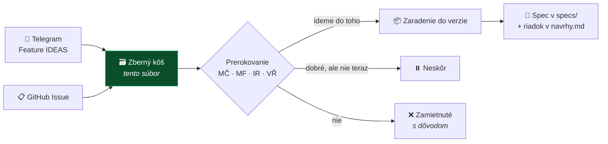

# 🗃️ Zberný kôš nápadov

**Všetko, čo by sme raz mohli integrovať — na jednom mieste**

> [!TIP]
> **Máš nápad? Hoď ho kamkoľvek z tohto:**
> 1. **Telegram topic *Feature IDEAS*** — najrýchlejšie, netreba nič formátovať *(odtiaľ ich pravidelne zbierame sem)*
> 2. **[GitHub formulár](https://github.com/originalmagneto/lawOSS-like-SK-CZ/issues/new?template=feature-navrh.yml)** — ak chceš, aby sa o tom hneď diskutovalo
> 3. **Priamo do tohto súboru** — jeden riadok do priehradky *Nezaradené*
>
> **Nič sa nezahadzuje.** Aj zamietnuté nápady tu zostávajú aj s dôvodom, nech sa nevracajú dokola.

## Ako nápad putuje

**Evidencia autorstva je v [`specs/navrhy.md`](../specs/navrhy.md)** — tam patrí, kto čo navrhol a kedy. Tu ide o to, **kam to mieri**.

---

## 🎯 V1 — kandidáti na MVP

> Rozhoduje sa **v stredu 12. 8. 2026**. Podklad a odporúčanie: [agenda stretnutia](../meetings/2026-08-12-agenda-mvp.md).

| # | Nápad | Prečo kandidát |
|---|---|---|
| — | **SK/CZ lokalizácia rozhrania** | Bez nej to advokát nepoužije. Technicky najlacnejšie — nové súbory locale, nulový merge konflikt. |
| [2](../specs/0002-okf-operacny-system-praxe.md) | **OKF — spisy a štruktúra praxe** | Jadro odlíšenia. MČ to má osobne rozbehnuté. |
| [4](../specs/0004-mcp-sk-konektory.md) | **SK/CZ MCP konektory** — judikatúra, Slov-Lex, registre | Najviditeľnejšia hodnota, servery už existujú, read-only = nízke riziko. |
| [7](../specs/0005-lehoty-timeline.md) | **Lehoty a timeline spisu** | Kandidát #1 od MF. Zmeškaná lehota je najčastejší dôvod zodpovednosti advokáta. |
| 8 | **OCR ingest → markdown** | Quick win, MČ má hotovú Quick Action. |

---

## 📦 V2 — hneď po MVP

| # | Nápad | Poznámka |
|---|---|---|
| **21** | **Tiered memory s compaction** | ⭐ Najsilnejší diferenciátor — MČ aj VŘ nezávisle. Ale aj najväčší build; v MVP ho v základnej podobe zastúpi OKF. |
| 1 | Transkripcia naviazaná na spis | LegalWork už transkribuje sám; naša časť je zaradenie do spisu. |
| 3 | Otvorený prompt layer | |
| 5 | Hybrid routing — lokálny model vs. subscription | |
| 17 | Rešeršný workflow „one-click" | |
| **19** | **Podpisovanie QES + QTS cez Autogram** → [spec 0007](../specs/0007-podpisovanie-a-zarucena-konverzia.md) | Advokáti s tým reálne pracujú. Regulované — potrebuje human gate a právne náležitosti. |
| 14 | Špecializovaní agenti podľa právneho odvetvia | |

---

## ⏸️ Neskôr — dobré nápady, ale nie teraz

| # | Nápad | Prečo počká |
|---|---|---|
| **26** | **Zaručená konverzia** → [spec 0010](../specs/0010-zarucena-konverzia.md) | **Rozhodnutie MČ 2026-08-07: až do ďalšej verzie** — potvrdené [rešeršou 2026-08-12](../research/pravny-ramec/2026-08-12-zarucena-konverzia-sk.md). Nie je to variant podpisovania: vyžaduje SOAP integráciu na štátny register CEZZK, registráciu oprávnenej osoby, mandátny certifikát a **platenú kvalifikovanú validačnú službu**. Rešerš sama odporúča používať hotové riešenia. MČ si na to stavia vlastnú aplikáciu — správne miesto je mimo LAWOSS. |
| 22 | Zjednotenie komunikačných kanálov do spisu | Najsilnejšie pomenovaná bolesť z praxe (VŘ), ale veľký scope a nejasné riešenie. |
| 23 | Self-healing a self-updating integrácie | Sedí na princíp „nie sme programátori", ale treba doriešiť breaking changes a rollback. |
| 24 | Self-evolving / self-correcting systém | Nerozvinuté, súvisí s #23. |
| 25 | CMR a case audit systém | Zatiaľ len heslo. |
| 20 | Fakturácia a výkazy času | Je v mockupoch, ale nie je to naše odlíšenie. |
| 15 | Poľské rozšírenie (PL) | Až keď bude SK/CZ stabilné. |
| 18 | Google Workspace integrácia a outreach | Nízka priorita. |
| 13 | MCP Salvia (CZ judikatúra) | Závisí od licenčných podmienok tretej strany — treba overiť. |

---

## ✅ Priebežné — rieši sa mimo verzií

| # | Nápad | Stav |
|---|---|---|
| 11 | UI/CLI prepínač | schválené na calle 6. 8. |
| 12 | Markdown/Obsidian interoperabilita | schválené na calle 6. 8. — je to princíp, nie funkcia |
| 16 | Modulové rozhranie plug-and-play | spracúva IR do 19. 8. |
| 9 | Orchestrátor a subagenti | [PR #2](https://github.com/originalmagneto/lawOSS-like-SK-CZ/pull/2) od MF, otvorený |
| 6 | Attorney workflow MVP | rozpadol sa do #7 a ďalších specov |
| 10 | Digitálna sekretárka | rámec, ktorý spája #1 + #2 |

---

## ❌ Zamietnuté

*(zatiaľ žiadne — ak niečo zamietneme, patrí sem aj s dôvodom, nech sa to nevracia dokola)*

---

## 🆕 Nezaradené

*Sem píš nové nápady, kým sa neprerokujú. Formát: **čo** — kto, kedy, odkiaľ.*

- *(prázdne)*

---

Priehradky V1/V2/Neskôr sú **návrh na prerokovanie**, nie rozhodnutie — okrem #26, kde rozhodol MČ 2026-08-07. Aktualizované 2026-08-07 zo [spracovania Telegram topicu](../research/idey/2026-08-07-feature-ideas-telegram.md).
