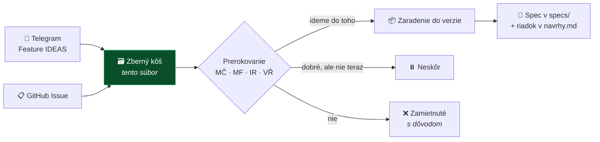

# 🗃️ Zberný kôš nápadov

**Všetko, čo by sme raz mohli integrovať — na jednom mieste**

> [!TIP]
> **Máš nápad? Hoď ho kamkoľvek z tohto:**
> 1. **Telegram topic *Feature IDEAS*** — najrýchlejšie, netreba nič formátovať *(odtiaľ ich pravidelne zbierame sem)*
> 2. **[GitHub formulár](https://github.com/Omni-Legal-Products/lawOSS-like-SK-CZ/issues/new?template=feature-navrh.yml)** — ak chceš, aby sa o tom hneď diskutovalo
> 3. **Priamo do tohto súboru** — jeden riadok do priehradky *Nezaradené*
>
> **Nič sa nezahadzuje.** Aj zamietnuté nápady tu zostávajú aj s dôvodom, nech sa nevracajú dokola.

## Ako nápad putuje

**Evidencia autorstva je v [`specs/navrhy.md`](../specs/navrhy.md)** — tam patrí, kto čo navrhol a kedy. Tu ide o to, **kam to mieri**.

---

## 🎯 V1 — kandidáti na MVP

> Rozhoduje sa **v stredu 12. 8. 2026**. Podklad a odporúčanie: [agenda stretnutia](../meetings/2026-08-12-agenda-mvp.md).

| # | Nápad | Prečo kandidát |
|---|---|---|
| — | **SK/CZ lokalizácia rozhrania** | Bez nej to advokát nepoužije. Technicky najlacnejšie — nové súbory locale, nulový merge konflikt. |
| [2](../specs/0002-okf-operacny-system-praxe.md) | **OKF — spisy a štruktúra praxe** | Jadro odlíšenia. MČ to má osobne rozbehnuté. |
| [4](../specs/0004-mcp-sk-konektory.md) | **SK/CZ MCP konektory** — judikatúra, Slov-Lex, registre | Najviditeľnejšia hodnota, servery už existujú, read-only = nízke riziko. |
| [7](../specs/0005-lehoty-timeline.md) | **Lehoty a timeline spisu** | Kandidát #1 od MF. Zmeškaná lehota je najčastejší dôvod zodpovednosti advokáta. |
| 8 | **OCR ingest → markdown** | Quick win, MČ má hotovú Quick Action. |

---

## 📦 V2 — hneď po MVP

| # | Nápad | Poznámka |
|---|---|---|
| **21** | **Tiered memory s compaction** | ⭐ Najsilnejší diferenciátor — MČ aj VŘ nezávisle. Ale aj najväčší build; v MVP ho v základnej podobe zastúpi OKF. |
| 1 | Transkripcia naviazaná na spis | LegalWork už transkribuje sám; naša časť je zaradenie do spisu. |
| 3 | Otvorený prompt layer | |
| 5 | Hybrid routing — lokálny model vs. subscription | |
| 17 | Rešeršný workflow „one-click" | |
| **19** | **Podpisovanie QES + QTS cez Autogram** → [spec 0007](../specs/0007-podpisovanie-a-zarucena-konverzia.md) | Advokáti s tým reálne pracujú. Regulované — potrebuje human gate a právne náležitosti. |
| 14 | Špecializovaní agenti podľa právneho odvetvia | |
| **34** | **Reconcile — učenie z úprav advokáta** → [spec 0009](../specs/0009-reconcile-ucenie-z-uprav.md) | Mechanizmus učenia, ktorý chýbal #21: draft vs. finál → najmenšia zmena inštrukcií, umiestnenie po rebríku OKF. 🟢 čistý skill. |

---

## ⏸️ Neskôr — dobré nápady, ale nie teraz

| # | Nápad | Prečo počká |
|---|---|---|
| **26** | **Zaručená konverzia** → [spec 0010](../specs/0010-zarucena-konverzia.md) | **Rozhodnutie MČ 2026-08-07: až do ďalšej verzie** — potvrdené [rešeršou 2026-08-12](../research/pravny-ramec/2026-08-12-zarucena-konverzia-sk.md). Nie je to variant podpisovania: vyžaduje SOAP integráciu na štátny register CEZZK, registráciu oprávnenej osoby, mandátny certifikát a **platenú kvalifikovanú validačnú službu**. Rešerš sama odporúča používať hotové riešenia. MČ si na to stavia vlastnú aplikáciu — správne miesto je mimo LAWOSS. |
| 22 | Zjednotenie komunikačných kanálov do spisu | Najsilnejšie pomenovaná bolesť z praxe (VŘ), ale veľký scope a nejasné riešenie. |
| 23 | Self-healing a self-updating integrácie | Sedí na princíp „nie sme programátori", ale treba doriešiť breaking changes a rollback. |
| 24 | Self-evolving / self-correcting systém | Nerozvinuté, súvisí s #23. |
| 25 | CMR a case audit systém | Zatiaľ len heslo. |
| 20 | Fakturácia a výkazy času | Je v mockupoch, ale nie je to naše odlíšenie. |
| 15 | Poľské rozšírenie (PL) | Až keď bude SK/CZ stabilné. |
| 18 | Google Workspace integrácia a outreach | Nízka priorita. |
| 13 | MCP Salvia (CZ judikatúra) | Závisí od licenčných podmienok tretej strany — treba overiť. |

---

## ✅ Priebežné — rieši sa mimo verzií

| # | Nápad | Stav |
|---|---|---|
| 11 | UI/CLI prepínač | schválené na calle 6. 8. |
| 12 | Markdown/Obsidian interoperabilita | schválené na calle 6. 8. — je to princíp, nie funkcia |
| 16 | Modulové rozhranie plug-and-play | spracúva IR do 19. 8. |
| 9 | Orchestrátor a subagenti | [PR #2](https://github.com/Omni-Legal-Products/lawOSS-like-SK-CZ/pull/2) od MF, otvorený |
| 6 | Attorney workflow MVP | rozpadol sa do #7 a ďalších specov |
| 10 | Digitálna sekretárka | rámec, ktorý spája #1 + #2 |

---

## ❌ Zamietnuté

*(zatiaľ žiadne — ak niečo zamietneme, patrí sem aj s dôvodom, nech sa to nevracia dokola)*

---

## 🆕 Nezaradené

*Sem píš nové nápady, kým sa neprerokujú. Formát: **čo** — kto, kedy, odkiaľ.*

- **27. Open formats at the core, compatibility at the edges** - nezáväzný návrh MČ z 2026-08-12. Kanonický pracovný obsah LAWOSS by používal otvorené textové formáty Markdown, HTML a JSON. DOCX, XLSX a PPTX by zostali štandardizovanými OOXML výmennými formátmi pre podporované vstupy a výstupy. Teams a SharePoint by boli voliteľnými integráciami, nie povinným základom architektúry. Návrh neznamená okamžitý zákaz nástrojov Microsoftu a zatiaľ nie je prijatým rozhodnutím.
- **28. Zoraďovanie súborov vo workspace browseri** — MČ, 2026-08-13, pri skúšaní LegalWorku. Prehliadač workspace nevie zoradiť súbory podľa dátumu, veľkosti, typu ani názvu. Pri spise s desiatkami dokumentov je to prvá vec, ktorá chýba. *(Malé, ale okamžite viditeľné zlepšenie; kandidát na upstream PR.)*
- **29. Sprístupniť režim sledovania zmien v editore dokumentov** — MČ, 2026-08-13. Editor `@eigenpal/docx-editor-react` **podporuje tri režimy**: `editing`, **`suggesting` (= sledovanie zmien)** a `viewing`. LegalWork ale natvrdo posiela `mode={readOnly ? "viewing" : "editing"}` *(`artifact-docx-editor.tsx`)*, takže **`suggesting` sa v UI nedá zapnúť**. Pre advokáta je pritom práca s tracked changes základ, nie doplnok. Chýba prepínač režimu. *(Overené v kóde 2026-08-13. Silný kandidát na upstream PR — malá zmena, veľká hodnota.)*
- **32. Nastaviteľná nomenklatúra pomenovania súborov** — MČ, 2026-08-14. Advokát si nastaví vlastnú konvenciu *(napr. `RRRR-MM-DD Názov dokumentu V1/V2/final`)* a keď zadá agentovi „usporiadaj spis", agent **podľa obsahu dokumentov premenuje aj existujúce súbory** do tejto konvencie — nielen novovzniknuté. Sedí na OKF ([spec 0002](../specs/0002-okf-operacny-system-praxe.md)) a na [ADR 0007](https://github.com/Omni-Legal-Products/lawOSS-like-SK-CZ/pull/19) *(zatiaľ otvorený PR)*: premenovanie je zmena **vnútri spisu**, takže agent ho smie navrhnúť, ale prepis originálu podlieha potvrdeniu. *(Súvisí s [#28](#) — zoraďovanie vo workspace browseri; poriadok v spise je jedna téma.)*
- **33. ⚠️ Ako ochrániť know-how pred komerčným prevzatím** — MČ, 2026-08-14. **Strategická otázka, nie funkcia.** Do appky ide celé know-how tímu a rozdáva sa zadarmo. Čo bráni tomu, aby ju niekto vzal a staval na nej **platené školenia, platené add-ony alebo platený hosting**? **MIT to nebráni — a to je vedomé rozhodnutie [ADR 0003](../decisions/0003-legal-work-ako-zaklad.md), nie prehliadnutie.** Reálne páky sú tri: **ochranná známka** na meno a logo, **autorita a komunita** *(„štyria advokáti SAK to postavili" sa nedá forknúť)* a prípadná **zmena licencie**, ktorá by ale bola v rozpore s ADR 0003/0004. Súvisí s odpoveďou IR na Q22: *„Platené moduly odmietam."* — to však hovorí, čo robíme **my**, nie čo smú robiť **iní**. **Patrí to na samostatné ADR, nie do zberného koša.**
- **31. Meno advokáta pri sledovaných zmenách a komentároch** — MČ, 2026-08-13. *(Kontext: [porovnanie editorov](../research/inspiracie/2026-08-13-editory-docx-superdoc-vs-eigenpal.md).)* **Dnes sa každá sledovaná zmena aj každý komentár podpíše ako „Legal Cowork".** Editor prop `author` má natvrdo tento default *(`artifact-docx-editor.tsx:87`)* a `artifact-panel.tsx` ho **nikdy neposiela**; appka navyše **nemá nikde nastavenie mena používateľa**. Pri dokumente, ktorý ide protistrane alebo na súd, je autorstvo úprav vec, ktorú advokát musí mať pod kontrolou. *(Overené v kóde 2026-08-13. Potrebné: pole na meno v nastaveniach + prepojenie do editora.)*
- **34. DOCX round-trip s testovacím korpusom a vizuálnou kontrolou** — VŘ, 2026-08-15, z odpovede na Q25. Podmienku IR *„Word nesmie byť druhá kategória"* treba previesť z priania na **merateľnú požiadavku**. VŘ má zdokumentovaných **deväť** konkrétnych spôsobov, ako sa rozbije generovanie `.docx` a prevod do PDF: prázdna hlavička tabuľky, justified text s mäkkými zalomeniami, page break prázdnym odstavcom, odstavec odkazujúci na štýl, ktorý šablóna nedefinuje *(príde o **všetko** priame formátovanie)*, chýbajúci `w:eastAsia` pri cudzojazyčných citáciách a ďalšie. **Zákerné je, že textová kontrola ich nenájde** — `pdftotext` vráti správny text aj z úplne rozsypaného layoutu. Bez korpusu je „kompatibilita na hranách" slogan a advokát to zistí, až keď pošle rozsypaný dokument protistrane. *(Súvisí s [#29](#) a [#31](#) — obe VŘ potvrdil ako reálny problém.)*
- **35. Kontrolný dotaz (canary) pri sankčnom screeningu** — VŘ, 2026-08-15, z odpovede na Q14, overené prevádzkou. **Sankčné API bez kľúča vracia prázdny výsledok aj pre zjavne sankcionovanú osobu.** Systém musí ku každému screeningu púšťať kontrolný dotaz na známy pozitívny prípad. Bez toho „čistý výsledok" znamená len „dotaz neprešiel" a **metodika AML stojí na fikcii**. Patrí k [spec 0004](../specs/0004-mcp-sk-konektory.md) a k režimom `light`/`medium`/`hard`.
- **36. Hranica vynútená v nástroji, nie v prompte** — VŘ, 2026-08-15, z odpovede na Q21. Prompt *„neodosielaj bez potvrdenia"* model občas obíde. U VŘ je pravidlo vynútené tak, že odosielací nástroj má **povinný `--dry-run` krok** a exfiltračne rizikové funkcie sú z nástrojovej plochy odstránené úplne — u jedného komunikačného konektora zúžil plochu **zo 79 nástrojov na 12** a vypol webhook zneužiteľný cez prompt injection. Navrhuje zapísať ako princíp do [ADR 0007](https://github.com/Omni-Legal-Products/lawOSS-like-SK-CZ/pull/19): **čo agent nesmie, mu nemá ísť ponúknuť.** *(ADR 0007 čaká na MF — treba rozhodnúť, či to doplniť tam, alebo samostatným ADR.)*
- **37. Typované záznamy pamäte + oddelená vrstva „poučenie z chyby"** — VŘ, 2026-08-15, z odpovede na Q10, z vyše roka prevádzky vlastnej trojúrovňovej pamäte. Dve veci navyše oproti [spec 0002](../specs/0002-okf-operacny-system-praxe.md): (1) záznamy musia byť **typované** (`user` / `feedback` / `project` / `reference`), lebo netypovaná pamäť po pár mesiacoch splynie v jednu hromadu a prestane sa dať revidovať; (2) musí existovať **oddelená vrstva „poučenie z chyby"** — to, čo sa model naučil zle, je iná kategória než to, čo je v spise, a maže sa inak.
- **38. Metrika „koľko z návrhu advokát prepísal a v čom"** — VŘ, 2026-08-15, z odpovede na Q13. Nie je to metrika správnosti, ale **štýlu** — a štýl je podľa [spec 0003](../specs/0003-prompt-layer.md) to, čo advokáta odlišuje. **Keď toto číslo neklesá, prompt layer sa neučí.** Doplnok k navrhnutému zoznamu metrík reconciliation.
- **39. Export do existujúcich spisových a fakturačných systémov** — VŘ, 2026-08-15, z odpovede na Q08. *„České kancelárie spisový a fakturačný systém väčšinou už majú"* (u neho Evolio). Pre reálne nasadenie je preto dôležitejší **exportný formát a rozhranie von** než vlastná fakturácia vnútri; keby sa malo voliť, VŘ berie export. Mení ťažisko Q08 z „čo staviame" na „s čím sa musíme spojiť".
- **40. Distribúcia schváleného poznatku ku všetkým agentom** — VŘ, 2026-08-15, z odpovede na Q11. Doložený prípad z praxe: **subagent bez prístupu k zdieľanej pamäti zopakoval judikát, ktorý už bol skôr vyhodnotený ako problematický.** Poučenie pre architektúru: povýšenie poznatku nie je len otázka súhlasu, ale aj **distribúcie** — čo sa schváli, musí sa dostať ku všetkým agentom, inak si systém odporuje sám so sebou.
- **41. Automat na upstream sync s konfliktným reportom** — IR, 2026-08-14, ponúknuté v [PR #13](https://github.com/Omni-Legal-Products/lawOSS-like-SK-CZ/pull/13). Nástroj, ktorý pripraví upstream sync a vypíše konflikty, viazaný na poctivo vedený `PATCHES.md`, aby sync vedel zopakovať hocikto. **Automat pri konflikte nič nerozhoduje sám.** Rieši otvorený bod „kto vlastní sync" (Q02) a otvorenú položku v backlogu *„Kto rieši merge konflikty pri upstream syncu"*.
- **30. Zrozumiteľnejšia hláška pri priložení .docx do chatu** — MČ, 2026-08-13. Pri priložení `.docx` do chatu sa zobrazí *„has a format the model can't read — Convert to PDF, image, or plain text"*, hoci appka má vstavaný editor Wordu. Používateľ z toho vyvodí, že docx nie je podporovaný. Správne má nasmerovať na otvorenie cez workspace. *(Zmena jedného textového reťazca, nulové riziko konfliktu — vhodný prvý upstream PR.)*

---

Priehradky V1/V2/Neskôr sú **návrh na prerokovanie**, nie rozhodnutie, okrem #26, kde rozhodol MČ 2026-08-07. Aktualizované 2026-08-12 o návrh MČ #27; pôvodný súpis pochádza zo [spracovania Telegram topicu](../research/idey/2026-08-07-feature-ideas-telegram.md).
- **42. stella/folio ako DOCX motor a testovacia latka** — MČ, 2026-08-17. [stella/folio](https://github.com/stella/folio) (Apache-2.0, TypeScript, aktívne) je framework-neutrálny OOXML engine + browser editor, ktorý **zachováva tracked changes, stránkovanie, tabuľky, hlavičky/päty aj poznámky pod čiarou** a má round-trip a layout testy. Dve použitia: *(a)* **lacný win** — headless engine a jeho testovací prístup použiť pre náš merateľný DOCX round-trip korpus (podmienka VŘ k Q25, návrh #34); *(b)* väčší krok — kandidát na doplnenie/náhradu `@eigenpal/docx-editor-react` v LegalWorku, ktorý má suggesting vypnutý (#29) a podpisuje zmeny ako „Legal Cowork" (#31). Overiť: kvalita pri SK/CZ dokumentoch, náročnosť integrácie do LegalWork artefaktov. *(Stella je CZ projekt, ktorý sme zamietli ako základ — ale jeho komponenty sú open source a presne v našej medzere.)*
- **43. stella/anonymize ako engine pre spec 0008** — MČ, 2026-08-17. [stella/anonymize](https://github.com/stella/anonymize) (Apache-2.0, Rust core + Node/Python/browser bindings): **deterministická, lokálna PII detekcia a náhrada bez volania modelu**, navrhnutá pre zmluvy a podania. Presne architektúra nášho odloženého privacy gate (spec 0008, ADR 0006). Keď sa anonymizácia otvorí (spúšťače v U8), **nestavať vlastný engine** — vyhodnotiť tento a doplniť SK/CZ detektory z podkladu IR (#36). Do overenia: podpora SK/CZ jazyka a formátov, kvalita na našich vzorkách.
- **44. Governance drobnosti podľa organizácie stella** — MČ, 2026-08-17. *(a)* **CLA pred prvým externým contributorom** — [stella/cla](https://github.com/stella/cla) ako vzor (text nemá licenciu → len inšpirácia, alebo štandardná Apache ICLA); CLA drží otvorenú budúcu zmenu licencie (viaže sa na ADR 0010 a licenčnú otázku B5). *(b)* **Reusable workflows** z [stella/.github](https://github.com/stella/.github) — najmä `audit-branch-protection` (drift detection pravidiel ako dôkaz compliance — sedí na ADR 0011) a `pr-lint`; použiť ako vzor pre naše org `.github`, nekopírovať bez licencie.
- **45. Samoúdržba nástrojovej plochy — CLI, skilly a ich verzie** — MČ, 2026-08-18, [topic *Feature IDEAS*](https://t.me/c/3828145652/97), spresnené v ten istý deň.
  - **Zadanie MČ:** v appke má byť **tlačidlo/funkcia na aktualizáciu CLI nástrojov**, ktoré appka používa — cez `brew update/upgrade` alebo vlastný upgrade skript. **Pri každom štarte** sa skontroluje, či zapnuté funkcie (napr. prepojenie na Gmail a Google Workspace cez `gog` CLI, reminders CLI) zodpovedajú svojmu repozitáru, a ak nie, aktualizujú sa — **vrátane skillov, ktoré k nim patria**.
  - **Inšpirácia, nie predloha:** podnetom bol [T3 Code](https://github.com/pingdotgg/t3code), ale **nejde o aktualizáciu agentských harnessov** ako u neho. Ide o **CLI nástroje, ktoré potrebuje náš agentický systém**. *(Overené 2026-08-18: T3 Code agentské CLI sám neaktualizuje — dokumentácia hovorí „drives provider CLIs; it does not ship them" a servery „does not update silently in the background". Je to teda nezaplnená diera, nie hotová funkcia na skopírovanie.)*
  - **Kľúčový architektonický postreh:** jednotkou aktualizácie **nie je CLI, ale integrácia** = binárka + jej skill(y) + konfigurácia + stav autentifikácie. Keď sa aktualizuje CLI a skill nie, skill popisuje príkazy a prepínače, ktoré už neplatia — a agent začne zlyhávať spôsobom, ktorý používateľ nevie diagnostikovať. **Verzujú sa spolu, aktualizujú sa spolu.**
  - **Prečo `brew` nestačí:** Windows je first-class cieľ (Q18, testuje IR) a brew tam nie je; navyše naše nástroje prídu z rôznych kanálov — npm/pnpm, pipx/uv, cargo, GitHub releases, `git pull` pre skill repo. Preto **manifest na integráciu**, ktorý deklaruje per platformu: príkaz na zistenie verzie · príkaz na aktualizáciu · známu dobrú verziu (pin) · kde žije jej skill.
  - **Kontrola pri štarte musí byť:** neblokujúca *(advokát otvára appku o 8:55 pred lehotou o 9:00 — nesmie čakať na sieť)* · funkčná offline *(bez siete appka beží s tým, čo je nainštalované)* · obmedzená frekvenciou *(raz denne, nie pri každom štarte)*. Výsledok je tichý odznak so stavom, nie modálne okno.
  - 🔒 **Bezpečnostný rámec:** aktualizácia = **stiahnutie a spustenie cudzieho kódu na stroji s klientskými spismi**. Preto: zdroje len z **allowlistu** nášho registra *(nie „agent nech si niečo doinštaluje")* · o aktualizácii rozhoduje **appka deterministicky, nie model** *(deterministické brány pred modelovými — [ADR 0007](../decisions/0007-agent-first-architektura.md))* · pinnuté verzie · **povinný rollback** · záznam do audit logu *(„18. 8. gog CLI 1.2 → 1.3") — dohľadateľné, akým nástrojovým reťazcom vznikol dokument*.
  - **Miera automatiky sedí na konfigurovateľnú autonómiu (Q21):** default = *upozorni a nechaj potvrdiť*, voliteľne = *aktualizuj sám*. Nie je to tvrdá hranica ako podpis či podanie, ale je to zmena stavu stroja — takže vedomá voľba používateľa, nie tichý default.
  - **Tri diely už ležia v repe:** validátor skillov + CI brána (PR #42, IR) — **prirodzene sa stáva akceptačným testom aktualizácie** *(aktualizovaný skill musí prejsť validáciou, než sa aktivuje)* · metodika kvality skillov (PR #35, IR) · manifest marketplace pluginov (PR #8/#9, MF; podľa [ADR 0011](../decisions/0011-proces-zmien-a-mergovania.md) sa presunie do samostatného repa).
  - **Mimo rozsahu:** vzdialené MCP servery *(bežia na našej infraštruktúre a aktualizujú sa na strane servera)* — týka sa to len lokálne spúšťaných stdio MCP, CLI nástrojov a skillov.
  - **Vzťah k [#23](#):** #23 je plná self-healing automatika cez cron; toto je jej **lacnejší a bezpečnejší prvý krok** — register, kontrola, tlačidlo, rollback.
- **46. Jednoklikové stiahnutie a indexácia právnych korpusov** — MČ + VŘ, 2026-08-18, z callu. VŘ nahráva kompletnú CZ právnu úpravu *(1,33 mil. súborov, prenos beží 12 dní)* a rozhodnutia nižších súdov *(~560 tis.)* na Google Drive, aby boli zdieľateľné. MČ navrhol distribuovať ich radšej cez **Hugging Face alebo torrent** a v aplikácii k tomu spraviť **jedno tlačidlo**: používateľ klikne, appka stiahne, rozbalí, naindexuje a povytvára prepojenia. VŘ: *„To mi vôbec neklaplo, že je tá možnosť."* Cieľ je najmenej technicky zdatný používateľ.
  - **Pozor — sú to dve rôzne triedy dát a každá chce iné riešenie** *(overené 2026-08-19)*: **(a) legislatíva a judikatúra** — státisíce až milióny súborov, desiatky GB; sem patrí HF/torrent. **(b) komentárový korpus VŘ** — 94 repozitárov, **spolu len ~94 MB** *(viď [#47](#))*; ten sa dá stiahnuť obyčajným `git clone` alebo priamo priložiť, netreba naň žiadnu ťažkú distribúciu.
  - Súvisí s [#45](#) *(samoúdržba nástrojovej plochy)* a s prístupom „MCP live vs. lokálna predspracovaná databáza", ktorý MČ používa pri judikatúre.
- **47. Komentárový korpus VŘ ako zabudovaný zdroj v českej verzii** — MČ, 2026-08-19, po calle. VŘ má na [GitHube](https://github.com/LexaurinTheDog?tab=repositories) **94 verejných komentárových repozitárov**, všetky **Apache-2.0**, spolu **~94 MB** *(overené cez GitHub API 2026-08-19)*. Pokrývajú prakticky celé české právo: OZ 89/2012 *(3106 §, 8 MB výkladu, 1965 rozhodnutí NS a ÚS)*, zákoník práce, TZ, trestní řád, OSŘ, insolvenční zákon, daňový řád, DPH, ZDP, ZOK, správní řád, exekuční řád, stavební zákon, ZZVZ, autorský zákon, finančná regulácia *(ZPKT, ZoB, ZISIF, pojišťovnictví, platební styk)* — a aj **zákon o advokacii 85/1996 Sb.**
  - **Formát presne sedí na architektúru z callu** *(Q17 — OKF/Markdown-first, žiadny centrálny RAG)*: každé repo má `INDEX.md` rozcestník, kapitoly podľa systematiky zákona, `DUVODOVA-ZPRAVA.md`, `ZASADY.md`, `PRAVNI-MODALITY.md`, `VYKLADOVE-OTAZKY.md` a priečinok `judikatura/` s plnými textami rozhodnutí a právnymi vetami. Sú to markdown súbory — **dajú sa použiť ako lokálne zdroje bez akejkoľvek konverznej vrstvy.**
  - **Metóda je čistá:** komentáre vznikli **výhradne z lokálnych zdrojov** *(e-Sbírka ku 1. 1. 2026, lokálne kópie rozhodnutí NS a ÚS, dôvodové správy zo snemovných tlačí)*, **bez živých komerčných databáz** (CODEXIS, ASPI, Beck-online), so zásadou *„když nevíš, nepiš nic"*.
  - **Licenčne čisté:** výkladový text Apache-2.0 *(© Vojtěch Říha)* — kompatibilné s naším MIT pri zachovaní atribúcie a `NOTICE`. Doslovné znenia predpisov, dôvodových správ a rozhodnutí sú **úradné diela vylúčené z autorskoprávnej ochrany** podľa § 3 písm. a) zák. č. 121/2000 Sb.
  - ⚠️ **Podmienka, ktorú si stanovil sám VŘ** *(Q23)* a ktorú opakujú aj jeho README: je to **sekundárny, nerecenzovaný materiál generovaný s AI** — *„publikovat lze, citovat v podání ne"*; má doložené prípady, keď formulácia komentára vynechala slová nosné pre petit. **Ak sa korpus zabuduje ako zdroj, toto varovanie musí niesť produkt, nie len repozitár** — teda dvojstupňový vzor **„navigácia → povinné dooverenie v primárnom prameni"**, ktorý je zároveň odpoveďou na požiadavku [spec 0004](../specs/0004-mcp-sk-konektory.md) na verifikáciu citácií.
  - ❗ **Asymetria SK × CZ na doriešenie:** česká strana by mala komentárovú vrstvu ku celému právu, slovenská má judikatúrne MCP a Slov-Lex live, ale **komentárovú vrstvu nemá**. Buď to vedome prijmeme *(CZ verzia je bohatšia)*, alebo sa pre SK hľadá ekvivalent. Patrí na roadmapu.
  - **Bokom:** VŘ má aj [`mcp-zakony-pro-lidi`](https://github.com/LexaurinTheDog/mcp-zakony-pro-lidi) *(TypeScript MCP)* — **bez licencie**; ak by sme naň mali stavať, treba ho poprosiť licenciu doplniť.
- **48. Opencode sync pipeline + verifikačná brána** — MČ, 2026-08-21, po analýze viazanosti LegalWorku na opencode. **Cieľ:** aby náš [LAWOSS fork](https://github.com/Omni-Legal-Products/lawoss) bol **kedykoľvek jednoducho updatovateľný** z upstreamu `eigenweltlabs/legalwork` aj s našimi zmenami — a aby LegalWork zároveň mohol byť vždy aktuálny s opencode bez rizika, že sa rozbije appka. Dve oddelené sync procesy, každá aktualizácia cez branch + PR, nikdy naživo.
  - **Východiskový stav (overené v kóde 2026-08-21):** LegalWork je **čistý konzument opencode, nie fork** — binárku pinuje v `constants.json` (`opencodeVersion`), používa oficiálne `@opencode-ai/sdk` a rozširuje sa výhradne pluginmi mimo jadra (`apps/server/src/opencode-plugins/*`). Porovnanie SDK `1.17.18` vs `1.18.20`: zmenil sa **jeden súbor typov, diff 7 riadkov, čisto additívny** — žiadne breaking changes. To znamená, že update je otázkou bumpu pinu + SDK a prebehnutia testov.
  - **Proces A — opencode watch (verzie):** periodická kontrola nových opencode releaseov *(skript alebo CI job)*. Pri novom releve automaticky stiahne nový SDK tarball, urobí **typový diff** proti pinutej verzii a vygeneruje report: *additívne* (zelená — možno bumpnúť hneď) vs *breaking* (červená — treba ručnú analýzu). Inšpirácia: presne tento ručný postup nám 21. 8. potvrdil bezpečnosť updateu na 1.18.x za hodinu práce — má sa zautomatizovať.
  - **Proces B — upstream sync (legalwork):** nadväzuje na [#41](#41-automat-na-upstream-sync-s-konfliktným-reportom) (IR) a poctivo vedený `PATCHES.md`. Pravidlo pre nás: **naše zmeny len ako pluginy, overlay súbory a config — žiadne editácie jadra**, potom merge konflikty takmer nevznikajú. Automat pri konflikte nič nerozhoduje sám, len reportuje.
  - **Verifikačná brána pred každým bumpom** *(opencode aj legalwork)*: typecheck → unit testy → **smoke test** (appka nabehne s novou binárkou, session sa vytvorí, pluginy sa načítajú, MCP sa pripojí) → až potom merge. Rollback = vrátenie pinu jedným commitom.
  - **Drift detection:** CI kontrola, že pin v `constants.json`, verzia SDK v `package.json`och a lockfile sedia — ak niekto bumpne jedno a nie druhé, build zlyhá s jasnou hláškou.
  - **Vzťah k ďalším nápadom:** #41 (upstream sync automat) je jeho podmnožina pre legalwork; #45 (samoúdržba nástrojovej plochy) rieši to isté na strane CLI/skill integrácií v appke; #23/#24 sú dlhodobá vízia, kde sa tento nápad berie ako prvý bezpečný krôčik. Sedí aj na princíp z [#36](#36-hranica-vynútená-v-nástroji-nie-v-prompte): o aktualizácii rozhoduje deterministický proces, nie model.
