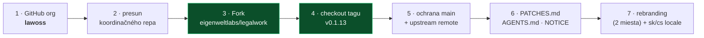
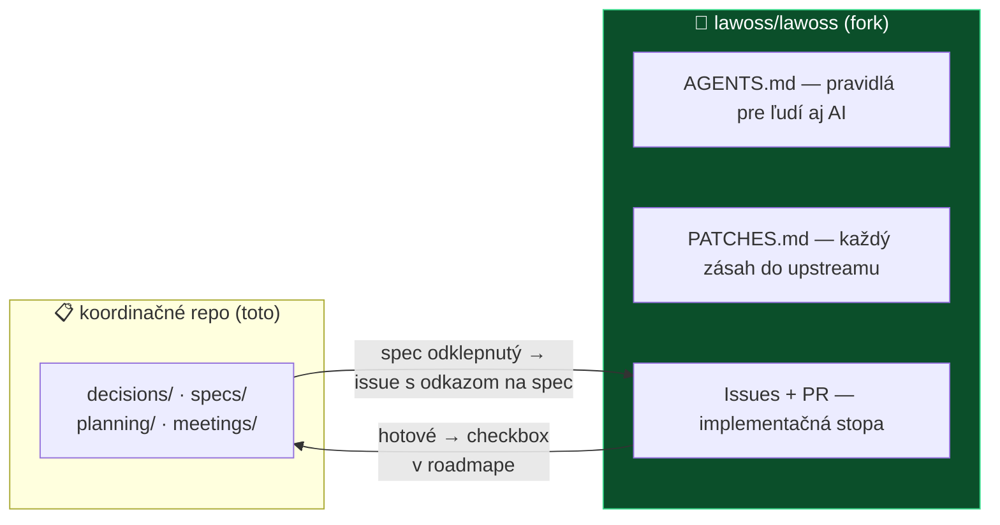
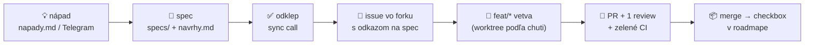
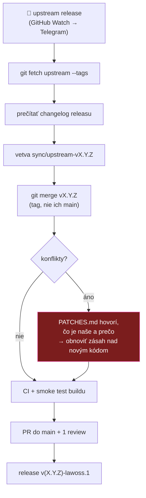
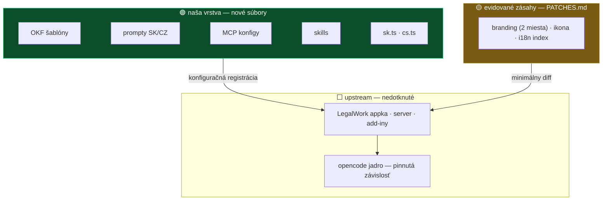

<div align="center">

# 🛠️ Plán: fork, repozitár a spôsob práce

**Ako založíme fork LegalWorku, ako budeme štyria fungovať a ako fork udržíme lacný**


</div>

> [!IMPORTANT]
> **Tento dokument je vykonávací plán, nie nové rozhodnutie.** Stavia na [ADR 0004](../decisions/0004-ako-rozsirit-legalwork.md) (forkujeme LegalWork pod vlastným brandingom) a [ADR 0005](../decisions/0005-struktura-repozitarov.md) (koordinácia oddelene od kódu). Cieľ: aby po odklepnutí na calle 12. 8. bolo založenie forku **mechanická práca na menej než hodinu** a aby sme od prvého dňa fungovali podľa dohodnutých pravidiel, nie ad hoc.

---

## 0️⃣ Čo je rozhodnuté a čo tento plán dopĺňa

| Otázka | Stav | Kde |
|---|---|---|
| Základ = LegalWork (MIT, opencode harness) | ✅ rozhodnuté *(čaká potvrdenie MF)* | [ADR 0003](../decisions/0003-legal-work-ako-zaklad.md) |
| Fork pod vlastným brandingom LAWOSS | ✅ rozhodnuté | [ADR 0004](../decisions/0004-ako-rozsirit-legalwork.md) |
| Koordinácia a kód v oddelených repách | 📝 návrh na odklep | [ADR 0005](../decisions/0005-struktura-repozitarov.md) |
| **Ako presne fork založiť, branching, worktrees, sync rytmus, architektúra addonov, rozdelenie práce** | **📄 tento plán** | nižšie |

### Uzavretie otázky „ako forknúť"

[Analýza LegalWorku](../research/inspiracie/legalwork.md) (2026-08-04) varovala, že *„klasický fork ruší výhodu upstreamu"* — a `AGENTS.md` to dodnes eviduje ako otvorené. **ADR 0004 (2026-08-06) túto otázku fakticky uzavrel** a rozpor sa dá zmieriť takto:

- Varovanie platí pre fork, ktorý **prepisuje cudzí kód**. My kód takmer neprepisujeme — naše zmeny sú **nové súbory** (SK/CZ locale, vlastné adresáre) plus **2 evidované miesta brandingu**.
- **opencode jadro nefokujeme vôbec** — LegalWork ho drží ako pinnutú externú závislosť (`constants.json`) a my to po forku zdedíme nezmenené. Vrstva, kde sa upstream hýbe najrýchlejšie, sa nás teda merge-ovo netýka.
- Divergenciu forku ohraničuje disciplína: pravidlo *„pridávaj súbory, neupravuj cudzie"* + `PATCHES.md` + upstream-first pre všeobecné veci (viď [sekciu 4](#4️⃣-synchronizácia-s-upstreamom--runbook)).

→ Po potvrdení tímom **aktualizovať riadok v `AGENTS.md`** (úloha v závere).

### Overené k 2026-08-10 *(GitHub API)*

- Najnovší release upstreamu je stále **`v0.1.13`** (2026-08-04) — kandidát na fork z ADR 0004 platí.
- Meno **`lawoss`**: podľa GitHub API **taký účet neexistuje** (404 pre organizáciu aj používateľa) — meno je s najväčšou pravdepodobnosťou voľné, ale definitívne sa to potvrdí až pri zakladaní organizácie (GitHub niektoré mená rezervuje).

---

## 1️⃣ Deň D — založenie repozitára (runbook)

Poradie je záväzné: **organizácia pred forkom** (ADR 0005 — presúvať fork neskôr = zbytočná robota s remote URL a CI tajomstvami).



| # | Krok | Detail | Kto |
|---|---|---|---|
| 1 | **Založiť organizáciu `lawoss`** | meno voľné *(overené 2026-08-10)*; nastaviť 2FA povinné, členovia MČ · MF · IR · VŘ | MČ |
| 2 | **Presunúť koordinačné repo** do organizácie | GitHub drží presmerovania; **pozor na GitHub Pages URL** — opraviť odkazy | MČ |
| 3 | **Fork cez tlačidlo *Fork*** z [eigenweltlabs/legalwork](https://github.com/eigenweltlabs/legalwork) do `lawoss/lawoss` | nie klonovaním — inak nefunguje *Sync fork* ani väzba na upstream | MČ |
| 4 | **Vetvu `main` postaviť na tag `v0.1.13`** | forkneme celú históriu, ale pracujeme od releasu, nie od tip-u `main` | MČ |
| 5 | **Ochrana `main`** (force-push ❌, delete ❌, **PR povinný — 1 approval**) + `git remote add upstream https://github.com/eigenweltlabs/legalwork` | prísnejšie než koordinačné repo — je to kód, viď [sekciu 2](#2️⃣-workflow-vo-forku--vetvy-pr-worktrees) | MČ |
| 6 | **Založiť `PATCHES.md`, `AGENTS.md` (+ symlink `CLAUDE.md`), `NOTICE`** | šablóny nižšie; `NOTICE` = atribúcia Eigenwelt Labs + pôvodná MIT licencia zostáva | MČ |
| 7 | **Rebranding + kostra lokalizácie** | `tauri.conf.json` + `productName` *(overené: iba 2 miesta)* → prvé dva záznamy v `PATCHES.md`; `sk.ts`/`cs.ts` ako nové súbory | MČ + VŘ |

**Čo v deň D robiť NETREBA:** podpisové tajomstvá (Apple Developer účet je samostatný blokátor), CI ladenie (zdedené workflow nechať bežať a opraviť až to, čo reálne spadne), veľké UI zmeny.

> [!TIP]
> **Nultý krok ešte pred forkom** *(z [agendy 12. 8.](../meetings/2026-08-12-agenda-mvp.md))*: MCP konektory (judikatúra + Slov-Lex) sa dajú kolegom rozdať **hneď** ako návod so screenshotmi — LegalWork ich pridáva cez Settings UI. Prvý reálny výstup bez čakania na fork.

---

## 2️⃣ Workflow vo forku — vetvy, PR, worktrees

Koordinačné repo zostáva ako je (markdown, push do `main` pri drobnostiach). **Fork má prísnejšie pravidlá**, lebo kód sa merguje horšie než markdown a výstupom sú podpísané binárky:

| | Koordinačné repo | Fork `lawoss/lawoss` |
|---|---|---|
| Push do `main` | ✅ pri drobnostiach | ❌ **nikdy — všetko cez PR** |
| Review | nepovinné | **1 approval povinný** *(pri 4 ľuďoch nezdržuje, chráni pred rozbitím buildu)* |
| CI | auto-README | zdedené `ci-tests.yml` + `ci-i18n.yml` musia byť zelené pred merge |
| Jazyk commitov | slovenčina | slovenčina; `typ: čo` — `feat:` `fix:` `loc:` `sync:` `chore:` |

### Menné konvencie vetiev

```
feat/okf-zalozenie-spisu      nová funkcia (odkaz na spec v popise PR)
fix/ocr-pdf-encoding          oprava
loc/sk-locale                 lokalizácia
sync/upstream-v0.1.14         merge upstream releasu (viď sekcia 4)
```

Vetvy žijú krátko (dni, nie týždne) — dlhá vetva vo forku znamená dvojitý merge dlh (voči `main` **aj** voči upstreamu).

### Worktrees — osobný nástroj, nie politika repa

Worktree nie je nič, čo by sme „zaviedli do repa" — je to **lokálna vec každého z nás**: jeden klon, viac pracovných priečinkov, každý na inej vetve. Odporúčané použitie: **jedna worktree na jednu úlohu/AI session**, aby paralelné Claude/opencode sessions nešliapali po tom istom priečinku. Kto pracuje na jednej veci naraz, worktrees nepotrebuje.

```bash
git worktree add ../lawoss-okf feat/okf-zalozenie-spisu   # nová worktree pre úlohu
git worktree remove ../lawoss-okf                          # po mergnutí PR
```

### Verzovanie forku

Verzia musí niesť informáciu, **na akom upstreame stojíme** — navrhujem `v<upstream>-lawoss.<n>`:

```
v0.1.13-lawoss.1   prvý náš release nad upstream v0.1.13
v0.1.13-lawoss.2   naša oprava, upstream nezmenený
v0.1.14-lawoss.1   po synci na ich v0.1.14
```

---

## 3️⃣ Dlhodobá pamäť projektu a implementácia nových vecí

### Kde čo žije — jedna veta: **rozhodnutia tu, kód tam**



- **ADR a specy sa do forku NEPRESÚVAJÚ.** Koordinačné repo zostáva jediným zdrojom pravdy o *prečo* a *čo*. Fork nesie iba *ako* — technickú dokumentáciu, `PATCHES.md` a implementačnú stopu v issues/PR.
- **`AGENTS.md` vo forku** (s `CLAUDE.md` symlinkom, rovnaký vzor ako tu) je pamäť pre AI agentov: pravidlá z tohto plánu — *pridávaj súbory*, *zapíš do PATCHES.md*, *nedotýkaj sa červenej zóny* — musia byť tam, inak ich agenti nebudú dodržiavať. To je hlavná poistka udržateľnosti pri práci s AI.
- **Krížové odkazy povinné:** README forku odkazuje na koordinačné repo a naopak; každý PR vo forku odkazuje na spec/ADR, z ktorého vychádza.

### Ako sa implementuje nová vec — jeden pipeline pre všetkých



Pravidlá po ceste: nič sa nezahadzuje (aj zamietnuté nápady zostávajú s dôvodom) · autorstvo v `navrhy.md` musí sedieť · ak PR siahol na upstream súbor, **v tom istom PR** pribudne riadok v `PATCHES.md` — review to kontroluje.

### Dvojjurisdikčnosť 🇸🇰🇨🇿 — štrukturálne, nie poznámkou pod čiarou

Vojta ťahá českú jurisdikciu — tá nesmie byť „preklad na konci", ale **os adresárovej štruktúry** našej domény:

```
lawoss/                     ← naša doména vo forku (zelená zóna, upstream ju nepozná)
├── okf/
│   ├── sk/                 šablóny spisov, lehoty, nomenklatúra SR
│   └── cz/                 to isté pre ČR — vlastní VŘ
├── prompts/
│   ├── common/             spoločné (štýl, formát citácií…)
│   ├── sk/                 SK právny kontext
│   └── cz/                 CZ právny kontext — vlastní VŘ
├── mcp/
│   ├── sk.json             registrácie SK serverov (judikatúra, Slov-Lex, ORSR…)
│   └── cz.json             CZ zdroje — vlastní VŘ
└── skills/                 opencode Agent Skills (per-jurisdikcia tam, kde treba)
```

- UI lokalizácia: `sk.ts` **a** `cs.ts` vznikajú súčasne (MČ + VŘ), `ci-i18n.yml` stráži kompletnosť.
- Právne názvoslovie: [glosár](../docs/) dostane **CZ stĺpec** — jeden termín, dve jurisdikcie, žiadne tiché počešťovanie SK textov ani naopak.
- Táto štruktúra drží doménu **prenosnú** (ADR 0004, pravidlo č. 5) — skills, prompty a MCP konfigy fungujú aj v čistom opencode či Claude Code.

---

## 4️⃣ Synchronizácia s upstreamom — runbook

Zásada z ADR 0004: **synchronizujeme pri ich releasoch, nie priebežne.** Upstream vydáva rýchlo (v0.1.13 vyšiel 4. 8.), takže rátajme rytmus ~1–2× mesačne.



```bash
git fetch upstream --tags
git checkout -b sync/upstream-v0.1.14 main
git merge v0.1.14              # tag releasu, nikdy upstream/main
# konflikty → PATCHES.md, obnoviť naše zásahy
git push -u origin sync/upstream-v0.1.14 && gh pr create --fill
```

### `PATCHES.md` — šablóna

```markdown
| Upstream súbor | Náš zásah | Prečo | Vlastník | PR |
|---|---|---|---|---|
| tauri.conf.json | productName, identifier, ikona | branding LAWOSS | MČ | #1 |
```

Pravidlo: **žiadny zásah do upstream súboru bez riadku tu.** Pri merge konflikte je tabuľka checklist — každý riadok sa po merge overí, že prežil.

### Kto rieši merge konflikty — návrh na odklep

Otvorený blokátor z callu 6. 8. Návrh:

1. **Sync vlastní MČ** — vykonáva runbook s AI asistenciou (typický konflikt u nás = branding riadky, nie logika; na to AI stačí).
2. **Konflikt v zásahu rieši vlastník zásahu** podľa stĺpca *Vlastník* v `PATCHES.md`.
3. **Eskalácia:** ak konflikt presahuje kapacitu tímu, zvážiť **zahodenie nášho zásahu** a iné riešenie (nový súbor, upstream PR) — zásah, ktorý sa nedá udržať, je dlhodobo drahší než funkcia, ktorú prináša.

### Upstream-first

Všetko, čo nie je špecificky SK/CZ doména, **ponúknuť najprv upstreamu** — každý prijatý PR zmenšuje náš diff (ADR 0004). Poradie kandidátov: `sk.ts`/`cs.ts` lokalizácia → opravy bugov → drobné vylepšenia UI. Lokalizačný PR je zároveň náš vstup do ich komunity — podať ho **skoro**, nech vzťah existuje skôr, než budeme niečo potrebovať my.

---

## 5️⃣ Architektúra addonov — tri zóny

Aby features nerozbili základ, každý súbor vo forku patrí do jednej z troch zón. **Toto je najdôležitejšia tabuľka celého plánu** a patrí do `AGENTS.md` forku:

| Zóna | Čo | Pravidlo |
|---|---|---|
| 🟢 **Naše adresáre** | `lawoss/**` (OKF, prompty, MCP konfigy, skills) · `apps/app/src/i18n/locales/sk.ts`, `cs.ts` · naša dokumentácia | Voľná ruka. Nové súbory sa s upstreamom **nikdy** nezrazia. Sem patrí ~90 % našej práce. |
| 🟡 **Evidované zásahy** | `tauri.conf.json` · `productName` · ikony · registrácia locale v i18n indexe · výnimočne iné | Každý zásah = riadok v `PATCHES.md` + vlastník. Pred pridaním nového sa pýtaj: *nejde to novým súborom alebo upstream PR?* Cieľ: **držať tabuľku pod ~10 riadkami.** |
| 🔴 **Zakázaná zóna** | plugin `legalwork-legalmemory-knowledge` (AGPL-3.0 — licenčné riziko, ADR 0004) · hard-coded extension registry (`apps/server/src/extensions/`) · bump `opencodeVersion` v `constants.json` · prepis histórie | Nedotýkať sa. Zmena len cez nový ADR. |

### Prečo to bude držať: rozšírenia sú konfiguračné, nie kódové

Overené v analýze (2026-08-04): opencode harness podporuje **čisto konfiguračne** MCP servery, agentov a subagentov, Agent Skills, pluginy cez SDK a custom commands. Naše SK/CZ features sa teda pripájajú **registráciou, nie zásahom do jadra**:



Dôsledok pre V1 scope ([agenda 12. 8.](../meetings/2026-08-12-agenda-mvp.md)): lokalizácia, OKF, MCP konektory, lehoty aj OCR ingest — **všetko sa zmestí do zelenej zóny.** Ak sa počas implementácie ukáže, že niečo zelenú zónu opustiť musí, je to signál na zastavenie a rozpravu, nie na tichý zásah do jadra.

---

## 6️⃣ Rozdelenie práce

Prevzaté z [agendy 12. 8.](../meetings/2026-08-12-agenda-mvp.md) a [roadmapy](roadmap.md), doplnené o infraštruktúru z tohto plánu. **Definitívne rozdelenie odklepne call.**

| Oblasť | Kto | Poznámka |
|---|---|---|
| Organizácia + fork + ochrana vetiev (deň D) | MČ | runbook v sekcii 1 |
| `PATCHES.md` · `AGENTS.md` forku · `NOTICE` | MČ | šablóny v tomto pláne |
| SK/CZ lokalizácia rozhrania | MČ + VŘ | nové súbory; kandidát na prvý upstream PR |
| OKF — založenie spisu a štruktúra | MČ | zelená zóna `lawoss/okf/sk/` |
| MCP konektory: judikatúra + Slov-Lex (+ nultý krok návod) | MČ | `lawoss/mcp/sk.json` |
| Lehoty a timeline spisu | MF | spec 0005 |
| OCR ingest → markdown | MČ | hotová Quick Action |
| UI/CLI prepínač | VŘ | |
| CZ jurisdikcia: `cz/` adresáre, glosár, CZ zdroje | VŘ | os štruktúry, viď sekcia 3 |
| Upstream sync (runbook sekcia 4) | MČ *(návrh)* | konflikt rieši vlastník zásahu |
| Apple Developer účet + podpisové tajomstvá | ❓ | otvorený blokátor |

---

## 7️⃣ Na odklep 12. 8. — checklist rozhodnutí

*(vedome bez checkbox syntaxe, aby to nefalšovalo progress bary v README)*

1. ☐ **Potvrdenie ADR 0003 + 0004 od MF** — bez toho sa fork nezakladá
2. ☐ **GitHub organizácia `lawoss`** — áno/nie; odporúčam **áno, pred forkom** (účet s tým menom podľa API neexistuje, overené 2026-08-10; potvrdí sa pri zakladaní)
3. ☐ **Tag forku: `v0.1.13`** — stále najnovší release (overené 2026-08-10)
4. ☐ **Pravidlá forku z tohto plánu** — PR povinný, PATCHES.md, tri zóny, verzovanie `v*-lawoss.n`
5. ☐ **Vlastník upstream syncu** — návrh MČ + „konflikt rieši vlastník zásahu"
6. ☐ **Rozdelenie práce** zo sekcie 6
7. ☐ **Apple Developer účet** — kto zriadi a platí
8. ☐ **Zverejnenie `judikaty-mcp`** + licencia — blokuje komunitnú časť
9. ☐ **`LICENSE` do koordinačného repa** — stále chýba (MČ)

**Po odklepe:** aktualizovať `AGENTS.md` (riadok *„⚠️ Otvorené: ako forknúť"* → vyriešené týmto plánom a ADR 0004) · preklopiť ADR 0005 zo stavu *návrh* · zapísať rozhodnutia do zápisu z callu.

---

<sub>Pripravil MČ s AI asistenciou, 2026-08-10. Fakty overené cez GitHub API k 2026-08-10 (release `v0.1.13`, dostupnosť mena `lawoss`); ostatné vychádza z ADR 0003–0005 a analýzy LegalWorku. Návrhy označené ako *návrh na odklep* nie sú rozhodnutia.</sub>
