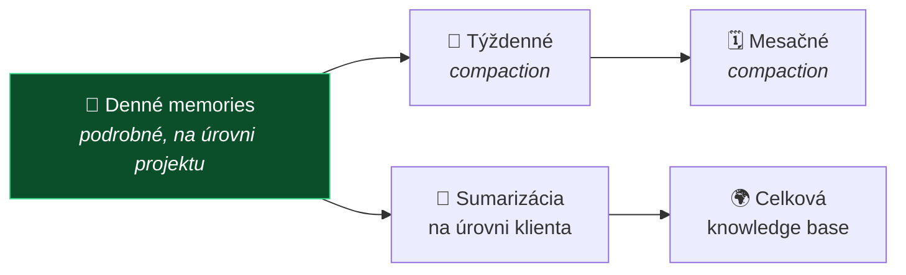

# 💡 Feature IDEAS — spracovanie Telegram topicu

**Obdobie 2026-07-29 → 2026-08-07 · 31 správ**

> [!NOTE]
> **Metóda.** Stiahnutá kompletná história topicu *Feature IDEAS* (id 97) zo skupiny *LawOSS (SLOVAKIA | CZECHIA) + AI Frontier Labs*, vrátane vnorených vlákien. Čísla v hranatých zátvorkách sú **id správ** — slúžia na dohľadanie originálu. Licencie a fakty o projektoch **overené cez GitHub API 2026-08-07**; obsah odkazov na X/Twitter overený nebol.

---

## 📋 Čo z toho vzišlo

| Návrh | Kto | Správa | Kam zapísané |
|---|---|---|---|
| Natívna autorizácia PDF/XML — QES + QTS cez Autogram | **MČ** | [209], [221] | [návrh #19](../../specs/navrhy.md) |
| Tiered memory s compaction | **MČ** *(podporil VŘ)* | [161], [159] | [návrh #21](../../specs/navrhy.md) |
| Zjednotenie komunikačných kanálov do spisu | **VŘ** | [156]–[158] | [návrh #22](../../specs/navrhy.md) |
| Self-healing a self-updating integrácie | **MČ** | [217] | [návrh #23](../../specs/navrhy.md) |
| Self-evolving / self-correcting systém | **MČ** | [105] | [návrh #24](../../specs/navrhy.md) |
| CMR a case audit systém | **MČ** | [145] | [návrh #25](../../specs/navrhy.md) |

---

## 🔏 Autorizácia PDF a XML — QES + QTS

**MČ [209], 6. 8.:** *„Napadlo ma spraviť v tej appke natívnu autorizáciu PDFiek cez QES ak s QTS 😬 robím práve nativny fork Autogram na macOS a už dlhšie používam na to quick actions vo Finder cez natívne CLI autogram bez terminálu"*

**MČ [221], 7. 8.:** *„ta autorizacia suborov by sa dala spravit aj cez API Autogram. je potrebné to preskúmať."*

Ide o [Autogram](https://github.com/slovensko-digital/autogram) od Slovensko.Digital. MČ ho už dnes používa cez CLI ako Finder quick action a robí naň vlastný natívny fork pre macOS.

### ⚠️ Licenčné zistenie — overené 2026-08-07

| Repozitár | Licencia | Čo to je |
|---|---|---|
| [`autogram`](https://github.com/slovensko-digital/autogram) | **EUPL-1.2** | hlavná desktopová aplikácia (Java), 151 ⭐ |
| [`autogram-core`](https://github.com/slovensko-digital/autogram-core) | **EUPL-1.2** | Java knižnica nad DSS na tvorbu a validáciu podpisov |
| [`autogram-sdk`](https://github.com/slovensko-digital/autogram-sdk) | **EUPL-1.2** | TypeScript SDK |
| [`autogram-portal`](https://github.com/slovensko-digital/autogram-portal) | **EUPL-1.2** | portál na podpisovanie s eIDAS QES |

**Celý ekosystém je EUPL-1.2, čo je reciproká (copyleft) licencia.** To má priamy dopad na náš zámer držať produkt pod MIT:

- ❌ **Nevendorovať a neforkovať Autogram do našej MIT aplikácie.** Odvodené dielo by muselo byť EUPL; kompatibilná doložka EUPL umožňuje prechod na GPL/AGPL/MPL, **nie na MIT**.
- ✅ **Volať ho ako samostatný proces** — cez CLI alebo lokálne API. Oddelený proces s vlastnou licenciou nie je odvodené dielo. Je to **presne ten istý vzor**, akým LegalWork drží opencode a akým sme navrhli riešiť LegalMemory.
- MČ-ov natívny macOS fork Autogramu je **v poriadku ako samostatný projekt** pod EUPL — len sa nesmie zliať do LAWOSS.

> [!IMPORTANT]
> **Toto je už tretíkrát, čo nás licencia dobehla:** mikeOSS (AGPL-3.0) → zamietnutý ako základ · LegalMemory (AGPL-3.0 + CLA) → len ako oddelený appliance · Autogram (EUPL-1.2) → len ako externý proces.
> **Odporúčanie:** pri každom novom komponente overiť licenciu **skôr**, než sa naň naviaže návrh funkcie. Vzor je vždy rovnaký — *volať, neintegrovať*.

### Väzba na existujúce riziko

[Spec 0004](../../specs/0004-mcp-sk-konektory.md) varuje, že úkony pod kvalifikovaným podpisom sú najrizikovejšia oblasť projektu: *„dávame pravdepodobnostnému modelu možnosť konať v mene advokáta"*. Tu ide o podpis, ktorý **spúšťa advokát**, nie agent — ale spec to musí povedať výslovne a definovať human gate.

---

## 🧠 Tiered memory s compaction

**MČ [161], 4. 8.:** návrh viacúrovňovej pamäte —

**VŘ [159]:** *„Nicméně «pamět případu» je základní kámen právní práce. Bez tohoto nemůže fungovat žádnej agent."*

**MČ [160]:** základné memory funkcie modelov *„niesu dostatočne pokročilé na komplikovanú právnu prácu"*.

> [!TIP]
> **Toto je najsilnejší kandidát na vlajkovú funkciu alfy.** SK aj CZ strana sa na ňom zhodli nezávisle. Zároveň MČ [154] správne poznamenal, že *„ten OKF by možno stačil"* — [OKF](../../specs/0002-okf-operacny-system-praxe.md) už dáva štruktúru, ktorú LegalMemory prácne dobýva nad cudzím DMS. Stačí nad ňu tenký index a compaction, nie celá ich pipeline.

---

## 📨 Zjednotenie komunikačných kanálov

**VŘ [156]–[158], 4. 8.:** *„ta překážka, se kterou jsem se setkal, tkví právě v separaci jednotlivých komunikačních kanalů… V podstatě si pak «ručně» volám jednotlivý komunikační kanály a pak si tyto informace vkládám do spisu… A tenhle problém zatím neumím vyřešit."*

Ide o **jediný explicitne pomenovaný nevyriešený problém z praxe** v celom topicu. Advokát dostáva podklady e-mailom, cez dátovú schránku, SMS, WhatsApp, telefonicky — a ručne to prenáša do spisu.

Nie je pokrytý žiadnym specom. Väzba na [OKF](../../specs/0002-okf-operacny-system-praxe.md) a na *digitálnu sekretárku* ([návrh #10](../../specs/navrhy.md)).

---

## 🔄 Self-healing a self-updating integrácie

**MČ [217], 6. 8.:** *„Všetky funkcie, ktoré budú integrované budú self healing a self updating. Tz. MCP, skilly, CLI tools a podobne budú vždy udržiavané aktuálne automaticky, aby nemuseli ľudia riešiť vôbec. jednoduché cron jobiky na tieto veci by sme implementovali"*

Sedí to priamo na princíp č. 1 *(nie sme programátori → minimálny maintenance)*. Otvorené otázky do specu: čo pri **breaking change** v MCP serveri, ako sa rieši rollback, a či sa smie automaticky aktualizovať niečo, čo pracuje s klientskymi dátami, bez vedomia advokáta.

---

## 🧬 Self-evolving / self-correcting systém

**MČ [105], 29. 7.:** *„Self evolving a Self correcting system - forknut z Hermes Agent? 🤔"*

Najstarší nápad v topicu, odvtedy nerozvinutý. Súvisí s [návrhom #23](../../specs/navrhy.md) — obe sú o systéme, ktorý sa udržiava sám.

---

## 🔍 Konkurencia a inšpirácie

| Čo | Kto zdieľal | Zistenie |
|---|---|---|
| [forlegal.ai](https://www.forlegal.ai/) 🇨🇿 | **VŘ** [190], [191] | **Platený konkurent.** VŘ z videí a špecifikácie odhaduje: *„chatbot se skilly pro netechnické uživatele, který funguje nejspíše přes Docker na VPS serveru Hetzner, nebo na (AWS) v Německu"* — **odhad, neoverené** |
| [legaltools.cz](http://legaltools.cz/) 🇨🇿 | **MČ** [169] | sprístupnil koncipient v ČR; nepreskúmané |
| [LegalMemory](https://eigenweltlabs.com/legalmemory) 🇩🇪 | **MČ** [154] | spracované v [brainstormingu 4. 8.](../../meetings/2026-08-04-brainstorming-zaklad-a-prenositelnost.md) — AGPL-3.0 + CLA |
| [oh-my-pi](https://github.com/can1357/oh-my-pi) | **MČ** [143] | **MF [147]** dodal podrobnú oponentúru cez Codex — telemetria zapnutá defaultne, bearer-link collab, veľký privilege surface. Zamietnuté v [ADR 0003](../../decisions/0003-legal-work-ako-zaklad.md) |
| [Firecrawl](https://x.com/firecrawl/status/2084670366803218774) | **MČ** [187], [188] | *„na parsovanie dokumentov"* — obsah odkazu **neoverený** |
| buzz.xyz | **MČ** [107] | bez reakcie, nepreskúmané |
| [OpenAI devs](https://x.com/openaidevs/status/2085398373511918022) | **MČ** [218], [219] | *„Veľká vec, jednotný štandard 👏"* — o aký štandard ide, **z topicu nevyplýva**; treba doplniť |

---

## 🧭 Strategické vyjadrenia z topicu

**MČ [193], 5. 8.** — najstručnejšia formulácia tézy projektu, aká zatiaľ padla:

> „Idea celého tohto projektíku je, že ideme robiť open source produkt, založený na iných produktoch, len tam prihodíme naše workflows, prompty, MCPčka a pod."

**MČ [145], 2. 8.:**

> „Podľa mňa my nemáme kapacity to udržiavanie veľmi komplikovaného harness, preto by som sa sústredil najmä na tie špecializované features, skills, prompts, OKF client folders a nejaké kvalitne CMR a case audit system"

Obe sedia na [ADR 0004](../../decisions/0004-ako-rozsirit-legalwork.md) a na princípy zapísané v [AGENTS.md](../../AGENTS.md).

---

## ✅ Na doriešenie

- [ ] Preskúmať **API Autogramu** ako cestu namiesto forku — MČ [221]
- [ ] Rozhodnúť, či sa QES/QTS ide robiť, a ak áno, napísať spec s human gate
- [ ] Doplniť, o aký **jednotný štandard** išlo v [219]
- [ ] Preskúmať **legaltools.cz** a **buzz.xyz**
- [ ] Overiť odhad VŘ o stacku forlegal.ai *(zatiaľ dohad)*

---

Spracované 2026-08-07 z Telegram topicu *Feature IDEAS*. Licencie projektov overené cez GitHub API v ten istý deň — pri ďalšom použití preveriť znova.
