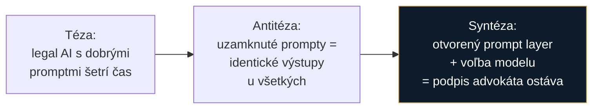
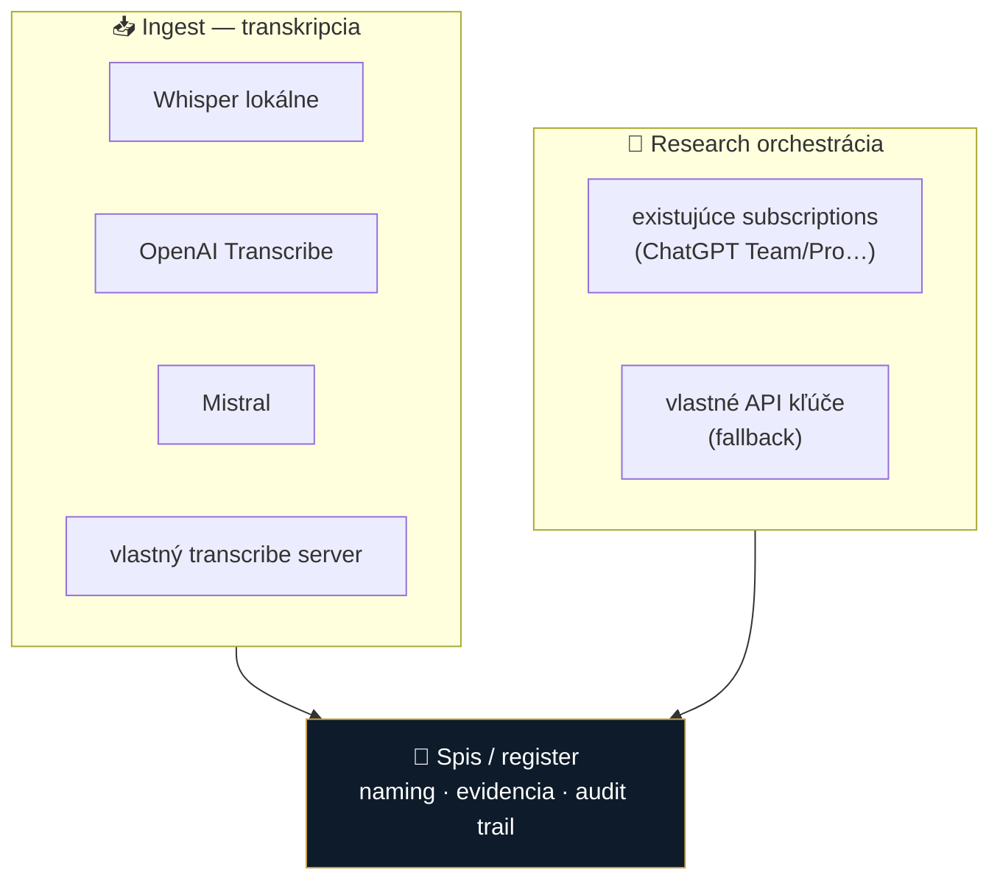

# 💡 Idey a strategické poznámky

Vstupy pre koncept **„mikeOSS Slovakia"** *(pracovný názov — finálny názov zatiaľ neriešený)*

## Zdrojové poznámky

| Súbor | O čom to je |
|---|---|
| [Build-open vs. Buy-closed](2026-07-29-build-open-vs-buy-closed.md) | Verdikt o právnickom AI stacku — prečo otvorený modulárny stack namiesto uzavretých legal-AI black boxov |
| [Orchestrátor + BYO subscriptions](2026-07-29-orchestrator-transkripcia-byo-subscriptions.md) | Návrh open-source orchestrátora: dvojkoľajka transkripcia + research cez existujúce subscriptions |

## Čo z toho berieme (destilát)

### 1. „Workflow nad inteligenciou"
Aplikácia je **lepidlo a register (zdroj pravdy)**, nie monolitický AI engine. Najväčšia hodnota pre advokáta nie je model, ale **štruktúra práce**: názvoslovie súborov, spisy, evidencia, ukladanie výstupov k veci.

> Toto je najsilnejšia myšlienka z poznámok — a zároveň to, čo v roaste vyčítal „cieľový advokát": *predávaš mi istotu a poriadok, nie kód.*

### 2. Otvorený prompt layer = konkurenčný podpis advokáta

Uzavreté legal-AI aplikácie uniformizujú štýl a štruktúru podaní naprieč používateľmi → **strata diferenciácie**. Náš prompt layer musí byť **transparentný, editovateľný, verzovaný** (per užívateľ / per vec).

### 3. Dvojkoľajka: Transkripcia + Research

### 4. Nákladová politika: model podľa rizika úlohy
| Typ úlohy | Model |
|---|---|
| Kritické výstupy (podania, zmluvy) | **prémiový model** — racionálne zaplatiť |
| Nízkorizikové (OCR, prepisy, sumáre) | **lacné / open-source** komponenty (napr. Mistral OCR na PDF→Markdown) |

Pozorovanie z poznámok: špecializované legal-AI appky **šetria na modeloch**, čím degradujú právnu kvalitu. Nerobme to isté.

### 5. BYO-subscription ako produktová os
- Náklad nesie používateľ cez **vlastné predplatné** (téza: research za ~20 €/mes. vs stovky € cez raw API).
- Aplikácia je **len orchestrátor** — to je zároveň to, čo nás drží mimo pozície „poskytovateľa služby" ([ADR 0002](../../decisions/0002-preco-forkujeme-mikeoss.md)).
- ⚠️ **ToS citlivosť:** neobchádzať podmienky ChatGPT/Team — aplikácia smie len sprostredkovať. Toto treba právne posúdiť (sme advokáti, mali by sme to zvládnuť).

### 6. Compliance vrstva (nutná, nie voliteľná)
- **Audit trail** — kto/kedy/čo transkriboval a exportoval, immutable log k spisu
- **Data routing** — čo ide lokálne vs do cloudu; EU region pinning
- **Klasifikácia dát** — PII / klientske tajomstvo
- Nadväzuje na 3 podmienky z ADR 0002 a na *Metodické usmernenie SAK 2025*

## Prepojenie na kandidátov

Poznámky **dvakrát spomínajú „taliansky OpenCode variant"** na posúdenie — s vysokou pravdepodobnosťou ide o **[LegalWork](https://github.com/eigenweltlabs/legalwork)**, ktorý je teraz zaradený v [inspiracie/](../inspiracie/). Sedí na viacero bodov naraz: lokálny beh, bring-your-own-model, MCP/skills rozšírenia.

## Otvorené otázky

- [ ] **Názov projektu** — „mikeOSS Slovakia" je pracovný; vyriešiť (súvisí aj s tým, ktorý základ nakoniec zvolíme)
- [ ] MVP scope: Transcribe · Research Orchestrator · File/Case Management · Settings (BYO) · Audit trail — čo z toho je v1?
- [ ] ToS analýza pre sprostredkované používanie subscriptions
- [ ] Naming konvencie a šablóny spisov (konfigurovateľné per kancelária)
