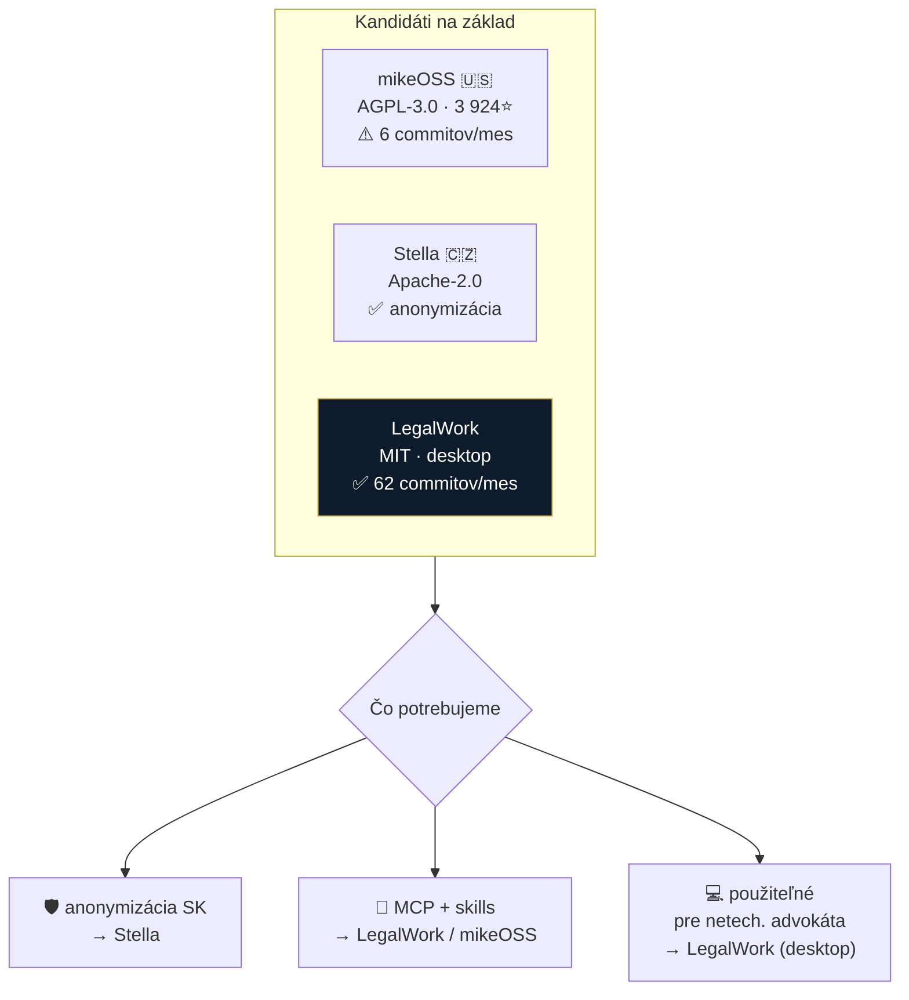

# 🔎 Inšpirácie — kandidáti na základ

**mikeOSS · Stella · LegalWork** — porovnanie k **2026-07-29**

> [!IMPORTANT]
> **Nový kandidát: [LegalWork](https://github.com/eigenweltlabs/legalwork)** (Eigenwelt Labs). Mení otvorenú otázku z [ADR 0002](../../decisions/0002-preco-forkujeme-mikeoss.md) z „mikeOSS vs Stella" na **trojku**. Kľúčové zistenie: **LegalWork je ~10× aktívnejšie vyvíjaný než mikeOSS** (62 vs 6 commitov za 4 týždne).

## Porovnanie (overené cez GitHub API, 2026-07-29)

| | **mikeOSS** | **Stella** | **LegalWork** ⭐ nový |
|---|---|---|---|
| Repo | `Open-Legal-Products/mike` | `stella` (CZ) | `eigenweltlabs/legalwork` |
| Pôvod | 🇺🇸 Will Chen (ex-Latham) | 🇨🇿 Česko | Eigenwelt Labs *(pôvod neoverený)* |
| Licencia | **AGPL-3.0** | Apache-2.0 *(z rešerše)* | **MIT** *(kompozit s 3rd-party)* |
| Jazyk | TypeScript | TypeScript | TypeScript + Electron *(opravené 2026-08-12 — nie Tauri)* |
| Vznik | 2026-04-29 | — | 2026-06-23 |
| Posledný push | 2026-07-08 | — | **2026-07-29 (dnes)** |
| Commity / 4 týždne | **6** | — | **62** |
| Prispievatelia | 3 | — | 2 |
| ⭐ | 3 924 | — | 81 |
| Forma | web app | workspace | **desktop app** (macOS/Win/Linux) |
| Anonymizácia | ❌ | ✅ WASM | ❌ |
| MCP podpora | ✅ | — | ✅ **skills + pluginy + MCP** |

## LegalWork — čo vie (z README, overené)

- **Review & redline** zmlúv ako *tracked changes priamo vo Worde* — presne advokátsky workflow
- **Tabular review** — extrakcia podmienok naprieč dokumentmi do citovanej mriežky
- **Draft** — podania, memá, zmluvy, engagement letters
- **Bring your own model** — AWS Bedrock, Azure OpenAI, *„alebo akýkoľvek provider"*; dáta idú len do modelu, ktorý si zvolíš
- **Beží lokálne** na tvojom stroji (remote worker len ak chceš) → sedí na dátovú suverenitu
- **Rozšíriteľné cez skills, pluginy a MCP konektory** (*Settings → Extensions*) → sem by šli naše SK MCP
- Telemetria: anonymná, EU-hosted PostHog, **vypnuteľná**; dev buildy neposielajú nič

> [!TIP]
> **✅ OVERENÉ (2026-07-29)** — plná analýza vrátane čítania zdrojového kódu: **[legalwork.md](legalwork.md)**
>
> 1. **Subscription podpora: ÁNO** — *Claude Pro/Max* sign-in je implementovaný. **ALE** appka sama varuje, že Anthropic Consumer Terms obmedzujú ten OAuth na Claude Code/claude.ai → *„third-party use may violate those terms and can be blocked without notice"*. **Nestavať na tom produkt.**
> 2. **Pôvod: Berlín 🇩🇪**, nie Taliansko. Pre nás lepšie — EU jurisdikcia.
> 3. **Transkripcia už existuje** — on-device (whisper.cpp, parakeet), vrátane systémového diktátu = náš [spec 0001](../../specs/0001-transkripcia.md).
> 4. **Free modely sú logované** → pre advokáta iba vlastný model.
> 5. **Open-core**: zadarmo pre jednotlivcov; *firm deployment* (audit log, správa prístupov) je platený.
> 6. **Slovenčina chýba** (12 jazykov, SK/CZ nie) → príležitosť prispieť do upstreamu.

## Čo si z čoho zobrať

| Potreba | Odkiaľ |
|---|---|
| 🛡️ Anonymizácia SK/CZ | **Stella** (Apache-2.0 → dá sa priamo použiť) + MasKIT |
| 💻 Desktop UX pre netechnického advokáta | **LegalWork** (hotové inštalátory) |
| 📝 Redline vo Worde / tracked changes | **LegalWork** |
| 🔌 Miesto pre naše SK MCP servery | **LegalWork** (Extensions) alebo mikeOSS |
| ⭐ Komunita / meno | **mikeOSS** (3 924⭐) |

## Ďalšie kroky

- [x] ~~Otestovať LegalWork: podporuje existujúcu subscription?~~ → **overené, viď [legalwork.md](legalwork.md)**
- [ ] Stiahnuť desktop build a otestovať na reálnom (anonymizovanom) spise
- [ ] Otestovať kvalitu transkripcie v **slovenčine** (whisper-small / parakeet) s právnou terminológiou
- [ ] Overiť licenciu Stelly (Apache-2.0?)
- [ ] Skúsiť pripojiť **jeden náš SK MCP server** (Slov-Lex) do LegalWork Extensions — ak to ide, je to najrýchlejšia cesta k v1
- [ ] Aktualizovať [ADR 0002](../../decisions/0002-preco-forkujeme-mikeoss.md) podľa výsledku

---

📁 Súvisiace: [idey/](../idey/) — strategické poznámky (build-open vs buy-closed, orchestrátor + BYO subscriptions) · [deep-research/](../deep-research/)
