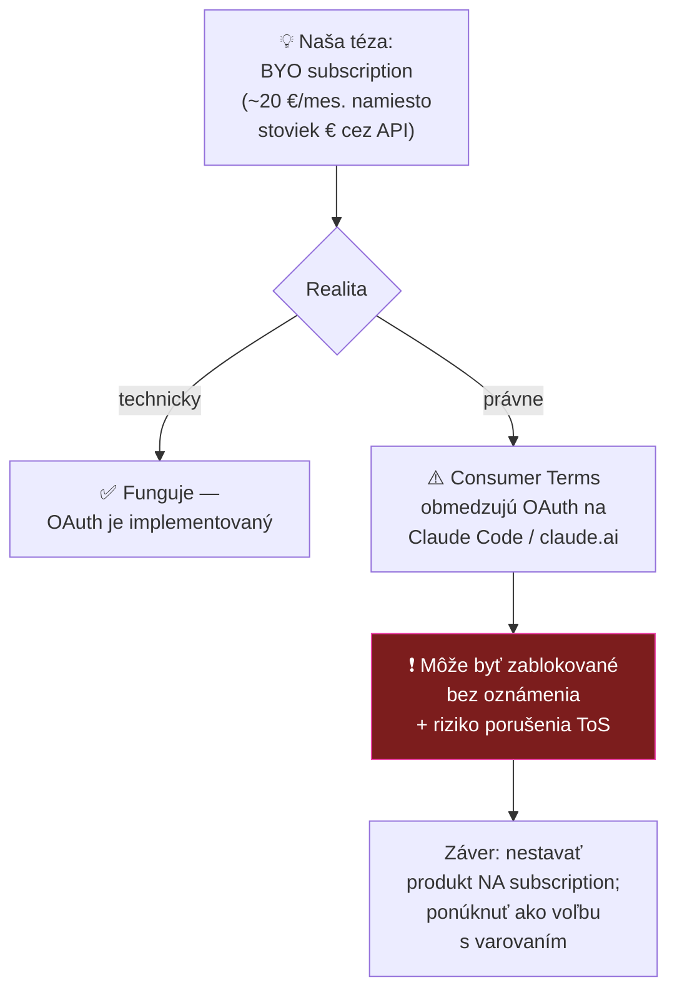

<div align="center">

# 🧭 LegalWork — hĺbková analýza

**[eigenweltlabs/legalwork](https://github.com/eigenweltlabs/legalwork)** · [eigenweltlabs.com/legalwork](https://eigenweltlabs.com/legalwork)


*Analýza k 2026-07-29 — fakty z webu, README a **priamo zo zdrojového kódu***

</div>

> [!IMPORTANT]
> **Dve faktické opravy oproti pôvodnému predpokladu:**
> 1. **Nie je taliansky — je z Berlína** 🇩🇪 (Eigenwelt Labs). Pre nás to je *lepšie*: EU jurisdikcia, GDPR-native, blízko našej regulácii.
> 2. **Áno, podporuje consumer subscription** (Claude Pro/Max) — ale s podstatnou výhradou, ktorú si sami zapísali do kódu. Viď nižšie.

---

## 🔑 Kľúčové zistenie: subscription áno, ale ToS problém

Toto bola naša hlavná otvorená otázka. Odpoveď je **priamo v zdrojovom kóde**
(`apps/app/src/react-app/domains/connections/provider-auth/provider-auth-modal.tsx`):

```js
// The "Claude Pro/Max" method signs in with a consumer Claude subscription
// rather than a Console API key. Anthropic's Consumer Terms restrict that
// OAuth to Claude Code / claude.ai, so we surface a warning before use.
```

A varovanie, ktoré appka zobrazí používateľovi:

> ⚠️ *„Claude Pro/Max sign-in uses your personal Claude subscription. Anthropic's Consumer Terms limit this OAuth to Claude Code and claude.ai, so **third-party use may violate those terms and can be blocked without notice**. For reliable, permitted access, use 'Create an API Key' or enter an Anthropic API key instead."*

### Čo to znamená pre nás



> [!WARNING]
> **Toto je priamo relevantné pre [spec 0003](../../specs/0003-prompt-layer.md).** Naše poznámky stavali na téze *„research za 20 €/mes. cez subscription namiesto stoviek € cez API"*. Technicky to ide — ale **poskytovateľ to môže kedykoľvek zablokovať a je to na hrane jeho podmienok**. Ako advokáti by sme nemali stavať odporúčaný postup pre kolegov na niečom, čo porušuje ToS tretej strany. Odporúčanie: **API kľúč ako default, subscription ako informovaná voľba používateľa s tým istým varovaním.**

---

## 📦 Čo LegalWork vie (overený zoznam funkcií)

| Funkcia | Detail | Relevancia pre nás |
|---|---|---|
| **Chat & lokálny agent** | Plánovanie úloh, práca so súbormi **len v autorizovaných priečinkoch** | 🔥 blízko [OKF](../../specs/0002-okf-operacny-system-praxe.md) |
| **Office add-iny** | Word, Excel, PowerPoint — bočný panel, **tracked changes vo Worde** | 🔥 reálny advokátsky workflow |
| **On-device transkripcia** | Nahrávanie porád + **systémový diktát**, lokálne spracovanie | 🔥 = náš [spec 0001](../../specs/0001-transkripcia.md), **už hotové** |
| **Tabular review** | Extrakcia do riadkov/stĺpcov so zdrojom, citátmi a číslom strany | due diligence |
| **Šablóny zmlúv** | Automatizácia firemných šablón, výstup DOCX na redline | SK šablóny |
| **Právna rešerš** | Agentická rešerš s generovaním citácií | 🔥 sem patria [naše SK MCP](../../specs/0004-mcp-sk-konektory.md) |
| **Fusion Mode** | Až **3 modely paralelne** + syntéza do finálnej odpovede | zaujímavé pri sporných otázkach |
| **Workflows & Skills** | Znovupoužiteľné inštrukcie, šablóny, skripty — **s verzovaním** | 🔥 = náš [prompt layer](../../specs/0003-prompt-layer.md) |
| **MCP konektory** | Vlastná sekcia v nastaveniach (`mcp-view.tsx`) | 🔥 sem pripojíme SK registre |
| **Private benchmarks** | Kancelária si definuje vlastné hodnotiace kritériá | kvalita výstupov |

### Transkripcia — čo reálne používa (z kódu)
`whisper.cpp` · `whisper-small` · `whisper-tiny` · `parakeet` · vlastný `whisper-server`
→ **lokálne spracovanie, presne ako sme chceli v spec 0001.**

### Podporovaní provideri (z kódu)
Anthropic · OpenAI · Google · **Ollama · LM Studio · llama.cpp · vLLM** (lokálne) · OpenRouter · OpenAI-compatible (vlastný endpoint) · AWS Bedrock · Azure OpenAI · Eigenwelt (free trial)

**Spôsoby prihlásenia:** OAuth *aj* API key *aj* vlastný base URL — čiže **model-agnostic architektúra**, ktorú sme chceli.

---

## 💰 Biznis model — pozor, je to open-core

| | |
|---|---|
| **Zadarmo** | pre jednotlivcov, MIT, lokálny beh |
| **Platené** | *firm deployments* — centrálna administrácia, identity controls, **audit logging** |

> [!NOTE]
> **Toto je pre nás dôležité.** Eigenwelt monetizuje presne tú vrstvu, ktorú potrebuje advokátska kancelária (audit log, správa prístupov). Náš model je iný — [monetizujeme vzdelávanie](../../decisions/0002-preco-forkujeme-mikeoss.md), nie softvér — takže si **nekonkurujeme**. Ale znamená to, že: (a) projekt má financovanie → vyššia šanca, že prežije; (b) firemné funkcie, ktoré budeme chcieť, môžu byť za platenou vrstvou.

---

## 🇸🇰 Príležitosť: slovenčina chýba

Podporované jazyky (12): `ca` `de` `en` `es` `fr` `ja` `pt-BR` `ru` `th` `vi` `zh`
**Slovenčina ani čeština tam nie sú.** → SK lokalizácia je čistý, dobre viditeľný prínos do upstreamu.

## ⚠️ Riziká

- **Free modely od Eigenweltu sú logované** — README aj web to hovoria priamo: *„nevhodné pre dôverné dáta, len testovanie"*. Pre advokáta: **iba vlastný model**.
- **Telemetria** — anonymná (názvy udalostí, počty, trvania; nie obsah), EU-hosted PostHog, **vypnuteľná** v Settings → Privacy; dev buildy neposielajú nič. Prijateľné, ale treba to advokátom povedať.
- **Mladý projekt, 2 prispievatelia** — rovnaké riziko ako mikeOSS, aj keď je aktivita 10× vyššia.

## ✅ Ďalšie kroky

- [ ] **Stiahnuť a otestovať** desktop build na reálnom (anonymizovanom) spise
- [ ] Overiť, či ide pripojiť **náš Slov-Lex MCP** cez Settings → MCP
- [ ] Otestovať kvalitu **transkripcie v slovenčine** (whisper-small vs parakeet) s právnou terminológiou
- [ ] Vyskúšať Word add-in s tracked changes na SK dokumente
- [ ] Zvážiť príspevok **SK lokalizácie** do upstreamu (dobrý vstup do komunity)

---

<sub>Fakty overené: GitHub API, README, eigenweltlabs.com a čítanie zdrojového kódu (provider-auth-modal.tsx, legalwork-runtime-config.ts, i18n/locales, docs/). Klon repa bol po analýze zmazaný.</sub>
