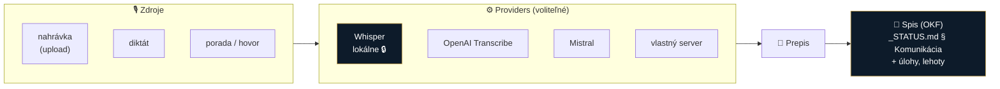

# Spec 0001: Transkripcia (hovory, stretnutia, diktát)

- **Stav:** návrh
- **Zdroj:** [research/idey/](../research/idey/2026-07-29-orchestrator-transkripcia-byo-subscriptions.md)
- **Súvisiace:** [0003 prompt layer](0003-prompt-layer.md) · [0002 OKF](0002-okf-operacny-system-praxe.md)

## Problém

Advokát strávi neúmerne veľa času prepisom a spracovaním hovorov, porád a pojednávaní. Nahrávka bez štruktúry je málo užitočná — hodnota vzniká až vtedy, keď je **prepis naviazaný na spis** a použiteľný ďalej (sumár, úlohy, lehoty).

## Navrhované riešenie

Transkripcia ako **ingest vrstva** — nie samostatná funkcia, ale vstup do spisu.

### Kľúčové vlastnosti

| Vlastnosť | Detail |
|---|---|
| **Provider registry** | Jednotné rozhranie; runtime výber providera podľa politiky |
| **Lokálne ako default** | Whisper na stroji advokáta — dôverné dáta neopúšťajú počítač |
| **BYO API / subscription** | Vlastný kľúč alebo existujúce predplatné (viď [0003](0003-prompt-layer.md)) |
| **Zápis do spisu** | Prepis automaticky do správneho OKF priečinka + záznam v `_STATUS.md` |
| **Nadväzné spracovanie** | Sumár, extrakcia úloh a lehôt → podľa PROTOKOLU ZÁPISU do `spis.md` / `MEMORY.md` |

> [!TIP]
> **Nemusíme to stavať od nuly.** [LegalWork](../research/inspiracie/legalwork.md) má on-device transkripciu **už hotovú** — `whisper.cpp`, `whisper-small/tiny`, `parakeet`, vrátane **systémového diktátu** a nahrávania porád, všetko lokálne. Ak pôjdeme touto cestou, náš príspevok je **kvalita v slovenčine + naviazanie na OKF spis**, nie samotná transkripcia.

## Otvorené otázky

- [ ] Kvalita Whisper na slovenčine s právnou terminológiou — otestovať na reálnej nahrávke
- [ ] Diarizácia (kto hovorí) — potrebné pri poradách?
- [ ] **Súhlas s nahrávaním** — právna a etická stránka (klient, protistrana, súd); pri pojednávaní pozor na zákonné obmedzenia
- [ ] Uchovávanie nahrávok: mazať po prepise, alebo archivovať k spisu?

> [!WARNING]
> Cloud provider = odoslanie obsahu porady s klientom tretej strane. Platí 3-fázový test SAK (viď [ADR 0002](../decisions/0002-preco-forkujeme-mikeoss.md)) — pri dôverných nahrávkach **lokálny Whisper**, nie cloud.
