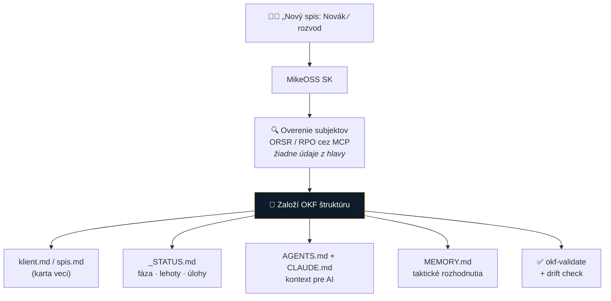

# Spec 0002: OKF — operačný systém advokátskej praxe

- **Stav:** návrh · **priorita: vysoká** (diferenciátor)
- **Zdroj:** existujúca implementácia — skill `novy-spis` (OKF v0.1) v legal plugine
- **Súvisiace:** [0001 transkripcia](0001-transkripcia.md) · [0004 MCP](0004-mcp-sk-konektory.md)

> [!IMPORTANT]
> **Toto je jadro odlíšenia.** Appka nie je „AI editor dokumentov" — je to **organizácia advokátskej praxe**, ktorá AI len využíva. Z poznámok: *„Aplikácia je lepidlo a register (zdroj pravdy), nie monolitický AI engine."* Roast to potvrdil z opačnej strany — advokát nekúpi kód, kúpi **poriadok a istotu**.

## Problém

Každá kancelária si vymýšľa vlastný chaos: názvy súborov, kde čo leží, čo je aktuálne. Keď príde AI, nemá sa čoho chytiť — a advokát nemá istotu, že model pracuje s aktuálnou verziou spisu. **AI bez štruktúry len rýchlejšie produkuje neporiadok.**

## Navrhované riešenie

Appka **presadzuje a učí** štruktúru — zakladá priečinky, generuje riadiace súbory, kontroluje konzistenciu.

### Čo už existuje (skill `novy-spis`, OKF v0.1)

| Prvok | Popis |
|---|---|
| **Profil A** | klient → spis (`YYYY-MM Protistrana - Vec - typ`, oblasť 1–6) |
| **Profil B** | projekt (generický) |
| **Profil C** | korporátny klient — firma ako spis s tematickým členením |
| **Riadiace súbory** | `klient.md`/`spis.md`/`projekt.md` (karta), `_STATUS.md`, `AGENTS.md`, `CLAUDE.md`, `MEMORY.md` |
| **ORSR/RPO audit** | pri zakladaní sa subjekty overia cez MCP — nie „z hlavy" |
| **Retrofit** | konverzia existujúceho priečinka; **prísne nedeštruktívne + idempotentné** |
| **Validácia** | `okf-validate.sh` → OK/chyba · `okf-freshness.sh` → drift `_STATUS.md` vs obsah |
| **PROTOKOL ZÁPISU** | disciplína zápisu: fakt → `_STATUS.md`; lehota → `spis.md` frontmatter + `_STATUS.md`; taktické rozhodnutie → `MEMORY.md` (TP-XXX); dokument → podpriečinok + `_STATUS.md`; komunikácia a úlohy → `_STATUS.md` |

### Čo treba doplniť pre produkt

- [ ] **GUI** nad skriptami — advokát neklikne `.sh` (dnes je to CLI/skill)
- [ ] **Konfigurovateľnosť per kancelária** — vlastné názvoslovie, oblasti práva, šablóny
- [ ] **Onboarding existujúcej praxe** — retrofit stoviek starých spisov naraz
- [ ] **Audit trail** — kto/kedy/čo zapísal (immutable log), nadväzuje na compliance
- [ ] Prepojenie na [transkripciu](0001-transkripcia.md) a výstupy AI → automaticky na správne miesto

## Prečo je to strategicky silné

1. **Nezávislé od AI módy** — štruktúra spisu má hodnotu aj bez modelu; AI je násobič, nie základ.
2. **Zdroj pravdy pre agentov** — `AGENTS.md`/`CLAUDE.md` v každom spise znamená, že *ktorýkoľvek* agentický systém vie okamžite kontext veci. To je presne to, čo sme robili aj v tomto repe.
3. **Predajné na workshopoch** — „naučíme vás poriadok v praxi" je vzdelávací produkt, ktorý stojí na vlastných nohách (a je to náš monetizačný model podľa [ADR 0002](../decisions/0002-preco-forkujeme-mikeoss.md)).
4. **Nekopírovateľné narýchlo** — Harvey ani Legora vám neusporiada prax podľa slovenských zvyklostí.

## Rozhodnuté

> [!NOTE]
> **OKF ide von ako open-source — bez obmedzení.** `novy-spis` je Mariánova implementácia OKF systému; dáva ju k dispozícii celú, vrátane ďalšieho vývoja a vylepšovania. *(rozhodnuté 2026-07-29)*

Dôsledok: OKF môže byť zároveň **implementácia aj dokumentovaný štandard** — a stáva sa tým prirodzeným základom v1.

## Otvorené otázky

- [ ] Multi-user: ako to funguje, keď v spise pracujú traja ľudia naraz?
- [ ] Publikovať OKF špecifikáciu samostatne (aby ju vedel implementovať aj niekto iný)?
