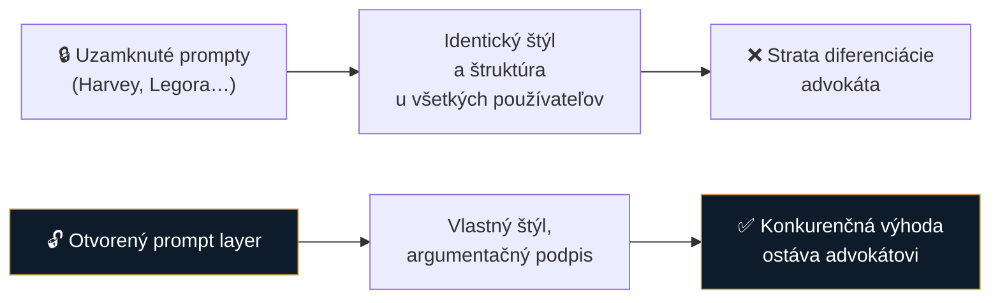

# Spec 0003: Otvorený prompt layer + voľba modelu (žiadny black box)

- **Stav:** návrh
- **Zdroj:** [research/idey/](../research/idey/2026-07-29-build-open-vs-buy-closed.md)
- **Súvisiace:** [0002 OKF](0002-okf-operacny-system-praxe.md)

## Problém

Komerčné legal-AI aplikácie zamykajú prompty do black boxu. Dôsledok:

V práve je **diferenciácia výstupu konkurenčná výhoda**. Ak všetci používajú rovnaký skrytý prompt, všetky podania začnú vyzerať rovnako — a advokát stráca to, čím sa odlišuje.

Druhý problém: uzavreté appky **šetria na modeloch** (lacnejší model = nižšie náklady pre vendora), čo degraduje právnu kvalitu — a používateľ o tom nevie.

## Navrhované riešenie

| Princíp | Realizácia |
|---|---|
| **Absolútna kontrola nad promptami** | Každý prompt viditeľný a editovateľný — žiadny skrytý systémový prompt |
| **Verzovanie a audit** | História zmien promptov, kto/kedy/prečo zmenil |
| **Per užívateľ / per vec** | Iný štýl pre trestné, iný pre korporátne; „štýlový profil advokáta" |
| **Voľba modelu per úloha** | Používateľ vidí a mení, ktorý model rieši ktorý krok |
| **BYO subscription / API** | Existujúce predplatné (ChatGPT/Claude) *alebo* vlastný kľúč *alebo* lokálny model |

### Nákladová politika (z poznámok)

| Typ úlohy | Model |
|---|---|
| Kritické (podania, zmluvy) | **prémiový** — racionálne zaplatiť |
| Nízkorizikové (OCR, prepis, sumár) | **lacné / lokálne** (napr. Mistral OCR na PDF→Markdown) |

## Otvorené otázky

- [ ] **ToS subscriptions** — sprostredkované používanie ChatGPT Team/Pro cez našu appku: kde je hranica? Neobchádzať podmienky. *(Sme advokáti — mali by sme si to vedieť posúdiť sami.)*
- [ ] Zdieľanie prompt knižnice v komunite (kancelárie si vymieňajú overené prompty?)
- [ ] Ako spraviť prompt editor použiteľný pre netechnického advokáta — nie textové pole s XML
- [ ] Default prompty: dodáme „dobré východisko", ale musí byť zrejmé, že sa dá zmeniť
