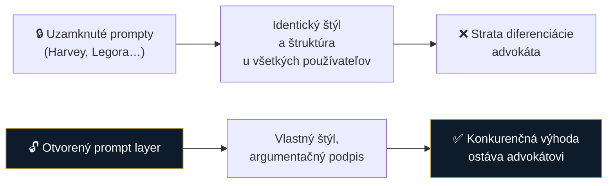
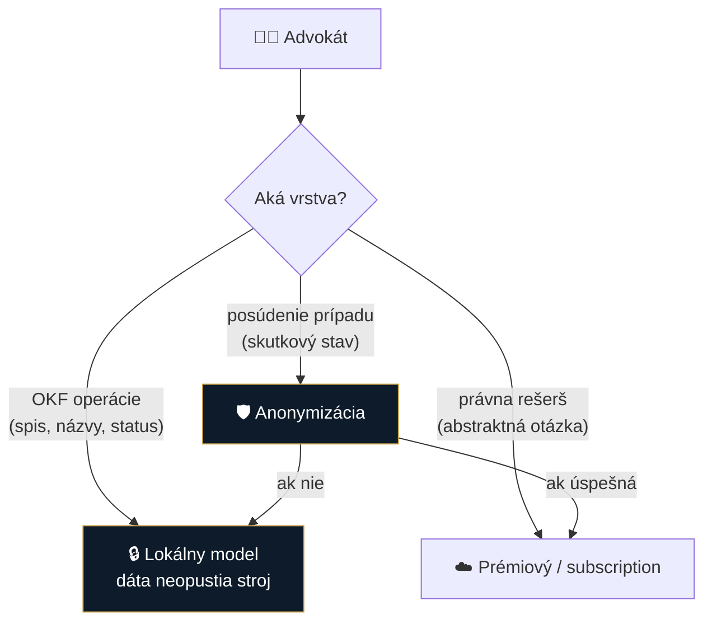

# Spec 0003: Otvorený prompt layer + voľba modelu (žiadny black box)

- **Stav:** návrh
- **Zdroj:** [research/idey/](../research/idey/2026-07-29-build-open-vs-buy-closed.md)
- **Súvisiace:** [0002 OKF](0002-okf-operacny-system-praxe.md)

## Problém

Komerčné legal-AI aplikácie zamykajú prompty do black boxu. Dôsledok:

V práve je **diferenciácia výstupu konkurenčná výhoda**. Ak všetci používajú rovnaký skrytý prompt, všetky podania začnú vyzerať rovnako — a advokát stráca to, čím sa odlišuje.

Druhý problém: uzavreté appky **šetria na modeloch** (lacnejší model = nižšie náklady pre vendora), čo degraduje právnu kvalitu — a používateľ o tom nevie.

## Navrhované riešenie

| Princíp | Realizácia |
|---|---|
| **Absolútna kontrola nad promptami** | Každý prompt viditeľný a editovateľný — žiadny skrytý systémový prompt |
| **Verzovanie a audit** | História zmien promptov, kto/kedy/prečo zmenil |
| **Per užívateľ / per vec** | Iný štýl pre trestné, iný pre korporátne; „štýlový profil advokáta" |
| **Voľba modelu per úloha** | Používateľ vidí a mení, ktorý model rieši ktorý krok |
| **BYO subscription / API** | Existujúce predplatné (ChatGPT/Claude) *alebo* vlastný kľúč *alebo* lokálny model |

### Nákladová politika (z poznámok)

| Typ úlohy | Model |
|---|---|
| Kritické (podania, zmluvy) | **prémiový** — racionálne zaplatiť |
| Nízkorizikové (OCR, prepis, sumár) | **lacné / lokálne** (napr. Mistral OCR na PDF→Markdown) |

---

## 🔀 Hybrid routing — rozdelenie podľa vrstvy

> **Navrhol:** Marián Čuprík · 2026-07-29 · *stav: na prerokovanie (MF, IR)*

Namiesto jedného globálneho modelu **routovať podľa vrstvy** — kritérium nie je len cena, ale **kde sú klientske dáta**.

| Vrstva | Aké dáta obsahuje | Model | Prečo |
|---|---|---|---|
| **OKF operácie** — zakladanie spisov, názvy, presuny, zápis do `_STATUS.md` | 🔴 najviac identifikujúcich údajov (mená, IČO, spisové značky) | **lokálny** | mechanické, vysoký objem, nízke nároky na reasoning — a dáta neopustia počítač |
| **Právna rešerš** — „aká je premlčacia doba pri…" | 🟢 často abstraktná, bez klientskych údajov | **prémiový / subscription** | tu sa oplatí najlepší reasoning |
| **Posúdenie prípadu (assessment)** | 🔴 obsahuje skutkový stav veci | ⚠️ **až po anonymizácii, inak lokálny** | viď nižšie |

> [!IMPORTANT]
> **„Rešerš" a „assessment" nie sú to isté.** Rešerš vieš položiť abstraktne (bez klienta). Posúdenie prípadu obsahuje fakty veci → do cloudu len cez sanitizačný filter, inak je to problém s mlčanlivosťou (3-fázový test SAK).

**Súvislosť s ToS:** ak by subscription niesla práve rešeršnú vrstvu, je to zároveň vrstva, ktorú budeme učiť na workshopoch — a tá má [ToS varovanie](#-tos-subscriptions--čiastočne-zodpovedané-2026-07-29). Preto subscription držať ako **voľbu používateľa**, nie ako odporúčaný default vo výučbe.

### Realizovateľnosť
V LegalWork/opencode nie je hotové per-feature routing v UI, ale **skill/agent si vie určiť vlastný model** (`.opencode/skills`) → cesta vedie cez skills, nie cez prepínač v nastaveniach. *(overené 2026-07-29)*

## ⚠️ ToS subscriptions — čiastočne zodpovedané (2026-07-29)

Overili sme to na [LegalWork](../research/inspiracie/legalwork.md), ktorý *Claude Pro/Max* sign-in **má implementovaný** — a zároveň k nemu zobrazuje varovanie:

> *„Anthropic's Consumer Terms limit this OAuth to Claude Code and claude.ai, so **third-party use may violate those terms and can be blocked without notice**. For reliable, permitted access, use an API key instead."*

**Dôsledok pre nás:** téza *„research za ~20 €/mes. cez subscription namiesto stoviek € cez API"* technicky funguje, ale stojí na tenkom ľade — poskytovateľ to môže kedykoľvek zablokovať a je to na hrane jeho podmienok.

> [!IMPORTANT]
> **Odporúčanie:** **API kľúč / lokálny model = default.** Subscription ponúknuť ako *informovanú voľbu používateľa* s rovnakým varovaním. Ako advokáti nemôžeme kolegom odporúčať postup, ktorý porušuje ToS tretej strany — a už vôbec nie na workshope, kde za to nesieme reputačnú zodpovednosť.

## Otvorené otázky

- [ ] Preveriť to isté pre **OpenAI/ChatGPT** podmienky (Anthropic máme overený)
- [ ] Zdieľanie prompt knižnice v komunite (kancelárie si vymieňajú overené prompty?)
- [ ] Ako spraviť prompt editor použiteľný pre netechnického advokáta — nie textové pole s XML
- [ ] Default prompty: dodáme „dobré východisko", ale musí byť zrejmé, že sa dá zmeniť
