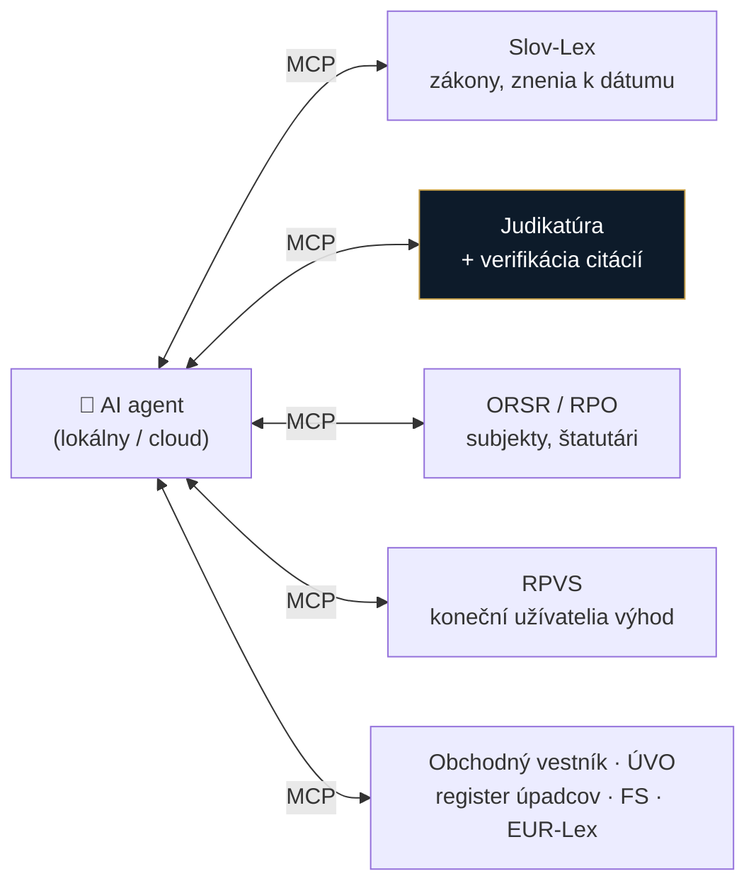

# Spec 0004: SK MCP konektory (judikatúra, registre, legislatíva)

- **Stav:** návrh · *veľká časť už existuje*
- **Navrhol:** Marián Čuprík (MČ) · 2026-07-29
- **Súvisiace:** [0002 OKF](0002-okf-operacny-system-praxe.md) · [research/inspiracie](../research/inspiracie/)

> [!NOTE]
> Z deep researchu aj roastu vyplynulo, že **väčšina konektorov už beží** v Mariánovom prostredí. Toto nie je stavba na zelenej lúke, ale **zbalenie a sprístupnenie** existujúceho.

## Problém

ChatGPT ani Harvey nevedia, čo je v Slov-Lexe k dnešnému dňu, ani kto je štatutár v ORSR. Bez napojenia na SK zdroje AI **halucinuje paragrafy a rozhodnutia** — čo je pre advokáta horšie než nič (disciplinárne riziko).

## Navrhované riešenie

### Stav konektorov

| Konektor | Stav | Poznámka |
|---|---|---|
| Slov-Lex | ✅ existuje | znenia k dátumu, dôvodové správy |
| Judikatúra SR | ✅ existuje | rozhodnutia, treatment, case chain |
| ORSR / RPO | ✅ existuje | subjekty, štatutári, výpisy |
| RPVS | ✅ existuje | KÚV, partneri verejného sektora |
| Obchodný vestník, ÚVO, register úpadcov, register diskvalifikácií, FS, CRZ, EUR-Lex | ✅ existuje | |
| **slovensko.sk / eID** | ❌ chýba | viď varovanie nižšie |

### Čo treba doplniť

- [ ] **Verifikácia citácií** — automatická kontrola, že citovaný § a spisová značka reálne existujú a sedia (anti-halucinačná poistka)
- [ ] **Zabalenie pre bežného advokáta** — jednoklikové pripojenie, nie ručná editácia JSON configu
- [ ] Otestovať pripojenie do [LegalWork Extensions](../research/inspiracie/) — ak to ide, je to najrýchlejšia cesta k v1
- [ ] Contract testy + monitoring (registre menia rozhrania bez ohlásenia → tichý rozpad)

> [!WARNING]
> **slovensko.sk / eID je iná liga.** Kým sú konektory *čítacie*, najhoršie riziko je nepresná informácia. Vo chvíli, keď pripojíme **autentifikované podanie pod kvalifikovaným podpisom**, dávame pravdepodobnostnému modelu možnosť konať v mene advokáta — jedna halucinovaná akcia = podanie, ktoré nikto nechcel. Odporúčanie: **read-only najprv**, zápisové úkony len s výslovným potvrdením človekom, a nikdy nie automaticky.

## Otvorené otázky

- [ ] Ktoré konektory ide zverejniť ako OSS a v akom rozsahu?
- [ ] Rate limity a slušné správanie voči štátnym registrom (nezaťažiť ich)
- [ ] Kto stráži funkčnosť po zmene rozhrania registra?
