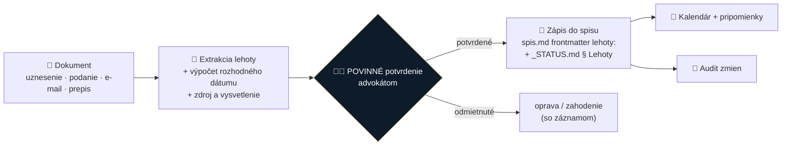
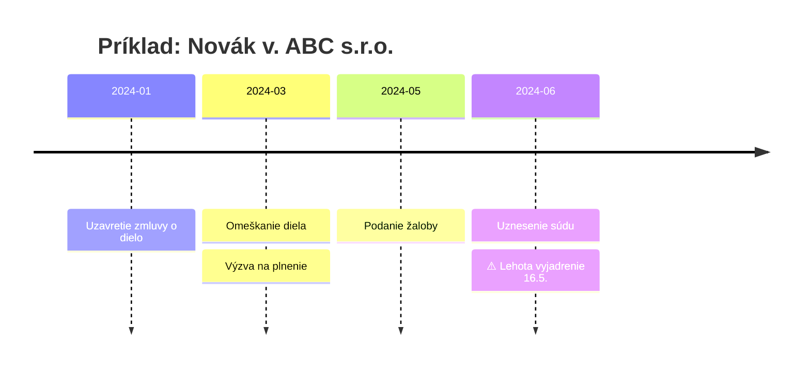

# Spec 0005: Lehoty & timeline spisu

- **Stav:** rozpracované · **kandidát na alfu #1**
- **Navrhol:** Martin Friedrich (MF) · 2026-07-30 · [Issue #1](https://github.com/originalmagneto/lawOSS-like-SK-CZ/issues/1)
- **Doplnil:** Marián Čuprík (MČ) — timeline/diagramy, markdown-first
- **Súvisiace:** [0002 OKF](0002-okf-operacny-system-praxe.md) · [0001 transkripcia](0001-transkripcia.md)

> [!IMPORTANT]
> **Najhodnotnejšia funkcia repa.** Zmeškaná lehota je najčastejší dôvod zodpovednosti advokáta. Nič z existujúcich specov to nerieši priamo — a dáva hodnotu **aj samostatne**, bez zvyšku systému. Preto kandidát na prvé miesto v alfe.

## Problém

Lehoty dnes advokát loví ručne z uznesení, podaní, zmlúv a e-mailov a prepisuje ich do kalendára. Každý ručný krok = priestor na chybu; jedna prehliadnutá lehota = disciplinárka alebo škoda.

## Navrhované riešenie (P0 z Issue #1)

- **Extrakcia** lehôt z rozhodnutí, podaní, zmlúv, e-mailov a transkripcií
- **Výpočet rozhodného dátumu** — s uvedením zdroja (z čoho lehota plynie) a vysvetlením výpočtu
- **Povinné potvrdenie advokátom** — AI nikdy nezapíše lehotu „naostro" sama; toto je poistka, ktorá z funkcie robí pomôcku a nie pascu
- **Kalendár, pripomienky, audit zmien** — kto/kedy lehotu potvrdil alebo zmenil
- Zápis podľa OKF PROTOKOLU ZÁPISU: `spis.md` frontmatter `lehoty:` + `_STATUS.md` § Lehoty

## 📊 Timeline spisu (doplnenie MČ)

Chronológia celej veci **generovaná zo spisu**: skutky, úkony, lehoty, aktéri.

- **Mermaid** (timeline/gantt) priamo v markdowne spisu — verzovateľné, agent-friendly
- voliteľne **Excalidraw** export pre vizuálne bohatší diagram (existujúci excalidraw skill)
- use-case: advokát ukáže klientovi alebo súdu chronológiu case-u na jeden pohľad

## Zásady formátov (rozhodnutie smerovania)

> [!NOTE]
> **Markdown-first, nie DOCX-centrické.** DOCX je legacy formát — základná podpora áno (python + LibreOffice), ale **primárny formát je markdown (+ HTML)**: lepšie pre agentov, verzovanie aj diff. DOCX len ako import/export na hranách systému. *(MČ, 2026-07-30 — reakcia na Issue #1)*

## Otvorené otázky (z Issue #1 + doplnené)

- [ ] Pravidlá výpočtu lehôt SK/CZ (procesné vs hmotnoprávne, sviatky, doručovanie — fikcia doručenia) — **toto je právne jadro, spíšu MF/IR**
- [ ] Kalendárové integrácie: čo je priorita (CalDAV / Google / ICS export)?
- [ ] Ako riešiť lehoty závislé od udalosti, ktorá ešte nenastala?
- [ ] Dvojitá kontrola pri lehotách kratších ako X dní?
