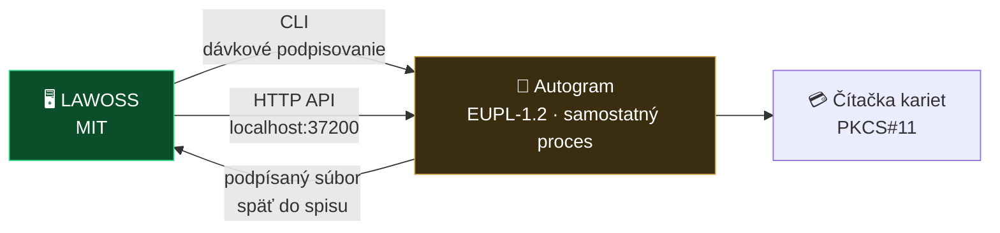

# Spec 0007: Podpisovanie QES + QTS cez Autogram

- **Stav:** návrh
- **Navrhol:** Marián Čuprík (MČ) · 2026-08-06 · Telegram topic *Feature IDEAS* [209], [221] + upresnenie 2026-08-07
- **Súvisiace:** [0002 OKF](0002-okf-operacny-system-praxe.md) · [0004 SK MCP konektory](0004-mcp-sk-konektory.md) · [návrhy #19 a #26](navrhy.md) · [spracovanie topicu](../research/idey/2026-08-07-feature-ideas-telegram.md)

> [!IMPORTANT]
> **Autogram je EUPL-1.2 — reciproká licencia.** Nesmie sa vendorovať ani forkovať do našej MIT aplikácie. Integrácia ide **výhradne cez rozhrania samostatného procesu** — CLI alebo lokálne HTTP API. Overené cez GitHub API 2026-08-07.

> [!IMPORTANT]
> **Aktualizácia 2026-08-12 — zaručená konverzia vyčlenená do [spec 0010](0010-zarucena-konverzia.md).**
> Tento spec ju pôvodne pokrýval spolu s podpisovaním s odôvodnením, že „zdieľajú engine a bezpečnostné hranice". [Rešerš](../research/pravny-ramec/2026-08-12-zarucena-konverzia-sk.md) ukázala, že to neplatí: konverzia navyše vyžaduje **SOAP integráciu na štátny register CEZZK**, registráciu oprávnenej osoby, **mandátny certifikát** a **platenú kvalifikovanú službu validácie** (§ 3 ods. 4 vyhl. 70/2021, overené v Slov-Lexe).
> **Tento spec sa od 2026-08-12 týka výlučne podpisovania QES + QTS cez Autogram.**

> [!NOTE]
> **Zaradenie do verzií — rozhodnutie MČ 2026-08-07:**
> - **Podpisovanie QES + QTS** *(návrh #19)* → kandidát na **V2**, hneď po MVP
> - **Zaručená konverzia** *(návrh #26)* → **ďalšia verzia, nie teraz.** Je to regulovaná činnosť a právne náležitosti musia byť vyriešené skôr, než sa čokoľvek implementuje. MČ si na ňu zatiaľ stavia samostatnú aplikáciu.
>
> Spec pokrýva oboje, lebo zdieľajú ten istý engine a tie isté bezpečnostné hranice. Viď [zberný kôš](../planning/napady.md).

## Problém

Advokát bežne potrebuje dve veci, ktoré dnes robí mimo akéhokoľvek AI nástroja:

1. **Podpísať dokument kvalifikovaným elektronickým podpisom** (QES), typicky s kvalifikovanou časovou pečiatkou (QTS) — podania súdu, zmluvy, plné moci.
2. **Vykonať zaručenú konverziu** — previesť listinný dokument do elektronickej podoby (alebo naopak) so zachovaním právnych účinkov. Advokát je na to oprávnenou osobou.

Oboje sa dnes deje v samostatnej aplikácii, mimo spisu. Výsledok si musí advokát ručne uložiť späť do správneho priečinka. To je presne ten druh trhliny vo workflowe, ktorý [OKF](0002-okf-operacny-system-praxe.md) inak zatvára.

### Právny rámec

| Jurisdikcia | Základ | Stav overenia |
|---|---|---|
| 🇸🇰 SR | [zákon č. 305/2013 Z. z. o e-Governmente](https://www.slov-lex.sk/ezbierky/pravne-predpisy/SK/ZZ/2013/305/) + [vyhláška MIRRI č. 70/2021 Z. z. o zaručenej konverzii](https://www.slov-lex.sk/ezbierky/pravne-predpisy/SK/ZZ/2021/70/) | ✅ overené cez Slov-Lex 2026-08-07 |
| 🇨🇿 ČR | autorizovaná konverze — zákon č. 300/2008 Sb. | ⚠️ **neoverené** — na potvrdenie VŘ |

> [!WARNING]
> Presné podmienky, kedy a ako smie advokát zaručenú konverziu vykonať, a aké náležitosti musí mať osvedčovacia doložka, **patria do specu skôr, než sa čokoľvek implementuje**. Toto je regulovaná činnosť, nie bežná funkcia.

## Navrhované riešenie

### Autogram ako externý podpisový engine

[Autogram](https://github.com/slovensko-digital/autogram) od Slovensko.Digital je multiplatformová desktopová aplikácia na podpisovanie a overovanie dokumentov podľa eIDAS. MČ ju už dnes používa cez CLI ako **quick action vo Finderi**, bez terminálu.

**Dve integračné cesty — obe overené v README Autogramu 2026-08-07:**

| Cesta | Ako | Na čo sa hodí |
|---|---|---|
| **CLI** | `autogram --help` *(na Windows `autogram-cli`)* | dávkové podpisovanie väčšieho počtu súborov naraz |
| **HTTP API** | `http://localhost:37200`, Swagger na `/docs` | podpisovanie iniciované z inej aplikácie — **presne náš prípad** |
| *(doplnkovo)* | protokol `autogram://go` | spustenie z prehliadača |

README Autogramu to hovorí priamo: *používatelia môžu aplikáciu integrovať do vlastného (webového) informačného systému cez HTTP API*. Toto teda nie je obchádzka — je to zamýšľaný spôsob použitia.

### Podporované karty a preukazy

Autogram podporuje **akúkoľvek PKCS#11 kartu** *(zadaním cesty k driveru)* a natívne:

| Karta | Jurisdikcia |
|---|---|
| slovenský občiansky preukaz (eID klient) | 🇸🇰 |
| český občiansky preukaz (eObčanka) | 🇨🇿 |
| **I.CA SecureStore** | 🇨🇿 — typický nosič certifikátov českých advokátov |
| MONET+ ProID+Q · Gemalto IDPrime 940 | 🇨🇿 |

> [!TIP]
> **Toto je dvojjurisdikčne silné.** Cez eID pokryjeme SK, cez eObčanku a I.CA SecureStore CZ. Slovenský **advokátsky preukaz** by mal fungovať cez generické PKCS#11 rozhranie — **treba overiť v praxi**, rovnako ako to, či a ako sa dá použiť na zaručenú konverziu.

### Predpoklad na strane používateľa

Autogram musí byť **nainštalovaný samostatne**. LAWOSS ho nedistribuuje ani nebundluje — len zistí, či je prítomný, a ak nie, nasmeruje používateľa na oficiálne [Releases](https://github.com/slovensko-digital/autogram/releases). Tým zostáva licenčná hranica čistá a zodpovednosť za podpisový engine ostáva na jeho autoroch.

### Zaradenie výstupu do spisu

Podpísaný alebo skonvertovaný súbor sa **automaticky ukladá do príslušného priečinka spisu** podľa OKF a zapisuje sa do changelogu veci. To je pridaná hodnota oproti tomu, čo advokát robí dnes ručne.

## Bezpečnostné hranice

> [!CAUTION]
> **Podpis vždy spúšťa advokát.** Agent smie dokument pripraviť, zaradiť a navrhnúť, **nikdy nie odoslať na podpis automaticky.** [Spec 0004](0004-mcp-sk-konektory.md) k tomu hovorí: *„vo chvíli, keď pripojíme autentifikované podanie pod kvalifikovaným podpisom, dávame pravdepodobnostnému modelu možnosť konať v mene advokáta — jedna halucinovaná akcia = podanie, ktoré nikto nechcel."*

Záväzné pravidlá:

- **Human gate pri každom podpise** — potvrdenie v Autograme, nie v našom UI
- **Žiadne automatické dávkové podpisovanie** bez explicitného výberu súborov človekom
- **PIN a certifikáty nikdy neprechádzajú cez LAWOSS** — ostávajú medzi Autogramom a čítačkou
- **Auditná stopa** — čo, kedy a v ktorom spise bolo podpísané alebo skonvertované

## Otvorené otázky

- [ ] Funguje **slovenský advokátsky preukaz** cez PKCS#11 v Autograme? *(overiť v praxi — MČ)*
- [ ] Aké sú presné náležitosti **osvedčovacej doložky** zaručenej konverzie a vie ich Autogram vyprodukovať, alebo ich musíme skladať sami?
- [ ] Potvrdiť **český právny rámec** autorizovanej konverze *(VŘ)*
- [ ] Ako sa rieši **QTS** — má Autogram vlastného poskytovateľa časovej pečiatky, alebo si ho zadáva používateľ?
- [ ] Zisťovanie prítomnosti Autogramu a jeho verzie — cez CLI alebo cez API ping na `localhost:37200`?
- [ ] MČ si stavia **vlastnú aplikáciu na zaručené konverzie** — má LAWOSS volať ju, alebo priamo Autogram? *(rozhodnúť, nech nevzniknú dve cesty)*

---

Fakty o Autograme overené z jeho README a GitHub API 2026-08-07. Slovenský právny rámec overený cez Slov-Lex. Český rámec zatiaľ neoverený.
