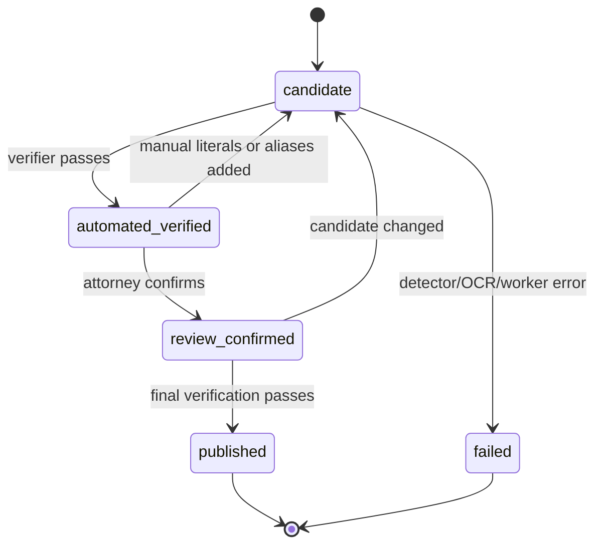

# Spec 0008: Lokálny anonymizačný gate pred externým LLM

- **Stav:** návrh
- **Navrhol:** Martin Friedrich (MF) · 2026-08-11
- **Zaradenie:** architektonický P0 privacy gate · implementačný kandidát V1.1/P1
- **Súvisiace:** [Issue #15](https://github.com/originalmagneto/lawOSS-like-SK-CZ/issues/15) · [Issue #1](https://github.com/originalmagneto/lawOSS-like-SK-CZ/issues/1) · [0002 OKF](0002-okf-operacny-system-praxe.md) · [0003 Prompt layer](0003-prompt-layer.md) · [0006 Orchestrátor](https://github.com/originalmagneto/lawOSS-like-SK-CZ/pull/2)

> [!IMPORTANT]
> Anonymizácia je bezpečnostná a procesná hranica, nie právna záruka úplnej anonymity. Publikovanie musí zostať za automatickým overením a výslovným potvrdením advokátom.

> [!NOTE]
> Tento dokument patrí do koordinačného repozitára. Nevendoruje Python runtime ani klientské dáta. Lokálny prototyp anonymizera je vstupný implementačný podklad; jeho redistribučná licencia, OS packaging a integračný kontrakt musia byť vyriešené pred kódovou integráciou.

## Problém

LAWOSS má podporovať lokálne dáta a kontrolovaný routing medzi lokálnym a externým modelom. Aktuálny backlog uvádza anonymizáciu iba ako „sanitizačný filter pred LLM“. Chýba špecifikácia toho, kedy je dokument spôsobilý opustiť lokálnu hranicu a aké dôkazy musí mať publikovaný artefakt.

Pri právnom dokumente nestačí nahradiť niekoľko regexových hodnôt. Osobné a dôverné údaje môžu zostať v:

- textových vrstvách a rozdelených XML runoch;
- DOCX hlavičkách, pätách, komentároch, vzťahoch a metadátach;
- PDF metadátach, formulároch, anotáciách, odkazoch a prílohách;
- obrazovej vrstve skenovaného PDF;
- názve súboru, reportoch, logoch alebo dočasnom pracovnom priestore.

## Cieľ

Vytvoriť lokálny workflow, ktorý:

1. vytvorí redakčný kandidát bez prepísania originálu;
2. overí kandidáta nezávislým skenom všetkých podporovaných kanálov;
3. umožní advokátovi doplniť prehliadnuté údaje a skontrolovať náhľad;
4. publikuje artefakt až po automatickom overení a ľudskom potvrdení;
5. poskytne LAWOSS bezpečný, strojovo čitateľný stav a auditnú stopu;
6. povolí externý modelový request iba pre stav `published`.

## Mimo rozsahu

- tvrdenie, že výstup je anonymný v absolútnom alebo právnom zmysle;
- automatické publikovanie alebo tiché pokračovanie po chybe;
- odosielanie originálu, mapovania alebo raw nálezov do externého providera;
- implementácia anonymizera v tomto koordinačnom repozitári;
- nahradenie advokátovej kontroly modelovým skóre;
- cloudové úložisko, centrálna databáza alebo SaaS anonymizačná služba.

## Stavový model



Záväzné pravidlá:

- originál sa nikdy neprepíše;
- `candidate`, `automated_verified` a `review_confirmed` sú nedostupné pre externý model;
- pri chybe detektora, OCR, verifikátora, workeru, limitu alebo chýbajúceho nástroja sa operácia odmietne;
- každá zmena kandidáta zneplatní predchádzajúce overenie a vyžaduje nové overenie;
- publikovanie vykoná iba lokálny proces po splnení oboch brán.

## Dávkové spracovanie a čiastočné zlyhania

Pri dávkovom requeste sa rozlišuje validácia celého requestu od spracovania jednotlivých dokumentov:

- agregované limity a vstupná validácia (napr. limit strán PDF) zostávajú fail-closed pre celý request;
- chyba detektora, OCR, verifiera, workeru alebo per-document limitu odmietne iba príslušný dokument, odstráni jeho dočasné artefakty a batch pokračuje;
- úspešné dokumenty zostávajú dostupné na ľudské review; zlyhanie jedného dokumentu nesmie označiť nasledujúce dokumenty ako `run_aborted`;
- výsledok batchu musí obsahovať `processed_count`, `failed_count` a `total_findings`, pričom položky používajú iba bezpečné `error_code` hodnoty;
- ZIP artefakt a `batch-summary.json` môžu obsahovať iba úspešné kandidáty a bezpečné počty/chybové kódy; ak je `processed_count == 0`, batch sa nepublikuje;
- efektívny profil a režim použité workerom sa musia preniesť do review session a bezpečného reportu.

Tým sa zachová fail-closed hranica pre každý chybný dokument bez straty už overených kandidátov z toho istého batchu.

## Redakčné profily pre SK/CZ

Profil je explicitná policy, nie voľný formulárový prepínač. Detektory ho musia dostať cez validovaný konfiguračný objekt.

| Profil | Povinné kategórie a účel |
|---|---|
| **Osobné údaje** | priame osobné identifikátory: mená podľa pravidiel, e-mail, telefón, IBAN, rodné číslo, dátum narodenia, identifikačné čísla, adresy, majetkové a vozidlové identifikátory |
| **Súdne zverejnenie** | profil Osobné údaje + spisové značky a ECLI; verejné inštitúcie sa štandardne zachovávajú |
| **Dôvernosť v spore** | Súdne zverejnenie + právnické osoby, IČO, DIČ a IČ DPH |
| **Maximálna ochrana** | Dôvernosť v spore + všeobecná detekcia mien; verejné inštitúcie sa nezachovávajú automaticky |

Každý report musí uviesť zvolený profil, verziu policy a počet nálezov. Report nesmie obsahovať pôvodné hodnoty.

## Integrácia do budúceho LAWOSS forku

Anonymizer zostáva samostatným lokálnym komponentom. Budúci fork LegalWorku ho spúšťa cez riadený Electron `local-service` alebo `native-binary` sidecar boundary. Upstream LegalWork aktuálne deklaruje tieto resource typy v `apps/app/src/app/extensions.ts` a balí platformové sidecars cez `apps/desktop/electron-builder.yml`; staršie LAWOSS poznámky o Tauri treba pred implementáciou zosúladiť.

Prvý adaptér má byť CLI/JSON alebo lokálny service s:

- dynamickým loopback portom;
- per-process capability tokenom;
- explicitným pracovným priestorom pre jednu vec;
- žiadnym automatickým fallbackom do cloudu;
- idempotentným zrušením a vyčistením dočasných artefaktov;
- oddelením originálu, kandidáta, reportu, mapovania a publikovaného výstupu.

Anonymizer sa nemá vystaviť ako ľubovoľný MCP nástroj s možnosťou čítať ľubovoľné cesty. Capability boundary musí byť matter-scoped a read-only voči originálu.

## Minimálny JSON kontrakt

Request:

```json
{
  "schema_version": 1,
  "artifact_id": "opaque-local-id",
  "profile": "litigation-confidentiality",
  "jurisdiction": ["SK", "CZ"],
  "source_path": "matter-scoped-local-reference",
  "require_human_review": true
}
```

Response:

```json
{
  "schema_version": 1,
  "artifact_id": "opaque-local-id",
  "state": "review_confirmed",
  "source_sha256": "sha256",
  "candidate_sha256": "sha256",
  "published_sha256": null,
  "profile": "litigation-confidentiality",
  "policy_version": "policy-version",
  "detector_version": "detector-version",
  "ocr_version": "ocr-version",
  "verifier_version": "verifier-version",
  "verification_channels": ["docx-xml-text", "docx-metadata"],
  "finding_count": 4,
  "unresolved": [],
  "human_review_required": false,
  "error_code": null
}
```

Raw identifiers, mapovania, pôvodné názvy súborov a tracebacky sú mimo kontraktu. Hashy sa vypočítajú lokálne; ich odoslanie providerovi je samostatné rozhodnutie a predvolene zakázané.

## Bezpečnostné hranice a lifecycle

- dočasný pracovný priestor má práva iba pre aktuálneho používateľa;
- originál, kandidát, náhľady, mapovania a reporty sa po zrušení, chybe alebo timeoute odstránia podľa retention policy;
- download je možný iba pre stav `published` a po overení loopback hostu, originu, capability a CSRF;
- PDF sa overuje textovým aj vizuálnym/OCR kanálom;
- DOCX sa kontroluje cez ZIP/XML inventory vrátane metadata, relationships a nepodporovaných kanálov;
- chýbajúci verifier alebo nájdený residual canary znamená fail-closed;
- logy a reporty obsahujú iba bezpečné kódy, počty, kategórie, kanály a hashované provenance;
- každé publikovanie musí byť spätne dohľadateľné podľa hashov, verzií, času a lokálneho review kroku.

## Platforma, licencia a packaging

Pred kódovou integráciou musia byť vyriešené:

1. výslovná redistribučná licencia anonymizera kompatibilná s MIT LAWOSS;
2. runtime Pythonu, Tesseract a jazykové dáta `slk`, `ces`, `eng`;
3. PDF/DOCX nástroje a ich verifikácia v balíku;
4. samostatná release-certification cesta pre macOS, Windows a Linux;
5. migrácia z pevného portu na dynamický port;
6. izolované testy, ktoré nezávisia od lokálneho approval manifestu;
7. kód-signing/notarizácia a bezpečné aktualizácie sidecaru.

Prvý pilot môže byť macOS-only iba ako výslovne schválené dočasné obmedzenie, nie ako implicitný produktový rozsah.

## Syntetické acceptance scenáre

Acceptance corpus musí obsahovať minimálne:

- SK a CZ osobné identifikátory, IBAN, telefóny, e-maily, adresy a dátumy;
- IČO, DIČ, IČ DPH, právnické osoby, spisové značky a ECLI;
- mená rozdelené medzi XML runy alebo OCR slová;
- DOCX hlavičky, päty, komentáre, relationships, metadata a odmietnuté nepodporované kanály;
- PDF text, metadata, formuláre, anotácie, odkazy, prílohy a skenované stránky;
- názvy súborov, reporty, ZIP summary a logy bez raw canaries;
- timeout, chýbajúci OCR jazyk, nedostupný verifier, malformed response a worker failure;
- pokus poslať originál alebo neoverený kandidát do externého requestu.

Každý povinný `must_redact` údaj musí mať po publikovaní nulový reziduálny výskyt v príslušných kontrolovaných kanáloch. Protected negatives musia zostať podľa profilu zachované.

## Otázky na rozhodnutie tímu

1. Prijímame anonymizáciu ako povinnú architektonickú hranicu a implementačný kandidát V1.1/P1?
2. Je prvý pilot oprávnené obmedziť na macOS, kým sa certifikuje Windows a Linux packaging?
3. Kto poskytne a schváli redistribučnú licenciu anonymizera?
4. Má byť prvý adaptér CLI/JSON sidecar, alebo má fork najprv rozšíriť LegalWork local-service extension manifest?
5. Ktoré auditné polia sú povinné pre OKF a cloud-routing ledger?

> Faktuálne tvrdenia o lokálnom prototype sú overené v pracovnom audite 2026-08-11. Faktuálne tvrdenia o upstream LegalWork extension/resource modely sú overené cez GitHub API 2026-08-11. Otvorené otázky nie sú rozhodnutia.
