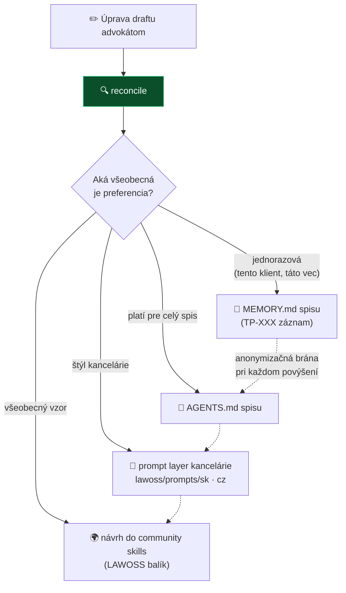

# Spec 0008: Reconcile — učenie z úprav advokáta

- **Stav:** návrh · **V2 kandidát — vedome NIE V1** (scope V1 sa klepe 12. 8., toto doň nepatrí)
- **Navrhol:** Marián Čuprík (MČ) · 2026-08-11
- **Zdroj inšpirácie:** skill `reconcile`, Jeff Su / Cowork Academy → [analýza](../research/inspiracie/reconcile-jeff-su.md) *(platený kurz bez licencie — adaptujeme koncept vlastnými slovami, text nepreberáme)*
- **Súvisiace:** [#21 tiered memory](navrhy.md) · [spec 0003 prompt layer](0003-prompt-layer.md) · [spec 0002 OKF](0002-okf-operacny-system-praxe.md) · [#5 hybrid routing](0003-prompt-layer.md#-hybrid-routing--rozdelenie-podľa-vrstvy)

## Problém

AI draft nikdy nie je finál. Advokát upraví podanie, zmluvu či email — a dnes sa tá práca **zahodí**: systém zajtra spraví tú istú chybu a advokát dookola opravuje to isté (oslovenie, štruktúru podania, citačný štýl, formálnosť). Úpravy advokáta sú pritom najkvalitnejší a najlacnejší tréningový signál, aký máme — vzniká sám, pri bežnej práci.

## Navrhované riešenie

Skill `reconcile` (SK/CZ): porovná AI draft s verziou, ktorú advokát **reálne použil**, a navrhne najmenšiu možnú zmenu inštrukcií, ktorá by rovnakej chybe nabudúce zabránila.

Mechaniku preberáme z originálu (fázy porovnanie → diagnóza → brána presnosti → návrh → schválenie; dispozície *delete → merge → move → rewrite → stage → add*; zásada „najprv orezať, až potom pridávať" — detail v [analýze](../research/inspiracie/reconcile-jeff-su.md)). **Naša pridaná hodnota je v tom, kam učenia ukladáme** — a presne tam vstupuje OKF.

### Adaptácia 1: rebrík umiestnenia nad OKF *(jadro adaptácie)*

Originál je zámerne standalone — umiestnenie učenia necháva na používateľa a výslovne odmieta vyžadovať štruktúru. My štruktúru **máme** (OKF), takže učenie stúpa po rebríku podľa všeobecnosti:

| Úroveň | Kam sa zapisuje | Príklad učenia |
|---|---|---|
| **Vec/klient** | `MEMORY.md` spisu (záznam TP-XXX podľa PROTOKOLU ZÁPISU) | „klient Novák chce oslovenie *vážený pán inžinier*" |
| **Spis** | `AGENTS.md` spisu | „v tejto veci vždy citovať aj CSP, nie len OZ" |
| **Kancelária** | prompt layer (`lawoss/prompts/sk/` alebo `cz/`) | „podania štruktúrujeme I./II./III., petit vždy na konci samostatne" |
| **Komunita** | návrh do LAWOSS balíka (PR) | „slovenské súdy — dátumy vypisovať slovom v petite" |

### Adaptácia 2: anonymizačná brána pri povýšení

Učenie extrahované zo spisu **nesmie niesť klientske údaje**, keď stúpa na vyššiu úroveň. Pravidlo: na úrovni spisu môže učenie odkazovať na vec; od úrovne kancelárie vyššie musí byť formulované všeobecne (žiadne mená, spisové značky, sumy). Pri povýšení na komunitnú úroveň kontrola človekom povinná — je to verejný PR.

### Adaptácia 3: citlivosť dát a beh

Reconcile **číta drafty aj finály = obsah spisu viazaný mlčanlivosťou**. Beh sa preto riadi [#5 hybrid routingom](0003-prompt-layer.md#-hybrid-routing--rozdelenie-podľa-vrstvy): lokálny model, alebo cloud len podľa citlivostnej voľby advokáta. Toto nie je detail — je to podmienka nasadenia.

### Adaptácia 4: human gate na každej úrovni

Preberáme poistky originálu a pridávame jednu vlastnú:

- advokát **schvaľuje každú** zmenu inštrukcií (žiadne tiché prepisovanie),
- jedna úprava ešte nie je pravidlo — slabé signály sa odkladajú (*stage*), kým sa nezopakujú,
- ak finál vyzerá horšie než draft, zmena sa **neučí** (môže ísť o omyl),
- **nové:** učenie, ktoré protirečí dohodnutému pravidlu kancelárie, ide na **prerokovanie tímu** — nie na tichý prepis spoločného promptu jedným advokátom.

### Čo máme v LAWOSS zadarmo navyše

| Výhoda | Detail |
|---|---|
| **Tracked changes z Word add-inu** | LegalWork robí drafty vo Worde s tracked changes — diff draft → finál dostávame **natívne**, netreba ho rekonštruovať |
| **Verzie markdownu v spise** | OKF spisy sú markdown — draft a finál sú dve verzie súboru, porovnanie je triviálne |
| **PROTOKOL ZÁPISU** | OKF už má disciplínu „kam čo patrí" — učenia dostanú vlastný typ záznamu (návrh: `R-XXX` v `MEMORY.md`) |

## Zaradenie a zóna

- **V2 kandidát** — konkretizuje [#21 tiered memory](navrhy.md) (je to mechanizmus učenia, ktorý tomu nápadu chýbal) a kŕmi [spec 0003](0003-prompt-layer.md). Do V1 nepatrí a nenavrhuje sa to.
- **🟢 zelená zóna** ([plán forku](../planning/plan-fork-a-workflow.md)) — čistý skill + prompty, žiadny zásah do jadra LegalWorku. ⚠️ Nepliesť s AGPL pluginom `legalwork-legalmemory` — ten je v zakázanej zóne; toto staviame vlastné nad OKF markdownom.

## Otvorené otázky

- [ ] Spúšťanie: manuálne („reconcile" po odoslaní dokumentu) vs. automatická ponuka pri uložení finálu do spisu?
- [ ] Formát záznamu učení: `R-XXX` v `MEMORY.md` spisu + rozšírenie PROTOKOLU ZÁPISU — odsúhlasiť v rámci OKF v0.2?
- [ ] Metrika zlepšovania: klesá počet materiálnych úprav na draft v čase? (jediný poctivý dôkaz, že sa systém učí)
- [ ] CZ variant: kde sa štýl podaní SK/CZ líši, učenia sa vetvia per jurisdikcia — potvrdiť s VŘ
