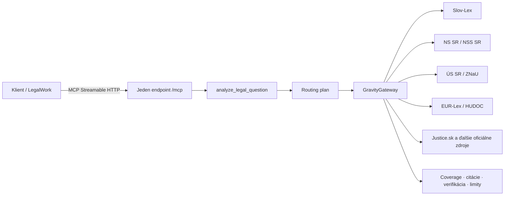

# Spec 0012: Jeden MCP endpoint pre viacero právnych zdrojov

- **Stav:** návrh
- **Navrhol:** Marián Čuprík (MČ) · 2026-08-21
- **Súvisiace:** [0004 SK MCP konektory](0004-mcp-sk-konektory.md) · [0006 Orchestrátor a subagenti](0006-orchestrator-subagenti.md) · [ADR 0007 Agent-first architektúra](../decisions/0007-agent-first-architektura.md) · [LAWOSS PR #14](https://github.com/Omni-Legal-Products/lawoss/pull/14)

> [!NOTE]
> Toto je technický návrh na prerokovanie. Nejde o prijaté rozhodnutie ani o tvrdenie, že už existuje verejne nasadená služba.

## Problém

Pôvodný návrh „jeden endpoint pre viacero MCP serverov“ rieši správny používateľský problém: advokát ani klient nemá ručne pripájať a udržiavať viacero právnych služieb. Čistý technický proxy server by však iba preposlal cudzie nástroje a preniesol na model výber zdroja, správne použitie nástrojov a interpretáciu neúplných výsledkov.

Pri právnom výskume potrebujeme okrem konektivity aj routing, overenie primárneho textu, kontrolu pokrytia, citácie a viditeľné limity.

## Navrhované riešenie

LAWOSS použije jednu doménovú MCP fasádu nad viacerými oficiálnymi právnymi konektormi:

Navonok je to jeden MCP endpoint a jedna právne zrozumiteľná operácia. Vnútri sa podľa otázky a relevantného dátumu vyberú potrebné zdrojové rodiny a oslovia sa paralelne. Nejde o všeobecný MCP multiplexer pre ľubovoľné cudzie `tools/list` a `tools/call` rozhrania.

## MCP kontrakt

### Verejný endpoint

- Transport: Streamable HTTP.
- Cesta: `/mcp`.
- Autentizácia: podľa nasadenia služby, minimálne oddelená od zdrojových credentials.
- Stav: endpoint má byť read-only a idempotentný z pohľadu právnych zdrojov.

### Verejný nástroj

`analyze_legal_question` prijíma:

| Parameter | Význam |
|---|---|
| `question` | právna otázka alebo výskumná úloha |
| `jurisdiction` | SK, CZ, EU, ECHR alebo kombinácia |
| `relevant_date` | dátum rozhodný pre znenie právneho predpisu alebo skutkový stav |
| `review_level` | rozsah verifikácie a kritiky |
| `files` | používateľom autorizované prílohy, ak ich nasadenie podporuje |

Výstup musí okrem záveru obsahovať:

- použité autority s identifikátorom, súdom/zdrojom, dátumom a odkazom;
- stav pokrytia každej požadovanej zdrojovej rodiny;
- informáciu o law-drift kontrole, ak je relevantná;
- chyby alebo nedostupnosť jednotlivých zdrojov;
- neistotu a limity, ktoré bránia tvrdeniu o úplnom overení;
- auditné metadáta bez ukladania surových klientskych dokumentov.

## Spracovanie požiadavky

1. Endpoint normalizuje otázku, jurisdikciu a relevantný dátum.
2. Routing plan určí povinné zdrojové rodiny a operácie.
3. `GravityGateway` paralelne spustí vyhľadávanie cez oficiálne konektory.
4. Pri nájdenej autorite sa načíta text alebo rozhodné znenie predpisu.
5. Pri relevantnej NS SR/NSS SR autorite sa podľa potreby vykoná tematická kontrola ÚS SR/ZNaU.
6. Validátor skontroluje štruktúru výsledkov, dôveryhodné detailné odkazy a stav pokrytia.
7. Syntéza oddelí pravidlo zo zákona, judikatúru, inferenciu a neistotu.
8. Klient dostane jednotný výsledok s citáciami a viditeľnými limitmi.

## Hranice komponentov

| Komponent | Zodpovednosť | Nesmie robiť |
|---|---|---|
| MCP HTTP server | autentizácia, MCP kontrakt, wire response | vyberať zdroje podľa vlastnej skrytej politiky |
| Orchestrátor | normalizácia, workflow, review level, syntéza | obchádzať povinnú verifikáciu |
| GravityGateway | routing plan → oficiálne konektory, fan-out, coverage | používať web fallback namiesto oficiálneho konektora |
| Zdrojové konektory | vyhľadanie a načítanie zdroja | vydávať neoverený výsledok za úplný |
| LAWOSS UI | konfigurácia endpointu, zobrazenie stavu a výsledku | poskytovať agentovi zápisové právne úkony bez human gate |

## Chybové stavy a verifikácia

- Nulový výsledok sa vráti ako nulové pokrytie, nie ako dôkaz, že autorita neexistuje.
- Chyba jedného voliteľného zdroja sa zobrazí v coverage a nesmie sa zamaskovať.
- Chyba povinného zdroja alebo povinného verifikačného kroku blokuje označenie výsledku za úplne overený.
- Neoficiálny, nedôveryhodný alebo chýbajúci detailný odkaz sa nesmie použiť ako čistá autorita.
- Historické znenie právneho predpisu sa kontroluje k relevantnému dátumu.
- Každý materiálny záver musí byť buď zdrojovo podložený, alebo označený ako inferencia, neistota či tooling limit.

## Bezpečnostné a licenčné hranice

- Verejný endpoint nesmie obsahovať credentials jednotlivých zdrojov.
- Zdrojové tokeny zostávajú na strane orchestrátora alebo konektora.
- Prílohy sa spracujú iba v rozsahu autorizácie a retenčnej politiky nasadenia.
- Základná operácia je read-only; podania, podpisovanie, mazanie a komunikácia navonok nie sú súčasťou tohto kontraktu.
- Konektory, routing pravidlá a produktový UI zostávajú oddelené, aby sa dali použiť aj mimo LAWOSS.

## Čo toto riešenie nie je

- Nie je to transparentný proxy server pre ľubovoľné MCP servery.
- Nie je to náhrada za zdrojové konektory ani za ich contract testy.
- Nie je to automatické rozhodovanie právnej veci.
- Nie je to povolenie na zápisové úkony v registroch alebo voči súdom.
- Nie je to dôvod vystaviť modelu všetky nástroje všetkých zdrojov naraz.

## Implementačná stopa

Koncept bol overený 2026-08-21 čítaním lokálneho Gravity prototypu `legal-orchestrator` (commit `4d91725`, súbory `src/legal_orchestrator/http_server.py`, `mcp_server.py` a `gravity_gateway.py`). Overenie potvrdilo endpoint `/mcp`, nástroj `analyze_legal_question` a paralelný fan-out na zdrojové rodiny. Tento lokálny prototyp ešte nie je predmetom tohto koordinačného PR a vyžaduje samostatnú čistú publish vetvu.

Navrhované implementačné kroky po schválení:

1. V Gravity pripraviť čistú publish vetvu alebo samostatný balík bez nesúvisiaceho vývojového stromu.
2. V LAWOSS pridať konfigurovateľné pripojenie na jeden orchestrator endpoint.
3. Zachovať existujúce priame MCP konektory ako fallback/development surface, nie ako používateľskú povinnosť.
4. Pridať contract testy pre jednotný request, coverage, čiastočný failure a provenance výsledku.
5. Prepojiť implementačný issue vo forku s týmto schváleným specom.

## Akceptačné kritériá

- Advokát nakonfiguruje jednu MCP URL namiesto viacerých právnych URL.
- Jedna otázka môže využiť viacero relevantných oficiálnych zdrojových rodín.
- Výsledok ukáže, ktoré zdroje boli použité, ktoré zlyhali a ktoré neboli potrebné.
- Zdrojovo nepodložené tvrdenie nebude prezentované ako overený právny záver.
- Relevantný dátum a law-drift stav sa zachovajú vo výsledku.
- Verejný kontrakt neobsahuje zápisové právne akcie.
- Pri zlyhaní povinného zdroja systém výsledok označí ako neúplne overený alebo spracovanie zablokuje.

## Otvorené otázky na prerokovanie

- Kde bude verejný alebo firemný orchestrator nasadený a kto bude spravovať jeho autentizáciu?
- Má byť v prvej verzii verejne viditeľný iba `analyze_legal_question`, alebo aj diagnostický coverage endpoint/tool?
- Ktoré zdrojové rodiny sú povinné pre SK, CZ, EU a ECHR variant?
- Má LAWOSS pri nedostupnosti orchestratora automaticky ponúknuť priame MCP pripojenia?
- Ktorá časť prototypu sa má publikovať ako samostatný balík a ktorá má zostať internou workflow vrstvou?
