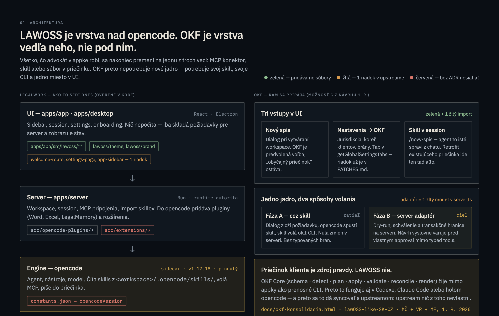
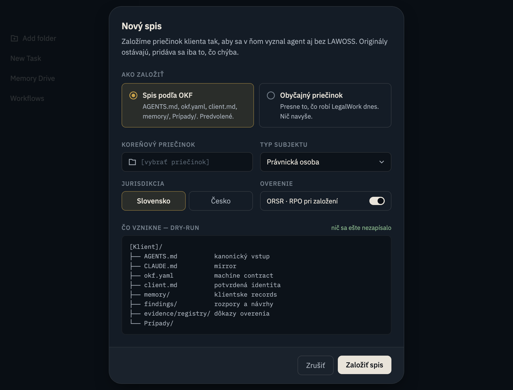
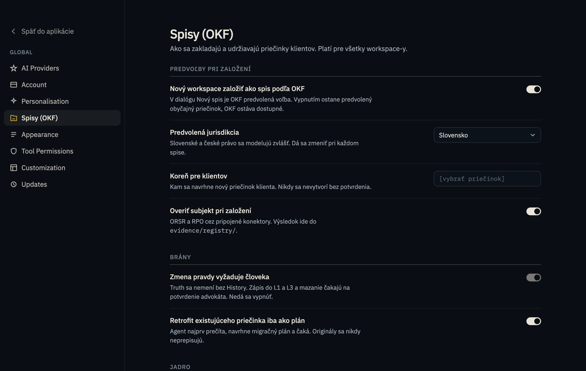
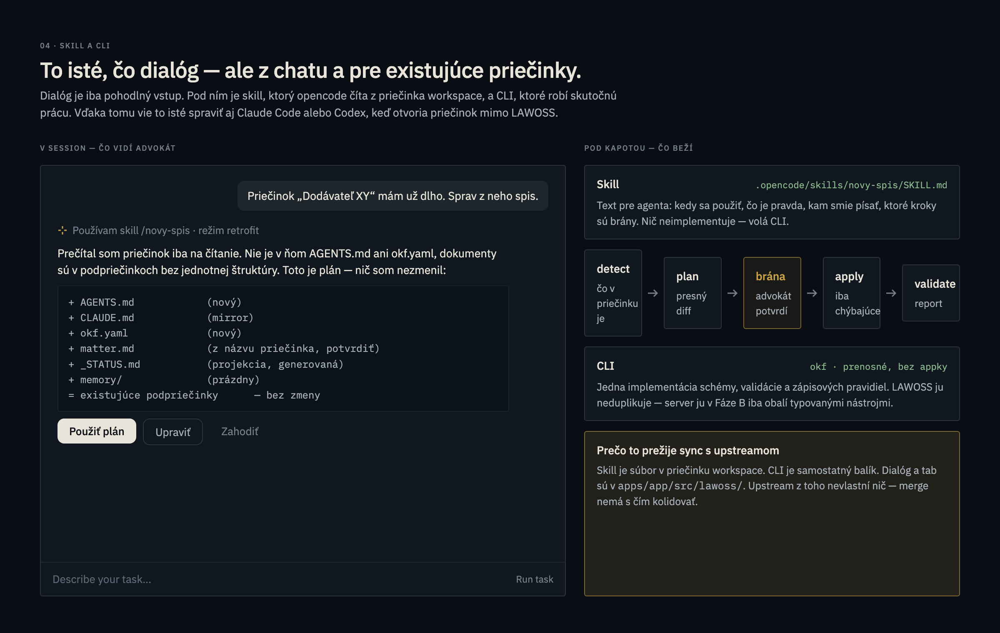

# Spec 0013: OKF CLI, Fáza A v LAWOSS a profily vecí

- **Stav:** návrh
- **Navrhol:** Marián Čuprík (MČ) · 2026-09-02 · *spracoval Claude Code na pokyn MČ*
- **Nadväzuje na:** [spec 0002 OKF](0002-okf-operacny-system-praxe.md) · [OKF 1.0 konsolidácia (MČ + VŘ + MF, call 1. 9.)](../docs/okf-konsolidacia.html) · [one-click onboarding (MF, 28. 8.)](../docs/superpowers/specs/2026-08-28-lawoss-one-click-onboarding-design.md)
- **Grafické návrhy:** [canvas na preklikanie](https://claude.ai/code/artifact/a761284b-d9c9-4058-9f96-9bb1eaf70597) · zdroje v [`assets/design/okf-cli/`](../assets/design/okf-cli/)

> [!IMPORTANT]
> Tento spec **nemení** rozhodnutie z 1. 9. (Možnosť C: OKF Core + prenosné CLI + LAWOSS adaptér). Robí tri veci: vysvetľuje, **čo to CLI vlastne je** a prečo nenaruší prenositeľnosť; navrhuje **poradie implementácie** (Fáza A bez zásahu do servera); a otvára **dieru, o ktorej konsolidácia mlčí** — OKF je dnes nakreslené sporovou agendou, no advokáti robia aj korporát, HR, IP, registrácie a insolvencie.

## Problém

Konsolidovaný návrh z 1. 9. hovorí *čo* má vzniknúť (jedno jadro, tri adaptéry, brány), ale tri veci nechal otvorené:

1. **Čo je „OKF CLI"** — v tíme to nie je zdieľaná predstava. Bez nej sa nedá rozhodnúť, kto ho vlastní a kde žije.
2. **Ako to dostať do LAWOSS bez toho, aby sme prišli o sync s upstreamom.** Server adaptér siaha do `apps/server`, čo je upstream kód.
3. **Typ práce.** V celom dokumente nie je slovo korporát, IP, RPVS ani insolvencia. Jediný náznak je priečinok „Pracovnoprávna vec" v príklade ACME. Ak to nevyriešime v schéme, vyriešia to advokáti priečinkami ako „Korporát 2026" — a OKF prestane byť pravdou.

## Navrhované riešenie

### 1 · Ako LAWOSS sedí na opencode (overené v kóde forku)



| Vrstva | Kde | Čo robí | Zóna |
|---|---|---|---|
| Engine | `opencode`, sidecar, pinnutý v `constants.json` (`v1.17.18`) | agent, nástroje, model; číta skills z `<workspace>/.opencode/skills/`, volá MCP, píše do priečinka | 🔴 |
| Server | `apps/server` | workspace, session, MCP pripojenia, import skillov; pluginy pre Word/Excel/LegalMemory | pluginy ⚪ · `extensions/` 🔴 |
| UI | `apps/app` + `apps/desktop` | sidebar, session, settings, onboarding — iba skladá požiadavky a zobrazuje stav | `apps/app/src/lawoss/**` 🟢 · 1-riadkové importy 🟡 |

Dôsledok, na ktorom stojí celý spec: **všetko, čo advokát v appke spraví, sa nakoniec premení na MCP konektor, skill alebo súbor v priečinku.** OKF preto nepotrebuje nové jadro pod opencode — potrebuje svoj skill, svoje CLI a tri miesta v UI.

### 2 · Čo je `okf` CLI

Malý program, ktorý sa spúšťa **v priečinku klienta** a vie presne päť vecí:

| Príkaz | Čo robí | Čo zapíše |
|---|---|---|
| `okf detect` | prečíta priečinok a povie, čo v ňom je a čo chýba | nič |
| `okf plan` | vyrobí presný zoznam, čo by sa vytvorilo | nič |
| `okf apply` | vytvorí **iba chýbajúce** artefakty | `AGENTS.md`, `okf.yaml`, `memory/`… |
| `okf validate` | skontroluje, či priečinok drží pravidlá (Truth má History, väzby sedia, L3 nepreteká) | nič |
| `okf render` | pregeneruje projekcie — `_STATUS.md`, `BRAIN.md`, `CLAUDE.md` mirror | iba odvodené súbory |

Súbory dnu, súbory von. Žiadny server, žiadna databáza, žiadna sieť. Overenie v ORSR *nie je* jeho práca — to robí agent cez MCP a výsledok mu odovzdá ako vstup. Spustiť dvakrát = rovnaký výsledok. Originály nikdy neprepíše.

**Ľudská brána je zámerne mimo neho.** CLI vyrobí plán; kto ho zavolal (agent alebo appka), ten ho ukáže advokátovi; `apply` beží až po potvrdení. Preto nemôže vzniknúť „vlastný approval", pred ktorým konsolidácia varuje — CLI ho jednoducho nevie obísť, lebo ho nevlastní.

### 3 · Prenositeľnosť — CLI ju nenaruší, naopak ju drží

Bez CLI by mal každý harness pravidlá OKF v prompte: Claude Code v skille, Codex v inom, opencode v treťom. Za pol roka by sa rozišli. CLI je *jedna* implementácia pravidiel, ktorú všetci volajú rovnako. Platí to za troch podmienok:

1. **Čítanie nevyžaduje nič.** Agent, ktorý otvorí priečinok bez CLI, sa zorientuje z `AGENTS.md`. CLI je na *zápis a kontrolu*, nie vstupenka na čítanie. Toto je jediné pravidlo, ktorého porušenie prenositeľnosť zabije. Navrhovaný test: **priečinok vyrobený ručne podľa `AGENTS.md` musí prejsť `okf validate`.**
2. **Nula závislosti na LAWOSS.** Vlastné repo (`Omni-Legal-Products/okf`), samostatný balík. LAWOSS si pinuje verziu rovnako ako `opencodeVersion`.
3. **Anglický machine contract, lokalizované zobrazenie** — to už konsolidácia má.

### 4 · Fáza A a Fáza B

| | Fáza A — cez skill | Fáza B — server adaptér |
|---|---|---|
| Tok | dialóg zloží požiadavku → opencode načíta `SKILL.md` → skill volá `okf detect` + `plan` → plán vidí advokát → potvrdí → `apply` → `validate` | to isté, ale dry-run, schválenie a transakčné hranice drží server cez typované nástroje |
| Zásah do upstreamu | **žiadny** | jeden 🟡 mount v `server.ts` |
| Brány | v skille a v UI, nie typované | typované, tak ako chce konsolidácia |
| Kedy | teraz — CLI ešte neexistuje, B nemá čo obaliť | keď CLI a schéma sadnú |

**Rozhodnutie MČ 2026-09-02: ideme najprv Fázu A.** B ostáva cieľ, nie alternatíva.

### 5 · Tri vstupy v UI

Každý je 🟢 komponent v `apps/app/src/lawoss/**` plus nanajvýš jeden 🟡 riadok v upstream súbore — rovnaký vzor, akým fork už nahradil uvítaciu obrazovku.

#### Nový spis — dialóg pri vytváraní workspace



OKF je predvolená voľba, „obyčajný priečinok" (= dnešný LegalWork) ostáva. Dry-run ukáže strom *pred* zápisom. Vo Fáze A dialóg iba zloží požiadavku pre skill.

#### Nastavenia → Spisy (OKF)



Predvoľby pri založení, brány, jadro. Brána „zmena pravdy vyžaduje človeka" sa nedá vypnúť. Tab pribudne do `getGlobalSettingsTabs` — riadok už je v `PATCHES.md` forku.

#### Skill v session — a jediná cesta pre retrofit



`/novy-spis` spraví z chatu to isté čo dialóg. Existujúci priečinok ide **iba tadiaľto**: read-only detect → plán → potvrdenie → iba chýbajúce artefakty. Advokát vidí presný diff a tri tlačidlá: použiť, upraviť, zahodiť.

### 6 · Profily vecí — nie nové systémy

OKF je dnes nakreslené sporovou agendou: matter, lehoty, podací denník. Keď sa ale pozrieme, čo je **spoločné pre každý typ práce**, je toho väčšina: identita klienta, AGENTS bootstrap, pamäťové záznamy, `evidence/registry`, ľudské brány, oddelenie SK/CZ. Líši sa iba: aké priečinky vzniknú, aké termíny existujú, aké registre a nástroje sú relevantné, čo ukazuje status.

Preto **profil**, dve polia v `okf.yaml`:

```yaml
matter:
  type: corporate      # litigation · corporate · employment · ip · registration · insolvency · advisory
  mode: ongoing        # bounded (má začiatok a koniec) · ongoing (stále zastupovanie)
```

`mode` je dôležitejšie než `type`. Spor alebo registrácia sú *ohraničené*. Korporát alebo HR pre firmu je *mandát* — udalosti (valné zhromaždenie, zmena konateľa), dokumenty (zápisnice, rozhodnutia), opakujúce sa povinnosti. Nie je to „prípad", a keby sme ho nútili do prípadu, vzniknú priečinky ako „Korporát 2026".

**Profil je priečinok šablón v balíku `okf`, nie kód** — `profiles/corporate/` so scaffoldom, poľami a odporúčanými nástrojmi. Pridať IP = pridať priečinok. Prenosné, lebo sú to dáta.

Čo profil mení:

| | Scaffold navyše | Termíny (druh) | Registre a nástroje, ktoré už máme |
|---|---|---|---|
| `litigation` | `podania/` | procesné | judikatúra, Slov-Lex, kalkulačka lehôt |
| `corporate` | `organy/`, `zapisnice/` | zákonné, registrové | ORSR, RPVS, RPO, Obchodný vestník |
| `registration` | — | registrové | RPVS, RPO |
| `ip` | `registracie/` | obnovy | `patent` CLI (EUIPO, ÚPV) |
| `insolvency` | — | procesné (prihlášky) | Register úpadcov |
| `employment` | — | zákonné, zmluvné | — |
| `advisory` *(predvolené)* | — | zmluvné | — |

Z „lehoty" sa stane všeobecný **termín** s druhom *procesná · zákonná · registrová · zmluvná · obnova* — jeden register, rôzne zdroje. Spec 0005 (lehoty) sa tým nezahadzuje, stáva sa profilom `litigation`.

Jeden klient s miešanou prácou už ide: `Prípady/` má každý svoj typ, a k tomu na úrovni klienta jeden `ongoing` mandát.

### 7 · Fázovanie

| Krok | Obsah | Prečo v tomto poradí |
|---|---|---|
| A0 | `okf` CLI v0.1: `detect · plan · apply · validate · render`, profily `advisory` + `litigation` | bez CLI nemá skill čo volať |
| A1 | skill `/novy-spis` vo forku (`lawoss/skills/`), inštalácia do workspace cez existujúci import | skill je len text, ide rýchlo |
| A2 | dialóg *Nový spis* + tab *Spisy (OKF)* ako sub-items pod **Experimenty** | tam patrí všetko rozpracované; sidebar ostáva vanilla |
| A3 | 🟡 prepojenie dialógu na upstream „Add folder" | až keď A2 sedí |
| B | server adaptér | keď schéma a CLI sadnú |
| profily | `corporate` + `registration` ako prvé — najčastejšia nesporová práca, MCP hotové | IP, HR, insolvencie až keď budú treba |

Nestavať šesť profilov naraz.

## Otvorené otázky

1. **Kde vznikne repo `okf`** — vlastné v organizácii (odporúčam), alebo dočasne `lawoss/okf/` vo forku s podmienkou nulovej závislosti, aby sa dalo neskôr vytiahnuť?
2. **Je `matter.type` pri založení povinný?** Odporúčam default `advisory` — advokát pri prvom kontakte často ešte nevie, čím to bude.
3. **Kto vlastní profily** — MČ (prax SK), VŘ (schéma a pamäť), alebo per profil?
4. **Termíny v profiloch `corporate` / `registration`** potrebujú právne overenie za SK aj CZ zvlášť, skôr než sa dostanú do šablóny. Tento spec ich zámerne nevymenúva.
