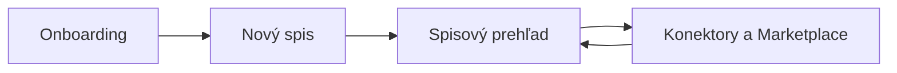

# Funkčné návrhy UI vrstvy LAWOSS

- **Navrhol:** Martin Friedrich (MF) · 2026-09-09
- **Stav:** návrh na prerokovanie
- **Cieľ:** premeniť aktuálne LAWOSS obrazovky vo forku LegalWork na súvislú prvú používateľskú cestu bez paralelného dizajnového systému
- **Nadväzuje na:** [LAWOSS Design systém](../docs/design/design-system.md), [dizajnový jazyk LAWOSS](../docs/design/2026-08-23-dizajnovy-jazyk-lawoss.md), [OKF spec](0002-okf-operacny-system-praxe.md) a rozširujúcu UI vrstvu v [PR #55](https://github.com/Omni-Legal-Products/lawOSS-like-SK-CZ/pull/55)

## 1. Východisko

Návrh vychádza z overenia implementačného repozitára `Omni-Legal-Products/lawoss` na vetve `dev`, commit `ec0f4c1`, vykonaného 2026-09-09. Aktuálny stav obsahuje:

| Existujúca plocha | Stav v overenom forku | Úloha v návrhu |
|---|---|---|
| `LawossWelcomePage` | existujúci onboarding s odporúčaným a podrobným nastavením | doplniť čitateľný stav konfigurácie |
| `NovySpisPage` | experimentálny OKF formulár s dry-run plánom | povýšiť na prvú funkčnú cestu založenia spisu |
| `PrehladPage` | dashboard s mock dátami | postupne napojiť na read-only údaje zo spisu |
| `MarketplacePage` | lokálny katalóg v režime náhľadu | doplniť riadenú inštaláciu až po schválení modelu |
| `ExperimentyPage` | príznaky a nedokončené pohľady | zachovať ako bezpečný release gate |

Návrh nepredpokladá nový shell ani náhradu LegalWork komponentov. Použije existujúce napojovacie body a reuse-first pravidlo.

## 2. Záväzné dizajnové pravidlá

- Hlavná téma je tmavý „podací denník na tmavom stole“: `desk #0A0E14`, `sheet #10171F`, atrament `#E9E4DA`, zlaté razidlo `#C9A24A`.
- UI používa IBM Plex Sans; IBM Plex Mono je vyhradený na spisové značky, IČO, názvy súborov, stavy a technické identifikátory.
- Zoznamy sú registre s 1 px deliacimi čiarami, nie mriežky dekoratívnych kariet. Aktívne rohy ostávajú hranaté podľa design systému.
- Na obrazovke je najviac jedna zlatá primárna výplň. Ostatné stavy používajú typografiu, symbol a semantickú farbu.
- Každý blok generovaný agentom má viditeľné označenie AI. „Overené“ sa zobrazí len spolu so zdrojom a provenance.
- UI samo nezapisuje OKF markdown. Zápis vykonáva príslušný skill/agent a UI zobrazuje jeho plán, výsledok a audit.
- Ľudská brána sa používa pri právne alebo nevratne významných účinkoch: napríklad potvrdenie lehoty, odoslanie, podpis, mazanie, sieťová alebo externá akcia. Bežná reconciliácia a rutinné statusové aktualizácie nesmú vytvárať ceremóniu potvrdenia pri každej jednotlivej zmene.

## 3. Funkčná cesta



### 3.1 Onboarding — setup ledger

Existujúca úvodná obrazovka zostáva základom. Doplní sa iba stavový register nastavenia:

```text
PRVÉ NASTAVENIE

01  Pracovný priečinok       pripravené
02  AI model                 čaká na výber
03  Ochrana pri úpravách     pripravené
04  Prvá úloha               voliteľné
```

Po voľbe odporúčaného nastavenia alebo vlastnej cesty používateľ vidí:

1. čo už bolo vytvorené,
2. čo ešte chýba,
3. kam sa ukladajú súbory,
4. ktorý model a ktoré rozšírenia sa použijú,
5. či sa dá nastavenie bezpečne obnoviť po prerušení.

Primárna akcia má byť `Pokračovať`. Pri chybe sa zobrazí dôvod a lokálna oprava, nie všeobecná chyba bez kontextu. Prvá úloha je voliteľná a má používať neklientsky citlivý testovací súbor alebo používateľom vybraný dokument.

**Akceptačné kritériá**

- Odporúčaná cesta vytvorí workspace a zobrazí výsledný stav bez ďalšieho technického rozhodovania.
- Podrobná cesta zachová vybranú cestu a stav po prerušení.
- Používateľ vždy vie, či je činnosť lokálna, cloudová alebo sieťová.
- Nastavenie konektorov sa nedostane do onboardingovej cesty bez jasného trust labelu.

### 3.2 Nový spis — OKF plán pred zápisom

Existujúci experimentálny formulár sa zjednotí do štyroch registrových krokov:

```text
01  Workspace
02  Údaje spisu
03  Návrh štruktúry
04  Výsledok
```

Formulár zachová voľbu `Spis podľa OKF` / `Obyčajný priečinok`, jurisdikciu SK/CZ, subjekt, názov, IČO, protistranu, koreňový priečinok a overenie subjektu.

Dry-run plán musí rozlišovať:

```text
PRIDÁ SA
  systémové súbory a chýbajúce priečinky podľa zvoleného profilu

ZOSTÁVA
  existujúce originály a súbory používateľa

VYŽADUJE POZORNOSŤ
  konflikt názvu, cesta mimo workspace, neoveriteľný údaj
```

Akcia sa delí na `Zobraziť plán` a `Potvrdiť vytvorenie spisu`. Po dokončení sa ponúkne `Otvoriť spis` a `Spustiť prvú úlohu`. Funkcia zostáva za experimentálnym príznakom, kým nebude napojená na skutočné spisy a overená na otvorených testovacích dátach.

**Akceptačné kritériá**

- Pred zápisom je viditeľný konkrétny zoznam vytváraných a nemeniteľných položiek.
- Existujúci súbor sa neprepíše bez explicitného riešenia konfliktu.
- Výsledok obsahuje cestu, validáciu a auditný odkaz.
- Agent používa existujúci `novy-spis` skill/CLI; GUI nevytvára druhú implementáciu OKF logiky.

### 3.3 Spisový prehľad — read-only cockpit

Globálny `Prehľad praxe` sa bude napájať na konkrétny spis. Základný layout:

```text
SPIS: ACME / ZMLUVNÝ SPOR       stav: OKF validné

OBAL              FAKTY              ÚLOHY              LEHOTY
spisová značka    zdroj + locator    otvorené            potvrdené / kandidáti

ČAKÁ NA POZORNOSŤ ADVOKÁTA
──────────────────────────────────────────────────────────────
lehota            návrh agenta       dôvod / zdroj       otvoriť
nezrovnalosť      upozornenie        súbor + riadok      preskúmať

POSLEDNÉ UDALOSTI A AUDIT
```

Pohľad číta `spis.md`, `klient.md`, `_STATUS.md`, `lehoty.md`, `MEMORY.md` a chronológiu podľa existujúceho OKF mapovania. Každý fakt, návrh a lehota má odkaz na zdrojový súbor a locator, ak je dostupný.

Bežné statusové a indexové aktualizácie prebiehajú cez agenta a zobrazia sa v audite. Karta brány sa otvorí len pri akcii s právnym alebo nevratným účinkom. Pri kandidátnej lehote sa zobrazí zdroj, výpočet, neistota a rozhodnutie advokáta; pri bežnom synchronizačnom zápise sa zobrazí súhrn zmien.

**Akceptačné kritériá**

- Prvá verzia je read-only okrem volania existujúceho skillu cez riadenú akciu.
- Neparsovateľná časť markdownu sa zobrazí ako surový obsah s upozornením; nesmie ticho zmiznúť.
- Obrazovka má jeden informačný diagram — napríklad pás lehôt alebo timeline — a registre, nie wall of text.
- Stav `AI návrh`, `Overené`, `čaká na doklady` a `lokálne` je rozlíšiteľný aj bez farby.

### 3.4 Marketplace a konektory — riadené rozšírenia

Existujúci katalóg sa rozšíri o tok:

```text
Náhľad → Zdroj a závislosti → Oprávnenia → Potvrdenie → Inštalácia → Overenie
```

Detail každej položky musí zobrazovať:

- repository a pin/ref,
- jurisdikciu,
- závislosti a odhadovanú pamäťovú cenu,
- rozsah inštalácie: workspace alebo globálne,
- trust label: lokálne, vlastný server alebo tretia strana,
- schopnosti: read-only, local-write, network alebo external-action,
- či je potrebná ľudská brána.

Predvolená konfigurácia SK/CZ sa môže pri onboardingu nainštalovať na klik. Remote inštalácia zostáva pokročilou cestou. Pri rozšíreniach s network/external-action schopnosťou sa nesmie použiť rovnaká akcia ako pri read-only položke.

**Akceptačné kritériá**

- Inštalácia najprv ukáže konkrétny plán zmien a cieľový rozsah.
- Neoverené položky zostanú v režime náhľadu.
- Ku každému MCP je pripojený sprievodný skill, ktorý prekladá jeho použitie do používateľskej úlohy.
- Po inštalácii sa zobrazí výsledok overenia, verzia a možnosť vypnutia/rollbacku.
- Marketplace zobrazuje pamäťovú cenu rozšírení a neblokuje spustenie základnej konfigurácie.

## 4. Poradie a hranice prvej implementácie

| Priorita | Funkcia | Prvá verzia | Zatiaľ mimo rozsahu |
|---|---|---|---|
| P0 | Onboarding setup ledger | stav workspace, priečinka, modelu a bezpečnostných volieb | personalizovaný štýlový editor advokáta |
| P0 | Nový spis | OKF/obyčajný priečinok, dry-run, potvrdenie, výsledok | automatická migrácia veľkého existujúceho archívu |
| P1 | Spisový prehľad | read-only obal, fakty, úlohy, lehoty, audit | plná editácia markdownu v novom UI |
| P2 | Marketplace/konektory | katalóg, trust, plán inštalácie, defaulty | automatická inštalácia neoverených a externých akcií |

Každá položka sa po schválení rozdelí na implementačné issue vo forku `lawoss`, ktoré odkáže späť na tento spec. Tento dokument sám nepovoľuje implementáciu ani automatické zápisy do klientskych spisov.

## 5. Otvorené rozhodnutia pre call

- Má byť `Nový spis` prvou viditeľnou LAWOSS akciou v onboardingu, alebo zatiaľ zostať iba v `Experimenty`?
- Ktorý profil adresárovej štruktúry a nomenklatúry má byť default pre SK a CZ?
- Ktoré defaultné skilly, MCP a pluginy patria do prvej klikateľnej konfigurácie?
- Aký spôsob zobrazovania pamäťovej ceny je dostatočne presný pre macOS a Windows?
- Ktoré akcie sú právne významné a teda vyžadujú kartu brány, aby sa nevytvorilo potvrdenie pri každom bežnom zápise?

## 6. Overenie návrhu

- Implementačný stav: [LAWOSS `dev`](https://github.com/Omni-Legal-Products/lawoss/tree/dev), auditovaný 2026-09-09 na commite `ec0f4c1`.
- Dizajnová referencia: [LAWOSS Design systém](../docs/design/design-system.md).
- Posledný relevantný tímový zápis: [call 2026-09-07](../meetings/2026-09-07-zapis-tyzdenne-stretnutie.md).
- Rozlíšenie zdroja a návrhu: obsah tohto dokumentu je nový návrh MF; existujúce rozhodnutia a prototypy sú uvedené ako podklady, nie ako automatické schválenie.
