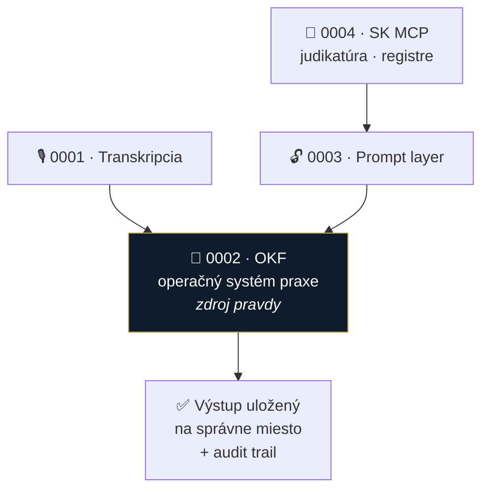

# 📐 Špecifikácie funkcií

Kandidáti na **v1** — evidencia nápadov, ktoré dozreli z brainstormingu

| # | Spec | Stav | Poznámka |
|---|---|---|---|
| 0001 | [Transkripcia](0001-transkripcia.md) | návrh | hovory, porady, diktát → priamo do spisu |
| 0002 | [**OKF — operačný systém praxe**](0002-okf-operacny-system-praxe.md) | návrh · **vysoká priorita** | ⭐ jadro odlíšenia; veľká časť už existuje (`novy-spis`) |
| 0003 | [Prompt layer](0003-prompt-layer.md) | návrh | žiadny black box, plná kontrola + voľba modelu |
| 0004 | [SK MCP konektory](0004-mcp-sk-konektory.md) | návrh | judikatúra, Slov-Lex, registre — väčšina už beží |

## Ako to spolu drží

**Ťažisko je 0002.** Ostatné tri sú vstupy a nástroje — ale hodnotu pre advokáta vytvára až to, že výstup **skončí na správnom mieste v spise** a dá sa mu veriť.

> [!TIP]
> Z poznámok: *„Workflow nad inteligenciou"* — appka je **lepidlo a register**, nie monolitický AI engine. To je zároveň odpoveď na výhradu z roastu, že advokát si nekúpi kód, ale poriadok a istotu.

## Otvorené naprieč specmi

- [ ] Ktoré z týchto štyroch je reálne **v1** a čo je až neskôr?
- [ ] Názov projektu *(„mikeOSS Slovakia" je pracovný)*
- [ ] Voľba základu — mikeOSS / Stella / LegalWork ([inspiracie](../research/inspiracie/))
