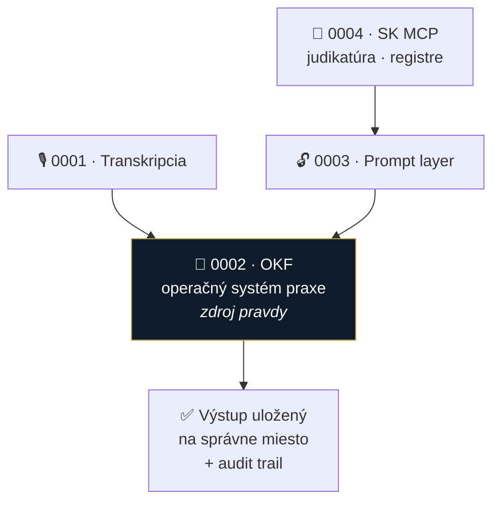

# 📐 Špecifikácie funkcií

Kandidáti na **v1** — evidencia nápadov, ktoré dozreli z brainstormingu

> 🌐 **Grafický prehľad:** [prehlad.html](prehlad.html) — [živá verzia](https://originalmagneto.github.io/lawOSS-like-SK-CZ/specs/prehlad.html)
> 💡 **Evidencia návrhov (kto čo navrhol):** [navrhy.md](navrhy.md) · 🗃️ **Všetkých 26 nápadov:** [zberný kôš](../planning/napady.md) · [**podať nový návrh →**](https://github.com/originalmagneto/lawOSS-like-SK-CZ/issues/new?template=feature-navrh.yml)

| # | Spec | Navrhol | Stav | Verzia | Poznámka |
|---|---|---|---|---|---|
| 0001 | [Transkripcia](0001-transkripcia.md) | MČ | návrh | V2 | LegalWork už transkribuje sám — naša časť je zaradenie do spisu |
| 0002 | [**OKF — operačný systém praxe**](0002-okf-operacny-system-praxe.md) | MČ | návrh · **vysoká priorita** | **V1** | ⭐ jadro odlíšenia; veľká časť už existuje (`novy-spis`) |
| 0003 | [Prompt layer](0003-prompt-layer.md) | MČ | návrh | V2 | žiadny black box + [hybrid routing](0003-prompt-layer.md#-hybrid-routing--rozdelenie-podľa-vrstvy) |
| 0004 | [SK MCP konektory](0004-mcp-sk-konektory.md) | MČ | návrh | **V1** | judikatúra, Slov-Lex, registre — väčšina už beží |
| 0005 | [**Lehoty & timeline spisu**](0005-lehoty-timeline.md) | MF *(+MČ)* | rozpracované | **V1** | ⭐ kandidát #1 od MF — povinné potvrdenie advokátom |
| 0006 | *Orchestrátor a subagenti* | MF | [PR #2](https://github.com/originalmagneto/lawOSS-like-SK-CZ/pull/2) — **otvorený** | — | číslo rezervované, kým sa PR nezmerguje |
| 0007 | [Podpisovanie QES/QTS a zaručená konverzia](0007-podpisovanie-a-zarucena-konverzia.md) | MČ | návrh | V2 / neskôr | cez [Autogram](https://github.com/slovensko-digital/autogram) ako externý proces — ⚠️ EUPL-1.2 |
| 0008 | [Lokálny anonymizačný gate pred externým LLM](0008-anonymizacia-a-privacy-gate.md) | MF | návrh | V1.1 / P1 | privacy gate pred externým routingom; samostatný local-service/sidecar |

> [!NOTE]
> **Zaradenie do verzií je návrh, nie rozhodnutie.** Scope V1 sa odklepáva **v stredu 12. 8. 2026** → [agenda a odôvodnenie](../meetings/2026-08-12-agenda-mvp.md).
> Výnimka: **zaručená konverzia** je rozhodnutím MČ z 7. 8. presunutá až do ďalšej verzie.

## Ako to spolu drží

**Ťažisko je 0002.** Ostatné tri sú vstupy a nástroje — ale hodnotu pre advokáta vytvára až to, že výstup **skončí na správnom mieste v spise** a dá sa mu veriť.

> [!TIP]
> Z poznámok: *„Workflow nad inteligenciou"* — appka je **lepidlo a register**, nie monolitický AI engine. To je zároveň odpoveď na výhradu z roastu, že advokát si nekúpi kód, ale poriadok a istotu.

## Otvorené naprieč specmi

- [x] ~~Ktoré z týchto štyroch je reálne **v1** a čo je až neskôr?~~ → **návrh scope V1 pripravený**, odklepáva sa 12. 8. → [agenda](../meetings/2026-08-12-agenda-mvp.md)
- [ ] Kto berie ktorú položku V1 a dokedy ju chceme vydať
- [ ] Zmergovať [PR #2](https://github.com/originalmagneto/lawOSS-like-SK-CZ/pull/2) a uvoľniť tým číslo 0006
- [ ] Názov projektu *(„mikeOSS Slovakia" je pracovný)*
- [ ] Voľba základu — mikeOSS / Stella / LegalWork ([inspiracie](../research/inspiracie/))
