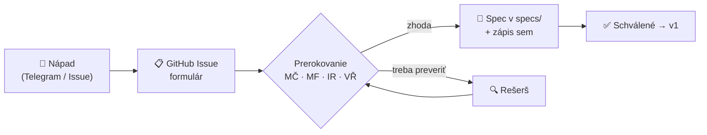

# 💡 Návrhy funkcií — evidencia

Kto čo navrhol, v akom je to stave a kde to žije

> [!TIP]
> **Chceš podať návrh?** Najjednoduchšie cez GitHub — [**Nový návrh funkcie →**](https://github.com/Omni-Legal-Products/lawOSS-like-SK-CZ/issues/new?template=feature-navrh.yml)
> Netreba nič programovať, je to formulár. Dá sa aj z mobilu. Po prerokovaní ho prepíšeme do `specs/`.

## Kto je kto

| Skratka | Meno | E-mail | GitHub | Telegram |
|---|---|---|---|---|
| **MČ** | Marián Čuprík | cuprik@achz.sk | [originalmagneto](https://github.com/originalmagneto) | @originalmagneto |
| **MF** | Martin Friedrich | martin@friedrich.sk | — | *(bez username)* |
| **IR** | Igor Ribár | igor.ribar@rs-p.digital | [igorribar](https://github.com/igorribar) | *(bez username)* |
| **VŘ** | Vojta Říha 🇨🇿 *(pridal sa 2026-08-06)* | riha.vojtech@gmail.com | [LexaurinTheDog](https://github.com/LexaurinTheDog) | @Groover89 |

E-maily doplnené 2026-08-11 (zdroj: kalendárová pozvánka na sync cally). GitHub účty IR a VŘ doplnené 2026-08-16 — **overené cez GitHub API** ako autori PR #33–#42 (IR) a #48–#50 (VŘ); VŘ o doplnenie sám požiadal v [PR #50](https://github.com/Omni-Legal-Products/lawOSS-like-SK-CZ/pull/50). GitHub účet MF doplniť, keď si ho potvrdí.

## Evidencia návrhov

> [!NOTE]
> ### Stavy — pevná sada, iné sa nepoužívajú
>
> | Stav | Znamená | Ďalší krok |
> |---|---|---|
> | 💭 **nápad** | zapísané, nerozpracované | rozpísať do specu, alebo zamietnuť s dôvodom |
> | 📝 **spec** | rozpísané do špecifikácie | dať tímu na odklep |
> | ✅ **odklepnuté** | tím schválil, môže sa stavať | issue vo forku *(viď [AGENTS.md](../AGENTS.md#-od-nápadu-k-implementácii--dve-repá-jeden-smer))* |
> | 🔨 **implementuje sa** | beží PR vo forku | dokončiť a zavrieť |
> | ✔️ **hotové** | je to v produkte | — |
> | ⏸️ **odložené** | vedome nie teraz | **musí mať spúšťač**, kedy sa vráti |
> | ❌ **zamietnuté** | nejde sa do toho | **musí mať dôvod** |
>
> Za stavom môže nasledovať `·` a voľná poznámka. **Stav sám je vždy z tejto sady** — inak sa nedá povedať, čo kde visí.

| # | Návrh | Navrhol | Dátum | Stav | Kde |
|---|---|---|---|---|---|
| 1 | Transkripcia (hovory, porady, diktát → do spisu) | **MČ** | 2026-07-29 | 📝 **spec** | [spec 0001](0001-transkripcia.md) |
| 2 | OKF — operačný systém advokátskej praxe | **MČ** | 2026-07-29 | 📝 **spec** · ⭐ vysoká priorita | [spec 0002](0002-okf-operacny-system-praxe.md) |
| 3 | Otvorený prompt layer (žiadny black box) | **MČ** | 2026-07-29 | 📝 **spec** | [spec 0003](0003-prompt-layer.md) |
| 4 | SK MCP konektory (judikatúra, Slov-Lex, registre) | **MČ** | 2026-07-29 | 📝 **spec** | [spec 0004](0004-mcp-sk-konektory.md) |
| 6 | **Attorney workflow MVP** — lehoty, conflict check, research ledger, dokumentový workflow, control plane | **MF** | 2026-07-30 | 📝 **spec** · (lehoty → spec 0005; ledger/control plane sa zlúčia do 0003/0004) | [Issue #1](https://github.com/Omni-Legal-Products/lawOSS-like-SK-CZ/issues/1) |
| 7 | **Lehoty & timeline spisu** — extrakcia lehôt s povinným potvrdením + vizuálna chronológia veci (mermaid/excalidraw) | **MF** *(+MČ timeline)* | 2026-07-30 | 📝 **spec** · ⭐ kandidát na alfu #1 | [spec 0005](0005-lehoty-timeline.md) |
| 8 | **OCR ingest → markdown** — Mistral OCR quick win (existujúca Quick Action MČ), markdown-first namiesto DOCX-centrizmu | **MČ** | 2026-07-30 | 📝 **spec** · quick win do alfy | [backlog](../planning/backlog.md) |
| 5 | **Hybrid routing** — lokálny model pre OKF, subscription pre rešerš, anonymizácia pred assessmentom | **MČ** | 2026-07-29 | 💭 **nápad** | [spec 0003 §hybrid](0003-prompt-layer.md#-hybrid-routing--rozdelenie-podľa-vrstvy) |
| 9 | **Orchestrátor a subagenti** — kto riadi workflow, oprávnenia agentov, human gates, auditná stopa | **MF** | 2026-08-04 | 📝 **spec** · PR otvorený | [PR #2](https://github.com/Omni-Legal-Products/lawOSS-like-SK-CZ/pull/2) |
| 10 | **Digitálna sekretárka** — založenie spisu → priečinky → workflow písaných aj diktovaných zápiskov → markdown do spisu | **MČ** | 2026-08-06 | 💭 **nápad** · spája 0001 + 0002 | [call 6. 8.](../meetings/2026-08-06-sync-call-volba-zakladu.md) |
| 11 | **UI/CLI prepínač** — UI ako default, CLI ako voliteľný režim | **MČ** *(podnet VŘ)* | 2026-08-06 | ✅ **odklepnuté** · na calle | [ADR 0003](../decisions/0003-legal-work-ako-zaklad.md) |
| 12 | **Markdown/Obsidian interoperabilita** — markdown ako primárny formát, žiadny vendor lock-in | **MČ** *(s VŘ)* | 2026-08-06 | ✅ **odklepnuté** · na calle | [ADR 0003](../decisions/0003-legal-work-ako-zaklad.md) |
| 13 | **MCP Salvia** — CZ judikatúra ako voliteľný modul (~10 € / 3 000 dotazov, lepšia indexácia než Codexis) | **VŘ** | 2026-08-06 | 💭 **nápad** · overiť licenčné podmienky | [call 6. 8.](../meetings/2026-08-06-sync-call-volba-zakladu.md) |
| 14 | **Špecializovaní agenti podľa právneho odvetvia** — všeobecný agent spotrebuje priveľa dotazov | **VŘ** | 2026-08-06 | 💭 **nápad** | [call 6. 8.](../meetings/2026-08-06-sync-call-volba-zakladu.md) |
| 15 | **Poľské rozšírenie (PL)** — voľne prístupné poľské právne dáta a judikatúra, evaluácia cez kontakty v PL | **VŘ** | 2026-08-06 | ✅ **odklepnuté** · na calle | [call 6. 8.](../meetings/2026-08-06-sync-call-volba-zakladu.md) |
| 16 | **Modulové rozhranie plug-and-play** — moduly ako LEGO nad jednotným základom, bezpečnostné hranice | **MČ** *(spracúva IR)* | 2026-08-06 | 📝 **spec** · IR do 2026-08-19 | [call 6. 8.](../meetings/2026-08-06-sync-call-volba-zakladu.md) |
| 17 | **Rešeršný workflow „one-click"** — dotaz → rešerš → projektové artefakty, cez NotebookLM CLI | **MČ** | 2026-08-06 | 💭 **nápad** | [call 6. 8.](../meetings/2026-08-06-sync-call-volba-zakladu.md) |
| 18 | **Google Workspace integrácia** — e-maily a marketingový outreach cez harness | **MČ** | 2026-08-06 | 💭 **nápad** · nízka priorita | [call 6. 8.](../meetings/2026-08-06-sync-call-volba-zakladu.md) |
| 19 | **Podpisovanie QES + QTS cez Autogram** — cez CLI aj lokálne HTTP API (`localhost:37200`); podpora eID, eObčanky a I.CA SecureStore | **MČ** | 2026-08-06 | 📝 **spec** · ⚠️ Autogram je EUPL-1.2 → volať ako externý proces, nevendorovať | [spec 0007](0007-podpisovanie-a-zarucena-konverzia.md) |
| 26 | **Zaručená konverzia** — listinný ↔ elektronický dokument so zachovaním právnych účinkov; advokát je oprávnená osoba. MČ si na to stavia aj vlastnú aplikáciu | **MČ** | 2026-08-07 | 📝 **spec** · **vyčlenené do vlastného specu 2026-08-12** po rešerši · **NIE V1, NIE V2** — vyžaduje SOAP integráciu na štátny register, mandátny certifikát a platenú kvalifikovanú validačnú službu | [spec 0010](0010-zarucena-konverzia.md) |
| 27 | **Lokálny anonymizačný gate pred externým LLM** - lokálna detekcia, nezávislé overenie a povinné potvrdenie pred externým routingom | **MF** | 2026-08-11 | ⏸️ **odložené** · nice to have · mimo prvej verzie *(call 2026-08-12)* | [spec 0008](0008-anonymizacia-a-privacy-gate.md) · [Issue #15](https://github.com/Omni-Legal-Products/lawOSS-like-SK-CZ/issues/15) |
| 28 | **Zoraďovanie súborov vo workspace browseri** — podľa dátumu, veľkosti, typu a názvu; pri spise s desiatkami dokumentov chýba ako prvé | **MČ** | 2026-08-13 | 💭 **nápad** · malé zlepšenie s okamžitým dopadom · kandidát na upstream PR | [zberný kôš #28](../planning/napady.md) |
| 29 | **Sprístupniť režim sledovania zmien v editore dokumentov** — editor podporuje `suggesting`, LegalWork ho natvrdo nikdy nezapne; pre advokáta je tracked changes základ | **MČ** | 2026-08-13 | 💭 **nápad** · **overené v kóde** *(`artifact-docx-editor.tsx` posiela len `editing`/`viewing`)* · silný kandidát na upstream PR | [zberný kôš #29](../planning/napady.md) |
| 30 | **Zrozumiteľnejšia hláška pri priložení .docx do chatu** — dnes tvrdí, že formát sa nedá prečítať, hoci appka má vstavaný editor Wordu; má nasmerovať na workspace | **MČ** | 2026-08-13 | 💭 **nápad** · zmena jedného reťazca · vhodný **prvý** upstream PR | [zberný kôš #30](../planning/napady.md) |
| 31 | **Meno advokáta pri sledovaných zmenách a komentároch** — dnes sa všetko podpíše ako „Legal Cowork"; appka nemá nastavenie mena používateľa | **MČ** | 2026-08-13 | 💭 **nápad** · **overené v kóde** · pri dokumente pre protistranu alebo súd ide o autorstvo úprav | [zberný kôš #31](../planning/napady.md) |
| 32 | **Nastaviteľná nomenklatúra pomenovania súborov** — vlastná konvencia (napr. `RRRR-MM-DD Názov V1/V2/final`); pri „usporiadaj spis" agent premenuje aj existujúce súbory podľa obsahu | **MČ** | 2026-08-14 | 💭 **nápad** · sedí na OKF a na hranicu z ADR 0007 | [zberný kôš #32](../planning/napady.md) |
| 33 | **Ako ochrániť know-how pred komerčným prevzatím** — čo bráni tomu, aby niekto na našej appke staval platené školenia, add-ony či hosting | **MČ** | 2026-08-14 | 💭 **nápad** · ⚠️ **strategická otázka, patrí na samostatné ADR** · MIT to nebráni vedome | [zberný kôš #33](../planning/napady.md) |
| 34 | **DOCX round-trip s testovacím korpusom a vizuálnou kontrolou** — podmienka IR *„Word nesmie byť druhá kategória"* prevedená na merateľnú požiadavku; 9 zdokumentovaných spôsobov, ako sa rozbije `.docx` → PDF, ktoré **textová kontrola nenájde** (`pdftotext` vráti správny text aj z rozsypaného layoutu) | **VŘ** | 2026-08-15 | 💭 **nápad** · podmienka k **Q25**, čaká na odklep | [odpovede VŘ, Q25](../planning/2026-08-15-odpovedi-VR-Q01-Q25.md) |
| 35 | **Kontrolný dotaz (canary) pri sankčnom screeningu** — sankčné API bez kľúča vracia prázdny výsledok aj pre zjavne sankcionovanú osobu; bez dotazu na známy pozitívny prípad znamená „čistý výsledok" len „dotaz neprešiel" | **VŘ** | 2026-08-15 | 💭 **nápad** · podmienka k **Q14** a k metodike AML | [odpovede VŘ, Q14](../planning/2026-08-15-odpovedi-VR-Q01-Q25.md) |
| 36 | **Hranica vynútená v nástroji, nie v prompte** — *„čo agent nesmie, mu nemá ísť ponúknuť"*; povinný `--dry-run` pri odosielaní a odstránenie rizikových funkcií z nástrojovej plochy (u VŘ zúženie zo 79 nástrojov na 12, vypnutý webhook zneužiteľný cez prompt injection) | **VŘ** | 2026-08-15 | ✅ **zapracované v ADR 0007**, zlúčené 2026-08-17 | [ADR 0007](https://github.com/Omni-Legal-Products/lawOSS-like-SK-CZ/pull/19) · [odpovede VŘ, Q21](../planning/2026-08-15-odpovedi-VR-Q01-Q25.md) |
| 37 | **Typované záznamy pamäte + oddelená vrstva „poučenie z chyby"** — netypovaná pamäť po pár mesiacoch splynie v hromadu a nedá sa revidovať; to, čo sa model naučil zle, je iná kategória než obsah spisu a maže sa inak | **VŘ** | 2026-08-15 | 💭 **nápad** · doplnok k [spec 0002](0002-okf-operacny-system-praxe.md), z vyše roka prevádzky | [odpovede VŘ, Q10](../planning/2026-08-15-odpovedi-VR-Q01-Q25.md) |
| 38 | **Metrika „koľko z návrhu advokát prepísal a v čom"** — nie metrika správnosti, ale **štýlu**; keď číslo neklesá, prompt layer sa neučí | **VŘ** | 2026-08-15 | 💭 **nápad** · doplnok k **Q13** a [spec 0003](0003-prompt-layer.md) | [odpovede VŘ, Q13](../planning/2026-08-15-odpovedi-VR-Q01-Q25.md) |
| 39 | **Export do existujúcich spisových a fakturačných systémov** — české kancelárie ich väčšinou už majú (u VŘ Evolio); keby sa malo voliť medzi vlastným billingom a dobrým exportom, prednosť má export | **VŘ** | 2026-08-15 | 💭 **nápad** · mení ťažisko **Q08** z „čo staviame" na „s čím sa spájame" | [odpovede VŘ, Q08](../planning/2026-08-15-odpovedi-VR-Q01-Q25.md) |
| 40 | **Distribúcia schváleného poznatku ku všetkým agentom** — povýšenie nie je len otázka súhlasu; doložený prípad, keď subagent bez prístupu k zdieľanej pamäti zopakoval judikát už vyhodnotený ako problematický | **VŘ** | 2026-08-15 | 💭 **nápad** · doplnok k **Q11** a k reconciliation | [odpovede VŘ, Q11](../planning/2026-08-15-odpovedi-VR-Q01-Q25.md) |
| 41 | **Automat na upstream sync s konfliktným reportom** — viazaný na `PATCHES.md`, aby sync vedel zopakovať hocikto; automat pri konflikte nič nerozhoduje sám | **IR** | 2026-08-14 | 💭 **nápad** · rieši otvorený bod „kto vlastní sync" (**Q02**) | [PR #13](https://github.com/Omni-Legal-Products/lawOSS-like-SK-CZ/pull/13) |
| 20 | **Fakturácia a výkazy času** — v rozhraní na mockupoch (Fakturácia, Výkazy času, Šablóny) | **MČ** | 2026-08-06 | 💭 **nápad** · dizajnový prieskum | [keyvisualy](../assets/brand/) |
| 21 | **Trojvrstvová pamäť + reconciliation** - L1 všeobecná, L2 projektová/spisová, L3 právnická; diff, human approval a periodická konsolidácia | **MČ** *(podporil VŘ)* | 2026-08-04, spresnené 2026-08-12 | ✅ **odklepnuté** · produktová priorita MČ · súčasť OKF | [spec 0002](0002-okf-operacny-system-praxe.md) · [call 2026-08-12](../meetings/2026-08-12-produktova-vizia-okf-pamat.md) |
| 22 | **Zjednotenie komunikačných kanálov do spisu** — e-mail, dátová schránka, SMS, telefón dnes advokát prenáša do spisu ručne | **VŘ** | 2026-08-04 | 💭 **nápad** · **jediný explicitne pomenovaný nevyriešený problém z praxe** | [spracovanie topicu](../research/idey/2026-08-07-feature-ideas-telegram.md) |
| 23 | **Self-healing a self-updating integrácie** — MCP servery, skilly a CLI nástroje udržiavané automaticky cez cron, aby to používateľ neriešil | **MČ** | 2026-08-06 | 💭 **nápad** · sedí na princíp „nie sme programátori" | [spracovanie topicu](../research/idey/2026-08-07-feature-ideas-telegram.md) |
| 24 | **Self-evolving / self-correcting systém** — inšpirácia Hermes Agent | **MČ** | 2026-07-29 | 💭 **nápad** · nerozvinuté; súvisí s #23 | [spracovanie topicu](../research/idey/2026-08-07-feature-ideas-telegram.md) |
| 25 | **CMR a case audit systém** — kontrola kvality a úplnosti vedenia spisu | **MČ** | 2026-08-02 | 💭 **nápad** · zatiaľ len heslo, treba rozpísať | [spracovanie topicu](../research/idey/2026-08-07-feature-ideas-telegram.md) |
| 34 | **Reconcile — učenie z úprav advokáta** — porovnanie AI draftu s finálom, najmenšia zmena inštrukcií; rebrík umiestnenia nad OKF (spis → kancelária → komunita) s anonymizačnou bránou (nadväzuje na #27). Inšpirácia: skill Jeffa Su (koncept, nie text — platený kurz bez licencie) | **MČ** | 2026-08-11 | 📝 **spec** · V2 kandidát — konkretizuje #21 | [spec 0009](0009-reconcile-ucenie-z-uprav.md) |
| 42 | **stella/folio ako DOCX motor a testovacia latka** — Apache-2.0 engine zachovávajúci tracked changes; lacný win pre merateľný round-trip (#34), kandidát k #29/#31 | **MČ** | 2026-08-17 | 💭 **nápad** · lacný win | [zberný kôš #42](../planning/napady.md) |
| 43 | **stella/anonymize ako engine pre spec 0008** — deterministická lokálna PII detekcia (Rust, Apache-2.0); pri otvorení anonymizácie nestavať vlastný engine | **MČ** | 2026-08-17 | 💭 **nápad** · viaže sa na spúšťače Q09 | [zberný kôš #43](../planning/napady.md) |
| 44 | **Governance podľa org stella** — CLA pred prvým externým contributorom + reusable workflows (audit branch protection, pr-lint) ako vzor | **MČ** | 2026-08-17 | 💭 **nápad** · lacný win | [zberný kôš #44](../planning/napady.md) |
| 45 | **Samoúdržba nástrojovej plochy — CLI, skilly a ich verzie** — tlačidlo + kontrola pri štarte, či zapnuté integrácie (napr. `gog` CLI pre Gmail/Workspace) sedia so svojím repom; aktualizuje sa **integrácia ako celok** (binárka + skill + konfig), s pinom, rollbackom a audit záznamom. Konkretizuje #23 | **MČ** | 2026-08-18 | 💭 **nápad** · reálna potreba MČ · lacný prvý krok k #23 | [zberný kôš #45](../planning/napady.md) |
| 46 | **Jednoklikové stiahnutie a indexácia právnych korpusov** — distribúcia cez Hugging Face/torrent namiesto Google Drive; appka stiahne, rozbalí, naindexuje a prepojí. Cieľom je najmenej technicky zdatný používateľ | **MČ** *(s VŘ)* | 2026-08-18 | 💭 **nápad** · z callu 18. 8. | [zberný kôš #46](../planning/napady.md) |
| 47 | **Komentárový korpus VŘ ako zabudovaný zdroj v CZ verzii** — 94 repozitárov, Apache-2.0, ~94 MB, markdown podľa systematiky zákonov; sedí na OKF/Markdown-first. Podmienka: „navigácia → dooverenie v primárnom prameni" musí niesť produkt | **MČ** *(zdroj VŘ)* | 2026-08-19 | 💭 **nápad** · rieši aj asymetriu SK × CZ | [zberný kôš #47](../planning/napady.md) |
| 48 | **Opencode sync pipeline + verifikačná brána** — dva oddelené sync procesy (opencode verzie, legalwork upstream), typový diff nových SDK releaseov, smoke test pred každým bumpom, drift detection; naše zmeny len ako pluginy/overlay, aby fork zostal vždy jednoducho updatovateľný | **MČ** | 2026-08-21 | 💭 **nápad** · rozvíja #41 a #45 · overené: SDK 1.17→1.18 diff je čisto additívny | [zberný kôš #48](../planning/napady.md) |
| 49 | **Jeden MCP endpoint pre viacero právnych zdrojov** — jedna doménová MCP fasáda nad routingom, paralelným fan-outom, verifikáciou a jednotným coverage/provenance výsledkom | **MČ** | 2026-08-21 | 📝 **spec** | [spec 0012](0012-jeden-mcp-endpoint-pre-viacero-pravnych-zdrojov.md) |

### Legenda stavov

| Stav | Význam |
|---|---|
| 💭 nápad | surový, ešte nediskutovaný (patrí do [Issues](https://github.com/Omni-Legal-Products/lawOSS-like-SK-CZ/issues)) |
| 📝 návrh | rozpísaný v `specs/`, čaká na prerokovanie |
| ✅ schválené | zhoda všetkých troch → ide do v1 |
| ⏸️ odložené | dobrý nápad, ale nie teraz |
| ❌ zamietnuté | s dôvodom (dôvod zapísať do specu) |

## Ako to funguje

1. **Nápad** hoď do Telegramu alebo rovno ako [GitHub Issue](https://github.com/Omni-Legal-Products/lawOSS-like-SK-CZ/issues/new?template=feature-navrh.yml).
2. **Prerokujeme** spoločne (Telegram / stretko / týždenný stredajší sync call).
3. Ak je zhoda → **rozpíše sa ako spec** v `specs/` a pridá riadok do tabuľky vyššie.
4. Autorstvo sa **vždy uvádza** — v specu aj tu. Aj pri zamietnutých návrhoch (aby sa nevracali dokola).

> [!NOTE]
> Prvý návrh mimo MČ prišiel **30. 7. 2026 od MF** cez formulár ([Issue #1](https://github.com/Omni-Legal-Products/lawOSS-like-SK-CZ/issues/1)) — presne takto to má fungovať. Igor, pridávaj rovnako, alebo napíš do Telegramu a zapíšeme to.
